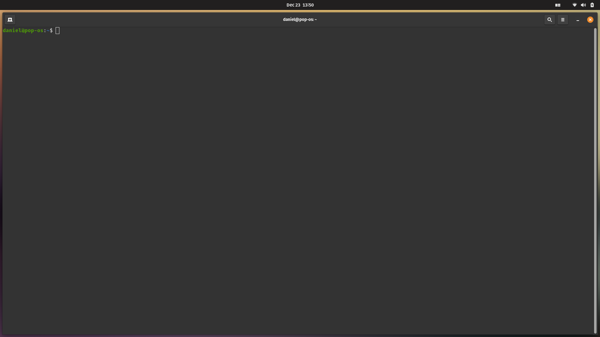
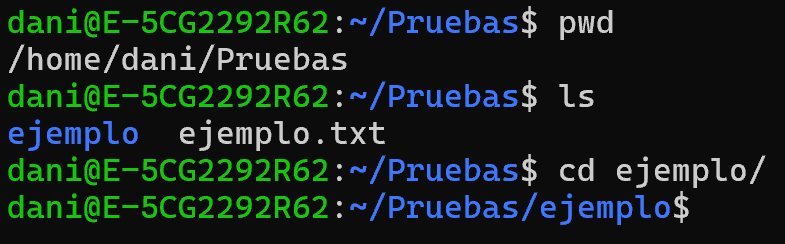
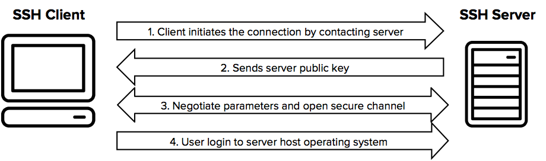
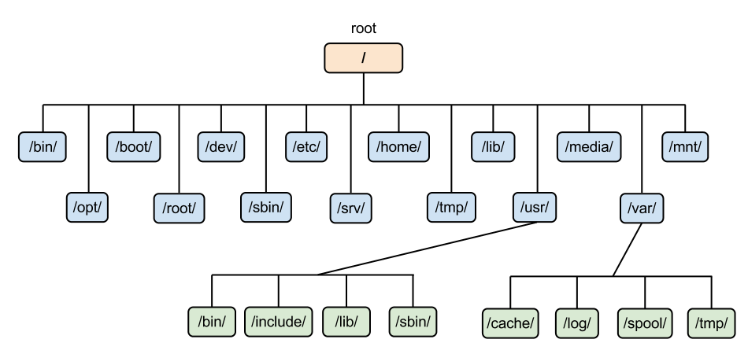
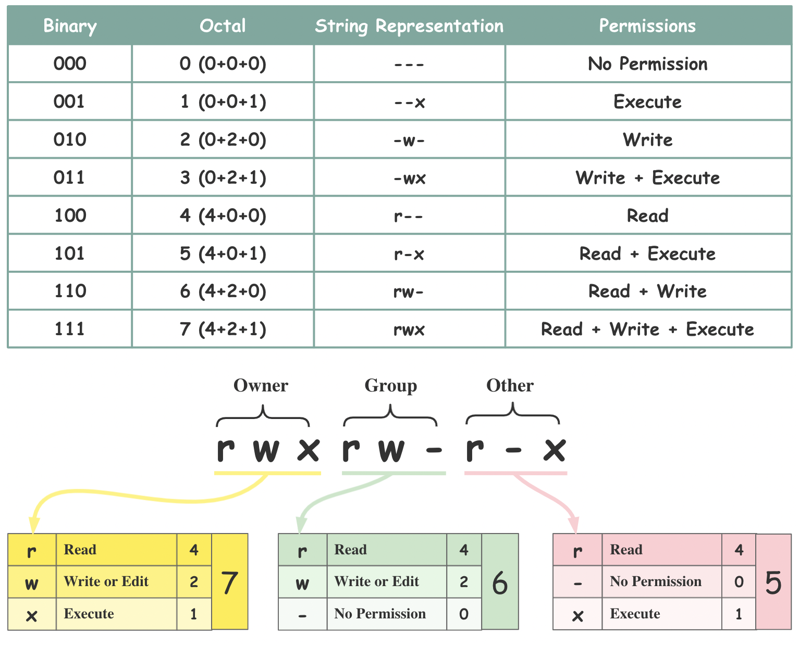

Este capítulo presenta los conceptos esenciales del sistema GNU/Linux, el funcionamiento
de la terminal como interfaz principal de interacción, los comandos fundamentales para
la navegación y la manipulación del sistema de archivos, el modelo de usuarios y
permisos, la gestión de procesos y servicios, y las herramientas básicas de
automatización y red.

## Bibliografía

- NetworkChuck. (2023). _60 comandos de Linux que NECESITAS saber (en 10 minutos)_
  \[Vídeo\]. YouTube. <https://www.youtube.com/watch?v=gd7BXuUQ91w>
- DeciLearn. (2023). _Linux Para Principiantes - Curso completo_ \[Vídeo\]. YouTube.
  <https://youtu.be/jVQKk8IB9pA>
- Linux Foundation. (s.f.). _Filesystem Hierarchy Standard_.
  <https://refspecs.linuxfoundation.org/FHS_3.0/fhs/index.html>

## Introducción

<figure markdown="span">
  
  <figcaption>Logo de Linux, representado por la mascota Tux.</figcaption>
</figure>

**Linux** no es un sistema operativo completo, sino un **_kernel_** de software libre
desarrollado inicialmente por Linus Torvalds. Su código fuente es público y accesible,
lo que permite a cualquier persona examinarlo, modificarlo, contribuir a su desarrollo o
crear su propia distribución.

El _kernel_ de Linux se combina con las utilidades del proyecto **GNU**, que aportan las
herramientas esenciales del entorno de usuario, como compiladores, intérpretes de
comandos y bibliotecas básicas. Por esta razón, la denominación más precisa para
referirse al sistema es **GNU/Linux**.

GNU/Linux se caracteriza por ser una plataforma robusta, segura y flexible, capaz de
adaptarse tanto a entornos personales como a infraestructuras críticas, incluyendo
servidores y sistemas embebidos. Esta versatilidad lo ha convertido en la base de los
sistemas operativos más utilizados en entornos distribuidos y plataformas en la nube,
aunque también encuentra un lugar destacado en el ámbito doméstico.

El modelo de desarrollo abierto, sustentado por una comunidad global de desarrolladores
y usuarios, facilita una evolución constante, con mejoras continuas en rendimiento,
estabilidad y seguridad. Esta diversidad se manifiesta en la existencia de múltiples
proyectos que integran el _kernel_ con diferentes herramientas, entornos gráficos y
gestores de paquetes. Cuando estos componentes se combinan con configuraciones
específicas se obtiene una **distribución**. Ejemplos representativos como Ubuntu,
Debian, Fedora o Arch Linux ilustran cómo un mismo núcleo puede ajustarse a contextos de
uso muy distintos.

## La terminal

La interacción directa con el sistema se realiza principalmente a través de la terminal
o **_shell_**, un intérprete de comandos que traduce las órdenes del usuario en acciones
ejecutables. Aunque existen alternativas modernas, **Bash** se mantiene como la _shell_
más extendida y estandarizada.

<figure markdown="span">
  
  <figcaption>Ejemplo de una ventana de una shell o terminal en Pop!_OS.</figcaption>
</figure>

Los comandos disponibles en la terminal presentan una sintaxis basada en un nombre
principal, un conjunto de opciones que modifican su comportamiento y una serie de
argumentos que especifican el objetivo de la acción.

???+ example "Anatomía de un comando"

    El comando `ls -l /home/usuario` combina el nombre principal `ls`, que lista los
    archivos y directorios, con la opción `-l`, que indica que la información se muestre
    en formato detallado, y el argumento `/home/usuario`, que especifica la ubicación
    del directorio cuyo contenido se desea visualizar.

El propio sistema facilita la consulta y el aprendizaje mediante documentación
integrada. Herramientas como `man`, `help` o `type` permiten comprender el
funcionamiento interno de los comandos y distinguir entre utilidades externas, funciones
internas o alias definidos por el usuario.

Los manuales se encuentran organizados en secciones que agrupan la información según su
naturaleza, lo que permite acceder de manera más precisa a la documentación. Las
secciones más comunes son las siguientes:

1. **Comandos de usuario**: Incluye programas ejecutables y comandos que pueden
   invocarse desde la _shell_. Ejemplo: `ls`, `cp`.
2. **Llamadas al sistema**: Documenta las funciones proporcionadas por el _kernel_ que
   permiten a los programas interactuar con el sistema operativo. Ejemplo: `open()`,
   `read()`.
3. **Funciones de biblioteca**: Contiene funciones disponibles en bibliotecas estándar,
   como la biblioteca C (`libc`). Ejemplo: `printf()`, `malloc()`.
4. **Archivos especiales y dispositivos**: Describe archivos del sistema y dispositivos
   especiales ubicados en `/dev` u otras rutas del sistema de archivos. Ejemplo:
   `/dev/null`.
5. **Formatos de archivo y convenciones**: Incluye descripciones de formatos de archivo,
   convenciones de configuración y estructuras de datos. Ejemplo: `/etc/passwd`.
6. **Juegos y diversiones**: Contiene documentación sobre juegos, ejemplos o programas
   de entretenimiento incluidos en el sistema.
7. **Miscelánea**: Agrupa temas varios, convenciones, estándares o programas que no
   encajan en otras secciones.
8. **Comandos de administración del sistema**: Incluye comandos reservados para la
   administración y configuración del sistema, normalmente accesibles solo por el
   superusuario (`root`). Ejemplo: `mount`, `passwd`.

Al consultar un manual es posible especificar la sección deseada para acceder
directamente a la información relevante.

???+ example "Secciones del manual"

    El comando `man 2 open` muestra la documentación de la llamada al sistema `open()`,
    mientras que `man 1 open` se refiere al comando de usuario homónimo.

No todos los comandos cuentan con una sección específica en el manual. En algunos casos,
la información solo está disponible a través de otras herramientas de ayuda o de
documentación externa.

## Comandos básicos

La interacción cotidiana con el sistema se apoya en un conjunto de comandos
fundamentales que permiten administrarlo, navegar por su estructura de directorios y
manipular información.

Entre ellos, `pwd` indica el directorio de trabajo actual, `ls` permite explorar el
contenido de los directorios mostrando información detallada, permisos o archivos
ocultos, y `cd` posibilita el desplazamiento entre directorios.

<figure markdown="span">
  
  <figcaption>Ejemplo de los comandos pwd, ls y cd.</figcaption>
</figure>

La creación de elementos básicos se realiza con `touch` para archivos y `mkdir` para
directorios. La lectura de archivos puede efectuarse mediante `cat`, adecuada para
contenidos breves, o `less`, que permite una navegación paginada en textos extensos. La
gestión de archivos y directorios se completa con `cp` para copiar, `mv` para mover o
renombrar, y `rm` o `rmdir` para eliminar elementos.

La administración básica también incluye utilidades como `whoami`, que identifica al
usuario activo, `useradd`, que crea nuevas cuentas, y `wget`, que descarga recursos
desde la red.

Otro de los flujos de trabajo más habituales, tanto en entornos corporativos como en
servidores domésticos, es el acceso remoto a otros equipos. Este acceso se realiza
mediante el protocolo **SSH** (_Secure Shell_), que permite establecer sesiones seguras
desde la línea de comandos e integrar de manera fluida la administración de sistemas
locales y remotos.

<figure markdown="span">
  
  <figcaption>Funcionamiento del protocolo SSH. <a href="https://www.ssh.com/academy/ssh">Referencia</a></figcaption>
</figure>

Los comandos anteriores cubren la mayor parte de las tareas cotidianas, aunque el
catálogo real es mucho más amplio y el comportamiento de cada comando puede alterarse
mediante sus opciones. Enumerar todos los comandos del sistema junto con sus múltiples
opciones resulta impracticable debido a su cantidad y diversidad.

Por esta razón, la opción `--help` está disponible en prácticamente cualquier comando y
proporciona información detallada sobre su uso, las opciones admitidas y una breve
descripción de su funcionalidad. También existen recursos externos como la documentación
oficial o los motores de búsqueda, aunque explorar el propio sistema resulta igualmente
enriquecedor, preferiblemente en un entorno controlado como una máquina virtual.

La siguiente tabla recopila los comandos de uso más frecuente:

| Comando   | Función                                                                                | Ejemplo de uso                          |
| --------- | -------------------------------------------------------------------------------------- | --------------------------------------- |
| `pwd`     | Muestra el directorio de trabajo actual.                                               | `pwd`                                   |
| `ls`      | Lista el contenido de directorios, mostrando información detallada y archivos ocultos. | `ls -la /home/usuario`                  |
| `cd`      | Cambia el directorio de trabajo.                                                       | `cd /var/log`                           |
| `touch`   | Crea archivos vacíos.                                                                  | `touch archivo.txt`                     |
| `mkdir`   | Crea nuevos directorios.                                                               | `mkdir proyecto`                        |
| `cat`     | Muestra el contenido de archivos pequeños.                                             | `cat archivo.txt`                       |
| `less`    | Visualiza archivos largos de forma paginada.                                           | `less archivo_grande.txt`               |
| `cp`      | Copia archivos o directorios.                                                          | `cp archivo.txt /home/usuario/backup/`  |
| `mv`      | Mueve o renombra archivos o directorios.                                               | `mv archivo.txt documento.txt`          |
| `rm`      | Elimina archivos.                                                                      | `rm archivo.txt`                        |
| `rmdir`   | Elimina directorios vacíos.                                                            | `rmdir carpeta_vacia`                   |
| `whoami`  | Muestra el usuario activo.                                                             | `whoami`                                |
| `useradd` | Crea nuevas cuentas de usuario.                                                        | `sudo useradd nuevo_usuario`            |
| `passwd`  | Cambia la contraseña de un usuario.                                                    | `passwd usuario`                        |
| `man`     | Accede a la documentación integrada de los comandos.                                   | `man ls`                                |
| `wget`    | Descarga archivos desde la red.                                                        | `wget https://ejemplo.com/archivo.zip`  |
| `ssh`     | Establece un acceso remoto seguro a otros equipos.                                     | `ssh usuario@192.168.1.10`              |
| `chmod`   | Modifica los permisos de archivos y directorios.                                       | `chmod 755 script.sh`                   |
| `chown`   | Cambia el propietario de archivos o directorios.                                       | `chown usuario:grupo archivo.txt`       |
| `find`    | Busca archivos y directorios según criterios específicos.                              | `find /home -name "*.txt"`              |
| `grep`    | Busca cadenas de texto dentro de archivos.                                             | `grep "error" log.txt`                  |
| `tar`     | Comprime o descomprime archivos y directorios.                                         | `tar -czvf backup.tar.gz /home/usuario` |
| `zip`     | Comprime archivos y directorios en formato ZIP.                                        | `zip -r nombre.zip nombre_carpeta`      |
| `unzip`   | Descomprime archivos en formato ZIP.                                                   | `unzip nombre.zip`                      |
| `df`      | Muestra el espacio disponible en los sistemas de archivos.                             | `df -h`                                 |
| `du`      | Muestra el tamaño de archivos y directorios.                                           | `du -sh /home/usuario`                  |
| `top`     | Muestra los procesos en ejecución y el uso de recursos en tiempo real.                 | `top`                                   |
| `ps`      | Lista los procesos en ejecución.                                                       | `ps aux`                                |
| `kill`    | Envía una señal a un proceso identificado por su PID.                                  | `kill -15 1234`                         |

## Estructura de directorios

El almacenamiento se organiza siguiendo una estructura jerárquica unificada en forma de
árbol cuyo origen se encuentra en el directorio raíz (`/`).

A diferencia de otros sistemas operativos, no existen unidades identificadas por letras.
Todos los dispositivos de almacenamiento se incorporan a esta jerarquía mediante el
proceso de montaje.

<figure markdown="span">
  
  <figcaption>Jerarquía de los directorios de Linux. <a href="https://goldinscrib.hashnode.dev/the-linux-file-system">Referencia</a></figcaption>
</figure>

Dentro de esta estructura destacan una serie de directorios esenciales:

- `/boot`: Alberga los componentes necesarios para el arranque del sistema, incluidos el
  _kernel_ y el gestor **GRUB**, el programa que se muestra al iniciar el equipo y que
  permite seleccionar el sistema operativo cuando existen varias instalaciones.
- `/etc`: Concentra los archivos de configuración en formato de texto plano, que
  determinan el comportamiento del sistema y de sus servicios.
- `/bin` y `/sbin`: Contienen los ejecutables imprescindibles para la operación básica y
  la administración del sistema.
- `/home`: Contiene los espacios de trabajo de los usuarios, mientras que `/root` se
  reserva exclusivamente para el superusuario.
- `/var`: Almacena datos variables como registros (_logs_), colas y bases de datos.
- `/dev`, `/proc` y `/sys`: Proporcionan representaciones virtuales del _hardware_ y del
  estado interno del _kernel_, lo que permite un acceso sistemático y controlado a los
  recursos del sistema.

Uno de los directorios más visitados, de manera directa o indirecta, es la carpeta
oculta `~/.cache`, que almacena datos temporales generados por diversas aplicaciones
para acelerar operaciones posteriores. En esta ubicación, las herramientas de gestión de
dependencias mantienen sus propios directorios de **_cache_**, donde guardan paquetes
descargados, compilaciones intermedias y metadatos. Ejemplos representativos son
`~/.cache/uv` para el gestor de paquetes `uv` de Python o `~/.cache/pip` para `pip`.

Con el tiempo, estos directorios de _cache_ pueden acumular un volumen considerable de
datos. Para identificar qué directorios consumen más espacio en disco resulta útil el
comando `du` con opciones que limitan la profundidad de exploración.

???+ example "Comprobar el espacio ocupado por directorios"

    Para visualizar el tamaño de cada subdirectorio inmediato dentro del directorio
    personal del usuario:

    ```bash linenums="1"
    du -h --max-depth=1 ~
    ```

    Este comando muestra el espacio ocupado por cada carpeta en formato legible (`-h` de
    _human-readable_), limitando la exploración a un solo nivel de profundidad. Resulta
    especialmente práctico para detectar directorios de _cache_ que han crecido de forma
    descontrolada y que pueden limpiarse sin afectar al funcionamiento del sistema.

## Usuarios y grupos

GNU/Linux es un sistema multiusuario en el que la seguridad y el control de acceso se
articulan mediante un modelo basado en usuarios, grupos y permisos. Este enfoque permite
que múltiples personas trabajen simultáneamente en el mismo sistema sin interferir entre
sí, y garantiza al mismo tiempo la protección de los recursos y la estabilidad del
entorno.

Los permisos no se asignan únicamente a individuos, sino que también se agrupan mediante
**grupos**, que actúan como conjuntos de privilegios compartidos, de forma similar a una
plantilla de privilegios.

Cada usuario dispone de un **grupo primario**, asociado por defecto a los archivos que
crea, y puede pertenecer a varios **grupos secundarios** que amplían sus capacidades,
como ocurre con el grupo `sudo`, destinado a la ejecución controlada de tareas
administrativas.

### Permisos

Cada archivo o directorio define privilegios de **lectura**, **escritura** y
**ejecución** para tres categorías claramente diferenciadas: el **propietario**, el
**grupo** asociado y el resto de usuarios, denominados **otros**. Esta última categoría
representa a cualquier usuario que no sea el propietario del archivo ni miembro del
grupo asociado.

Este esquema limita el acceso indebido a los recursos. Por encima de estas restricciones
se sitúa el **superusuario**, identificado como `root`, que posee control total sobre el
sistema y puede ignorar el modelo de permisos convencional.

El sistema evalúa los permisos siguiendo un orden de prioridad estricto. Primero
comprueba si el usuario es el propietario, en cuyo caso aplica los permisos
correspondientes. Si no lo es, verifica si pertenece al grupo y, solo cuando no se
cumple ninguna de estas condiciones, se aplican los permisos definidos para otros.

<figure markdown="span">
  
  <figcaption>Registro de permisos de Linux. <a href="https://bytebytego.com/guides/linux-file-permission-illustrated/">Referencia</a></figcaption>
</figure>

Los permisos se visualizan habitualmente mediante el comando `ls -l`, que muestra una
cadena simbólica como `rwxr-xr--`. Esta notación agrupa los permisos en tres bloques de
tres caracteres, correspondientes al propietario, al grupo y a otros, respectivamente.
Cada carácter indica si el permiso de lectura (`r`), escritura (`w`) o ejecución (`x`)
está concedido. Cuando un permiso no está habilitado, se sustituye por un guion.

???+ example "Interpretar permisos con ls -l"

    Al ejecutar `ls -l` sobre un archivo se obtiene una cadena de permisos como la
    siguiente:

    ```bash linenums="1"
    rwxr-xr--
    ```

    La cadena se divide en bloques de tres caracteres (`rwx`, `r-x` y `r--`) que
    representan los permisos del propietario, del grupo y de los demás usuarios:

    | Permiso       | Propietario | Grupo | Otros |
    | ------------- | ----------- | ----- | ----- |
    | Lectura (r)   | ✔           | ✔     | ✔     |
    | Escritura (w) | ✔           | ✖     | ✖     |
    | Ejecución (x) | ✔           | ✔     | ✖     |

    En este contexto:

    - **Propietario**: Tiene permisos completos sobre el archivo, por lo que puede leer
      su contenido, modificarlo y ejecutarlo si se trata de un archivo ejecutable.
    - **Grupo**: Posee permisos de lectura y ejecución, lo que le permite abrir y
      ejecutar el archivo, pero no modificarlo.
    - **Otros**: Solo cuentan con permiso de lectura, por lo que pueden consultar el
      contenido del archivo, pero no ejecutarlo ni realizar cambios sobre él.

    Siguiendo la misma lógica, `r--` indica que únicamente se permite la lectura,
    mientras que `rw-` permite lectura y escritura, pero no ejecución.

### Modificación de permisos

Los permisos de archivos y directorios se modifican con el comando `chmod`, que admite
dos notaciones principales, la **octal** y la **simbólica**.

En la notación octal, cada permiso tiene un valor numérico fijo, donde la lectura
equivale a 4, la escritura a 2 y la ejecución a 1. La suma de estos valores determina el
permiso final para cada categoría. El comando recibe siempre tres dígitos que
representan de izquierda a derecha los permisos del propietario, del grupo y de otros.

???+ example "Notación octal"

    Al aplicar `chmod 754 archivo`, cada dígito resulta de sumar los valores de los
    permisos concedidos. El propietario obtiene el valor 7 (4 + 2 + 1), lo que equivale
    a lectura, escritura y ejecución. El grupo recibe el valor 5 (4 + 1), es decir,
    lectura y ejecución, pero no escritura. El resto de usuarios obtiene el valor 4, que
    corresponde únicamente a lectura.

Por otra parte, la notación simbólica utiliza letras para identificar a los sujetos, `u`
para el propietario, `g` para el grupo, `o` para otros y `a` para todos, además de
emplear operadores para añadir, quitar o asignar permisos.

???+ example "Notación simbólica"

    - **Añadir permisos de ejecución a todos**: `chmod a+x backup.sh`. El operador `+`
      suma el permiso de ejecución (`x`) a todas las categorías (`a` de _all_).
    - **Dar acceso de lectura al grupo**: `chmod g+r backup.sh`. Únicamente el grupo
      (`g`) recibe el atributo de lectura (`r`).
    - **Retirar permisos de escritura a otros**: `chmod o-w backup.sh`. El operador `-`
      garantiza que cualquier permiso de escritura previo para terceros sea revocado,
      sin alterar los permisos del propietario o del grupo.
    - **Asignación exacta de permisos**: `chmod g=rx backup.sh`. El operador `=`
      establece que el grupo tenga lectura y ejecución, y elimina de una sola vez
      cualquier otro permiso previo, como el de escritura.

El comando `umask` define los permisos **por defecto** de los nuevos archivos y
directorios. Mientras que `chmod` modifica permisos existentes, `umask` actúa como una
máscara que restringe los permisos máximos iniciales.

Para los archivos, el sistema parte de un valor máximo de lectura y escritura para todos
y, para los directorios, de permisos completos. El valor de `umask` indica qué permisos
deben eliminarse automáticamente, de modo que cuanto más restrictiva sea la máscara, más
limitados serán los permisos resultantes.

???+ example "Máscara umask"

    Con una máscara `umask` de 022:

    - **Archivo nuevo**: El sistema parte de los permisos máximos `rw-rw-rw-` (lectura y
      escritura para todos). La máscara elimina los permisos de escritura para el grupo
      y para otros, por lo que el archivo se crea con permisos finales `rw-r--r--`.
    - **Directorio nuevo**: El sistema parte de permisos máximos `rwxrwxrwx` (lectura,
      escritura y ejecución para todos). Al aplicar la misma máscara se eliminan los
      permisos de escritura para el grupo y para otros, lo que resulta en permisos
      finales `rwxr-xr-x`.

### Propiedad de archivos

Además de los permisos, cada archivo y directorio posee un **propietario** y un
**grupo** que determinan quién ejerce la autoridad principal sobre él.

El comando `chown` permite modificar esta propiedad, definiendo quién es el dueño y a
qué grupo pertenece un recurso. A diferencia de `chmod`, que puede ser utilizado por el
propietario del archivo para ajustar sus permisos, `chown` requiere privilegios
administrativos, ya que cambiar la propiedad implica transferir el control efectivo del
recurso.

Este comando permite modificar únicamente el usuario propietario, solo el grupo o ambos
de forma simultánea, y puede aplicarse de manera recursiva a directorios completos.

???+ example "Cambiar propietario con chown"

    Para asignar la propiedad de un directorio llamado `proyecto` al usuario `ana`:

    ```bash linenums="1"
    sudo chown ana proyecto
    ```

    Tras ejecutar el comando, `ana` es la propietaria del directorio, mientras que el
    grupo permanece sin cambios. Para cambiar solo el grupo a `desarrolladores`:

    ```bash linenums="1"
    sudo chown :desarrolladores proyecto
    ```

    El propietario actual se mantiene, pero el grupo asociado pasa a ser
    `desarrolladores`. Para cambiar el propietario y el grupo de forma simultánea:

    ```bash linenums="1"
    sudo chown ana:desarrolladores proyecto
    ```

    Por último, para aplicar los cambios de manera recursiva a todos los archivos y
    subdirectorios contenidos en `proyecto`:

    ```bash linenums="1"
    sudo chown -R ana:desarrolladores proyecto
    ```

## Procesos y servicios

Un **proceso** es un **programa en ejecución**. Cuando un usuario inicia un programa, el
sistema operativo carga el archivo binario en memoria, asigna los recursos necesarios y
lo transforma en un proceso activo.

Cada proceso es gestionado por el _kernel_ y recibe un identificador único denominado
**PID** (_Process ID_). Todos los procesos forman una jerarquía cuyo origen es el
proceso con PID 1, gestionado actualmente por **`systemd`**, que arranca junto al
_kernel_ y actúa como ancestro de todos los demás. Cuando un programa lanza otro, como
ocurre cuando la terminal ejecuta `ls`, el primero actúa como proceso padre y el segundo
como proceso hijo.

Además del PID, cada proceso registra el **PPID** (_Parent Process ID_), que identifica
al proceso que lo creó, y el **UID** (_User ID_), que indica el usuario que lo ejecuta y
determina sus permisos sobre los archivos y los recursos del sistema.

A lo largo de su ciclo de vida, un proceso puede encontrarse en distintos estados, que
van desde la ejecución activa hasta la espera o la finalización:

| Estado     | Código | Descripción                                                                        |
| ---------- | ------ | ---------------------------------------------------------------------------------- |
| _Running_  | `R`    | En ejecución o listo para ejecutarse.                                              |
| _Sleeping_ | `S`    | Esperando un evento, como una entrada del usuario o una lectura de disco.          |
| _Sleeping_ | `D`    | En espera ininterrumpible, asociada normalmente a operaciones de entrada y salida. |
| _Stopped_  | `T`    | Pausado, por ejemplo mediante `Ctrl + Z`.                                          |
| _Zombie_   | `Z`    | Finalizado, pero sin que su proceso padre haya registrado la finalización.         |

El estado y el consumo de recursos de los procesos pueden supervisarse mediante
herramientas como `ps`, `top` o `htop`, que permiten analizar su comportamiento en
tiempo real.

### Señales

Las **señales** son mecanismos que permiten comunicar eventos a un proceso en ejecución.
Funcionan como mensajes que pueden solicitar la terminación, la pausa, la reanudación o
la recarga de la configuración de un proceso. Las señales más utilizadas son las
siguientes:

| Señal     | Nombre    | Número | Función                                                                   |
| --------- | --------- | ------ | ------------------------------------------------------------------------- |
| `SIGTERM` | Terminate | 15     | Solicita al proceso que cierre de manera ordenada.                        |
| `SIGKILL` | Kill      | 9      | Fuerza la terminación inmediata del proceso, sin posibilidad de reacción. |
| `SIGHUP`  | Hangup    | 1      | Solicita la recarga de la configuración de los _daemons_.                 |
| `SIGSTOP` | Stop      | 19     | Pausa el proceso sin liberarlo de la memoria.                             |
| `SIGCONT` | Continue  | 18     | Reanuda un proceso previamente detenido.                                  |

El comando `kill` envía estas señales a procesos concretos identificados por su PID.
Cuando el PID no se conoce, `pkill` permite operar directamente sobre el nombre del
proceso. Los usuarios solo pueden enviar señales a sus propios procesos, de modo que
interactuar con procesos de otros usuarios o del sistema requiere privilegios de
superusuario mediante `sudo`.

El teclado también genera señales durante la ejecución de un proceso en primer plano. La
combinación `Ctrl + C` envía `SIGINT` e interrumpe la ejecución del proceso activo,
mientras que `Ctrl + Z` envía `SIGTSTP`, pausa el proceso y lo traslada al segundo
plano, desde donde puede reanudarse con `fg`.

???+ example "Finalizar procesos por PID y por nombre"

    La forma estándar de `kill` envía la señal `SIGTERM`, que permite al proceso
    finalizar de manera ordenada liberando sus recursos:

    ```bash linenums="1"
    kill 1234
    ```

    Si el proceso no responde a `SIGTERM`, es posible forzar su terminación inmediata
    mediante `SIGKILL`:

    ```bash linenums="1"
    kill -9 1234
    ```

    Cuando un proceso de Python se queda bloqueado o sin responder, como ocurre con
    frecuencia con _notebooks_ de Jupyter o _scripts_ de larga duración, resulta
    práctico utilizar `pkill` para finalizar todos los procesos asociados a un nombre
    determinado sin necesidad de conocer sus PID individuales:

    ```bash linenums="1"
    pkill python
    ```

### Ejecución persistente de procesos

En entornos de desarrollo y producción es frecuente la necesidad de mantener procesos en
ejecución incluso después de cerrar la sesión del terminal. Cuando un usuario cierra su
sesión, el sistema envía la señal `SIGHUP` a todos los procesos asociados a dicha
sesión, lo que provoca su terminación.

El comando **`nohup`** (_no hang up_) permite ignorar esta señal, lo que garantiza que
el proceso continúe ejecutándose de forma independiente de la sesión del usuario. La
salida estándar y la salida de error se redirigen automáticamente al archivo `nohup.out`
en el directorio de trabajo actual.

???+ example "Mantener un proceso activo tras cerrar sesión"

    Para ejecutar un _script_ de Python que debe permanecer activo de forma indefinida,
    incluso si se cierra la terminal o finaliza la conexión SSH:

    ```bash linenums="1"
    nohup python script_entrenamiento.py &
    ```

    El símbolo `&` al final envía el proceso al segundo plano y libera la terminal para
    continuar trabajando. La combinación de `nohup` con `&` resulta idónea para tareas
    de larga duración, como entrenamientos de modelos de aprendizaje automático o
    procesamiento masivo de datos.

### _Daemons_

Los **_daemons_** son procesos diseñados para ejecutarse en segundo plano de manera
continua, sin depender de la sesión de un usuario. Proporcionan servicios permanentes
como servidores web, acceso remoto por SSH o tareas programadas.

A diferencia de los procesos interactivos, los _daemons_ se desvinculan de su terminal
original y son adoptados por `systemd`, lo que garantiza su ejecución continua incluso
cuando el usuario que los inició cierra su sesión.

Por convención, muchos _daemons_ tienen nombres terminados en `d`, como `sshd` para la
gestión de conexiones SSH, `httpd` o `apache2` para el servicio web, `crond` para las
tareas programadas y `systemd` para el control de servicios y procesos del sistema. Por
razones de seguridad, los _daemons_ no deben ejecutarse como `root` salvo que sea
estrictamente necesario.

El control de los _daemons_ se realiza mediante `systemctl`, que permite iniciar,
detener, reiniciar y habilitar servicios de manera uniforme:

| Comando                      | Función                                                                          |
| ---------------------------- | -------------------------------------------------------------------------------- |
| `sudo systemctl start sshd`  | Inicia el _daemon_ y crea el proceso correspondiente.                            |
| `sudo systemctl stop sshd`   | Detiene el _daemon_.                                                             |
| `sudo systemctl status sshd` | Muestra el estado, el PID y el consumo de recursos del _daemon_.                 |
| `sudo systemctl enable sshd` | Configura el _daemon_ para que se inicie automáticamente al arrancar el sistema. |

## Alias y atajos de comandos

La eficiencia operativa se potencia mediante la **automatización** de tareas repetitivas
o complejas a través de la _shell_. Una herramienta fundamental para este propósito son
los **alias**, que funcionan como atajos para comandos largos o de uso frecuente. Los
alias permiten reducir errores, ahorrar tiempo y estandarizar procedimientos dentro del
entorno de trabajo.

Los alias se configuran generalmente en los archivos de inicialización de la _shell_,
como `~/.bashrc` o `~/.zshrc`, lo que asegura que estén disponibles de manera automática
en cada nueva sesión.

???+ example "Alias para comandos frecuentes"

    El alias `alias ll='ls -alF'` convierte un comando largo y detallado en una
    instrucción breve y fácil de recordar.

La recarga inmediata de estos archivos mediante `source ~/.bashrc` aplica los cambios
sin necesidad de cerrar la sesión, lo que mantiene la continuidad del trabajo.

Más allá de los alias, el sistema ofrece mecanismos de automatización más completos,
como los [_scripts_ de Bash](../../02_dev_tools/02_scripting/section_1_bash.md) y los
[_Makefiles_](../../02_dev_tools/02_scripting/section_2_makefile.md), que permiten
ejecutar secuencias de comandos de manera periódica o en respuesta a eventos
específicos.

## Gestión de red y puertos

En entornos de desarrollo y de administración de sistemas es habitual inspeccionar el
estado de la red, identificar qué puertos están en uso o verificar la conectividad con
servicios remotos. Estas tareas se apoyan en un conjunto reducido de herramientas que,
en muchas distribuciones, no se encuentran instaladas por defecto.

???+ example "Inspección de red y puertos"

    Instalación de las herramientas necesarias:

    ```bash linenums="1"
    sudo apt install net-tools telnet
    ```

    Una vez instaladas, es posible listar todos los puertos TCP activos en el sistema:

    ```bash linenums="1"
    netstat -n --all --tcp
    ```

    Para localizar el proceso que está utilizando un puerto específico, como el 9000:

    ```bash linenums="1"
    sudo lsof -i -P -n | grep 9000
    ```

    Por último, para comprobar la conectividad con un servicio concreto mediante Telnet
    se indican la dirección y el puerto de destino:

    ```bash linenums="1"
    telnet localhost 5433
    ```

!!! note "Alternativa moderna a netstat"

    El paquete `net-tools` se considera obsoleto en las distribuciones actuales. El
    comando `ss`, incluido en `iproute2`, ofrece la misma información de forma más
    rápida y detallada. Por ejemplo, `ss -tulnp` lista los puertos TCP y UDP en escucha
    junto con el proceso asociado a cada uno.
