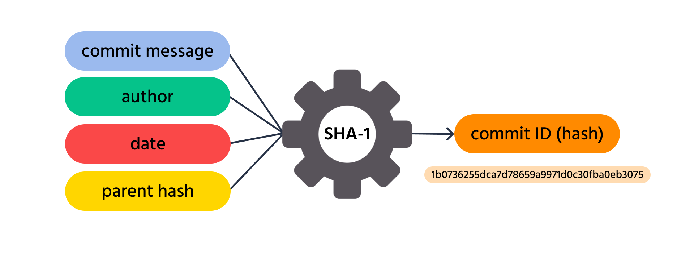
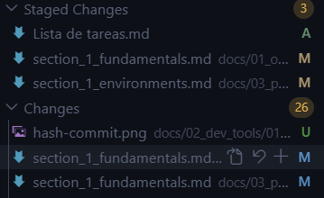
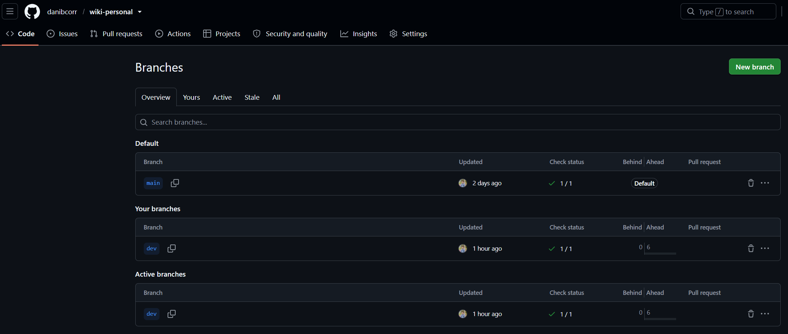
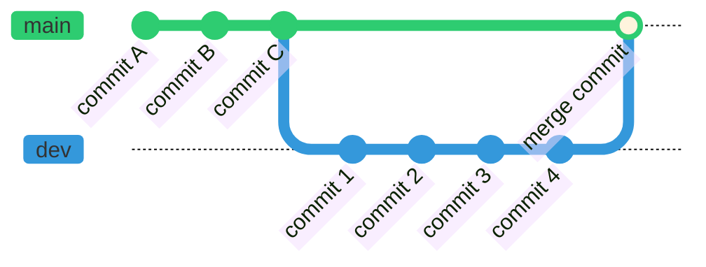
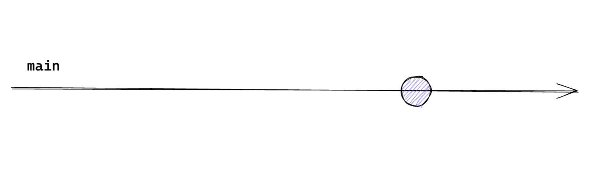
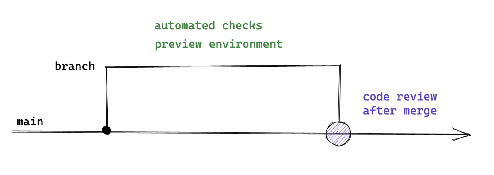
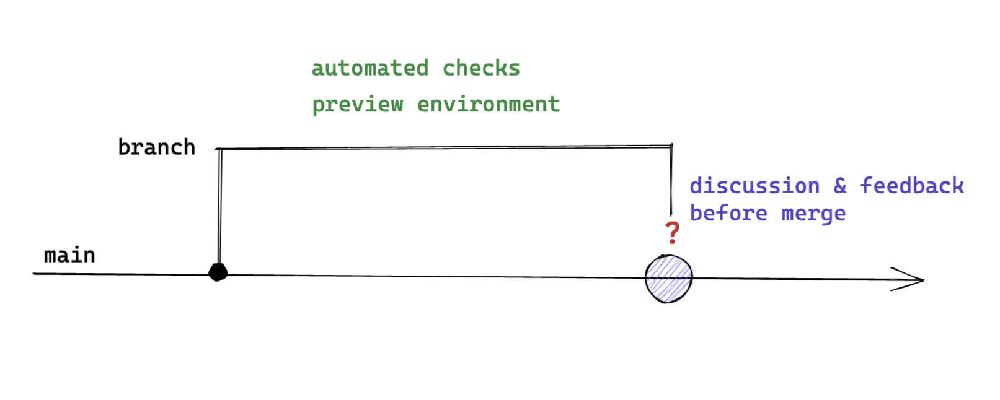

Este capítulo introduce Git como sistema de control de versiones distribuido, su
terminología, las áreas de trabajo que lo componen, los comandos esenciales para
gestionar un repositorio y las estrategias de ramificación más extendidas.

## Bibliografía

- Git. (s.f.). _Git - Distributed Version Control System_. <https://git-scm.com/>
- Umali, A. (2024). _Learning Git: A Hands-On and Visual Guide to the Basics of Git_.
  O'Reilly Media. <https://www.oreilly.com/library/view/learning-git/9781098133900/>
- Wilsenach, R. (2021). _Ship / Show / Ask: A modern branching strategy_. Martin Fowler.
  <https://martinfowler.com/articles/ship-show-ask.html>

## Introducción

<figure markdown="span">
  
  <figcaption>Logo de Git.</figcaption>
</figure>

**Git** es un sistema de control de versiones diseñado para gestionar el historial de
cambios en proyectos de software. Permite a los equipos de desarrollo colaborar de forma
eficiente, realizar un seguimiento detallado de las modificaciones en el código fuente y
administrar distintas versiones de un proyecto a lo largo del tiempo. Fue creado por
Linus Torvalds, quien también desarrolló el _kernel_ de Linux, con el objetivo de
disponer de una herramienta rápida, distribuida y capaz de manejar proyectos de gran
envergadura.

Plataformas como **GitHub** o **GitLab** se construyen sobre Git para facilitar la
gestión de proyectos y la colaboración en línea. Estas herramientas proporcionan
interfaces gráficas que simplifican las operaciones habituales del control de versiones
y ofrecen funcionalidades adicionales como la integración y el despliegue continuos
(CI/CD), lo que permite automatizar los procesos de compilación, pruebas y publicación
del software.

## Control de versiones

El **control de versiones** es un mecanismo que permite gestionar los cambios en
archivos a lo largo del tiempo y facilita la recuperación de versiones anteriores cuando
resulta necesario.

<figure markdown="span">
  
  <figcaption>Identificador único (<em>hash</em>) de un <em>commit</em>. <a href="https://codefinity.com/courses/v2/7533d91f-0a23-44a3-afc7-c84d5072e189/b9a4a4e8-3d95-4d5d-bf29-f87c3fd673a4/c3bcd665-926a-44bf-adf1-d1f97167d536">Referencia</a></figcaption>
</figure>

Puede entenderse como un sistema de etiquetas de cambios. Cada vez que se guarda un
cambio mediante un **_commit_**, Git genera un **identificador único**, denominado
_hash_, que registra el estado exacto de los archivos en ese momento. Este identificador
permite consultar, comparar o restaurar versiones anteriores de manera segura y
organizada.

### Terminología

Antes de describir el funcionamiento interno de Git conviene fijar el vocabulario que se
emplea a lo largo del capítulo:

- **Repositorio local**: Espacio en el equipo donde se almacenan todos los archivos de
  un proyecto y sus versiones anteriores. Git realiza el seguimiento de los cambios en
  estos archivos sin necesidad de conexión a internet.
- **Repositorio remoto**: Copia del repositorio local almacenada en internet o en una
  red externa. Plataformas como GitHub, GitLab o Bitbucket permiten que varias personas
  trabajen en el mismo proyecto desde diferentes ubicaciones.
- **Histórico** (_log_): Registro que muestra todos los cambios realizados en el
  proyecto a lo largo del tiempo. Cada _commit_ queda registrado en este historial junto
  con la fecha, el autor del cambio y una descripción de lo modificado. También se
  conoce como _commit history_.
- **Conflicto**: Situación que se produce cuando Git no puede combinar automáticamente
  los cambios de diferentes personas en un mismo archivo. Por ejemplo, si dos personas
  editan la misma línea y después intentan guardar sus cambios en el repositorio remoto,
  Git no puede determinar qué versión debe mantener y marca un conflicto. En ese caso es
  necesario revisar y decidir manualmente qué cambios conservar.

### Áreas de trabajo

<figure markdown="span">
  
  <figcaption>Áreas de trabajo en Git. <a href="https://ihcantabria.github.io/ApuntesGit/_images/comandos-workflow.png">Referencia</a></figcaption>
</figure>

Un repositorio local se organiza en tres áreas complementarias que determinan en qué
punto del ciclo de vida se encuentra cada cambio:

1. **_Working Directory_**: Directorio de trabajo donde se modifican los archivos. Los
   archivos nuevos que se añaden en esta área permanecen en estado _untracked_, es
   decir, sin seguimiento, hasta que se incorporan explícitamente al control de
   versiones.
2. **Área de preparación** (_staging area_): Espacio de borrador donde se preparan los
   cambios que formarán parte del siguiente _commit_. Se materializa en un archivo
   denominado `index`, ubicado dentro del directorio `.git` en la raíz del repositorio.
   Los archivos añadidos a esta área pasan a estar _tracked_, es decir, con seguimiento.
3. **Historial de _commits_** (_commit history_): Área donde se almacenan de forma
   permanente todas las versiones confirmadas del proyecto.

Estas tres áreas, junto con los metadatos y las referencias contenidos en el directorio
`.git`, constituyen el repositorio local. El flujo de trabajo típico consiste en
modificar archivos en el directorio de trabajo, añadirlos al área de preparación
mediante `git add`, confirmarlos en el historial con `git commit` y, finalmente,
publicarlos en el repositorio remoto con `git push`.

### Estados de un archivo

<figure markdown="span">
  
  <figcaption>Ejemplo de los estados de los archivos en un repositorio local.</figcaption>
</figure>

Durante su ciclo de vida en Git, un archivo puede pasar por diferentes estados:

1. **Sin seguimiento** (_untracked_): El archivo es nuevo y Git aún no lo rastrea. No se
   guarda en el historial del repositorio hasta que se añade manualmente con `git add`.
2. **Ignorado** (_ignored_): Los archivos de configuración personal o temporales pueden
   declararse en una lista especial denominada `.gitignore`. Git los omite y no los
   incorpora al repositorio.
3. **Modificado** (_modified_): El archivo ha sido editado después de su última
   confirmación, pero esos cambios todavía no se han preparado.
4. **Preparado** (_staged_): Una vez que el archivo modificado se añade con `git add`,
   entra en estado _staged_, lo que significa que está listo para incorporarse a la
   próxima confirmación.
5. **Confirmado** (_committed_): Cuando se ejecuta `git commit`, los cambios preparados
   se guardan en la base de datos de Git y quedan registrados de manera permanente en el
   historial del repositorio.

Al inspeccionar el estado del repositorio, ya sea mediante `git status --short` o a
través de la interfaz de un editor, cada archivo aparece acompañado de un código que
resume su situación respecto al control de versiones:

| Código | Significado                   | Descripción                                                      |
| ------ | ----------------------------- | ---------------------------------------------------------------- |
| `A`    | _Added_ (añadido)             | Archivo nuevo que se ha añadido al área de preparación.          |
| `M`    | _Modified_ (modificado)       | Archivo ya rastreado que ha sido modificado.                     |
| `D`    | _Deleted_ (eliminado)         | Archivo que ha sido eliminado del control de versiones.          |
| `R`    | _Renamed_ (renombrado)        | Archivo que ha sido renombrado.                                  |
| `U`    | _Unmerged_ (sin fusionar)     | Archivo con conflictos pendientes de resolución tras una fusión. |
| `??`   | _Untracked_ (sin seguimiento) | Archivo nuevo que Git todavía no rastrea.                        |

## Uso de Git

### Línea de comandos

La forma canónica de interactuar con Git es la **interfaz de línea de comandos**
(_Command Line Interface_, CLI). En Windows, el instalador de Git incorpora **Git
Bash**, un emulador de terminal que proporciona la CLI de Git junto con las utilidades
básicas de GNU/Linux, de modo que los comandos son idénticos en cualquier sistema
operativo.

!!! note "Fundamentos de Linux"

    Los comandos de terminal empleados en este capítulo se apoyan en las utilidades
    básicas de GNU/Linux, descritas en el capítulo de [fundamentos de
    Linux](../../01_operative_systems/01_linux/section_1_fundamentals.md).

### Configuración de Git

Antes de comenzar a trabajar con plataformas como GitHub o GitLab es imprescindible
configurar correctamente el entorno local. Esta configuración incluye, entre otros
aspectos, la identidad del autor de los _commits_ y ciertos parámetros de comportamiento
global.

El comando `git config --global --list` permite consultar todas las variables definidas
en la configuración global junto con sus valores. Dicha configuración se utiliza, entre
otros fines, para establecer el nombre de usuario y la dirección de correo electrónico
que quedarán asociados a cada _commit_.

#### Nombre de usuario y correo

Git utiliza el nombre y el correo configurados para identificar la autoría de cada
contribución. Ambos valores pueden definirse de forma global, de modo que se apliquen a
todos los repositorios del sistema.

???+ example "Configurar la identidad"

    ```bash linenums="1"
    git config --global user.name "Nombre Apellido"
    git config --global user.email "correo@example.com"
    ```

    La configuración resultante puede verificarse en cualquier momento:

    ```bash linenums="1"
    git config --global --list
    ```

Para restringir la configuración a un único repositorio basta con omitir la opción
`--global` y ejecutar los comandos dentro del directorio correspondiente.

#### Autenticación mediante SSH

El uso de claves SSH (_Secure Shell_) simplifica la autenticación con GitHub o GitLab,
ya que evita introducir credenciales en cada operación remota. El procedimiento consiste
en generar un par de claves, registrar la clave pública en la plataforma y comprobar la
conexión.

???+ example "Generar y registrar una clave SSH"

    La generación de la clave emplea el algoritmo `ed25519`, recomendado por su
    seguridad y su tamaño reducido:

    ```bash linenums="1"
    ssh-keygen -t ed25519 -C "correo@example.com"
    ```

    En sistemas que no admiten `ed25519` se recurre a RSA con una longitud de 4096 bits:

    ```bash linenums="1"
    ssh-keygen -t rsa -b 4096 -C "correo@example.com"
    ```

    A continuación se muestra la clave pública generada para copiarla:

    ```bash linenums="1"
    cat ~/.ssh/id_ed25519.pub
    ```

    La clave se registra en el apartado **Settings** > **SSH and GPG keys** de la cuenta
    de GitHub, o en la sección equivalente de GitLab. Por último, la conexión se
    verifica con el comando correspondiente a cada plataforma:

    ```bash linenums="1"
    ssh -T git@github.com
    ssh -T git@gitlab.com
    ```

#### Autenticación mediante _tokens_ personales

Cuando se prefiere el protocolo HTTPS (_HyperText Transfer Protocol Secure_) en lugar de
SSH, la autenticación se resuelve con un **token personal de acceso** que sustituye a la
contraseña en las operaciones de clonado y publicación. El proceso consiste en acceder
al apartado **Settings** > **Developer Settings** > **Personal Access Tokens** de la
plataforma, generar un _token_ con los permisos estrictamente necesarios y utilizarlo
como contraseña cuando Git solicite las credenciales.

!!! warning "Tratamiento de los _tokens_"

    Un _token_ personal equivale a una contraseña con permisos sobre el repositorio. No
    debe almacenarse en el código ni en archivos versionados, y conviene asignarle la
    fecha de caducidad más corta que resulte compatible con su uso.

### Comandos para el control de versiones

Un comando de Git se compone de tres elementos. El primero es el programa principal,
`git`. El segundo es el comando que define la acción concreta que se desea realizar. El
tercero, de carácter opcional, es el conjunto de opciones y argumentos que ajustan su
comportamiento.

???+ example "Anatomía de un _commit_"

    ```bash linenums="1"
    git commit -m "Esto es un commit"
    ```

    En este caso, `git commit` define la acción de confirmar cambios, `-m` es una opción
    que permite añadir un mensaje descriptivo y `"Esto es un commit"` es el argumento
    asociado a dicha opción.

!!! tip "Buenas prácticas en los _commits_"

    Un buen _commit_ es aquel que contiene exclusivamente los cambios relacionados con
    una única tarea o propósito concreto. Conviene evitar el uso indiscriminado de
    `git add .` y seleccionar cuidadosamente qué cambios se incluyen. Una práctica
    recomendable consiste en crear _tickets_ específicos en un gestor de tareas, como
    Jira, asociar cada _commit_ a su _issue_ correspondiente y crear ramas dedicadas a
    partir de ellos. Además, los mensajes de _commit_ deben ser concisos, idealmente de
    80 caracteres o menos, para facilitar su lectura en el historial.

La siguiente tabla describe los comandos más relevantes para la gestión del control de
versiones en un repositorio local:

| Comando               | Descripción                                                                                                                                                                                                     | Ejemplo de uso                                                                                             |
| --------------------- | --------------------------------------------------------------------------------------------------------------------------------------------------------------------------------------------------------------- | ---------------------------------------------------------------------------------------------------------- |
| `git init`            | Inicializa un repositorio en el directorio actual y crea el directorio oculto `.git`, que contiene toda la información necesaria para el control de versiones. Por defecto, la rama principal creada es `main`. | `git init` inicializa un repositorio en el directorio actual.                                              |
| `git remote`          | Gestiona las conexiones entre el repositorio local y uno o varios repositorios remotos, permitiendo añadirlos, eliminarlos o listarlos.                                                                         | `git remote add origin url_repo` asocia el repositorio remoto con el alias `origin`.                       |
| `git clone`           | Crea una copia local completa de un repositorio existente, incluyendo su historial de _commits_ y sus ramas.                                                                                                    | `git clone https://github.com/usuario/repositorio.git` clona el repositorio indicado.                      |
| `git add`             | Añade cambios al área de preparación (_staging area_). Git no mueve los archivos, sino que registra una instantánea de su estado actual.                                                                        | `git add archivo.txt` prepara el archivo para el próximo _commit_.                                         |
| `git add -p`          | Añade cambios de forma interactiva, recorriendo cada fragmento modificado del archivo y preguntando si se desea incluir en el área de preparación.                                                              | `git add -p archivo.txt` revisa cada fragmento del archivo para decidir si se prepara.                     |
| `git commit`          | Registra de forma permanente los cambios preparados en el historial del repositorio local.                                                                                                                      | `git commit -m "Mensaje del commit"` crea un _commit_ con un mensaje descriptivo.                          |
| `git commit --amend`  | Modifica el último _commit_, permitiendo cambiar el mensaje o incorporar nuevos cambios al mismo _commit_. Resulta útil para corregir errores recientes.                                                        | `git commit --amend` reabre el último _commit_ para modificarlo.                                           |
| `git reset HEAD`      | Revierte la preparación de archivos que habían sido añadidos al área de preparación, sin perder los cambios en el directorio de trabajo.                                                                        | `git reset HEAD archivo.txt` saca el archivo del área de preparación.                                      |
| `git status`          | Muestra el estado actual del repositorio, indicando qué archivos han sido modificados, cuáles están preparados y cuáles no reciben seguimiento.                                                                 | `git status` muestra un resumen del estado del repositorio.                                                |
| `git checkout`        | Permite cambiar entre ramas o restaurar archivos a su último estado confirmado. En versiones recientes de Git se recomienda `git switch` para cambiar de rama.                                                  | `git checkout rama-nueva` cambia a otra rama.<br />`git checkout -- archivo.txt` descarta cambios locales. |
| `git branch`          | Gestiona las ramas locales, permitiendo listarlas, crearlas o eliminarlas.                                                                                                                                      | `git branch` lista las ramas.<br />`git branch rama-nueva` crea una nueva rama.                            |
| `git merge`           | Fusiona los cambios de una rama en la rama actual e integra sus _commits_ en el historial.                                                                                                                      | `git merge rama-nueva` fusiona `rama-nueva` en la rama actual.                                             |
| `git merge --abort`   | Cancela una fusión en curso y restaura el estado anterior del directorio de trabajo. Resulta útil cuando surgen conflictos que se prefiere no resolver en ese momento.                                          | `git merge --abort` cancela la fusión en curso.                                                            |
| `git merge -X theirs` | Fusiona aceptando automáticamente los cambios de la rama entrante en caso de conflicto y descarta los de la rama actual.                                                                                        | `git merge -X theirs rama-feature` fusiona aceptando los cambios de `rama-feature`.                        |
| `git fetch`           | Descarga información actualizada del repositorio remoto sin modificar la rama local ni el directorio de trabajo, lo que permite inspeccionar los cambios antes de integrarlos.                                  | `git fetch origin` descarga los cambios del remoto `origin`.                                               |
| `git fetch --prune`   | Descarga los cambios del repositorio remoto y elimina las referencias locales a ramas remotas que ya no existen. Resulta fundamental para evitar la acumulación de ramas obsoletas.                             | `git fetch --prune` limpia las referencias a ramas remotas eliminadas.                                     |
| `git pull`            | Combina `git fetch` y `git merge` en un solo comando, descargando y fusionando los cambios del repositorio remoto con la rama actual.                                                                           | `git pull origin main` actualiza la rama local `main`.                                                     |
| `git push`            | Envía los _commits_ locales al repositorio remoto y hace públicos los cambios confirmados.                                                                                                                      | `git push origin main` sube los _commits_ a la rama `main` remota.                                         |
| `git log`             | Muestra el historial de _commits_ del repositorio, lo que permite analizar la evolución del proyecto.                                                                                                           | `git log` muestra el historial completo.<br />`git log --oneline` muestra un resumen compacto.             |
| `git diff`            | Muestra las diferencias entre archivos en distintos estados, como entre el directorio de trabajo y el último _commit_ o entre _commits_ concretos.                                                              | `git diff` muestra los cambios no confirmados.                                                             |
| `git stash`           | Guarda temporalmente los cambios no confirmados y limpia el directorio de trabajo, lo que permite cambiar de contexto sin perder el trabajo en curso.                                                           | `git stash` guarda los cambios.<br />`git stash pop` los recupera.                                         |
| `git rm`              | Elimina archivos del repositorio y del área de preparación, registrando la eliminación para el próximo _commit_.                                                                                                | `git rm archivo.txt` elimina el archivo del control de versiones.                                          |
| `git rebase`          | Reaplica _commits_ sobre una base distinta y mantiene un historial lineal. Resulta especialmente útil para actualizar ramas respecto a la rama principal.                                                       | `git rebase main` reaplica los _commits_ actuales sobre `main`.                                            |
| `git rebase --abort`  | Cancela un _rebase_ en curso y restaura la rama a su estado original previo a la operación.                                                                                                                     | `git rebase --abort` cancela el _rebase_ en curso.                                                         |
| `git clean`           | Elimina archivos sin seguimiento del directorio de trabajo. Debe emplearse con precaución, ya que borra archivos de forma permanente.                                                                           | `git clean -f` elimina los archivos sin seguimiento.                                                       |

### Ramas

<figure markdown="span">
  
  <figcaption>Ejemplo de la visualización de ramas en GitHub.</figcaption>
</figure>

Una rama (**_branch_**) es un puntero móvil que apunta a un _commit_ específico dentro
del historial del proyecto. Las ramas permiten crear líneas de desarrollo independientes
a partir de un punto común, de modo que es posible trabajar en nuevas funcionalidades,
correcciones o experimentos sin alterar el código de la rama principal.

Una vez que el trabajo en una rama se considera estable, puede integrarse de nuevo en la
rama de origen mediante una operación de fusión (**_merge_**). Este mecanismo constituye
uno de los pilares fundamentales de Git, ya que facilita el desarrollo paralelo y la
organización del flujo de trabajo en equipos de cualquier tamaño.

La metodología más básica emplea una rama principal denominada `main`, anteriormente
`master`, término que ha caído en desuso por convención de la comunidad. Esta rama es la
que se lleva a producción y debe estar siempre disponible. De forma adicional se
mantiene una rama de desarrollo, `dev`, que incorpora las nuevas funcionalidades que
posteriormente se añadirán a la rama principal. A partir de ambas es posible crear
subramas que permiten implementar cada característica por separado, aunque el detalle
depende de la metodología de trabajo adoptada.


En general, las ramas pueden clasificarse según su duración y propósito:

- **Ramas de ejecución prolongada** (_long-running branches_): Existen durante toda la
  vida del proyecto, como `main` o `dev`. Representan estados estables del código y no
  se eliminan tras una integración.
- **Ramas de funcionalidad** (_feature branches_): Se crean para desarrollar una
  funcionalidad concreta. Tienen un periodo de vida corto y se eliminan una vez que sus
  cambios se integran en la rama principal o de desarrollo.
- **Ramas de vida corta** (_short-lived branches_): Se basan directamente en las ramas
  principales y se utilizan para correcciones rápidas (_hotfixes_) o cambios menores.

???+ note "Documentar la estrategia de ramas"

    Constituye una buena práctica definir y documentar la estrategia de ramas en la
    propia documentación del proyecto, de modo que todos los miembros del equipo
    compartan un criterio común sobre cómo y cuándo crear, nombrar y fusionar ramas.

Junto a las ramas, Git mantiene el puntero `HEAD`, que indica la rama en uso y, a través
de ella, el _commit_ activo. También es posible situarse directamente en un _commit_ que
no está apuntado por ninguna rama, situación conocida como **_detached HEAD state_**.

### _Merge_ y _pull requests_

La incorporación de los cambios de una rama a otra se realiza mediante _merges_ o _pull
requests_. En este proceso intervienen dos ramas. La rama _source_ contiene los cambios
que se desean incorporar, mientras que la rama _target_ es aquella donde se introducirán
dichos cambios. Un caso habitual consiste en emplear `dev` como rama _source_ y `main`
como rama _target_.



## Estrategias de ramificación

Las estrategias de ramificación están estrechamente vinculadas con la forma en que se
crean, desarrollan y combinan las ramas dentro de un mismo repositorio. Definen un
conjunto de convenciones que determinan cuándo crear una rama, qué propósito debe
cumplir y cómo debe integrarse de nuevo en el flujo principal.

Cada estrategia responde a necesidades distintas en función del tamaño del equipo, la
frecuencia de los despliegues y el nivel de complejidad del proyecto. A continuación se
presentan tres de las más extendidas.

### _Trunk-Based Development_

<figure markdown="span">
  
  <figcaption>Esquema de desarrollo Trunk-Based. <a href="https://statusneo.com/wp-content/uploads/2022/12/Beginners%20Guide%20to%20Trunk-Based%20Development.png">Referencia</a></figcaption>
</figure>

En esta estrategia, los desarrolladores fusionan con mucha frecuencia pequeñas
actualizaciones en una única rama principal. Sus principales ventajas son las
siguientes:

- **Facilita la integración y el despliegue continuos**: La fusión de cambios pequeños y
  frecuentes resulta idónea para entornos que practican CI/CD, ya que permite
  despliegues rápidos y regulares.
- **Fomenta la iteración rápida y la colaboración**: Los desarrolladores pueden trabajar
  en paralelo e integrar sus cambios con rapidez, lo que acelera el ciclo de desarrollo.

Frente a ellas presenta los siguientes inconvenientes:

- **Gestión en equipos grandes**: Resulta difícil de sostener en equipos numerosos sin
  una disciplina y una coordinación estrictas.
- **Rastreo de cambios individuales**: Ofrece menos trazabilidad que Git Flow, lo que
  puede dificultar la identificación de problemas específicos.

### Git Flow

<figure markdown="span">
  
  <figcaption>Esquema de desarrollo Git Flow. <a href="https://images.edrawmax.com/what-is/gitflow-diagram/2-git-flow-model.png">Referencia</a></figcaption>
</figure>

Esta estrategia utiliza múltiples ramas con propósitos diferenciados, como ramas de
funcionalidad, de lanzamiento y de corrección. Sus principales ventajas son las
siguientes:

- **Organización y estructura**: El modelo resulta altamente organizado, lo que facilita
  la gestión de proyectos complejos.
- **Seguimiento detallado de cambios**: Permite rastrear los cambios individuales con
  precisión, lo que resulta útil para auditorías y revisiones de código.
- **Adecuación a ciclos de lanzamiento largos**: Se ajusta bien a proyectos que
  requieren una planificación y una gestión detalladas.

Frente a ellas presenta los siguientes inconvenientes:

- **Complejidad**: La gestión de múltiples ramas exige más esfuerzo y coordinación.
- **Ralentización del desarrollo**: Si no se gestiona correctamente, la necesidad de
  mantener y fusionar múltiples ramas puede frenar el proceso de desarrollo.

### _Ship / Show / Ask_

Uno de los problemas recurrentes en el desarrollo de software moderno reside en el
crecimiento progresivo del código, el aumento de su complejidad y la consiguiente
pérdida de visibilidad por parte del resto de los miembros del equipo. Esta situación
provoca que la incorporación de nuevas funcionalidades en las ramas de producción se vea
limitada o que, en muchos casos, la responsabilidad del control de calidad recaiga casi
exclusivamente en las herramientas de integración y despliegue continuos, lo que reduce
la interacción humana en el proceso de revisión.

En este contexto surge la estrategia **_Ship / Show / Ask_**, propuesta por Rouan
Wilsenach, que redefine la forma de trabajar con ramas y solicitudes de integración. El
enfoque se articula en tres modalidades diferenciadas que buscan equilibrar velocidad,
calidad y comunicación dentro del equipo.

<figure markdown="span">
  
  <figcaption>Esquema del enfoque Ship. <a href="https://martinfowler.com/articles/ship-show-ask.html">Referencia</a></figcaption>
</figure>

El enfoque **_Ship_** se basa en la realización de cambios pequeños, acotados y de bajo
riesgo que pueden integrarse directamente en la rama principal sin necesidad de abrir
una _pull request_ ni de solicitar la revisión explícita de otros miembros del equipo.
Resulta especialmente adecuado cuando se añade una funcionalidad siguiendo un patrón
existente, se corrige un error menor, se actualiza documentación o se mejora el código a
partir de comentarios previos.

<figure markdown="span">
  
  <figcaption>Esquema del enfoque Show. <a href="https://martinfowler.com/articles/ship-show-ask.html">Referencia</a></figcaption>
</figure>

La modalidad **_Show_** introduce un punto intermedio entre la integración directa y la
revisión formal. En este caso se crea una _pull request_ desde una rama distinta de la
principal, pero dicha solicitud no requiere aprobación obligatoria para ser integrada.
El cambio pasa por los mecanismos habituales de CI/CD y se incorpora con rapidez a la
base de código, al tiempo que se genera un espacio explícito para la revisión, el
aprendizaje y la conversación. El equipo recibe la notificación de la _pull request_, lo
que permite que otros desarrolladores revisen el enfoque adoptado, planteen preguntas o
sugieran mejoras. Esta modalidad resulta especialmente útil cuando se busca
retroalimentación sobre cómo mejorar una solución, cuando se introduce un nuevo patrón,
cuando se realiza una refactorización relevante o cuando se corrige un error interesante
desde el punto de vista técnico. De este modo se favorece el aprendizaje colectivo sin
frenar el flujo de entrega.

<figure markdown="span">
  
  <figcaption>Esquema del enfoque Ask. <a href="https://martinfowler.com/articles/ship-show-ask.html">Referencia</a></figcaption>
</figure>

Por último, el enfoque **_Ask_** representa el modelo más tradicional y deliberativo, y
consiste en abrir una _pull request_ que sí requiere la aprobación explícita de uno o
varios miembros del equipo antes de ser integrada. Este modelo se reserva para
situaciones de mayor incertidumbre o riesgo, como propuestas experimentales, nuevos
enfoques arquitectónicos o soluciones que aún no están completamente maduras. En estos
casos, el objetivo principal es fomentar la discusión abierta, validar decisiones
técnicas y construir consenso. Resulta adecuado cuando existen dudas sobre la viabilidad
de una solución, cuando se exploran alternativas, cuando se solicita ayuda para mejorar
una implementación o cuando el trabajo se deja pendiente de revisión para una
integración posterior.

Una vez establecidos el vocabulario, los comandos y la estrategia de ramificación, el
siguiente paso consiste en automatizar las comprobaciones del flujo de trabajo y
resolver las situaciones problemáticas que surgen en el día a día, aspectos que se
abordan en el capítulo de [_hooks_ y casos prácticos](section_2_practical_cases.md).
