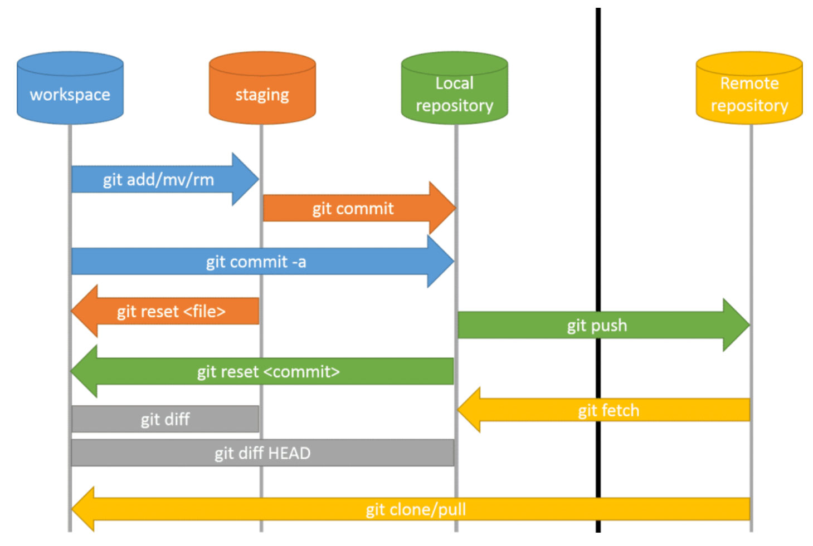
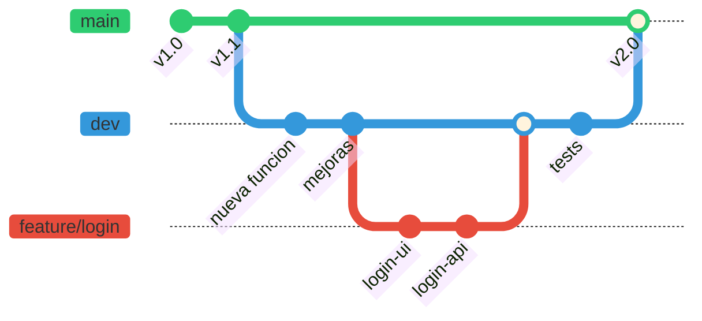
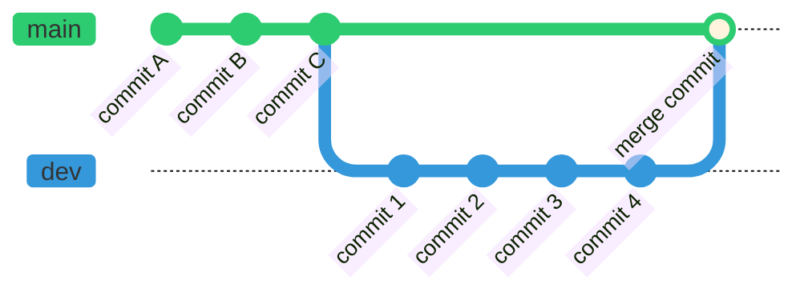

Este capítulo introduce Git como sistema de control de versiones distribuido, su
terminología, las áreas de trabajo y los comandos esenciales para gestionar
repositorios.

## Introducción

<figure markdown="span">
  
  <figcaption>Logo de Git</figcaption>
</figure>

**Git** es un sistema de control de versiones diseñado para gestionar el historial de
cambios en proyectos de software. Permite a los equipos de desarrollo colaborar de forma
eficiente, realizar un seguimiento detallado de las modificaciones en el código fuente y
administrar distintas versiones de un proyecto a lo largo del tiempo. Fue creado por
Linus Torvalds, quien también desarrolló el _kernel_ de Linux, con el objetivo de
disponer de una herramienta rápida, distribuida y capaz de manejar proyectos de gran
envergadura.

Plataformas como **GitHub** o **GitLab** se construyen sobre Git para facilitar la
gestión de proyectos y la colaboración en línea. Estas herramientas proporcionan
interfaces gráficas que simplifican las operaciones habituales del control de versiones
y ofrecen funcionalidades adicionales como la integración continua y el despliegue
continuo (CI/CD), lo que permite automatizar procesos de compilación, pruebas y
publicación del software de manera eficiente.

## Control de versiones

El **control de versiones** es una herramienta que permite gestionar los cambios en
archivos a lo largo del tiempo, facilitando la recuperación de versiones anteriores
cuando sea necesario.

Puede entenderse como un sistema de **etiquetas de cambios**, cada vez que se guarda un
cambio mediante un _commit_ en Git, se genera un **identificador único** (llamado
_hash_) que registra el estado exacto de los archivos en ese momento. Esto permite
consultar, comparar o restaurar versiones anteriores de manera segura y organizada.

### Terminología

- **Repositorio local**: Espacio en el ordenador donde se almacenan todos los archivos
  de un proyecto y sus versiones anteriores. Git permite hacer un seguimiento de los
  cambios en estos archivos sin necesidad de conexión a internet.

- **Repositorio remoto**: Copia del repositorio local almacenada en internet o en una
  red externa. Plataformas como GitHub, GitLab o Bitbucket permiten que varias personas
  trabajen en el mismo proyecto desde diferentes ubicaciones.

- **Histórico (_Log_)**: Registro que muestra todos los cambios realizados en el
  proyecto a lo largo del tiempo. Cada vez que se guarda un cambio en Git (un
  **_commit_**), queda registrado en este historial con información como la fecha, el
  autor del cambio y una descripción de lo modificado. También se conoce como **_Commit
  History_**, siendo el lugar donde se almacenan todos los **_commits_** realizados.

- **Conflicto**: Situación que ocurre cuando Git no puede combinar automáticamente los
  cambios de diferentes personas en un mismo archivo. Por ejemplo, si dos personas
  editan la misma línea de un archivo y luego intentan guardar sus cambios en el
  repositorio remoto, Git no puede determinar qué versión debe mantener y marca un
  conflicto. En ese caso, es necesario revisar y decidir manualmente qué cambios
  conservar.

### Áreas de trabajo

<figure markdown="span">
  
  <figcaption>Áreas de trabajo en Git. <a href="https://ihcantabria.github.io/ApuntesGit/_images/comandos-workflow.png">Fuente</a></figcaption>
</figure>

Dentro del sistema Git se distinguen diferentes áreas:

1. **_Working Directory_**: Es el directorio de trabajo donde se modifican los archivos.
   Cuando se añaden nuevos archivos en esta área, para Git están en estado _untracked_
   (sin seguimiento) hasta que se añadan explícitamente.

2. **_Staging Area_**: Funciona como un espacio de borrador donde se preparan los
   cambios para el siguiente _commit_. Se representa físicamente mediante un fichero
   llamado `index` dentro de la carpeta `.git` en la raíz del repositorio. Los archivos
   añadidos a esta área pasan a estar _tracked_ (con seguimiento).

3. **_Commit History_**: Área donde se almacenan todas las versiones confirmadas del
   proyecto.

4. **_Local Repository_**: Contiene toda la información del proyecto y su historial de
   cambios a nivel local.

El flujo de trabajo típico consiste en modificar archivos en el _Working Directory_,
añadirlos al _Staging Area_ mediante `git add`, confirmarlos al _Commit History_ con
`git commit` y finalmente subirlos al repositorio remoto con `git push`.

### Estados de un archivo

Durante el ciclo de vida en Git, un archivo puede pasar por diferentes estados:

1. **Sin seguimiento (_Untracked_)**: El archivo es nuevo y Git aún no lo está
   rastreando. No se guarda en el historial del repositorio hasta que se agregue
   manualmente con `git add`.

2. **Ignorado (_Ignored_)**: Archivos como configuraciones personales o temporales
   pueden estar en una lista especial llamada `.gitignore`. Git los omite y no los
   agrega al repositorio.

3. **Modificado (_Modified_)**: El archivo ha sido editado después de su última
   confirmación (_commit_), pero esos cambios aún no han sido registrados en Git.

4. **Preparado (_Staged_)**: Una vez que el archivo modificado se agrega con `git add`,
   entra en estado _staged_. Esto significa que está listo para ser guardado en la
   próxima confirmación.

5. **Confirmado (_Committed_)**: Cuando se ejecuta `git commit`, los cambios preparados
   se guardan en la base de datos de Git, registrándolos en el historial del repositorio
   de manera permanente.

## Uso de Git

### Línea de comandos

**Git Bash** es una interfaz de línea de comandos (también conocido como **CLI** de
_Command-line Interface_) que permite la interacción con Git mediante el uso de comandos
de Linux.

Si quieres conocer sobre estos comandos y lo básico sobre Linux, puedes dirigirte a este
[apartado](../../01_operative_systems/01_linux/section_1_fundamentals.md).

### Configuración de Git

Antes de comenzar a trabajar con plataformas como GitHub o GitLab, es imprescindible
configurar correctamente el entorno local de Git. Esta configuración incluye, entre
otros aspectos, la identidad del autor de los _commits_ y ciertos parámetros de
comportamiento global.

Mediante el comando `git config --global --list` es posible consultar todas las
variables definidas en la configuración global de Git junto con sus valores. Esta
configuración se utiliza, entre otros fines, para establecer el nombre de usuario y la
dirección de correo electrónico que quedarán asociados a cada _commit_.

#### Configurar nombre de usuario y correo

Git utiliza el nombre y el correo configurados para identificar tus contribuciones.
Puedes configurarlos globalmente para que se apliquen a todos tus repositorios
utilizando los siguientes comandos:

???+ example "Configurar identidad"

    ```bash linenums="1"
    git config --global user.name "Tu Nombre"
    git config --global user.email "tu-correo@example.com"
    ```

Para verificar la configuración, puedes utilizar:

???+ example "Verificar configuración"

    ```bash linenums="1"
    git config --global --list
    ```

Si deseas configurarlos solo para un repositorio específico, omite la opción `--global`
y ejecuta los comandos dentro del directorio del repositorio.

#### Configurar autenticación SSH para GitHub/GitLab

Configurar claves SSH simplifica la autenticación con GitHub/GitLab.

Para ello, genera una clave SSH si no tienes una, utilizando el siguiente comando:

???+ example "Generar clave SSH"

    ```bash linenums="1"
    ssh-keygen -t ed25519 -C "<EMAIL_ADDRESS>"
    ```

    Si tu sistema no soporta `ed25519`, usa:

    ```bash linenums="1"
    ssh-keygen -t rsa -b 4096 -C "<EMAIL_ADDRESS>"
    ```

    Copia la clave pública generada:

    ```bash linenums="1"
    cat ~/.ssh/id_ed25519.pub
    ```

Ve a tu cuenta de GitHub o GitLab, accede a **Settings** > **SSH and GPG keys** (o
similar), y añade la clave pública copiada.

Finalmente, puedes probar la conexión utilizando el siguiente comando:

???+ example "Verificar conexión SSH"

    ```bash linenums="1"
    ssh -T git@github.com
    ```

    En el caso de utilizar GitLab puedes utilizar este otro comando:

    ```bash linenums="1"
    ssh -T git@gitlab.com
    ```

#### Configurar autenticación con tokens personales

Si prefieres usar HTTPS en lugar de SSH, puedes crear un token personal de acceso en
GitHub/GitLab y usarlo como contraseña al clonar o realizar _push_. Para configurarlo:

1. Ve a **Settings** > **Developer Settings** > **Personal Access Tokens** (o similar).
2. Genera un token con los permisos necesarios.
3. Al realizar una operación que requiera autenticación, usa tu usuario como nombre de
   usuario y el token como contraseña.

### Comandos para el control de versiones

Un comando de Git se compone de tres elementos fundamentales: el programa principal
(`git`), el comando que define la acción concreta que se desea realizar y, de forma
opcional, una serie de opciones y argumentos que ajustan su comportamiento.

???+ example "Commit con mensaje"

    ```
    git commit -m "Esto es un commit"
    ```

    En este caso, `git commit` define la acción de confirmar cambios, `-m` es una opción que
    permite añadir un mensaje descriptivo y `"Esto es un commit"` es el argumento asociado a
    dicha opción.

    ???+ note "Nota sobre los Commits"

        Un buen _commit_ es aquel que contiene exclusivamente los cambios relacionados
        con una única tarea o propósito concreto. Evitar el uso indiscriminado de
        `git add .` y, en su lugar, seleccionar cuidadosamente qué cambios se
        incluyen. Una práctica recomendable consiste en crear _tickets_ específicos en
        un gestor de tareas (como Jira) y asociar cada _commit_ a su _issue_
        correspondiente, creando ramas dedicadas a partir de ellos. Además, los
        mensajes de _commit_ deben ser concisos, idealmente de 80 caracteres o menos,
        para facilitar su lectura en el historial.

A continuación se describen los comandos más relevantes para la gestión del control de
versiones en un repositorio Git a nivel local.

| Comando                 | Función                                                                                                                                                                                                                 | Ejemplo de uso                                                                                             |
| ----------------------- | ----------------------------------------------------------------------------------------------------------------------------------------------------------------------------------------------------------------------- | ---------------------------------------------------------------------------------------------------------- |
| **git init**            | Inicializa un repositorio Git en el directorio actual, creando la carpeta oculta `.git` que contiene toda la información necesaria para el control de versiones. Por defecto, la rama principal creada es `main`.       | `git init` inicializa un repositorio en la carpeta actual.                                                 |
| **git remote**          | Gestiona las conexiones entre el repositorio local y uno o varios repositorios remotos. Permite añadir, eliminar o listar repositorios remotos.                                                                         | `git remote add origin url_repo` asocia el repositorio remoto con el alias `origin`.                       |
| **git clone**           | Crea una copia local completa de un repositorio existente, incluyendo su historial de commits y ramas.                                                                                                                  | `git clone https://github.com/usuario/repositorio.git` clona el repositorio indicado.                      |
| **git add**             | Añade cambios al área de preparación (_staging area_). Git no mueve los archivos, sino que registra una instantánea de su estado actual.                                                                                | `git add archivo.txt` prepara el archivo para el próximo commit.                                           |
| **git add -p**          | Añade cambios de forma interactiva, permitiendo seleccionar fragmento a fragmento qué cambios incluir en el área de preparación. Git recorre cada fragmento modificado del archivo y pregunta si se desea incluir o no. | `git add -p archivo.txt` revisa cada fragmento del archivo para decidir si se prepara.                     |
| **git commit**          | Registra de forma permanente los cambios preparados en el historial del repositorio local.                                                                                                                              | `git commit -m "Mensaje del commit"` crea un commit con un mensaje descriptivo.                            |
| **git commit --amend**  | Modifica el último commit, permitiendo cambiar el mensaje o añadir nuevos cambios al mismo commit. Resulta útil para corregir errores recientes.                                                                        | `git commit --amend` reabre el último commit para modificarlo.                                             |
| **git reset HEAD**      | Revierte la preparación de archivos que habían sido añadidos al área de preparación, sin perder los cambios en el directorio de trabajo.                                                                                | `git reset HEAD archivo.txt` saca el archivo del área de preparación.                                      |
| **git status**          | Muestra el estado actual del repositorio, indicando qué archivos han sido modificados, cuáles están preparados y cuáles no están siendo seguidos.                                                                       | `git status` muestra un resumen del estado del repositorio.                                                |
| **git checkout**        | Permite cambiar entre ramas o restaurar archivos a su último estado confirmado. En versiones recientes de Git, se recomienda `git switch` para cambiar de rama.                                                         | `git checkout rama-nueva` cambia a otra rama.<br />`git checkout -- archivo.txt` descarta cambios locales. |
| **git branch**          | Gestiona las ramas locales, permitiendo listarlas, crearlas o eliminarlas.                                                                                                                                              | `git branch` lista las ramas.<br />`git branch rama-nueva` crea una nueva rama.                            |
| **git merge**           | Fusiona los cambios de una rama en la rama actual, integrando sus commits en el historial.                                                                                                                              | `git merge rama-nueva` fusiona `rama-nueva` en la rama actual.                                             |
| **git merge --abort**   | Cancela un _merge_ en curso y restaura el estado anterior del directorio de trabajo. Útil cuando surgen conflictos que se prefiere no resolver en ese momento.                                                          | `git merge --abort` cancela la fusión en curso.                                                            |
| **git merge -X theirs** | Fusiona aceptando automáticamente todos los cambios de la rama entrante en caso de conflicto, descartando los de la rama actual.                                                                                        | `git merge -X theirs rama-feature` fusiona aceptando los cambios de `rama-feature`.                        |
| **git fetch**           | Descarga información actualizada del repositorio remoto sin modificar la rama local ni el directorio de trabajo. Permite inspeccionar cambios antes de integrarlos.                                                     | `git fetch origin` descarga los cambios del remoto `origin`.                                               |
| **git fetch --prune**   | Descarga los cambios del repositorio remoto y elimina las referencias locales a ramas remotas que ya no existen. Es fundamental para evitar acumulación de ramas obsoletas.                                             | `git fetch --prune` limpia referencias a ramas remotas eliminadas.                                         |
| **git pull**            | Combina `git fetch` y `git merge` en un solo comando, descargando y fusionando los cambios del repositorio remoto con la rama actual.                                                                                   | `git pull origin main` actualiza la rama local `main`.                                                     |
| **git push**            | Envía los commits locales al repositorio remoto, haciendo públicos los cambios confirmados.                                                                                                                             | `git push origin main` sube los commits a la rama `main` remota.                                           |
| **git log**             | Muestra el historial de commits del repositorio, permitiendo analizar la evolución del proyecto.                                                                                                                        | `git log` muestra el historial completo.<br />`git log --oneline` muestra un resumen compacto.             |
| **git diff**            | Muestra las diferencias entre archivos en distintos estados, como entre el directorio de trabajo y el último commit o entre commits concretos.                                                                          | `git diff` muestra los cambios no confirmados.                                                             |
| **git stash**           | Guarda temporalmente los cambios no confirmados y limpia el directorio de trabajo, permitiendo cambiar de contexto sin perder trabajo.                                                                                  | `git stash` guarda los cambios.<br />`git stash pop` los recupera.                                         |
| **git rm**              | Elimina archivos del repositorio y del área de preparación, registrando la eliminación para el próximo commit.                                                                                                          | `git rm archivo.txt` elimina el archivo del control de versiones.                                          |
| **git rebase**          | Reaplica commits sobre una base distinta, manteniendo un historial lineal. Es especialmente útil para actualizar ramas con respecto a la rama principal.                                                                | `git rebase main` reaplica los commits actuales sobre `main`.                                              |
| **git rebase --abort**  | Cancela un _rebase_ en curso y restaura la rama a su estado original antes de iniciar la operación.                                                                                                                     | `git rebase --abort` cancela el rebase en curso.                                                           |
| **git clean**           | Elimina archivos no rastreados del directorio de trabajo. Debe usarse con precaución, ya que borra archivos de forma permanente.                                                                                        | `git clean -f` elimina archivos no rastreados.                                                             |

### Ramas

Una rama (**_branch_**) en Git es un puntero móvil que apunta a un _commit_ específico
dentro del historial del proyecto. Las ramas permiten crear líneas de desarrollo
independientes a partir de un punto común, de modo que es posible trabajar en nuevas
funcionalidades, correcciones o experimentos sin alterar el código de la rama principal.
Una vez que el trabajo en una rama se considera estable, puede integrarse de nuevo en la
rama de origen mediante una operación de fusión (**_merge_**). Este mecanismo constituye
uno de los pilares fundamentales de Git, ya que facilita el desarrollo paralelo y la
organización del flujo de trabajo en equipos de cualquier tamaño.

Las estrategias de ramificación en Git están estrechamente vinculadas con la forma en
que se crean, desarrollan y combinan las diferentes ramas dentro de un mismo
repositorio. Estas estrategias definen un conjunto de convenciones que determinan cuándo
crear una rama, qué propósito debe cumplir y cómo debe integrarse de nuevo en el flujo
principal. En las siguientes secciones se abordan las formas más habituales de trabajar
con ramas en Git.

Una de las metodologías más básicas de Git consiste en utilizar una rama principal
denominada `main` (anteriormente `master`, término que ha caído en desuso por convención
de la comunidad), que es la que se lleva a producción y debe estar siempre disponible.
Adicionalmente, se cuenta con una rama de desarrollo (`dev`) que incorpora las nuevas
características o funcionalidades que posteriormente se añadirán a la rama principal. A
partir de estas, es posible crear diferentes subramas que permiten implementar cada
característica por separado, aunque esto dependerá de la metodología de trabajo
utilizada.



En general, las ramas pueden clasificarse según su duración y propósito:

- **Ramas de ejecución prolongada (_long-running branches_)**: Son ramas que existen
  durante toda la vida del proyecto, como `main` o `dev`. Representan estados estables
  del código y no se eliminan tras una integración.
- **_Feature branches_**: Ramas creadas para desarrollar una funcionalidad concreta.
  Tienen un periodo de vida corto y se eliminan una vez que sus cambios se integran en
  la rama principal o de desarrollo.
- **_Short-lived branches_**: Ramas de muy corta duración basadas directamente en las
  ramas principales, utilizadas para correcciones rápidas (_hotfixes_) o cambios
  menores.

???+ note "Documentar la estrategia de ramas"

    Es una buena práctica definir y documentar la estrategia de ramas dentro de la propia
    documentación del proyecto, de modo que todos los miembros del equipo compartan un
    criterio común sobre cómo y cuándo crear, nombrar y fusionar ramas.

En Git existe el concepto de `HEAD`, un puntero que indica la rama que se está
utilizando y apunta a un _commit_ específico. Es posible encontrarse en un _commit_ que
no está siendo apuntado por una rama, situación conocida como **_Detached HEAD State_**.

### _Merge_ y _pull requests_

Para combinar los cambios de una rama a otra se utilizan los _merges_ o _pull requests_
en los repositorios. En este proceso intervienen dos ramas: la rama "_source_" y la rama
"_target_". La rama _source_ contiene los cambios que se desean incorporar, mientras que
la _target_ es la rama donde se introducirán dichos cambios. Por ejemplo, la rama
_source_ puede ser la rama `dev` y la _target_ puede ser la rama `main`.


