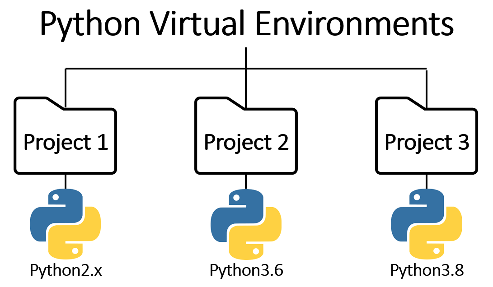

Este capítulo describe las principales herramientas para la gestión de entornos
virtuales y dependencias en Python, con énfasis en uv.

## Bibliografía

- Python Software Foundation. (s.f.). _venv — Creation of virtual environments_.
  <https://docs.python.org/3/library/venv.html>
- Poetry. (s.f.). _Poetry - Python dependency management_. <https://python-poetry.org/>
- Anaconda. (s.f.). _Anaconda Documentation_. <https://docs.anaconda.com/>
- Astral. (s.f.). _uv - An extremely fast Python package installer_.
  <https://docs.astral.sh/uv/>
- Astral. (s.f.). _Building and publishing a package_.
  <https://docs.astral.sh/uv/guides/package/#publishing-your-package>

## Gestores de entornos y paquetes

En el ecosistema de Python existen diversas herramientas para la gestión de paquetes y
entornos virtuales. La elección de una u otra depende del contexto de trabajo, las
necesidades del equipo y la infraestructura disponible. No obstante, como principio
general, resulta conveniente optar por la alternativa más simple y minimalista posible.
Un entorno con pocas dependencias es más fácil de llevar a producción (por ejemplo,
dentro de una imagen de Docker), de compartir con otros desarrolladores y de mantener a
lo largo del tiempo.

### Anaconda

<figure markdown="span">
  
  <figcaption>Logo de Anaconda</figcaption>
</figure>

Anaconda es una plataforma de código abierto diseñada para la creación y gestión de
entornos virtuales en Python, orientada a proyectos de ciencia de datos y aprendizaje
automático. Proporciona una distribución de Python con numerosas bibliotecas
preinstaladas, un gestor de paquetes propio denominado
[Conda](https://anaconda.org/anaconda/repo) y herramientas integradas como
[Jupyter](https://jupyter.org/).

La gestión de paquetes se realiza principalmente a través de Conda, aunque también es
posible utilizar [PIP](https://pypi.org/). Sin embargo, mezclar ambos gestores no es
recomendable, ya que pueden surgir conflictos en la resolución de dependencias. Para
profundizar en este aspecto, puede consultarse este
[recurso](https://terminal.space/tech/why-cant-we-pip-and-conda-be-friends/).

Durante años, Anaconda fue la plataforma dominante en ciencia de datos gracias a su
ecosistema completo y su facilidad de uso. Con el tiempo, sin embargo, ha presentado
limitaciones relevantes, como una licencia más restrictiva para entornos empresariales y
un exceso de dependencias por defecto que incrementan innecesariamente el tamaño del
entorno. Además, al ser tan completa, resultaba pesada en cuanto a tamaño, incluso con
alternativas como Miniconda.

### VENV

[`VENV`](https://docs.python.org/3/library/venv.html) es el módulo estándar de Python
para la creación de entornos virtuales. A diferencia de Anaconda, no incluye
dependencias adicionales y viene integrado en la instalación base de Python. La gestión
de paquetes se realiza mediante [PIP](https://pypi.org/), el gestor de paquetes por
defecto del lenguaje.

Su principal ventaja es la simplicidad y la ausencia de herramientas externas, aunque
carece de funcionalidades avanzadas como la gestión de grupos de dependencias o la
resolución determinista de versiones.

### Poetry

<figure markdown="span">
  
  <figcaption>Logo de Poetry</figcaption>
</figure>

[Poetry](https://python-poetry.org/) es una herramienta de gestión de dependencias y
empaquetado para proyectos de Python. Permite administrar dependencias organizadas por
grupos (producción, pruebas, documentación, entre otros), lo que elimina la necesidad de
mantener múltiples archivos `requirements.txt` o de concentrar todas las dependencias en
un único fichero.

### uv

[`uv`](https://docs.astral.sh/uv/) es una de las herramientas más recientes y eficientes
para la gestión de entornos virtuales y dependencias en Python. Su objetivo principal es
simplificar y acelerar tareas que tradicionalmente requieren múltiples herramientas. Su
velocidad es notablemente superior a la de otras alternativas, ya que está basada en
Rust, un lenguaje de programación de bajo nivel.

`uv` adopta un modelo de configuración basado en archivos `pyproject.toml`, al igual que
Poetry, similar al sistema `cargo` de Rust, donde se definen los metadatos del proyecto,
las dependencias con sus versiones, la versión de Python requerida y las configuraciones
de herramientas auxiliares. Además, permite la gestión automática de entornos y no
requiere que Python esté previamente instalado en el sistema, ya que `uv` se encarga de
descargarlo y configurarlo de forma transparente.

Por todo ello, en la actualidad `uv` representa la opción más recomendable para la
mayoría de proyectos y es en la herramienta que nos vamos a centrar.

## Creación y activación de entornos

<figure markdown="span">
  
  <figcaption>Formas de configurar entornos virtuales en Python. <a href="https://python.plainenglish.io/3-ways-to-set-up-your-python-projects-a45a3d7e8561">Referencia</a></figcaption>
</figure>

Un entorno virtual genera una instancia aislada del intérprete de Python, de modo que
las dependencias de un proyecto específico no interfieran con las bibliotecas globales
del sistema ni con otros desarrollos simultáneos, lo que garantiza la reproducibilidad
del código y evita conflictos de versiones.

En el caso de `uv`, el flujo de trabajo se compone de dos fases. En primer lugar, se
instala la herramienta mediante un _script_ de ejecución rápida que configura el binario
en el sistema, para ello utilizamos el comando siguiente:

```bash linenums="1"
curl -LsSf https://astral.sh/uv/install.sh | sh
```

A continuación, se inicializa el proyecto y se crea su entorno virtual correspondiente:

```bash linenums="1"
uv init nombre_del_proyecto
cd nombre_del_proyecto
uv venv
uv pip install nombre_del_paquete
```

## Estructura de un `pyproject.toml` con uv

El archivo `pyproject.toml` constituye el punto central de configuración de un proyecto
Python gestionado con `uv`. En él se definen los metadatos del proyecto, las
dependencias organizadas por grupos, los índices de paquetes y la configuración de
herramientas auxiliares. Este enfoque centralizado elimina la necesidad de mantener
múltiples archivos de configuración dispersos por el proyecto.

!!! example "Ejemplo de un fichero `pyproject.toml`"

    A continuación se muestra un ejemplo completo con las secciones más relevantes.

    ```toml linenums="1"
    [build-system]
    requires = ["uv_build>=0.10.7,<0.11.0"]
    build-backend = "uv_build"

    [project]
    name = "mi-proyecto"
    version = "1.0.0"
    description = "Descripción del proyecto"
    readme = "README.md"
    requires-python = "==3.11.*"
    authors = [
        {name = "Tu Nombre", email = "tu@email.com"},
    ]

    [tool.uv]
    default-groups = "all"
    cache-keys = [{ file = "pyproject.toml" }, { git = { commit = true } }]

    [tool.uv.sources]
    mi-paquete-local = { path = "ruta/al/paquete", editable = true }
    paquete-privado = { index = "mi_indice_privado" }

    [[tool.uv.index]]
    name = "pypi"
    url = "https://pypi.org/simple"
    default = true

    [[tool.uv.index]]
    name = "mi_indice_privado"
    url = "https://mi-servidor.com/api/packages/pypi/simple/"
    authenticate = "always"

    [dependency-groups]
    core = [
        "numpy==1.26.4",
        "pandas==2.2.0",
    ]
    notebooks = [
        "ipykernel==6.29.0",
        "matplotlib==3.8.2",
    ]
    pipeline = [
        "pytest==8.0.0",
        "pytest-cov==4.1.0",
        "ruff==0.2.0",
        "mypy==1.8.0",
        "pre-commit==3.6.0",
    ]
    docs = [
        "mkdocs==1.5.3",
        "mkdocs-material==9.5.0",
    ]

    [tool.ruff]
    line-length = 88
    indent-width = 4
    extend-exclude = [".venv", ".uv-cache", "notebooks"]

    [tool.ruff.lint]
    select = ["E", "F", "W", "PL", "UP", "N", "B", "I"]

    [tool.ruff.format]
    docstring-code-format = true
    quote-style = "double"
    indent-style = "space"

    [tool.mypy]
    check_untyped_defs = true
    ignore_missing_imports = true
    exclude = [".venv/", ".uv-cache/", "notebooks/"]

    [tool.pytest.ini_options]
    testpaths = ["tests"]
    python_files = ["test_*.py"]
    python_classes = ["Test*"]
    python_functions = ["test_*"]
    addopts = ["--strict-markers", "--tb=short"]
    ```

    - La sección **`[build-system]`** define el _backend_ de construcción del proyecto. Al
      especificar `uv_build`, se habilita el empaquetado del proyecto como una distribución
      instalable, lo que permite encapsularlo como una librería y utilizarlo como tal, de la
      misma forma que se emplea cualquier librería de terceros como Polars, NumPy o
      similares.

    - La sección **`[project]`** contiene los metadatos del proyecto: nombre, versión,
      descripción, versión de Python requerida y autores. Este formato sigue el estándar
      definido por [PEP 621](https://peps.python.org/pep-0621/), que unifica la declaración
      de metadatos en el ecosistema Python.

    - La sección **`[tool.uv]`** alberga la configuración específica de `uv`. El campo
      `default-groups` indica qué grupos de dependencias se instalan por defecto, mientras
      que `cache-keys` permite invalidar la caché cuando cambian determinados archivos o el
      _commit_ de Git.

    - La sección **`[tool.uv.sources]`** permite definir fuentes alternativas para paquetes
      específicos, como paquetes locales en modo editable (útiles durante el desarrollo) o
      paquetes alojados en índices privados. Esto resulta especialmente práctico cuando se
      gestionan librerías propias en repositorios o instancias privadas de GitLab o
      plataformas similares.

    - La sección **`[[tool.uv.index]]`** configura los índices de paquetes disponibles. Es
      posible definir múltiples índices simultáneamente, estableciendo _PyPI_ como índice
      por defecto y añadiendo repositorios privados con autenticación obligatoria.

    - La sección **`[dependency-groups]`** organiza las dependencias en grupos lógicos
      (_core_, _notebooks_, _pipeline_, _docs_, entre otros). Esta organización permite
      instalar únicamente lo necesario según el contexto. Por ejemplo, en un entorno de
      integración continua (CI/CD) solo se instalaría el grupo `pipeline`, mientras que en
      un entorno de desarrollo local podrían instalarse todos los grupos.

    - Las secciones **`[tool.ruff]`**, **`[tool.mypy]`** y **`[tool.pytest.ini_options]`**
      centralizan la configuración de herramientas del proyecto dentro del propio
      `pyproject.toml`, eliminando la necesidad de archivos separados como `setup.cfg`,
      `.flake8`, `mypy.ini` o `pytest.ini`.

## Operaciones comunes de mantenimiento

A continuación se muestran algunas de las operaciones más comunes en el uso de `uv`. En
caso de tener dudas sobre las opciones que ofrecen estos comandos, o para descubrir
otros que no se mencionan aquí, puede ejecutarse `uv help`, que muestra los comandos
disponibles junto con una descripción de cada uno.

### Gestión de la caché

Los gestores de entorno almacenan en caché la información de los paquetes que instalan.
Con el tiempo, esta caché puede ocupar una cantidad significativa de espacio en disco o
generar conflictos cuando existen paquetes corruptos. Para liberar espacio o solucionar
problemas con dependencias, es posible purgar la caché con el siguiente comando:

```bash linenums="1"
uv cache clean
```

### Actualización de paquetes

El _software_ evoluciona de forma continua. Los paquetes incorporan nuevas
funcionalidades, corrigen errores y resuelven vulnerabilidades de seguridad en versiones
posteriores. Mantener las dependencias actualizadas es esencial para el correcto
funcionamiento y la seguridad del proyecto.

Lo ideal no es actualizar todos los paquetes del entorno de forma simultánea. Una
estrategia más adecuada consiste en definir una batería de tests en el repositorio donde
se aloja el código y apoyarse en herramientas como Dependabot en GitHub, o equivalentes
en otras plataformas, que avisan cuando hay disponible una nueva versión de una
dependencia. En ese caso, Dependabot crea una nueva rama, ejecuta los tests definidos en
el repositorio y abre una _merge request_ que puede aprobarse si las pruebas se superan.
Esta es la forma más práctica y funcional, además de ajustarse a las buenas prácticas,
ya que ciertas librerías pueden arrastrar dependencias de otras que se estén utilizando
sin saberlo, lo que puede provocar divergencias entre versiones.

En caso de preferir un proceso manual, siempre es posible consultar la página de PyPI o
el repositorio correspondiente de la dependencia y comprobar si existe una nueva
versión. Dicha versión puede fijarse en el fichero `pyproject.toml` o instalarse
directamente mediante el siguiente comando:

```bash linenums="1"
uv pip install --upgrade nombre_del_paquete
```

### Instalación de paquetes desde un archivo de requisitos

Aunque los sistemas basados en `pyproject.toml` hacen cada vez menos necesario el uso de
archivos `requirements.txt`, en determinados contextos puede seguir siendo útil. El
procedimiento consiste en crear un archivo con los paquetes y versiones deseadas e
instalarlo mediante el gestor correspondiente.

Suponiendo que contamos con un fichero `requirements.txt`que contiene los siguientes
dependencias con las versiones especificadas:

```plaintext linenums="1"
numpy==1.21.0
pandas>=1.3.0
requests
```

Podemos instalar las versiones de dichas dependencias utilizando `uv` mediante el
siguiente comando:

```bash linenums="1"
uv pip install -r requirements.txt
```

### Instalación de dependencias por grupos

Con `uv`, la instalación de dependencias de grupos (recuerda del ejemplo anterior cómo
se definian los diferentes grupos en el fichero `pyproject.toml` en el apartado
`[dependency-groups]`, la parte de Estructura de un pyproject.toml con uv¶) específicos
se realiza mediante el comando `uv sync`:

```bash linenums="1"
# Instalar solo el grupo core
uv sync --group core

# Instalar varios grupos simultáneamente
uv sync --group core --group notebooks

# Instalar todos los grupos
uv sync --all-groups
```

### Eliminación de un entorno

En la mayoría de los casos, los entornos creados se alojan dentro del propio directorio
del proyecto. Para eliminarlos, basta con borrar la carpeta correspondiente. En el caso
de utilizar Linux, WSL o similares podemos utilizar el siguiente comando:

```bash linenums="1"
rm -rf nombre_del_entorno
```

### Eliminación de paquetes

Cuando se gestiona un proyecto con `uv` y `pyproject.toml`, la forma recomendada de
eliminar una dependencia consiste en borrarla directamente del archivo `pyproject.toml`
y ejecutar `uv sync` a continuación. De este modo, el fichero `.lock` se regenera de
forma coherente con el estado actual de las dependencias. En el caso de utilizar `pip`
de forma directa, se emplea el siguiente comando:

```bash linenums="1"
uv pip uninstall nombre_del_paquete
```

## Integración con Jupyter

Para utilizar un entorno virtual dentro de Jupyter, es necesario instalar el paquete
`ipykernel` como dependencia del entorno. Para ello se utiliza el siguiente comando:

```bash linenums="1"
uv add ipykernel
```

El registro manual del entorno como _kernel_ de Jupyter solo es necesario cuando el
entorno virtual se encuentra en un directorio diferente al del proyecto. En la mayoría
de los entornos de desarrollo modernos, como VSCode, si el entorno reside dentro del
directorio del proyecto, se detecta automáticamente y es posible seleccionar el _kernel_
asociado sin pasos adicionales.

En el caso particular de `uv`, cuando se emplea el comando `uv venv`, el entorno se crea
por defecto en la raíz del proyecto con la versión de Python especificada en el
`pyproject.toml`. De este modo, al utilizar _Jupyter Notebooks_ en VSCode, el entorno se
detecta directamente sin necesidad de ejecutar ningún comando de registro adicional.

## Construcción y publicación de paquetes

Además de gestionar entornos y dependencias, `uv` permite empaquetar un proyecto en
distribuciones instalables y publicarlas en un índice de paquetes como
[PyPI](https://pypi.org/). De esta forma, una librería propia queda disponible para el
resto de la comunidad o para otros equipos, que podrán instalarla del mismo modo que
cualquier dependencia de terceros.

El requisito previo es haber declarado la sección `[build-system]` en el
`pyproject.toml`, tal como se mostró en el ejemplo anterior, ya que es la que indica el
_backend_ encargado de generar el paquete.

El flujo se resume en dos comandos. El primero, `uv build`, construye los artefactos de
distribución (la _source distribution_ y la _wheel_) y los deposita en el subdirectorio
`dist/`. El segundo, `uv publish`, los sube al índice configurado.

La autenticación en PyPI se realiza mediante un **token**, que se proporciona con la
opción `--token` o a través de la variable de entorno `UV_PUBLISH_TOKEN`. Al publicar
desde GitHub Actions u otro _Trusted Publisher_ no es necesario gestionar credenciales,
sino que basta con registrar un publicador de confianza en el proyecto de PyPI.

Los detalles adicionales, como la actualización de versiones con `uv version`, la
publicación en índices personalizados o el uso de _Trusted Publishers_, se encuentran
recogidos en la documentación oficial referenciada en la bibliografía.
