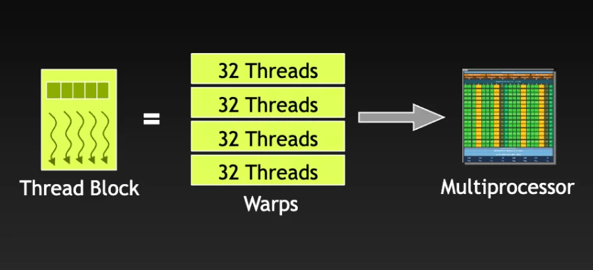

Este capítulo presenta la plataforma CUDA y la arquitectura de las GPU sobre las que se
ejecuta, con atención a la organización de los hilos en _warps_, al reparto de trabajo
entre CPU y GPU, a la jerarquía de memoria del dispositivo y al efecto que la precisión
numérica tiene sobre el rendimiento.

## Bibliografía

- NVIDIA. (s.f.). _CUDA Toolkit Documentation_. <https://docs.nvidia.com/cuda/>
- NVIDIA. (2017). _NVIDIA Tesla V100 GPU Architecture_ \[Informe técnico\].
  <https://images.nvidia.com/content/volta-architecture/pdf/volta-architecture-whitepaper.pdf>
- NVIDIA y Universidad de Málaga. (s.f.). _Deep Learning Institute - UMA_.
  <http://nvidiadli.uma.es/index.php/es/certificaciones-nvidia>

## Introducción

<figure markdown="span">
  
  <figcaption>Logo de CUDA.</figcaption>
</figure>

**CUDA** (_Compute Unified Device Architecture_) es una plataforma de computación
paralela y una interfaz de programación de aplicaciones (_Application Programming
Interface_, API) desarrollada por NVIDIA. Permite emplear unidades de procesamiento
gráfico (_Graphics Processing Unit_, GPU), en lugar de la unidad central de
procesamiento (_Central Processing Unit_, CPU), para realizar cálculos que, por su
volumen o por su estructura, se benefician de ejecutarse de forma masivamente paralela.
Su aplicación abarca áreas como la inteligencia artificial, la simulación científica y
la renderización de gráficos.

Los capítulos siguientes desarrollan la programación de la plataforma en dos lenguajes.
El capítulo de [CUDA en C](section_2_cuda_c.md) cubre la escritura de _kernels_ y la
gestión explícita de la memoria del dispositivo, mientras que el de
[CUDA en Python](section_3_cuda_python.md) aborda las mismas ideas a través de Numba y
CuPy.

## Arquitectura de la GPU

<figure markdown="span">
  
  <figcaption>Ecosistema de la plataforma CUDA.</figcaption>
</figure>

CUDA se sustenta en tres cualidades que explican la capacidad de la GPU para el
procesamiento paralelo:

- **Simplicidad**: La GPU organiza los hilos en grupos de 32 denominados _warps_. Los
  hilos de un mismo _warp_ comparten una única unidad de emisión de instrucciones, lo
  que reduce el coste de planificación y simplifica la gestión del paralelismo. Este
  modelo de ejecución se conoce como _Single Instruction Multiple Threads_ (SIMT).
- **Escalabilidad**: La plataforma permite construir modelos de paralelización que
  crecen con el volumen de datos disponible, algo especialmente relevante en
  aplicaciones a gran escala.
- **Productividad**: Cuando un _warp_ queda a la espera de un acceso a memoria, el
  multiprocesador conmuta a otro _warp_ que sí tenga trabajo pendiente. Esta rotación
  oculta la latencia y mantiene las unidades de cálculo ocupadas.

### _Warps_

<figure markdown="span">
  
  <figcaption>Organización de los bloques de hilos en <em>warps</em> dentro de la GPU. <a href="https://www.centron.de/en/tutorial/the-role-of-warps-in-parallel-processing-gpu-efficiency-explained/">Referencia</a></figcaption>
</figure>

El _warp_ es la unidad de planificación de la GPU. En el nivel de hardware, un bloque de
hilos se divide en _warps_ de 32 hilos que el multiprocesador emite de forma conjunta.
Estos _warps_ permanecen asignados al multiprocesador hasta completar su ejecución, y un
nuevo bloque no se lanza hasta que se liberan suficientes registros y memoria compartida
para alojar los _warps_ que lo componen.

!!! note "Divergencia dentro de un _warp_"

    Mientras todos los hilos de un _warp_ siguen el mismo camino de ejecución, la
    instrucción se emite una sola vez para los 32. Cuando una condición hace que unos
    hilos tomen una rama y otros no, el _warp_ diverge y las ramas se ejecutan de forma
    secuencial, con lo que se pierde parte del rendimiento.

    A partir de la arquitectura Volta, el _independent thread scheduling_ otorga a cada
    hilo su propio contador de programa, de modo que los hilos divergentes pueden
    avanzar de forma independiente. Esto elimina ciertos bloqueos, pero también implica
    que no se puede presumir que los hilos de un _warp_ estén sincronizados de forma
    implícita. Para garantizarlo hay que emplear `__syncwarp()`, una barrera que se
    invoca dentro del _kernel_ y que afecta solo a los hilos de un _warp_, a diferencia
    de `__syncthreads()`, que sincroniza el bloque completo.

### Modelo CPU-GPU

Aunque CUDA ofrece ventajas notables, el rendimiento depende de equilibrar la carga de
trabajo entre la GPU y la CPU, un enfoque que se conoce como **computación
heterogénea**.

La GPU se orienta al procesamiento intensivo en datos y al paralelismo fino, mientras
que la CPU resulta más adecuada para el código con saltos y bifurcaciones frecuentes,
así como para el paralelismo grueso. Identificar qué partes del código se benefician de
la paralelización en la GPU y cuáles conviene procesar de forma secuencial en la CPU es
determinante para obtener el máximo rendimiento. El paralelismo en el que CUDA destaca
es, por tanto, el **paralelismo de datos** (_data parallelism_).

<figure markdown="span">
  
  <figcaption>Comparación entre la arquitectura de una CPU y la de una GPU.</figcaption>
</figure>

### Jerarquía de memoria

Una GPU se compone de $N$ multiprocesadores, cada uno de los cuales contiene $M$
núcleos. La siguiente imagen muestra algunas de las familias de GPU de la serie Tesla de
NVIDIA.

<figure markdown="span">
  
  <figcaption>Familias de GPU de la serie Tesla de NVIDIA.</figcaption>
</figure>

Cada multiprocesador dispone de su propio banco de registros, de memoria compartida y de
dos cachés de solo lectura, una para constantes y otra para texturas. Junto a ellos, la
GPU cuenta con una memoria global, implementada con tecnología GDDR o HBM según la
generación, cuyo ancho de banda supera en un orden de magnitud al de la memoria
principal de la CPU. Esa memoria global es, sin embargo, considerablemente más lenta que
la memoria compartida del multiprocesador, que está construida con SRAM. Los bloques de
hilos pueden asignarse a cualquier multiprocesador para su ejecución.

<figure markdown="span">
  
  <figcaption>Estructura interna de una GPU.</figcaption>
</figure>

A modo de ejemplo, la GPU GV100 de la generación Volta cuenta con 84 multiprocesadores y
8 controladores de memoria de 512 bits. Cada multiprocesador de esta arquitectura
dispone de 64 núcleos para operaciones `int32`, 64 para `float32`, 32 para `float64` y 8
unidades tensoriales.

<figure markdown="span">
  
  <figcaption>Multiprocesador de la arquitectura Volta (GPU GV100).</figcaption>
</figure>

De la imagen anterior se desprende que el diseño de un multiprocesador se utiliza como
unidad base y se replica para construir configuraciones de mayor capacidad.

<figure markdown="span">
  
  <figcaption>Replicación de multiprocesadores a partir de un diseño base.</figcaption>
</figure>

### Núcleos tensoriales

En la última década los núcleos tensoriales han adquirido un protagonismo notable, hasta
convertirse en la principal unidad de cómputo que emplean las bibliotecas de aprendizaje
profundo. Están diseñados para resolver operaciones matriciales a gran velocidad, lo que
resulta determinante en el entrenamiento de modelos de inteligencia artificial y en
cualquier proceso dominado por productos de matrices. El siguiente diagrama ilustra la
operación que cada núcleo tensorial completa por ciclo de reloj.

<figure markdown="span">
  
  <figcaption>Operación de un núcleo tensorial por ciclo de reloj.</figcaption>
</figure>

### Precisión numérica

La precisión de los datos influye directamente en la tasa de cómputo (_throughput_) del
sistema, esto es, en el número de operaciones que completa por unidad de tiempo. Reducir
la precisión, por ejemplo de enteros de 32 bits a enteros de 16 bits, permite realizar
un mayor número de operaciones por unidad de tiempo a cambio de un resultado menos
exacto. Dependiendo de la aplicación, esa pérdida de exactitud puede ser perfectamente
aceptable, y de hecho el entrenamiento de redes neuronales en precisión mixta se apoya
en esta idea.

<figure markdown="span">
  
  <figcaption><em>Throughput</em> para diferentes precisiones numéricas en arquitecturas de GPU modernas.</figcaption>
</figure>

Sobre esta arquitectura se apoyan los dos capítulos siguientes, el de
[CUDA en C](section_2_cuda_c.md), que la programa de forma explícita, y el de
[CUDA en Python](section_3_cuda_python.md), que llega a ella a través de Numba y CuPy.
