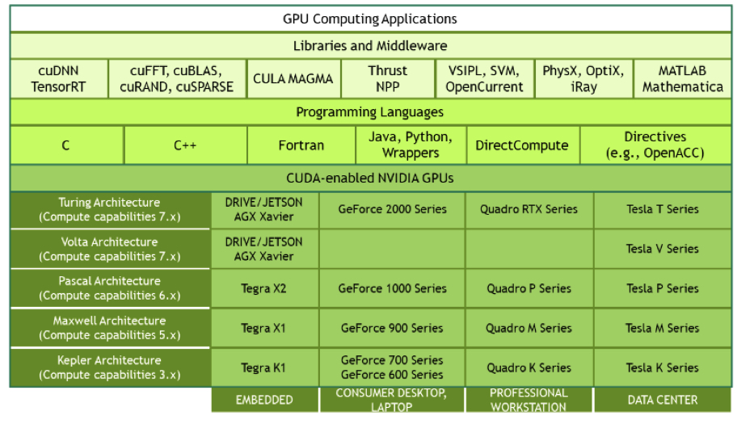
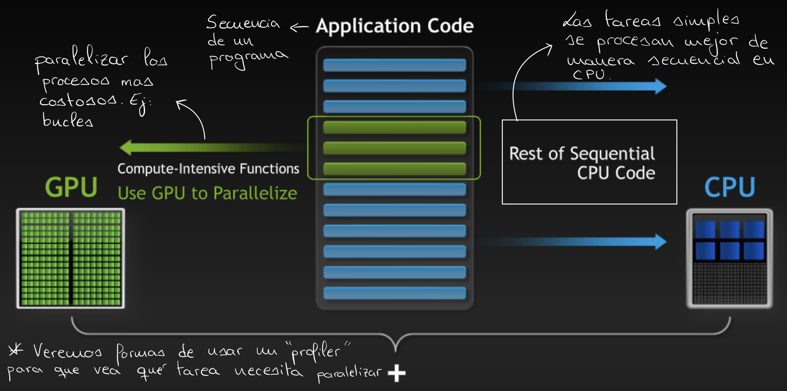
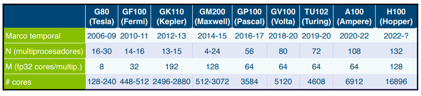
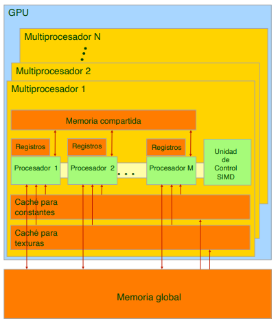
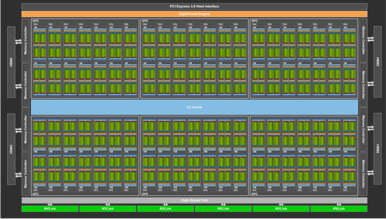
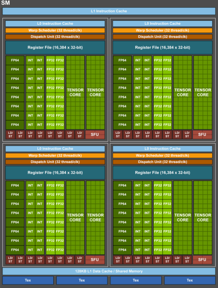
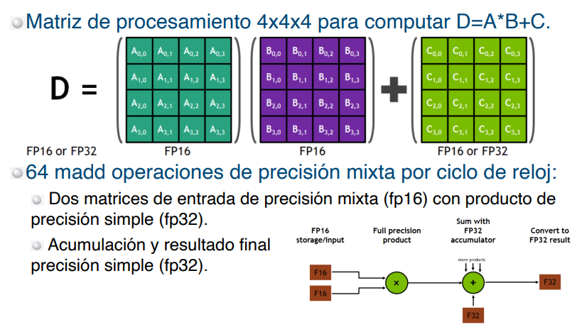
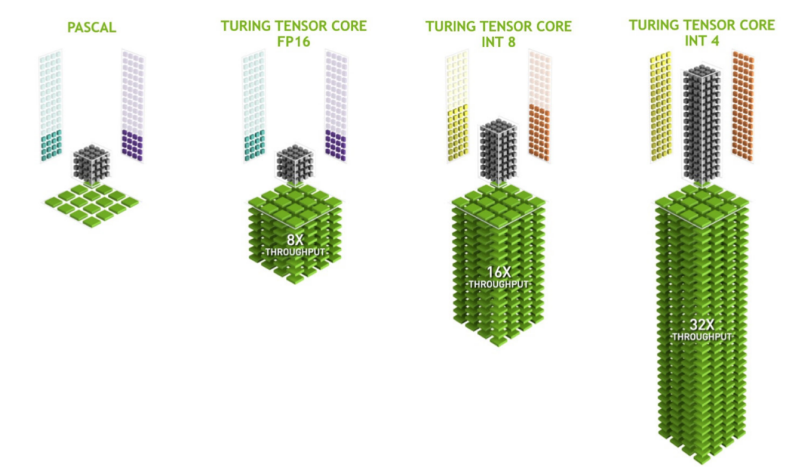

<figure markdown="span">
  { width="200" }
  <figcaption>Logo de Nvidia CUDA</figcaption>
</figure>

**CUDA** (_Compute Unified Device Architecture_) es una plataforma de computación
paralela y una interfaz de programación de aplicaciones desarrollada por NVIDIA. Permite
el uso de unidades de procesamiento gráfico (GPU) para realizar cálculos complejos con
mayor eficiencia. Su aplicación abarca áreas como la inteligencia artificial, las
simulaciones científicas y la renderización de gráficos, donde la capacidad de
procesamiento masivo en paralelo resulta determinante.

## Arquitectura de la GPU

<figure markdown="span">

</figure>

CUDA se sustenta en tres cualidades fundamentales que destacan la capacidad de la GPU
para el procesamiento paralelo:

- **Simplicidad**: La GPU organiza los hilos en grupos de 32, conocidos como _warps_.
  Todos los hilos de un _warp_ ejecutan la misma instrucción simultáneamente, lo que
  simplifica la gestión del paralelismo.
- **Escalabilidad**: La plataforma permite la creación de modelos de paralelización
  sostenible gracias a la abundancia de datos, especialmente en aplicaciones a gran
  escala. Utiliza el modelo _Single Instruction Multiple Threads_ (SIMT) para manejar
  grandes volúmenes de datos de manera eficiente.
- **Productividad**: CUDA permite que los hilos que enfrentan latencias oculten este
  tiempo mediante la conmutación con otros hilos, manteniendo una alta eficiencia en el
  procesamiento.

### Warps

El concepto clave en CUDA es el _warp_. En el nivel de _hardware_, un bloque de hilos se
divide en _warps_, que son grupos de 32 hilos que ejecutan instrucciones en paralelo.
Estos _warps_ permanecen en el multiprocesador hasta completar su ejecución. Un nuevo
bloque de hilos no se lanza hasta que se liberan suficientes registros y memoria
compartida para los _warps_ del nuevo bloque. La conmutación inmediata entre los hilos
dentro de un _warp_ contribuye a una ejecución eficiente.

CUDA combina _software_, _firmware_ y _hardware_ para ofrecer una plataforma de
computación paralela robusta:

- **_Software_**: Proporciona extensiones SIMD que permiten la programación eficiente de
  la GPU, facilitando la ejecución paralela y escalable.
- **_Firmware_**: Incluye _drivers_ para la programación GPU, que soportan tareas como
  renderizado, manejo de APIs y gestión de memoria.
- **_Hardware_**: Habilita el paralelismo general de la GPU, optimizando la capacidad de
  procesamiento paralelo.

### Modelo CPU-GPU

Aunque CUDA ofrece ventajas significativas, resulta crucial equilibrar la carga de
trabajo entre la GPU y la CPU, un enfoque conocido como computación heterogénea. La GPU
se orienta al procesamiento intensivo en datos y paralelismo fino, mientras que la CPU
resulta más adecuada para operaciones con saltos y bifurcaciones, así como para
paralelismo grueso. Identificar qué partes del código se benefician de la paralelización
en la GPU y cuáles deben procesarse secuencialmente en la CPU es fundamental para
obtener el máximo rendimiento. Se observa, por tanto, que el paralelismo en el que CUDA
destaca es el **paralelismo de datos** (_data parallelism_).

<figure markdown="span">

</figure>

### Jerarquía de memoria

Una GPU se compone de $N$ multiprocesadores, cada uno de los cuales contiene $M$
núcleos. La siguiente imagen muestra algunas de las familias de GPU de la serie Tesla de
NVIDIA.

<figure markdown="span">

</figure>

Cada multiprocesador dispone de su propio banco de registros, memoria compartida, una
caché de constantes y una caché de texturas (ambas de solo lectura). Además, la GPU
cuenta con una memoria global de tipo GDDR, que es aproximadamente tres veces más rápida
que la memoria principal de la CPU, aunque considerablemente más lenta que la memoria
compartida de tipo SRAM. Los bloques de hilos en CUDA pueden asignarse a cualquier
multiprocesador para su ejecución. La siguiente imagen ilustra la estructura interna de
una GPU.

<figure markdown="span">

</figure>

A modo de ejemplo, la generación Volta, concretamente la GPU GV100, cuenta con 84
multiprocesadores (SMs) y 8 controladores de memoria de 512 bits. En la arquitectura
Volta, cada multiprocesador dispone de 64 núcleos para operaciones de tipo _int32_, 64
núcleos para _float32_, 32 núcleos para _float64_ y 8 unidades tensoriales.

<figure markdown="span">

</figure>

De la imagen anterior se observa que el diseño de un bloque se utiliza como base para
crear diseños más complejos al replicarlo.

<figure markdown="span">

</figure>

### Núcleos tensoriales

En la última década, los núcleos tensoriales han adquirido un protagonismo notable. Son
la principal unidad de cómputo utilizada por bibliotecas de aprendizaje profundo (_deep
learning_) como PyTorch y TensorFlow. Estos componentes están diseñados para realizar
operaciones matriciales a alta velocidad, lo que resulta crucial en el entrenamiento de
modelos de inteligencia artificial y en procesos que implican operaciones matriciales
extensivas. El siguiente diagrama ilustra el proceso de operación de cada núcleo
tensorial por ciclo de reloj.

<figure markdown="span">

</figure>

### Precisión numérica

La precisión de los datos influye directamente en la tasa de transferencia
(_throughput_) del sistema. Reducir la precisión, por ejemplo de enteros de 32 bits a
enteros de 16 bits, permite realizar un mayor número de operaciones por unidad de
tiempo, aunque con una precisión menor en los resultados. Dependiendo de la aplicación,
esta reducción de precisión puede ser perfectamente aceptable. La siguiente imagen
muestra el _throughput_ para diferentes precisiones de datos en arquitecturas de GPU
modernas.

<figure markdown="span">

</figure>
