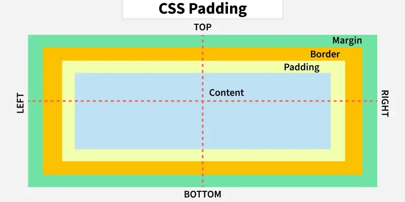

Este capítulo presenta los fundamentos del desarrollo web, comenzando por el modelo
cliente-servidor y el protocolo que rige la comunicación entre ambas partes. A partir de
esa base se abordan las tecnologías que dan forma a las páginas web, es decir, HTML para
la estructura del contenido, CSS para su presentación visual y JavaScript para la
interacción con el usuario. El recorrido continúa con la representación interna del
documento en el navegador, conocida como DOM, y concluye con las técnicas de diseño
adaptativo y su implementación mediante la librería Bootstrap.

## Bibliografía

- MDN contributors. (s.f.). _MDN Web Docs_. Mozilla. <https://developer.mozilla.org/es/>
- WHATWG. (s.f.). _HTML Living Standard_. <https://html.spec.whatwg.org/>
- Bootstrap team. (s.f.). _Bootstrap Documentation_.
  <https://getbootstrap.com/docs/5.3/getting-started/introduction/>
- World Wide Web Consortium. (s.f.). _WAI-ARIA Overview_. Web Accessibility Initiative.
  <https://www.w3.org/WAI/standards-guidelines/aria/>

## Introducción

El desarrollo web se articula en torno a tres tecnologías fundamentales que operan de
forma conjunta y complementaria dentro del navegador.

**HTML** (_HyperText Markup Language_) define la estructura y disposición de los
elementos de la página, tales como títulos, botones, formularios o párrafos. El término
_hypertext_ hace referencia a texto que contiene enlaces a otros textos, lo que
constituye la base de la navegación web. HTML se especifica actualmente como un estándar
en evolución continua (_living standard_) mantenido por el WHATWG en colaboración con el
**W3C** (_World Wide Web Consortium_), organismo que coordina buena parte de las
tecnologías y recomendaciones de la web.

**CSS** (_Cascading Style Sheets_) se encarga del estilo visual de esos elementos,
controlando colores, tipografías, márgenes y disposición espacial. Su nombre alude al
mecanismo de cascada, según el cual las reglas de estilo se combinan y resuelven en
función de su origen y especificidad.

**JavaScript** gestiona la interacción con el usuario, abarcando desde el procesamiento
de entradas hasta la comunicación con APIs externas o la actualización dinámica del
contenido sin necesidad de recargar la página.

A estas tres tecnologías se las denomina colectivamente **_front end_**, es decir, la
parte de la aplicación que el usuario ve y con la que interactúa directamente. En
contraposición, el **_back end_** se ocupa de la lógica del servidor, la gestión de
bases de datos, la autenticación y la exposición de APIs.

## Modelo cliente-servidor

El modelo fundamental sobre el que se sustenta la web es el modelo **cliente-servidor**.
En este esquema, múltiples clientes (ordenadores, dispositivos móviles, entre otros) se
comunican a través de Internet con un servidor centralizado, habitualmente alojado en un
centro de datos. El flujo de comunicación sigue un patrón definido: el cliente realiza
una petición (_request_) al servidor, este la procesa y devuelve una respuesta
(_response_) que el cliente recibe y presenta al usuario.

Este intercambio se rige por el protocolo **HTTP** (_HyperText Transfer Protocol_), que
define cómo se estructuran y transmiten los mensajes entre ambas partes. Para
comunicaciones seguras se utiliza **HTTPS**, que añade una capa de cifrado antes de
transmitir el contenido, de modo que un tercero que intercepte el tráfico no pueda
interpretarlo.

Una petición HTTP se compone de una línea inicial que identifica la operación solicitada
y de un conjunto de cabeceras (_headers_) que aportan información adicional sobre la
petición.

???+ example "Petición HTTP"

    ```bash linenums="1"
    GET / HTTP/1.1
    Host: ejemplo.com
    ```

    En esta petición, `GET` es el método utilizado, `/` es la ruta del recurso
    solicitado, `HTTP/1.1` indica la versión del protocolo y `Host` es una cabecera que
    especifica el servidor de destino.

El método indica la naturaleza de la operación que se desea realizar sobre el recurso.
Los métodos más habituales son los siguientes:

| Método   | Función                            | Ejemplo de uso          |
| -------- | ---------------------------------- | ----------------------- |
| `GET`    | Obtiene información de un recurso. | Cargar una página web.  |
| `POST`   | Envía información al servidor.     | Enviar un formulario.   |
| `PUT`    | Actualiza un recurso existente.    | Modificar un perfil.    |
| `DELETE` | Elimina un recurso.                | Borrar una publicación. |

Las respuestas del servidor incluyen un **código de estado** que indica el resultado de
la petición. Estos códigos se agrupan por rangos según su significado:

| Rango | Categoría             | Ejemplo representativo      |
| ----- | --------------------- | --------------------------- |
| 1xx   | Respuesta informativa | `100 Continue`              |
| 2xx   | Éxito                 | `200 OK`                    |
| 3xx   | Redirección           | `301 Moved Permanently`     |
| 4xx   | Error del cliente     | `404 Not Found`             |
| 5xx   | Error del servidor    | `500 Internal Server Error` |

Cuando el navegador recibe la respuesta, procesa el contenido de forma secuencial. Cada
línea de HTML es interpretada y representada progresivamente en pantalla, proceso que se
conoce como **_page rendering_**. Por este motivo, el orden en que se declaran los
recursos dentro del documento influye en la percepción de velocidad de la página.

## Tipos de recursos y contenido

Dentro del ecosistema web conviene distinguir entre distintos tipos de recursos. Una
**_webpage_** es una única página web. Un **_website_** es un conjunto de _webpages_
interrelacionadas que comparten un mismo dominio y una misma identidad. Una **aplicación
web**, como Spotify o Gmail, ofrece una experiencia dinámica e interactiva, con
contenido que se genera y actualiza en tiempo real en función de las acciones del
usuario.

En cuanto al contenido, existe una distinción importante entre páginas **estáticas** y
**dinámicas**. En las páginas estáticas, el contenido permanece invariable y se sirve
tal cual está almacenado en el servidor, lo que simplifica el despliegue y reduce el
coste de mantenimiento. En las páginas dinámicas, el contenido se genera en el servidor
en el momento de la petición y se envía al navegador adaptado al contexto, por ejemplo
al usuario autenticado o al idioma solicitado.

Para reducir el número de peticiones y mejorar el rendimiento se recurre a la **caché**,
un mecanismo que almacena temporalmente recursos ya descargados para evitar solicitarlos
de nuevo. Esta estrategia disminuye la latencia percibida y la carga sobre el servidor,
a cambio de introducir la necesidad de invalidar los recursos cuando su contenido
cambia.

## Hosting

El **_hosting_** es el servicio que permite alojar una aplicación o sitio web en un
servidor accesible a través de Internet. Existen principalmente dos modalidades, cuya
elección depende del volumen de tráfico previsto y de los requisitos de control sobre la
infraestructura.

El **_hosting_ compartido** distribuye los recursos de un mismo servidor físico entre
múltiples clientes, de modo que varias webs comparten CPU, memoria y almacenamiento. Su
principal ventaja es el bajo coste, lo que lo hace adecuado para proyectos pequeños o en
fase de desarrollo con poca demanda de tráfico.

El **_hosting_ dedicado** reserva los recursos del servidor en exclusiva para un único
cliente. Esto ofrece mayor flexibilidad, rendimiento y control, aunque a un coste
significativamente superior. Es la opción habitual para aplicaciones con alta demanda o
requisitos estrictos de seguridad y disponibilidad.

| Característica | _Hosting_ compartido            | _Hosting_ dedicado           |
| -------------- | ------------------------------- | ---------------------------- |
| Recursos       | Compartidos entre clientes      | Exclusivos de un cliente     |
| Coste          | Reducido                        | Elevado                      |
| Control        | Limitado por el proveedor       | Configuración completa       |
| Uso típico     | Proyectos pequeños o en pruebas | Aplicaciones de alta demanda |

## Librerías, frameworks y APIs

En el desarrollo web es importante distinguir entre librerías y _frameworks_. Una
**librería** es un conjunto reducido de funcionalidades que resuelve un problema
específico, como la validación de datos, y el desarrollador decide cuándo y cómo
invocarla. Un **_framework_** agrupa un conjunto de librerías y establece una estructura
de trabajo más amplia, imponiendo convenciones que pueden alterar la forma en que se
organiza el proyecto. Ejemplos de _frameworks_ orientados a la construcción de sitios y
aplicaciones web son Astro o Docusaurus. En este mismo ecosistema se sitúa
**TypeScript** que, sin ser un _framework_, extiende JavaScript añadiendo un sistema de
tipos estáticos que se verifica antes de la ejecución. Las librerías de Node.js se
gestionan mediante **npm** (_Node Package Manager_), su gestor de paquetes oficial.

Las **APIs** (_Application Programming Interface_) actúan como intermediarias entre el
usuario y un servicio, exponiendo funcionalidades de forma controlada sin revelar los
detalles de su implementación. En el contexto web resultan especialmente relevantes tres
categorías. Las _Browser APIs_ extienden las capacidades del navegador, como `Fetch`
para realizar peticiones HTTP, `Canvas` para renderizado gráfico o la _History API_ para
gestionar el historial de navegación. Las _REST APIs_ constituyen un conjunto de
principios arquitectónicos para construir APIs eficientes y escalables sobre HTTP. Por
último, las _Sensor-based APIs_ permiten interactuar con sensores físicos en
dispositivos IoT.

## HTML

HTML estructura el contenido mediante **etiquetas** (_tags_) y **elementos**. Cada
etiqueta define un tipo de contenido o comportamiento dentro del documento. Las
etiquetas pueden ser de apertura y cierre, como `<p>...</p>`, en cuyo caso delimitan un
contenido, o autocontenidas, como `<br />`, cuando no encierran nada.

### Estructura de un documento

Todo documento HTML sigue una organización común. La declaración `<!doctype html>`
informa al navegador de que el documento utiliza la versión actual del estándar. El
elemento raíz `<html>` contiene dos bloques diferenciados. El primero, `<head>`, alberga
metadatos que no se muestran directamente en la página, como el título de la pestaña, la
codificación de caracteres o los enlaces a hojas de estilo. El segundo, `<body>`, agrupa
el contenido visible.

???+ example "Esqueleto de un documento HTML"

    ```html linenums="1"
    <!doctype html>
    <html lang="es">
      <head>
        <meta charset="utf-8" />
        <title>Título de la pestaña</title>
      </head>
      <body>
        <h1>Título principal</h1>
        <p>Contenido de la página.</p>
      </body>
    </html>
    ```

    El atributo `lang` declara el idioma del documento, lo que resulta relevante tanto
    para los motores de búsqueda como para los lectores de pantalla.

### Etiquetas básicas

Las etiquetas de uso más frecuente cubren la organización del texto, la creación de
listas, la inserción de enlaces e imágenes y la recogida de datos del usuario.

| Etiqueta                | Función                                                    |
| ----------------------- | ---------------------------------------------------------- |
| `<h1>` a `<h6>`         | Definen títulos jerarquizados de mayor a menor relevancia. |
| `<p>`                   | Delimita un párrafo de texto.                              |
| `<br />`                | Introduce un salto de línea.                               |
| `<strong>` y `<em>`     | Indican importancia y énfasis semántico.                   |
| `<b>` e `<i>`           | Aplican negrita e itálica como estilo puramente visual.    |
| `<ul>`, `<ol>` y `<li>` | Construyen listas no ordenadas, ordenadas y sus elementos. |
| `<div>`                 | Agrupa contenido sin aportar estilo propio.                |
| `<a>`                   | Crea un enlace hacia otro recurso.                         |
| ``               | Inserta una imagen.                                        |
| `<table>`               | Estructura información en filas y columnas.                |
| `<form>` e `<input />`  | Recogen datos introducidos por el usuario.                 |

La distinción entre `<strong>` y `<b>`, así como entre `<em>` e `<i>`, es semántica. Las
primeras comunican importancia o énfasis al navegador y a las tecnologías de asistencia,
mientras que las segundas se limitan a modificar la apariencia del texto.

???+ example "Etiquetas HTML básicas"

    ```html linenums="1"
    <!-- Párrafo -->
    <p>Texto del párrafo.</p>

    <!-- Salto de línea (no requiere etiqueta de cierre) -->
    <br />

    <!-- Énfasis semántico e importancia -->
    <strong>Texto importante</strong>
    <em>Texto enfatizado</em>

    <!-- Negrita e itálica (estilo visual) -->
    <b>Negrita</b>
    <i>Itálica</i>

    <!-- Lista no ordenada -->
    <ul>
      <li>Elemento 1</li>
      <li>Elemento 2</li>
    </ul>

    <!-- Lista ordenada -->
    <ol>
      <li>Elemento 1</li>
      <li>Elemento 2</li>
    </ol>

    <!-- División sin estilo propio -->
    <div>
      <h1>Título</h1>
    </div>

    <!-- Enlace -->
    <a href="pagina.html">Texto del enlace</a>

    <!-- Imagen -->
    

    <!-- Campo de entrada -->
    <input type="text" placeholder="Escribe aquí" />
    ```

### Navegación, listas e imágenes

El atributo `href` de la etiqueta `<a>` admite rutas relativas, lo que permite enlazar
documentos alojados en el mismo proyecto y construir así la navegación de un sitio web.
De forma análoga, el atributo `src` de `` indica la ubicación del archivo de
imagen, mientras que `alt` proporciona una descripción alternativa imprescindible para
la accesibilidad.

El siguiente ejemplo ilustra un sitio web sencillo formado por una página principal que
combina listas anidadas con enlaces hacia otras dos páginas.

???+ example "Página principal con enlaces y listas"

    ```html linenums="1"
    <!doctype html>
    <html lang="es">
      <head>
        <meta charset="utf-8" />
        <title>Página principal</title>
      </head>
      <body>
        <h1>Título en H1</h1>
        <h2>Subtítulo en H2</h2>
        <p>Página de ejemplo para practicar la estructura de un documento HTML.</p>
        <ul>
          <li>Primer elemento de la lista</li>
          <li>Segundo elemento de la lista</li>
          <li>
            Tercer elemento de la lista
            <ul>
              <li>Elemento anidado</li>
            </ul>
          </li>
        </ul>
        <a href="./pages/pagina_1.html">Ir a la página con imagen</a>
        <p>
          Para consultar un ejemplo de tabla,
          <a href="./pages/pagina_2.html">acceder a la segunda página</a>.
        </p>
      </body>
    </html>
    ```

La primera de las páginas enlazadas muestra el uso conjunto de imágenes, saltos de línea
y enlaces de retorno hacia el documento de origen.

???+ example "Página con imagen"

    ```html linenums="1"
    <!doctype html>
    <html lang="es">
      <head>
        <meta charset="utf-8" />
        <title>Página 1</title>
      </head>
      <body>
        <h1>Página con imagen</h1>
        <p>Ejemplo de inserción de una imagen dentro de un párrafo.</p>
        <p>
          
          <br />
          <em>Pie de imagen escrito con énfasis semántico.</em>
        </p>
        <p>Para volver al inicio, <a href="../index.html">acceder a la portada</a>.</p>
      </body>
    </html>
    ```

### Formularios

Los formularios permiten enviar datos al servidor. El elemento `<form>` define el
destino de la información mediante el atributo `action` y el método HTTP empleado
mediante `method`. Cada campo se declara con `<input />`, cuyo atributo `type` determina
la naturaleza del dato y el control que muestra el navegador. El atributo `name`
identifica el campo en el envío, y la etiqueta `<label>` asocia una descripción textual
a un campo concreto a través de la correspondencia entre `for` e `id`, lo que resulta
esencial para la accesibilidad.

???+ example "Formulario de registro"

    ```html linenums="1"
    <!doctype html>
    <html lang="es">
      <head>
        <meta charset="utf-8" />
        <title>Formulario</title>
      </head>
      <body>
        <h1>Registro</h1>
        <form action="/registration" method="POST">
          <label for="username">Nombre de usuario:</label><br />
          <input type="text" id="username" name="username" /><br /><br />
          <label for="password">Contraseña:</label><br />
          <input type="password" id="password" name="password" /><br /><br />
          <input type="submit" value="Enviar" />
        </form>
      </body>
    </html>
    ```

    El método `POST` transmite los datos en el cuerpo de la petición, a diferencia de
    `GET`, que los añadiría a la URL. Por este motivo, `POST` es el método adecuado para
    información sensible como una contraseña.

### El DOM

El **DOM** (_Document Object Model_) es una representación en forma de árbol de todos
los elementos de una página HTML. Cuando el navegador carga una página, construye esta
estructura jerárquica a partir del código fuente, donde cada etiqueta se convierte en un
nodo del árbol. El nodo raíz es `<html>`, del que parten `<head>` y `<body>`, y de
estos, sus respectivos elementos hijos.

El DOM es inicialmente estático, pero gracias a JavaScript es posible manipularlo de
forma dinámica añadiendo, eliminando o modificando elementos sin recargar la página.
Este es precisamente el principio sobre el que se construyen _frameworks_ como React.

### Accesibilidad

Resulta una buena práctica considerar siempre la **accesibilidad** al desarrollar
interfaces web, de modo que el contenido pueda ser utilizado por personas con diversidad
funcional. Para ello se puede consultar la **WAI** (_Web Accessibility Initiative_) y el
estándar **ARIA** (_Accessible Rich Internet Applications_), que proporcionan guías y
atributos complementarios para describir el propósito y el estado de los elementos de la
interfaz.

!!! tip "Accesibilidad desde el marcado"

    El uso correcto de etiquetas semánticas, de descripciones alternativas en las
    imágenes y de asociaciones entre etiquetas y campos de formulario cubre buena parte
    de los requisitos de accesibilidad sin necesidad de atributos adicionales.

## CSS

CSS define el aspecto visual de los elementos HTML. Su sintaxis básica consiste en un
**selector**, que identifica el elemento a estilizar, seguido de un **bloque de
declaración** con pares propiedad-valor.

???+ example "Sintaxis básica de CSS"

    ```css linenums="1"
    h1 {
      color: purple;
    }
    ```

Los estilos pueden declararse directamente en el documento, aunque lo habitual es
mantenerlos en un archivo independiente y vincularlo desde el `<head>`. Esta separación
entre estructura y presentación facilita la reutilización de estilos en múltiples
páginas.

???+ example "Vincular hoja de estilos"

    ```html linenums="1"
    <head>
      <link rel="stylesheet" href="style.css" />
    </head>
    ```

### Selectores

CSS ofrece varios tipos de selectores para aplicar estilos con distintos niveles de
especificidad. El **selector de elemento** aplica estilos a todas las instancias de una
etiqueta. El **selector de ID**, precedido por `#`, identifica un elemento único en la
página. El **selector de clase**, precedido por `.`, permite reutilizar estilos en
múltiples elementos y constituye la opción más habitual. Además, existen selectores
descendentes, que actúan sobre los elementos contenidos en otro, selectores de hijo
directo, que se limitan al primer nivel de anidamiento, y **pseudo-clases**, que aplican
estilos según el estado del elemento.

???+ example "Tipos de selectores CSS"

    ```css linenums="1"
    /* Selector de elemento */
    p {
      color: blue;
    }

    /* Selector de ID (único en la página) */
    #mi-id {
      color: blue;
    }

    /* Selector de clase (reutilizable) */
    .mi-clase {
      color: blue;
    }

    /* Elemento con clase específica */
    p.mi-clase {
      color: blue;
    }

    /* Selector descendente */
    #blog p {
      color: blue;
    }

    /* Selector hijo directo */
    h2 > span {
      color: blue;
    }

    /* Pseudo-clase (estado del elemento) */
    a:hover {
      color: blue;
    }
    ```

    Y su correspondencia en HTML:

    ```html linenums="1"
    <p>Selector de elemento</p>
    <p id="mi-id">Selector de ID</p>
    <p class="mi-clase">Selector de clase</p>

    <div id="blog">
      <p>Selector descendente</p>
    </div>

    <h2><span>Selector hijo directo</span></h2>
    <a href="#">Pseudo-clase hover</a>
    ```

El siguiente ejemplo reúne ambos conceptos en una página que presenta una tabla cuyos
bordes se definen desde una hoja de estilos externa.

???+ example "Página con tabla"

    ```html linenums="1"
    <!doctype html>
    <html lang="es">
      <head>
        <meta charset="utf-8" />
        <title>Tabla de ejemplo</title>
        <link rel="stylesheet" href="../css/stylesheet.css" />
      </head>
      <body>
        <table>
          <tr>
            <th>Columna 1</th>
            <th>Columna 2</th>
          </tr>
          <tr>
            <td>Fila 1</td>
            <td>10 €</td>
          </tr>
          <tr>
            <td>Fila 2</td>
            <td>10 €</td>
          </tr>
        </table>
        <a href="../index.html">Volver al inicio</a>
      </body>
    </html>
    ```

    Y su hoja de estilos asociada (`stylesheet.css`):

    ```css linenums="1"
    table,
    th,
    td {
      border: 1px solid black;
      border-collapse: collapse;
    }
    ```

### Modelo de caja

<figure markdown="span">
  
  <figcaption>Modelo de caja de CSS</figcaption>
</figure>

En CSS, cada elemento HTML se representa como una **caja** (_box model_) compuesta por
cuatro capas concéntricas. La más interna es el **contenido**, cuyo tamaño se controla
con las propiedades `width`, `min-width`, `max-width`, `height`, `min-height` y
`max-height`. Alrededor del contenido se encuentra el **_padding_**, o relleno interno,
que separa el contenido del borde. El **_border_** rodea el _padding_ y puede adoptar
estilos como `solid`, `dashed` (discontinuo), `dotted` (punteado) o `double` (doble).
Finalmente, el **_margin_** es el espacio exterior que separa la caja de otros elementos
adyacentes.

Las dimensiones de la caja de relleno se obtienen sumando al contenido el _padding_
aplicado a cada lado.

$$\text{padding-box width} = \text{content width} + \text{padding-left} + \text{padding-right}$$

$$\text{padding-box height} = \text{content height} + \text{padding-top} + \text{padding-bottom}$$

En estas expresiones, $\text{content width}$ y $\text{content height}$ representan las
dimensiones del área de contenido, mientras que los términos restantes corresponden al
relleno declarado en cada uno de los cuatro lados del elemento.

### Elementos de bloque y de línea

Los elementos HTML se clasifican en dos tipos según su comportamiento en el flujo del
documento. Los **elementos de bloque**, como `div`, `form`, `h1` o `h2`, ocupan todo el
ancho disponible y generan un salto de línea antes y después. Los **elementos de
línea**, como `a`, `img`, `input` o `b`, ocupan únicamente el espacio de su contenido y
no interrumpen el flujo del texto. Esta diferencia condiciona la disposición de los
elementos y, por tanto, el resultado de aplicar propiedades de tamaño o de margen.

## Diseño responsive

El **diseño _responsive_** consiste en adaptar la presentación de una web a distintos
tamaños de pantalla y resoluciones. Se apoya en tres pilares, que son los _flexible
grids_ o mallas flexibles, las _fluid images_ o imágenes fluidas y las _media queries_,
consultas que aplican estilos según las características del dispositivo.

### Bootstrap

**Bootstrap** es una librería de CSS y JavaScript que facilita la creación de interfaces
_responsive_ mediante componentes reutilizables y un sistema de mallas predefinido. Su
sistema de rejilla se basa en una jerarquía de 12 columnas y se estructura siempre con
un contenedor (`container`), filas (`row`) y columnas (`col`).

???+ example "Sistema de rejilla de Bootstrap"

    ```html linenums="1"
    <div class="container">
      <div class="row">
        <!-- Ocupa 12 columnas en móvil y 6 en pantallas grandes -->
        <div class="col-12 col-lg-6">Contenido</div>
      </div>
    </div>
    ```

Bootstrap sigue el enfoque **_mobile first_**, según el cual los estilos base se aplican
a pantallas pequeñas y los **_breakpoints_** permiten sobrescribir el diseño para
pantallas mayores. Cada _breakpoint_ se identifica mediante un infijo que se incorpora
al nombre de la clase:

| Infijo  | Anchura mínima | Dispositivo de referencia |
| ------- | -------------- | ------------------------- |
| Ninguno | 0 px           | Móviles en vertical       |
| `sm`    | 576 px         | Móviles en horizontal     |
| `md`    | 768 px         | Tabletas                  |
| `lg`    | 992 px         | Ordenadores portátiles    |
| `xl`    | 1200 px        | Monitores de escritorio   |
| `xxl`   | 1400 px        | Monitores de gran formato |

Las herramientas de desarrollo del navegador permiten simular distintos dispositivos
para verificar el comportamiento _responsive_ sin necesidad de disponer del hardware
correspondiente.

El siguiente ejemplo muestra dos páginas con navegación entre ellas utilizando
componentes de Bootstrap cargados desde una red de distribución de contenidos (_CDN_).
El atributo `integrity` incorpora una firma que el navegador verifica antes de ejecutar
el recurso, garantizando que el archivo descargado no ha sido manipulado.

???+ example "Página principal con Bootstrap"

    ```html linenums="1"
    <!doctype html>
    <html lang="es">
      <head>
        <meta charset="utf-8" />
        <meta name="viewport" content="width=device-width, initial-scale=1" />
        <title>Demostración de Bootstrap</title>
        <link
          href="https://cdn.jsdelivr.net/npm/bootstrap@5.3.8/dist/css/bootstrap.min.css"
          rel="stylesheet"
          integrity="sha384-sRIl4kxILFvY47J16cr9ZwB07vP4J8+LH7qKQnuqkuIAvNWLzeN8tE5YBujZqJLB"
          crossorigin="anonymous"
        />
      </head>
      <body>
        <script
          src="https://cdn.jsdelivr.net/npm/bootstrap@5.3.8/dist/js/bootstrap.bundle.min.js"
          integrity="sha384-FKyoEForCGlyvwx9Hj09JcYn3nv7wiPVlz7YYwJrWVcXK/BmnVDxM+D2scQbITxI"
          crossorigin="anonymous"
        ></script>
        <div>
          <h1>Página principal</h1>
          <button
            type="button"
            class="btn btn-primary"
            onclick="location.href = './page2.html'"
          >
            Ir a la página 2
          </button>
        </div>
      </body>
    </html>
    ```

    La etiqueta `<meta name="viewport">` indica al navegador que ajuste la anchura del
    documento a la del dispositivo, requisito imprescindible para que las _media queries_
    de Bootstrap surtan efecto.

???+ example "Segunda página con Bootstrap"

    ```html linenums="1"
    <!doctype html>
    <html lang="es">
      <head>
        <meta charset="utf-8" />
        <meta name="viewport" content="width=device-width, initial-scale=1" />
        <title>Página 2</title>
        <link
          href="https://cdn.jsdelivr.net/npm/bootstrap@5.3.8/dist/css/bootstrap.min.css"
          rel="stylesheet"
          integrity="sha384-sRIl4kxILFvY47J16cr9ZwB07vP4J8+LH7qKQnuqkuIAvNWLzeN8tE5YBujZqJLB"
          crossorigin="anonymous"
        />
      </head>
      <body>
        <script
          src="https://cdn.jsdelivr.net/npm/bootstrap@5.3.8/dist/js/bootstrap.bundle.min.js"
          integrity="sha384-FKyoEForCGlyvwx9Hj09JcYn3nv7wiPVlz7YYwJrWVcXK/BmnVDxM+D2scQbITxI"
          crossorigin="anonymous"
        ></script>
        <div>
          <h1>Página 2</h1>
          <p>Contenido de la segunda página del ejemplo.</p>
        </div>
        <div>
          <button
            type="button"
            class="btn btn-primary"
            onclick="location.href = 'index.html'"
          >
            Volver al inicio
          </button>
        </div>
      </body>
    </html>
    ```
