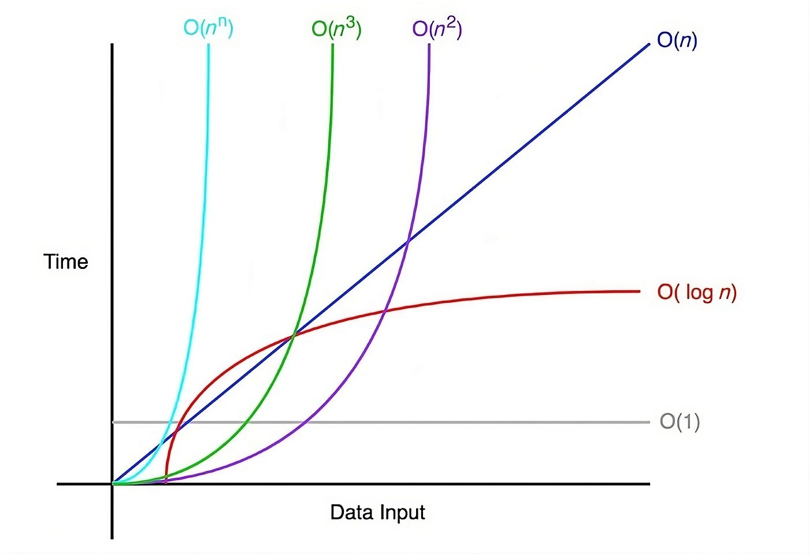

Este capítulo aborda la notación Big O para el análisis de complejidad algorítmica y los
métodos clásicos de ordenación y búsqueda. Estos algoritmos operan sobre las
[estructuras de datos](section_1_data_structures.md) presentadas en el capítulo
anterior.

## Bibliografía

- Sciencestack. (s.f.). _Big-O Algorithm Complexity Cheat Sheet_.
  <https://www.bigocheatsheet.com/>

## Notación Big O

La notación Big O se utiliza para evaluar la eficiencia de los algoritmos en términos de
complejidad temporal y espacial. La **complejidad temporal** describe cómo varía el
tiempo requerido por un algoritmo en función del número de elementos de entrada,
mientras que la **complejidad espacial** describe el uso de memoria en función del
número de variables utilizadas por el algoritmo.

### Órdenes de complejidad

<figure markdown="span">
  
  <figcaption>Órdenes de complejidad más habituales en notación Big O. <a href="https://medium.com/@sysglobalsolutionsblog/notaci%C3%B3n-big-o-615bd1e0a227">Referencia</a></figcaption>
</figure>

- $O(1)$: El tiempo de ejecución es constante, independientemente del tamaño de la
  entrada. Es típico en algoritmos que acceden a un número fijo de elementos, como
  devolver el primer elemento de una lista.

- $O(\log N)$: El tiempo de ejecución crece logarítmicamente con el tamaño de la
  entrada. Común en algoritmos que dividen el problema a la mitad en cada paso, como la
  búsqueda binaria.

- $O(N)$: El tiempo de ejecución crece linealmente con el tamaño de la entrada. Típico
  de algoritmos que realizan una operación en cada elemento de la entrada, como sumar
  todos los elementos de una lista.

- $O(N \log N)$: Representa una combinación de comportamiento lineal y logarítmico. Es
  común en algoritmos de ordenación eficientes, como _quicksort_.

- $O(N^2)$: El tiempo de ejecución crece cuadráticamente con el tamaño de la entrada. Se
  presenta en algoritmos que realizan operaciones sobre cada par de elementos, como la
  ordenación por burbuja.

- $O(2^N)$: El tiempo de ejecución crece exponencialmente con el tamaño de la entrada.
  Es típico de algoritmos que generan todas las combinaciones posibles de elementos,
  como el problema del viajante.

En casos donde se realizan múltiples operaciones con diferentes costes temporales, la
notación Big O representa el peor caso.

### Complejidad en algoritmos multipartes

En algoritmos que involucran múltiples estructuras de datos, la complejidad puede
depender de más de un parámetro.

???+ example "Bucles secuenciales"

    ```python linenums="1"
    def funcion(array_a: list[int], array_b: list[int]) -> None:
        for i in array_a:
            ...

        for i in array_b:
            ...
    ```

    Cada bucle tiene una complejidad de $O(N)$, pero como operan en *arrays* diferentes,
    la complejidad total es $O(A + B)$, donde $A$ y $B$ son los tamaños de `array_a` y
    `array_b` respectivamente.

???+ example "Bucles anidados"

    ```python linenums="1"
    def funcion(array_a: list[int], array_b: list[int]) -> None:
        for i in array_a:
            for j in array_b:
                ...
    ```

    En este caso, la complejidad es $O(A \times B)$, ya que los bucles anidados operan
    sobre *arrays* diferentes. Es un error asumir $O(N^2)$ sin considerar los tamaños de
    los *arrays* involucrados.

Es importante señalar que la notación Big O no está limitada a la letra $N$. Cualquier
letra puede representar el tamaño de la entrada en función del contexto del problema.

## Métodos de ordenación

### Ordenación por burbuja (_Bubble Sort_)

La ordenación por burbuja compara pares adyacentes de elementos en una lista e
intercambia sus posiciones si están en orden incorrecto. Este proceso se repite hasta
que no se requieren más intercambios, lo que indica que la lista está ordenada.

- **Complejidad temporal**: $O(N^2)$ en el peor caso.
- **Complejidad espacial**: $O(1)$.

???+ tip "Implementación"

    ```python linenums="1"
    def ordenacion_burbuja(lista: list[int]) -> list[int]:
        n: int = len(lista)

        for i in range(n):
            for j in range(n - 1):
                if lista[j] > lista[j + 1]:
                    lista[j], lista[j + 1] = lista[j + 1], lista[j]

        return lista
    ```

### Ordenación por selección (_Selection Sort_)

La ordenación por selección selecciona el elemento más pequeño de la parte no ordenada
de la lista y lo coloca en la siguiente posición de la parte ordenada. Este proceso se
repite hasta que la lista está completamente ordenada.

- **Complejidad temporal**: $O(N^2)$ en el peor caso.
- **Complejidad espacial**: $O(1)$.

???+ tip "Implementación"

    ```python linenums="1"
    def ordenacion_seleccion(lista: list[int]) -> list[int]:
        n: int = len(lista)

        for i in range(n):
            idx_min: int = i

            for j in range(i + 1, n):
                if lista[j] < lista[idx_min]:
                    idx_min = j

            lista[i], lista[idx_min] = lista[idx_min], lista[i]

        return lista
    ```

### Ordenación por inserción (_Insertion Sort_)

La ordenación por inserción divide la lista en una parte ordenada y otra desordenada. Se
toma un elemento de la parte desordenada y se inserta en la posición correcta dentro de
la parte ordenada. En el mejor caso (lista ya ordenada) alcanza $O(N)$.

- **Complejidad temporal**: $O(N^2)$ en el peor caso, $O(N)$ en el mejor caso.
- **Complejidad espacial**: $O(1)$.

???+ tip "Implementación"

    ```python linenums="1"
    def ordenacion_insercion(lista: list[int]) -> list[int]:
        for i in range(1, len(lista)):
            j: int = i

            while j > 0 and lista[j - 1] > lista[j]:
                lista[j - 1], lista[j] = lista[j], lista[j - 1]
                j -= 1

        return lista
    ```

## Métodos de búsqueda

### Búsqueda lineal (_Linear Search_)

La búsqueda lineal recorre cada elemento de la lista uno por uno hasta encontrar el
elemento buscado o hasta recorrer todos los elementos.

- **Complejidad temporal**: $O(N)$ en el peor caso.
- **Complejidad espacial**: $O(1)$.

???+ tip "Implementación"

    ```python linenums="1"
    def busqueda_lineal(lista: list[int], valor_buscar: int) -> int | None:
        for idx, valor in enumerate(lista):
            if valor_buscar == valor:
                return idx

        return None
    ```

### Búsqueda binaria (_Binary Search_)

La búsqueda binaria divide repetidamente a la mitad la parte de la lista que podría
contener el elemento buscado, hasta reducir las posibles ubicaciones a una sola. Este
método requiere que la lista esté previamente ordenada.

- **Complejidad temporal**: $O(\log N)$ en el peor caso.
- **Complejidad espacial**: $O(1)$.

???+ tip "Implementación"

    ```python linenums="1"
    def busqueda_binaria(lista: list[int], valor_buscar: int) -> int | None:
        izquierda: int = 0
        derecha: int = len(lista) - 1

        while izquierda <= derecha:
            punto_medio: int = (izquierda + derecha) // 2

            if valor_buscar == lista[punto_medio]:
                return punto_medio
            elif valor_buscar > lista[punto_medio]:
                izquierda = punto_medio + 1
            else:
                derecha = punto_medio - 1

        return None
    ```
