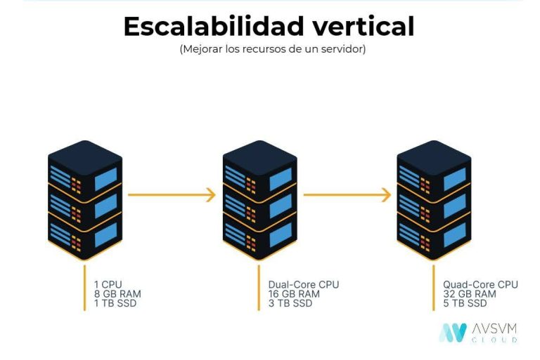
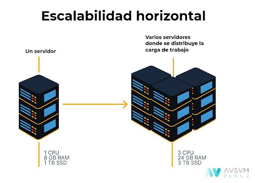

Este capítulo presenta SQL como lenguaje estándar para la gestión de bases de datos
relacionales, cubriendo desde consultas básicas hasta operaciones avanzadas con
subconsultas y CTEs.

## Bibliografía

- PostgreSQL Global Development Group. (s.f.). _PostgreSQL Documentation_.
  <https://www.postgresql.org/docs/>
- W3Schools. (s.f.). _SQL Tutorial_. <https://www.w3schools.com/sql/>

## Introducción

**SQL** (Structured Query Language) es un lenguaje estándar de programación para
gestionar y manipular bases de datos relacionales. Desarrollado en la década de 1970 por
IBM, SQL permite realizar consultas, actualizar datos, eliminar registros, y crear y
modificar estructuras de bases de datos. Su sintaxis es simple e intuitiva, facilitando
su aprendizaje y uso.

## Fundamentos

A diferencia de herramientas como Excel, que están limitadas a gestionar un número
reducido de filas, las bases de datos SQL son capaces de manejar grandes volúmenes de
datos de manera eficiente.

Las bases de datos se clasifican en dos categorías principales:

- **Relacionales**: Almacenan datos estructurados en tablas organizadas en filas y
  columnas. Cada tabla tiene un identificador único que permite relacionarla con otras
  tablas.
- **No relacionales** o **NoSQL**: Almacenan datos no estructurados en formatos como
  grafos, documentos o pares clave-valor.

La siguiente tabla resume las ventajas y desventajas de cada tipo:

|             | Datos relacionales                                                                                            | Datos no relacionales                                                                                                                                                           |
| ----------- | ------------------------------------------------------------------------------------------------------------- | ------------------------------------------------------------------------------------------------------------------------------------------------------------------------------- |
| **Pros**    | Esquema estandarizado<br/>Gran comunidad de usuarios<br/>Lenguaje de consulta estandarizado<br/>ACID          | Disponibilidad continua<br/>Velocidad de consulta<br/>Agilidad<br/>Costo                                                                                                        |
| **Contras** | Dificultad de agrupación<br/>Normalización de datos<br/>Primero el esquema<br/>Escalado intensivo en recursos | No hay un lenguaje de consulta estandarizado<br/>Comunidad de usuarios más pequeña<br/>Se requieren habilidades de desarrollador<br/>Inconsistencia en la recuperación de datos |

### Propiedades ACID

Las bases de datos relacionales destacan por garantizar la integridad y confiabilidad de
los datos a través de las propiedades **ACID**, esenciales en entornos transaccionales
como banca, comercio electrónico o cajas registradoras. Estas propiedades son:

1. **Atomicidad** (_Atomicity_): Una transacción debe ejecutarse en su totalidad o no
   ejecutarse en absoluto. Si ocurre un fallo, todo se revierte.
2. **Consistencia** (_Consistency_): Las transacciones llevan la base de datos de un
   estado válido a otro, cumpliendo con las reglas de integridad.
3. **Aislamiento** (_Isolation_): Mientras una transacción está en curso, sus cambios no
   son visibles para otras transacciones hasta que se completa.
4. **Durabilidad** (_Durability_): Una vez confirmada, la transacción persiste incluso
   ante fallos del sistema.

### Escalabilidad

- **Bases de datos relacionales**: Su escalabilidad es principalmente **vertical**, es
  decir, aumentar la capacidad de hardware de una sola máquina. Las bases _NewSQL_
  buscan combinar la robustez de los datos relacionales con la escalabilidad de sistemas
  _NoSQL_.

<figure markdown="span">
  
  <figcaption>Representación del modelo de datos relacional (I).</figcaption>
</figure>

- **Bases de datos NoSQL**: Destacan por su escalabilidad **horizontal**, mediante la
  distribución de datos en múltiples servidores, lo que reduce costos y mejora el
  rendimiento.

<figure markdown="span">
  
  <figcaption>Representación del modelo de datos relacional (II).</figcaption>
</figure>

### Operaciones CRUD

Para interactuar con bases de datos relacionales, se utilizan consultas SQL o
**_queries_**, agrupadas bajo las operaciones **CRUD**:

- **Create** (Crear)
- **Read** (Leer)
- **Update** (Actualizar)
- **Delete** (Eliminar)

### Almacenamiento

Las bases de datos pueden almacenarse en:

- **Servidores locales (_On-Premise_)**: Propiedad y mantenimiento a cargo de la
  empresa.
- **Servidores en la nube (_Serverless_)**: Servicios administrados por terceros, como
  AWS o Azure.

### Diagramas y estructuras

El **ERD** (_Entity Relationship Diagram_) es una herramienta visual para mapear las
relaciones entre tablas dentro de una base de datos.

Las tablas se clasifican en dos tipos principales:

- **Tablas de hechos (_Fact tables_)**: Almacenan datos principales para análisis, como
  registros de ventas o eventos.
- **Tablas de dimensiones (_Dimension tables_)**: Proporcionan contexto adicional sobre
  los datos en las tablas de hechos, describiendo atributos como ubicaciones, segmentos
  de mercado o perfiles de clientes.

## Consultas básicas

Las consultas en SQL utilizan un conjunto de palabras clave que permiten seleccionar,
filtrar, ordenar y limitar los datos en una base de datos. A continuación, se detallan
las palabras clave más importantes, acompañadas de ejemplos prácticos para ilustrar su
uso:

#### SELECT

Especifica las columnas que se desean recuperar de la base de datos.

???+ example "Selección de columnas"

    Para seleccionar columnas específicas:

    ```sql  linenums="1"
    SELECT
      job_title_short,
      job_location
    FROM
      job_posting_fact
    ```

    Para recuperar todas las columnas, utiliza `*`:

    ```sql  linenums="1"
    SELECT *
    FROM
      job_posting_fact
    ```

#### FROM

Indica la tabla de donde se extraen los datos.

???+ example "Tabla de origen"

    ```sql  linenums="1"
    SELECT
      job_title_short,
      job_location
    FROM
      job_posting_fact
    ```

#### WHERE

Permite filtrar las filas según una condición específica.

???+ example "Filtrado con WHERE"

    ```sql  linenums="1"
    SELECT
      job_title_short,
      job_location,
      job_via,
      salary_year_avg
    FROM
      job_posting_fact
    WHERE
      job_title_short = 'Machine Learning Engineer'
    ```

#### ORDER BY

Ordena las filas recuperadas. De manera predeterminada, el orden es ascendente. Para
orden descendente, se utiliza `DESC`.

???+ example "Ordenación descendente"

    ```sql  linenums="1"
    SELECT
      job_title_short,
      job_location,
      job_via,
      salary_year_avg
    FROM
      job_posting_fact
    ORDER BY
      salary_year_avg DESC
    ```

#### LIMIT

Restringe el número de filas devueltas por la consulta.

???+ example "Limitar resultados"

    ```sql  linenums="1"
    SELECT
      job_title_short,
      job_location
    FROM
      job_posting_fact
    LIMIT 5
    ```

#### SELECT DISTINCT

Recupera solo filas únicas, eliminando duplicados.

???+ example "Eliminar duplicados"

    ```sql  linenums="1"
    SELECT DISTINCT
      salary_year_avg
    FROM
      job_posting_fact
    ```

El orden correcto para estructurar una consulta SQL es el siguiente:

1. `SELECT`
2. `FROM`
3. `WHERE`
4. `GROUP BY`
5. `HAVING`
6. `ORDER BY`
7. `LIMIT`

Las palabras clave no son sensibles a mayúsculas o minúsculas, aunque se suelen escribir
en mayúsculas por convención. Se pueden añadir comentarios a las consultas SQL usando
`--` para comentarios de una línea y `/* */` para comentarios de varias líneas.

???+ example "Comentarios en SQL"

    ```sql  linenums="1"
    -- Este es un comentario de una línea

    /*
    Este es un comentario
    de varias líneas
    */
    ```

## Operadores y comparadores

En SQL, los operadores y comparadores se utilizan para realizar operaciones lógicas y
comparaciones entre valores. A continuación se presentan algunos de los más comunes:

#### AND

Combina condiciones en una cláusula `WHERE`. Todas las condiciones separadas por `AND`
deben ser verdaderas para que la fila sea incluida en el resultado.

???+ example "Operador AND"

    ```sql  linenums="1"
    WHERE
      condition1 AND condition2
    ```

#### OR

Combina condiciones en una cláusula `WHERE`. Al menos una de las condiciones separadas
por `OR` debe ser verdadera para que la fila sea incluida en el resultado.

???+ example "Operador OR"

    ```sql  linenums="1"
    WHERE
      condition1 OR condition2
    ```

#### NOT o <>

Niega una condición en una cláusula `WHERE`. Si la condición después de `NOT` es falsa,
la fila es incluida en el resultado.

???+ example "Operador NOT"

    ```sql  linenums="1"
    WHERE
      NOT condition
    ```

#### BETWEEN

Selecciona valores dentro de un rango.

???+ example "Rango con BETWEEN"

    ```sql  linenums="1"
    WHERE
      column BETWEEN value1 AND value2
    ```

#### LIKE

Busca un patrón específico en una columna usando caracteres comodín. `%` representa
cero, uno o varios caracteres.

???+ example "Patrón con LIKE"

    ```sql  linenums="1"
    WHERE
      column LIKE 'pattern%'
    ```

#### IN

Comprueba si un valor está en una lista de valores especificados.

???+ example "Lista con IN"

    ```sql  linenums="1"
    WHERE
      column IN (value1, value2, value3)
    ```

#### Operadores > y <

Compara si un valor es mayor o menor que el especificado.

???+ example "Comparación mayor/menor"

    ```sql  linenums="1"
    WHERE
      column > value
    ```

#### Operadores >= y <=

Compara si un valor es mayor o igual, o menor o igual al especificado.

???+ example "Comparación mayor o igual"

    ```sql  linenums="1"
    WHERE
      column >= value
    ```

???+ example "Condiciones combinadas"

    Por ejemplo, si se desea seleccionar los trabajos de 'Data Scientist' o 'Machine
    Learning Engineer' con un salario promedio anual entre 50000 y 100000, podríamos
    combinar los operadores `AND`, `OR` y `BETWEEN` para formar una condición compleja en la
    cláusula `WHERE`, obteniendo la siguiente consulta:

    ```sql  linenums="1"
    SELECT
      job_title_short,
      job_location,
      job_via,
      salary_year_avg
    FROM
      job_posting_fact
    WHERE
      (job_title_short = 'Data Scientist' OR job_title_short = 'Machine Learning Engineer') AND
      salary_year_avg BETWEEN 50000 AND 100000;
    ```

???+ example "Filtrado combinado con múltiples condiciones"

    Obtener trabajos de 'Data Analyst' con salario > $100k y de 'Business Analyst' con
    salario > $70k, solo en 'Boston, MA' o 'Anywhere':

    ```sql linenums="1"
    SELECT
        job_posting_fact.job_title_short,
        job_posting_fact.salary_year_avg,
        job_posting_fact.job_location
    FROM
        job_posting_fact
    WHERE
        job_location IN ('Boston, MA', 'Anywhere') AND
        (
            (job_title_short = 'Data Analyst' AND salary_year_avg > 100000) OR
            (job_title_short = 'Business Analyst' AND salary_year_avg > 70000)
        );
    ```

## Comodines (_wildcards_)

Los comodines son caracteres especiales que se utilizan en SQL para buscar patrones en
cadenas de texto. Se utilizan en combinación con el operador `LIKE` en una cláusula
`WHERE`. Los comodines más comunes en SQL son:

#### Comodín %

Este comodín representa cero, uno o varios caracteres.

???+ example "Búsqueda con %"

    Por ejemplo, si se desea buscar todos los trabajos que contengan la palabra 'Analyst'
    en cualquier parte del título, se podría utilizar la siguiente consulta:

    ```sql  linenums="1"
    WHERE
      job_title LIKE '%Analyst%'
    ```

#### Comodín \_

Este comodín representa exactamente un carácter.

???+ example "Búsqueda con \_"

    Por ejemplo, si se desea buscar todos los trabajos cuyo título tenga exactamente 10
    caracteres, se podría utilizar la siguiente consulta:

    ```sql  linenums="1"
    WHERE
      job_title LIKE '__________'
    ```

    En este caso, cada guión bajo `_` representa un carácter, y como hay 10 guiones bajos,
    se buscarán los títulos de trabajo que tengan exactamente 10 caracteres.

Es importante tener en cuenta que el uso de comodines puede hacer que las consultas sean
más lentas, especialmente si se utiliza el comodín `%` al principio de un patrón, ya que
en ese caso SQL tiene que buscar el patrón en todas las posiciones de cada valor de la
columna. Por lo tanto, se recomienda utilizar los comodines con cuidado y solo cuando
sean necesarios.

???+ example "Buscar roles no senior con comodines"

    Buscar roles de analista que no sean senior, combinando `NOT LIKE` con `LIKE`:

    ```sql linenums="1"
    SELECT
        job_posting_fact.job_title,
        job_posting_fact.job_location,
        job_posting_fact.salary_year_avg
    FROM
        job_posting_fact
    WHERE
        job_title NOT LIKE '%Senior%' AND
        (job_title LIKE '%Data%' OR job_title LIKE '%Business%') AND
        job_title LIKE '%Analyst%';
    ```

## Alias y operaciones

Los alias asignan nombres temporales a columnas o tablas, facilitando la lectura de
consultas.

???+ example "Alias de columna"

    ```sql  linenums="1"
    SELECT
      job_title_short AS job_title
    FROM
      job_posting_fact
    ```

SQL también permite realizar operaciones aritméticas como suma, resta, multiplicación,
división y módulo.

???+ example "Operaciones aritméticas"

    ```sql  linenums="1"
    SELECT
      hours_spent,
      hours_rate +  5 AS rate_hike
    FROM
      job_posting_fact
    WHERE
      rate_hike * hours_spent > 1000
    ```

En este caso, se está calculando un nuevo salario por hora (`rate_hike`) al sumar 5 al
salario por hora actual (`hours_rate`). Luego, se filtran los resultados para mostrar
solo aquellos donde el producto de `rate_hike` y `hours_spent` sea mayor a 1000.

## Funciones de agregación

Las funciones de agregación calculan un resultado único a partir de un conjunto de
valores. Algunas funciones comunes son:

- `SUM()`: Suma todos los valores en una columna.
- `COUNT()`: Cuenta el número de filas que coinciden con un criterio.
- `AVG()`: Calcula el promedio de una columna.
- `MAX()`: Encuentra el valor máximo en un conjunto.
- `MIN()`: Encuentra el valor mínimo en un conjunto.

Estas funciones se pueden usar con las cláusulas `GROUP BY` y `HAVING`:

- `GROUP BY`: Agrupa filas que comparten una propiedad para aplicar funciones de
  agregación.
- `HAVING`: Filtra grupos basados en el resultado de una función agregada.

???+ example "Agregación básica"

    ```sql  linenums="1"
    SELECT
      -- Realizar la suma de todos los salarios
      SUM(job_posting_fact.salary_year_avg) AS salary_sum,

      -- Contar el número de filas que hay en la base de datos
      COUNT(*) AS count_rows,

      -- Contar el número de trabajos diferentes
      COUNT(DISTINCT job_posting_fact.job_title_short) AS tipo_trabajos,

      -- Promedio del salario
      AVG(job_posting_fact.salary_year_avg) AS salario_promedio
    FROM
      job_posting_fact
    WHERE
      -- Ahora podemos aplicar todos los filtros anteriores pero
      -- solo en aquellos casos donde el título del trabajo contenga el
      -- término Machine Learning
      job_posting_fact.job_title LIKE '%Machine%Learning%'
    ```

???+ example "GROUP BY y HAVING"

    Otro ejemplo que muestra cómo se pueden usar estas funciones y cláusulas para obtener
    información más detallada sobre los trabajos:

    ```sql  linenums="1"
    SELECT
      -- Nos quedamos con los tipos de trabajos
      job_posting_fact.job_title_short as Trabajos,

      -- Obtenemos el salario mínimo para cada puesto
      MIN(job_posting_fact.salary_year_avg) as MIN_SAL_YER,

      -- Obtenemos el salario máximo para cada puesto
      MAX(job_posting_fact.salary_year_avg) as MAX_SAL_YER,

      -- Obtenemos el salario promedio para cada puesto
      AVG(job_posting_fact.salary_year_avg) as AVG_SAL_YER,

      -- Contamos las veces que aparece un puesto de trabajo
      COUNT(job_posting_fact.job_title_short) as JOB_COUNT
    FROM
      job_posting_fact
    GROUP BY
      -- Agrupamos los datos por el tipo de trabajo
      Trabajos
    HAVING
      -- Filtramos aquellos trabajos que no se repitan más de 100 veces
      -- Es muy útil para en el caso de calcular media no haya grandes
      -- desviaciones
      JOB_COUNT > 100
    ORDER BY
      -- Ordenamos las filas según el salario promedio anual
      AVG_SAL_YER
    ```

???+ example "Ganancias por proyecto con operaciones aritméticas"

    Calcular las ganancias totales por proyecto y un escenario con tarifa incrementada
    en $5:

    ```sql linenums="1"
    SELECT
        invoices_fact.project_id AS Proyecto,
        SUM(invoices_fact.hours_spent * invoices_fact.hours_rate) AS Coste_original,
        SUM(invoices_fact.hours_spent * (invoices_fact.hours_rate + 5)) AS Coste_incremento
    FROM
        invoices_fact
    GROUP BY
        Proyecto
    ORDER BY
        project_id;
    ```

## Valores NULL

Los valores `NULL` en SQL representan la ausencia de información. Podemos filtrar estos
valores utilizando la cláusula `IS NOT NULL` en una consulta `WHERE`.

???+ example "Filtrar valores NULL"

    ```sql  linenums="1"
    WHERE
      salary_year_avg IS NOT NULL
    ```

Otra estrategia es reemplazar los valores `NULL` con un valor calculado, como el
promedio de los valores no nulos que pertenecen a la misma categoría. Por ejemplo, si
tenemos una tabla de ofertas de trabajo donde algunos registros tienen salarios
publicados y otros no, podríamos rellenar los valores `NULL` con la media de los
salarios de la misma categoría de trabajo.

???+ example "Reemplazar NULL con promedio"

    ```sql  linenums="1"
    UPDATE empleados
    SET salario = (
      SELECT AVG(salario)
      FROM empleados AS e2
      WHERE e2.trabajo = empleados.trabajo
      AND e2.salario IS NOT NULL
    )
    WHERE salario IS NULL;
    ```

    Este código actualizará la columna `salario` de la tabla `empleados`, estableciendo los
    valores `NULL` al promedio de salario para cada tipo de trabajo. La subconsulta calcula
    el promedio de salario para cada tipo de trabajo, excluyendo los valores `NULL`. Ten en
    cuenta que este comando actualizará la tabla `empleados` en su lugar. Si no queremos
    modificar la tabla original, podrías crear una nueva tabla o vista con los valores
    `NULL` reemplazados.

## _Joins_

Existen cuatro tipos de `JOIN`:

- `LEFT JOIN`: Devuelve todos los datos de la tabla izquierda y las coincidencias de la
  tabla derecha.
- `RIGHT JOIN`: Devuelve todos los datos de la tabla derecha y las coincidencias de la
  tabla izquierda.
- `INNER JOIN`: Devuelve solo los datos que coinciden en ambas tablas.
- `FULL JOIN`: Devuelve todos los datos de ambas tablas, coincidan o no.

???+ example "LEFT JOIN entre tablas"

    Si dos tablas contienen un identificador común y queremos combinarlas para obtener los
    datos asociados a ese identificador, como el nombre de la empresa, podemos hacer lo
    siguiente:

    ```sql  linenums="1"
    SELECT
      job_postings_fact.job_id,
      company_dim.name as Empresa
    FROM
      job_postings_fact
    LEFT JOIN company_dim ON job_postings_fact.company_id = company_dim.company_id
    ```

    En este caso, estamos utilizando un `LEFT JOIN` para combinar las tablas
    `job_postings_fact` y `company_dim` basándonos en la columna `company_id` que es común
    en ambas tablas. Como resultado, obtendremos una tabla que incluye el `job_id` y el
    nombre de la empresa (`Empresa`) para cada registro en `job_postings_fact`. Si un
    `job_id` en `job_postings_fact` no tiene una coincidencia en `company_dim`, el valor de
    `Empresa` será `NULL` para ese registro.

???+ example "Salario promedio y ofertas por habilidad con JOIN"

    Combinar varias tablas mediante `LEFT JOIN` para obtener el salario promedio y el
    número de ofertas asociadas a cada habilidad:

    ```sql linenums="1"
    SELECT
        skills_dim.skills AS skill_name,
        COUNT(job_postings_fact.job_title) AS number_of_job_posting,
        AVG(job_postings_fact.salary_year_avg) AS average_salary_for_skill
    FROM
        skills_dim
    LEFT JOIN skills_job_dim ON skills_dim.skill_id = skills_job_dim.skill_id
    LEFT JOIN job_postings_fact ON skills_job_dim.job_id = job_postings_fact.job_id
    GROUP BY
        skill_name
    ORDER BY
        average_salary_for_skill DESC;
    ```

## Consultas avanzadas

### Instalación de PostgreSQL

1. **Instalación de PostgreSQL**: Puedes instalar PostgreSQL desde el repositorio
   oficial de PostgreSQL o desde los repositorios de tu distribución. En PopOS, que está
   basado en Ubuntu, puedes usar `apt`. Abre un terminal y ejecuta los siguientes
   comandos:

    ```bash linenums="1"
    sudo apt update
    sudo apt install postgresql postgresql-contrib
    ```

    Esto instalará PostgreSQL y algunas utilidades adicionales.

2. **Interfaz de usuario gráfica (GUI)**: Aunque PostgreSQL no viene con una interfaz
   gráfica por defecto, puedes instalar pgAdmin, que es una interfaz gráfica popular
   para PostgreSQL. Puedes instalar pgAdmin desde el repositorio oficial o descargándolo
   desde su sitio web.

    Alternativamente, puedes usar herramientas de línea de comandos como `psql`, o
    integrar PostgreSQL con editores de texto como VS Code a través de extensiones.

3. **Configuración del firewall**: PostgreSQL utiliza el puerto 5432 por defecto. Para
   permitir el tráfico a este puerto, asegúrate de que UFW (Uncomplicated Firewall) esté
   configurado correctamente:

    ```bash linenums="1"
    sudo ufw allow 5432/tcp
    sudo ufw status verbose
    ```

    Verifica que el puerto esté habilitado y que el firewall esté funcionando como
    esperas.

4. **Creación de un usuario y una base de datos**: Una vez instalado PostgreSQL, puedes
   crear un usuario y una base de datos. Primero, cambia al usuario `postgres` y accede
   a la consola `psql`:

    ```bash linenums="1"
    sudo -i -u postgres
    psql
    ```

    En la consola `psql`, ejecuta los siguientes comandos para crear un usuario y una
    base de datos:

    ```sql linenums="1"
    CREATE USER nombre_usuario WITH ENCRYPTED PASSWORD 'clave';
    CREATE DATABASE nombre_database OWNER nombre_usuario;
    ```

    Reemplaza `nombre_usuario` y `nombre_database` con los nombres deseados, y `clave`
    con la contraseña deseada.

5. **Instalación de extensiones en VS Code**: Para trabajar con PostgreSQL en VS Code,
   instala las siguientes extensiones:
    - **SQLTools**: Proporciona soporte para consultas SQL y gestión de bases de datos.
    - **SQLTools PostgreSQL**: Un complemento específico para PostgreSQL.

    Puedes buscar e instalar estas extensiones desde la pestaña de extensiones en VS
    Code.

6. **Permisos del usuario**: El usuario creado no tiene permisos para crear bases de
   datos por defecto. Para otorgar permisos, ejecuta el siguiente comando en `psql`:

    ```sql linenums="1"
    ALTER USER nombre_usuario CREATEDB;
    ```

    Esto permite que el usuario creado pueda crear nuevas bases de datos.

Además, algunos comandos útiles en `psql` son:

- **Listar bases de datos**:

    ```sql linenums="1"
    \l
    ```

- **Listar usuarios**:
    ```sql linenums="1"
    \du
    ```

Estos comandos te permiten ver las bases de datos y los usuarios disponibles en tu
instancia de PostgreSQL. Utiliza estos comandos para verificar el estado y la
configuración de tu base de datos y usuarios.

### Tipos de datos

En SQL, se emplean diversos tipos de datos para definir las columnas en una base de
datos, asegurando la integridad y eficiencia en el procesamiento de consultas. Los tipos
de datos más comunes son:

#### INT

Este tipo de datos se utiliza para almacenar números enteros.

???+ example "Columna INT"

    Si tenemos una tabla de `empleados` y queremos almacenar la `edad` de cada empleado,
    puedes usar el tipo de datos `INT`.

    ```sql  linenums="1"
    CREATE TABLE empleados (
      id INT,
      nombre VARCHAR(100),
      edad INT
    );
    ```

#### VARCHAR o TEXT

Estos tipos de datos se utilizan para almacenar cadenas de caracteres. `VARCHAR`
requiere que especifiques una longitud máxima para los caracteres. `TEXT` se utiliza
para cadenas de caracteres de longitud variable.

???+ example "Columna VARCHAR"

    Podemos usar `VARCHAR` para almacenar el `nombre` de los empleados.

    ```sql  linenums="1"
    CREATE TABLE empleados (
      id INT,
      nombre VARCHAR(100),
      edad INT
    );
    ```

#### BOOLEAN

Este tipo de datos se utiliza para almacenar valores booleanos, es decir, verdadero o
falso (1 o 0).

???+ example "Columna BOOLEAN"

    Si queremos almacenar si un empleado ha completado una tarea, puedes usar el tipo de
    datos `BOOLEAN`.

    ```sql  linenums="1"
    CREATE TABLE tareas (
      id INT,
      descripcion VARCHAR(255),
      completada BOOLEAN
    );
    ```

#### TIMESTAMP

Este tipo de datos se utiliza para almacenar fechas y horas.

???+ example "Columna TIMESTAMP"

    Podemos usar `TIMESTAMP` para almacenar la `fecha_de_contratacion` de un empleado.

    ```sql  linenums="1"
    CREATE TABLE empleados (
      id INT,
      nombre VARCHAR(100),
      fecha_de_contratacion TIMESTAMP
    );
    ```

#### NUMERIC

Este tipo de datos se utiliza para almacenar números decimales o de precisión exacta.

???+ example "Columna NUMERIC"

    Podemos usar `NUMERIC` para almacenar el `salario` de un empleado.

    ```sql  linenums="1"
    CREATE TABLE empleados (
      id INT,
      nombre VARCHAR(100),
      salario NUMERIC(10, 2)
    );
    ```

En el ejemplo anterior, `NUMERIC(10, 2)` significa que el salario puede tener hasta 10
dígitos en total, de los cuales 2 son decimales.

### Manipulación de tablas

Para manipular tablas en SQL, se utilizan las siguientes instrucciones:

#### CREATE TABLE

Crea nuevas tablas.

???+ example "Crear tabla"

    ```sql  linenums="1"
    CREATE TABLE job_applied(
      job_id INT,
      application_sent_date DATE,
      custom_resume BOOLEAN,
      resume_file_name VARCHAR(255),
      cover_letter_sent BOOLEAN,
      cover_letter_file_name VARCHAR(255),
      status VARCHAR(50)
    );
    ```

En el código anterior, `job_applied` es el nombre de la tabla y los parámetros dentro de
los paréntesis son los nombres de las columnas con sus respectivos tipos de datos.

#### INSERT INTO

Añade datos a una tabla.

???+ example "Insertar datos"

    ```sql  linenums="1"
    INSERT INTO job_applied(
      job_id,
      application_sent_date,
      custom_resume,
      resume_file_name,
      cover_letter_sent,
      cover_letter_file_name,
      status
    )
    VALUES  (1,
      '2024-02-01',
      TRUE,
      'CV_01.pdf',
      true,
      'cover_letter_01.pdf',
      'submitted'),
      (2,
      '2024-03-01',
      TRUE,
      'CV_02.pdf',
      true,
      'cover_letter_02.pdf',
      'submitted');
    ```

#### ALTER TABLE

Modifica la estructura de una tabla existente.

???+ example "Modificar estructura"

    Podemos añadir una nueva columna a una tabla existente de la siguiente manera:

    ```sql  linenums="1"
    ALTER TABLE empleados
    ADD COLUMN email VARCHAR(255);
    ```

    Aquí se añade una nueva columna llamada `email` a la tabla `empleados`. El tipo de
    datos de la nueva columna es `VARCHAR(255)`.

    También podemos eliminar una columna existente de una tabla utilizando la instrucción
    `ALTER TABLE`.

    ```sql  linenums="1"
    ALTER TABLE empleados
    DROP COLUMN email;
    ```

    En este caso, se elimina la columna `email` de la tabla `empleados`.

#### DROP TABLE

Elimina una tabla y sus datos.

???+ example "Eliminar tabla"

    Si queremos eliminar la tabla `empleados`, puedes hacerlo de la siguiente manera:

    ```sql  linenums="1"
    DROP TABLE empleados;
    ```

    !!!danger "Peligro"

        Ten en cuenta que esta operación eliminará la tabla y todos los datos que contiene,
        por lo que debes tener cuidado al utilizarla.

        Es una buena práctica hacer una copia de seguridad de tus datos antes de realizar
        operaciones que puedan resultar en la pérdida de datos.

### Actualización de datos

La instrucción `UPDATE` en SQL se utiliza para modificar los datos existentes en una
tabla. Esta instrucción resulta muy útil cuando se necesita cambiar los valores de
ciertas filas o columnas.

!!! note "Sintaxis"

    ```sql  linenums="1"
    UPDATE nombre_tabla
    SET columna1 = valor1, columna2 = valor2, ...
    WHERE condicion;
    ```

    - `nombre_tabla` es el nombre de la tabla que se desea actualizar.
    - `SET` es la cláusula que se utiliza para especificar las columnas a actualizar y los
      nuevos valores que se desean asignar a esas columnas. Se pueden actualizar una o varias
      columnas a la vez.
    - `WHERE` es la cláusula que se utiliza para especificar las filas que se desean
      actualizar. Si se omite la cláusula `WHERE`, todas las filas de la tabla se
      actualizarán, lo cual puede no ser lo deseado.

???+ example "Actualizar salarios"

    Si tenemos una tabla llamada `empleados` y se desea aumentar el salario de todos los
    empleados que tienen un salario inferior a 30000 en un 10%, se podría hacer de la
    siguiente manera:

    ```sql  linenums="1"
    UPDATE empleados
    SET salario = salario * 1.1
    WHERE salario < 30000;
    ```

En este caso, la cláusula `WHERE` se utiliza para seleccionar solo las filas donde el
salario es inferior a 30000. Luego, la cláusula `SET` se utiliza para aumentar el
salario de esas filas en un 10%.

Es muy importante utilizar la cláusula `WHERE` cuando se utiliza la instrucción
`UPDATE`, para evitar cambios no deseados en los datos. Siempre es una buena práctica
hacer una copia de seguridad de los datos antes de realizar operaciones que pueden
modificarlos.

### Tratamiento de columnas

En SQL, se pueden realizar varias operaciones en las columnas de una tabla:

#### Renombrar columnas

Utilizando `RENAME COLUMN`.

???+ example "Renombrar columna"

    ```sql  linenums="1"
    ALTER TABLE job_applied
    RENAME COLUMN contact TO contact_name;
    ```

#### Cambiar el tipo de una columna

Utilizando `TYPE`.

???+ example "Cambiar tipo de columna"

    ```sql  linenums="1"
    ALTER TABLE job_applied
    ALTER COLUMN contact_name TYPE TEXT;
    ```

#### Eliminar una columna

Utilizando `DROP COLUMN`.

???+ example "Eliminar columna"

    ```sql  linenums="1"
    ALTER TABLE job_applied
    DROP COLUMN contact_name;
    ```

### Carga de datos

La instrucción `COPY` se usa para importar datos desde un archivo CSV a una tabla.

!!! note "Sintaxis"

    ```sql  linenums="1"
    COPY nombre_tabla
    FROM ruta_archivo_csv
    DELIMITER ',' CSV HEADER;
    ```

Aquí, `nombre_tabla` es la tabla destino, `ruta_archivo_csv` es la ubicación del
archivo, y `DELIMITER ',' CSV HEADER` indica el delimitador y que la primera fila
contiene los nombres de las columnas.

### Funciones para fechas

SQL ofrece varias funciones para operar con fechas y horas:

#### ::DATE

Convierte un valor de fecha y hora a solo fecha.

???+ example "Conversión a fecha"

    ```sql  linenums="1"
    SELECT fecha_hora::DATE FROM nombre_tabla;
    ```

#### AT TIME ZONE

Convierte una fecha y hora a una zona horaria específica.

???+ example "Cambio de zona horaria"

    ```sql  linenums="1"
    SELECT NOW() AT TIME ZONE 'UTC';
    ```

#### EXTRACT

Obtiene partes específicas de una fecha.

???+ example "Extraer mes de fecha"

    Ejemplo para filtrar fechas de enero:

    ```sql  linenums="1"
    WHERE EXTRACT(MONTH FROM fecha) = 1;
    ```

    En este caso, `EXTRACT(MONTH FROM fecha)` devuelve el mes de la fecha, y la condición
    `= 1` selecciona solo las fechas que corresponden al mes de enero.

### Expresiones CASE

Las expresiones `CASE` en SQL se utilizan para crear diferentes resultados basados en
diferentes condiciones. Son similares a las declaraciones `if-then-else` en otros
lenguajes de programación.

???+ example "Clasificar por salario"

    Si se desea clasificar los trabajos en función del salario, se podría utilizar la
    siguiente consulta:

    ```sql  linenums="1"
    SELECT job_title,
      CASE
        WHEN salary_year_avg > 100000 THEN 'High'
        WHEN salary_year_avg > 50000 THEN 'Medium'
        ELSE 'Low'
      END AS salary_category
    FROM job_posting_fact;
    ```

    En este caso, la expresión `CASE` clasifica los trabajos en 'High', 'Medium' o 'Low' en
    función del salario promedio anual.

### Subconsultas y CTEs

Las subconsultas y los CTEs (_Common Table Expressions_) son técnicas avanzadas de SQL
que permiten realizar consultas más complejas.

???+ example "Subconsulta"

    Si se desea obtener el salario promedio de los trabajos de 'Data Scientist', se podría
    utilizar una subconsulta de la siguiente manera:

    ```sql  linenums="1"
    SELECT AVG(salary_year_avg)
    FROM (
      SELECT salary_year_avg
      FROM job_posting_fact
      WHERE job_title = 'Data Scientist'
    ) AS subquery;
    ```

    En este caso, la subconsulta selecciona los salarios de los trabajos de 'Data Scientist',
    y la consulta principal calcula el salario promedio.

    Un CTE es similar a una subconsulta, pero se define antes de la consulta principal y se
    puede referenciar varias veces en la consulta.

???+ example "CTE (Common Table Expression)"

    ```sql  linenums="1"
    WITH data_scientist_jobs AS (
      SELECT *
      FROM job_posting_fact
      WHERE job_title = 'Data Scientist'
    )
    SELECT AVG(salary_year_avg)
    FROM data_scientist_jobs;
    ```

    En este caso, el CTE `data_scientist_jobs` selecciona los trabajos de 'Data Scientist', y
    luego se utiliza en la consulta principal para calcular el salario promedio.

### UNION

La operación `UNION` combina los resultados de varias consultas `SELECT`.

???+ example "Combinar con UNION"

    Ejemplo para obtener títulos de trabajo únicos de 'Data Scientist' y 'Machine Learning
    Engineer':

    ```sql  linenums="1"
    SELECT job_title
    FROM job_posting_fact
    WHERE job_title = 'Data Scientist'
    UNION
    SELECT job_title
    FROM job_posting_fact
    WHERE job_title = 'Machine Learning Engineer';
    ```
