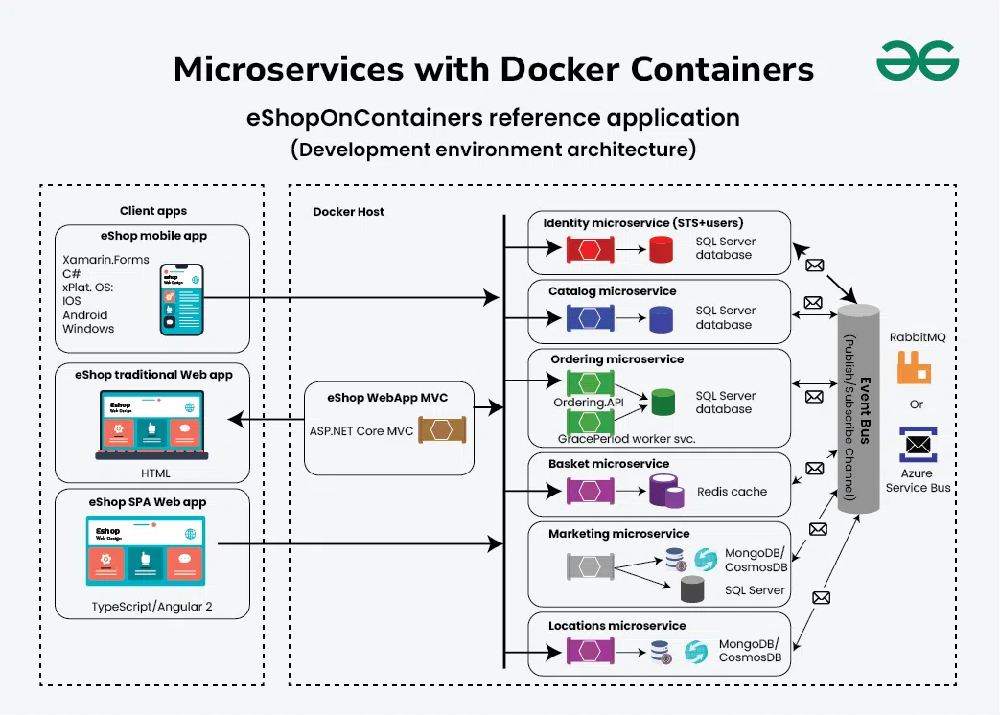
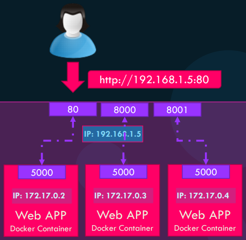
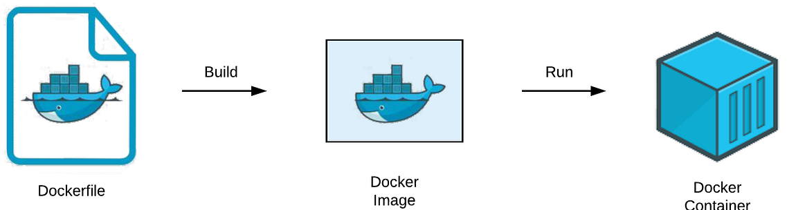

Este capítulo presenta Docker como plataforma de contenedores y describe la arquitectura
que lo sustenta, la relación entre los contenedores y la arquitectura de microservicios,
las diferencias respecto a las máquinas virtuales, los comandos esenciales para
gestionar imágenes y contenedores, la configuración de redes y volúmenes, la definición
de servicios con Docker Compose y las prácticas recomendadas de optimización y
seguridad.

## Bibliografía

- Docker. (s.f.). _Docker Documentation_. <https://docs.docker.com/>
- Podman. (s.f.). _Podman Documentation_. <https://docs.podman.io/>
- Gutiérrez, R. (s.f.). _DevOps con Docker, Jenkins, Kubernetes, Git, GitFlow CI y CD_
  \[Curso\]. Udemy.
  <https://www.udemy.com/course/devops-con-dockers-kubernetes-jenkins-y-gitflow-cicd/>
- Pradumnasaraf. (s.f.). _DevOps_ \[Repositorio\]. GitHub.
  <https://github.com/Pradumnasaraf/DevOps>

## Introducción

<figure markdown="span">
  
  <figcaption>Logo de Docker.</figcaption>
</figure>

**Docker** es una plataforma de código abierto que facilita la creación, la distribución
y la ejecución de aplicaciones mediante contenedores. Un **contenedor** empaqueta una
aplicación junto con todas sus dependencias y configuraciones en una unidad
estandarizada, lo que simplifica el desarrollo de software y garantiza la consistencia
entre distintos entornos.

Docker no es la única implementación disponible. Alternativas de código abierto como
Podman han ganado relevancia a raíz de los cambios de licencia y de las condiciones de
uso de Docker en entornos empresariales. Ambas herramientas ofrecen prestaciones
equivalentes y comparten en gran medida la misma interfaz de línea de comandos, por lo
que los conceptos descritos en este capítulo resultan aplicables a las dos.

Entre las características principales de los contenedores destaca la **portabilidad**,
puesto que se ejecutan en cualquier sistema que soporte Docker con independencia del
sistema operativo del _host_, es decir, de la máquina donde se instala el sistema de
contenedores. La **ligereza** proviene de que comparten el _kernel_ del sistema
operativo del _host_, lo que los hace más rápidos de iniciar que las máquinas virtuales.
La **consistencia** asegura que una aplicación se ejecute de la misma manera en
cualquier entorno. El **aislamiento** garantiza que cada contenedor opera de forma
independiente, lo que mejora la seguridad y evita conflictos entre aplicaciones. Por
último, la **escalabilidad** facilita la creación y la eliminación rápida de instancias.

## Contenedores y microservicios

<figure markdown="span">
  
  <figcaption>Sistema basado en microservicios. <a href="https://www.geeksforgeeks.org/system-design/how-to-design-a-microservices-architecture-with-docker-containers/">Referencia</a></figcaption>
</figure>

La posibilidad de empaquetar cada aplicación de forma independiente da pie al concepto
de **microservicios**. En esta arquitectura, cada servicio se distribuye con sus propias
dependencias, lo que evita conflictos entre versiones, permite escalar cada componente
de manera individual y simplifica el desarrollo, ya que cada equipo puede evolucionar su
servicio sin coordinar el despliegue con el resto.

La comunicación entre contenedores, es decir, entre cada microservicio, se realiza
habitualmente mediante APIs (_Application Programming Interface_), que actúan como
interfaz común entre las aplicaciones y los servicios que componen el sistema. Este
modelo contrasta con las aplicaciones monolíticas, en las que todos los componentes
comparten un único proceso y un único ciclo de despliegue.

## Contenedores frente a máquinas virtuales

Los contenedores y las máquinas virtuales son tecnologías de virtualización que permiten
ejecutar múltiples aplicaciones en un solo servidor físico, conocido como _host_. Aunque
comparten objetivos similares, como optimizar el uso de los recursos y asegurar el
aislamiento, difieren de forma significativa en su implementación y en la arquitectura
subyacente.

### Virtualización a nivel de sistema operativo

Los contenedores constituyen una forma de virtualización a nivel del sistema operativo,
también conocida como virtualización ligera. A diferencia de las máquinas virtuales, que
virtualizan un sistema operativo completo, los contenedores comparten el _kernel_ del
sistema operativo del _host_ y ejecutan las aplicaciones dentro de espacios de usuario
completamente aislados.

Cada contenedor incluye únicamente la aplicación y sus dependencias, es decir,
bibliotecas, archivos de configuración y variables de entorno. Esta reducción del
contenido lo hace extremadamente portátil y sencillo de desplegar en entornos muy
distintos, desde la máquina local de una persona que desarrolla hasta un clúster en la
nube.

El aislamiento se consigue combinando tres mecanismos del _kernel_ de Linux. Los
_namespaces_, o espacios de nombres, aíslan recursos del sistema operativo: `pid` aísla
los identificadores de procesos, `net` proporciona pilas de red separadas, `mnt` aísla
los puntos de montaje del sistema de archivos, `ipc` aísla los recursos de comunicación
entre procesos, `uts` aísla los nombres de _host_ y de dominio, y `user` aísla los
identificadores de usuarios y grupos.

Los _cgroups_, o grupos de control, gestionan el uso de recursos como CPU, memoria y
disco, lo que garantiza que ningún contenedor consuma más recursos de los asignados. Por
su parte, el _Union Filesystem_ (UFS) permite que las imágenes se construyan en capas.
Las capas de solo lectura contienen los archivos del sistema y las dependencias,
mientras que la capa de escritura se sitúa en la parte superior, lo que minimiza el uso
de almacenamiento y facilita el desarrollo iterativo.

### Máquinas virtuales e hipervisores

Las máquinas virtuales representan una tecnología de virtualización más tradicional que
permite ejecutar múltiples sistemas operativos en un servidor físico mediante un
hipervisor, como VMware o VirtualBox. Un hipervisor puede ejecutarse directamente sobre
el hardware del servidor, lo que se denomina virtualización de tipo 1, o sobre un
sistema operativo ya instalado, conocido como virtualización de tipo 2. En ambos casos,
el hipervisor gestiona la creación y la ejecución de las máquinas virtuales y reparte
los recursos de hardware entre ellas.

Cada máquina virtual dispone de su propio sistema operativo completo, lo que proporciona
un aislamiento más fuerte que el de los contenedores. Esta garantía tiene como
contrapartida un mayor consumo de CPU, memoria y almacenamiento, además de tiempos de
inicio más prolongados.

### Criterios de elección

Los contenedores resultan idóneos para el desarrollo y las pruebas, las arquitecturas de
microservicios y el despliegue continuo, por ejemplo en las herramientas de CI/CD que
ofrecen plataformas como GitLab o GitHub. Las máquinas virtuales se adaptan mejor a
aplicaciones monolíticas que requieren un aislamiento completo del sistema operativo, a
entornos que combinan varios sistemas operativos y a cargas de trabajo heredadas.

En la nube, proveedores como Amazon Web Services (AWS), Google Cloud Platform (GCP) y
Microsoft Azure ofrecen servicios de ambos tipos. Entre los servicios de contenedores se
encuentran ECS, Fargate y EKS en AWS, Azure Kubernetes Service (AKS) y Google Kubernetes
Engine (GKE), mientras que las máquinas virtuales se corresponden con EC2 en AWS, las
_VM Instances_ de GCP y Azure Virtual Machines. Para la gestión local, Docker Desktop y
la interfaz de línea de comandos de Docker cubren el ciclo completo de desarrollo y
despliegue.

## Arquitectura de Docker Engine

Docker Engine se compone de tres elementos fundamentales. El primero es **Docker CLI**,
la interfaz de línea de comandos con la que se emiten las órdenes. El segundo es la
**REST API**, que actúa como canal de comunicación entre el CLI y el _daemon_. El
tercero es el **Docker Daemon**, responsable de gestionar imágenes, contenedores, redes
y volúmenes. Dado que la comunicación se realiza a través de la REST API, el CLI puede
dirigirse a un _daemon_ remoto y gestionar contenedores alojados en otros servidores de
forma transparente.

!!! note "_Daemons_ en Linux"

    Un _daemon_ es un programa que se ejecuta en segundo plano, en lugar de hacerlo bajo
    el control directo de un usuario. Se trata de procesos autónomos que se inician
    durante el arranque del sistema y atienden tareas recurrentes como los servicios de
    red, la impresión o la sincronización. Su gestión mediante `systemctl` se describe en
    el capítulo de [fundamentos de
    Linux](../01_operative_systems/01_linux/section_1_fundamentals.md).

Conviene recordar que los contenedores **comparten el _kernel_ del _host_**. Si el
_host_ ejecuta un _kernel_ Linux, no es posible ejecutar contenedores Windows de forma
nativa, y a la inversa. Al instalar Docker en Windows se crea una instancia de Linux
mediante WSL sobre la que Docker ejecuta los contenedores, lo que explica que la
experiencia de uso sea equivalente en ambos sistemas.

## Imágenes y _tags_

Una imagen es una plantilla de solo lectura a partir de la cual se crean los
contenedores. Las imágenes utilizan **_tags_** para identificar variantes según el
sistema operativo base, como Alpine, Debian o Ubuntu, la versión del paquete que
contienen y otros criterios propios de cada proyecto.

Cuando no se especifica un _tag_, Docker recurre a `latest` por defecto. Esta práctica
**no se considera recomendable**, ya que no ofrece control sobre la versión utilizada y
puede introducir cambios inesperados entre construcciones. La alternativa consiste en
fijar siempre la versión y actualizarla de forma controlada, por ejemplo ante la
aparición de un problema de seguridad.

Las imágenes públicas de Docker Hub suelen disponer de un sistema de alertas que
notifica cuando una imagen se ve comprometida o cuando se detecta un fallo o una mejora
relevante en el servicio que empaquetan. Los _tags_ disponibles se consultan en la
documentación de cada imagen en el propio registro.

???+ example "Fijar la versión de una imagen"

    ```bash linenums="1"
    docker run redis:7.2
    ```

    El _tag_ `7.2` selecciona una versión concreta de Redis, de modo que la imagen
    empleada es siempre la misma con independencia del momento en que se descargue.

## Comandos principales

La gestión de imágenes constituye el punto de partida del trabajo con contenedores, ya
que toda ejecución parte de una imagen descargada de un registro o construida
localmente:

| Comando           | Descripción                                                                               | Ejemplo de uso                                                                              |
| ----------------- | ----------------------------------------------------------------------------------------- | ------------------------------------------------------------------------------------------- |
| `docker images`   | Lista las imágenes disponibles en la máquina local.                                       | `docker images` muestra todas las imágenes descargadas.                                     |
| `docker pull`     | Descarga una imagen desde un registro, por defecto [Docker Hub](https://hub.docker.com/). | `docker pull redis:7.2` descarga la versión indicada de Redis.                              |
| `docker build`    | Construye una imagen a partir de un `Dockerfile`.                                         | `docker build -t nombre_imagen:etiqueta .` construye la imagen en el directorio actual.     |
| `docker tag`      | Asigna una etiqueta adicional a una imagen existente.                                     | `docker tag nombre_imagen:1.0 usuario/nombre_imagen:1.0` prepara la imagen para publicarla. |
| `docker image rm` | Elimina una imagen local.                                                                 | `docker image rm redis:7.2` elimina la imagen indicada.                                     |

El ciclo de vida de un contenedor abarca su creación, su inicio, su detención y su
eliminación. Los comandos correspondientes admiten tanto el nombre asignado al
contenedor como su identificador:

| Comando         | Descripción                                                                    | Ejemplo de uso                                                                                                          |
| --------------- | ------------------------------------------------------------------------------ | ----------------------------------------------------------------------------------------------------------------------- |
| `docker create` | Crea un contenedor a partir de una imagen y devuelve su identificador.         | `docker create --name mongodb mongo` crea el contenedor con un nombre concreto.                                         |
| `docker start`  | Inicia un contenedor ya creado.                                                | `docker start mongodb` inicia el contenedor.<br />`docker start $(docker ps -a -q)` inicia todos los contenedores.      |
| `docker run`    | Combina la creación y el inicio de un contenedor en una sola orden.            | `docker run -d -p 8080:80 --name web debian:12` crea y ejecuta el contenedor en segundo plano.                          |
| `docker ps`     | Lista los contenedores activos con su identificador, imagen, estado y nombre.  | `docker ps` muestra los contenedores en ejecución.<br />`docker ps -a` incluye también los detenidos.                   |
| `docker stop`   | Detiene un contenedor en ejecución.                                            | `docker stop mongodb` detiene el contenedor.<br />`docker stop $(docker ps -q)` detiene todos los contenedores activos. |
| `docker rm`     | Elimina un contenedor detenido.                                                | `docker rm mongodb` elimina el contenedor.<br />`docker rm $(docker ps -a -q)` elimina todos los contenedores.          |
| `docker exec`   | Ejecuta un comando dentro de un contenedor en marcha.                          | `docker exec -it mongodb bash` abre una _shell_ interactiva en el contenedor.                                           |
| `docker cp`     | Copia archivos entre el _host_ y el contenedor.                                | `docker cp ./datos.csv mongodb:/tmp/datos.csv` copia el archivo al contenedor.                                          |
| `docker update` | Modifica la configuración de recursos de uno o varios contenedores existentes. | `docker update --memory 512m mongodb` ajusta el límite de memoria del contenedor.                                       |

La asignación de recursos también puede fijarse en el momento de la creación. La opción
`--cpu-shares` establece el peso relativo del contenedor en el reparto de CPU y la
opción `-m` limita la memoria disponible, como en
`docker run --cpu-shares=512 -m 256m nombre_imagen`. El conjunto completo de parámetros
admitidos se detalla en la
[documentación de `docker update`](https://docs.docker.com/engine/reference/commandline/update/).

Cuando un servicio no se comporta como se espera, la inspección del contenedor y de sus
registros permite localizar el origen del problema:

| Comando          | Descripción                                                          | Ejemplo de uso                                                                                                  |
| ---------------- | -------------------------------------------------------------------- | --------------------------------------------------------------------------------------------------------------- |
| `docker inspect` | Muestra la configuración detallada de un contenedor o de una imagen. | `docker inspect mongodb` devuelve la configuración completa en formato JSON.                                    |
| `docker logs`    | Muestra los registros generados por el contenedor.                   | `docker logs mongodb` muestra los registros acumulados.<br />`docker logs -f mongodb` los sigue en tiempo real. |
| `docker stats`   | Monitoriza el consumo de CPU, memoria y ancho de banda.              | `docker stats mongodb` monitoriza un contenedor.<br />`docker stats` monitoriza todos los contenedores activos. |

Las redes y los volúmenes son recursos independientes del ciclo de vida de los
contenedores, por lo que disponen de sus propios subcomandos de gestión:

| Comando                  | Descripción                                                          | Ejemplo de uso                                                          |
| ------------------------ | -------------------------------------------------------------------- | ----------------------------------------------------------------------- |
| `docker network ls`      | Lista las redes configuradas en Docker.                              | `docker network ls` muestra las redes existentes.                       |
| `docker network create`  | Crea una red personalizada.                                          | `docker network create nombre_red` crea la red indicada.                |
| `docker network inspect` | Detalla una red concreta, con sus direcciones IP y sus contenedores. | `docker network inspect nombre_red` muestra la configuración de la red. |
| `docker network rm`      | Elimina una red.                                                     | `docker network rm nombre_red` elimina la red indicada.                 |
| `docker volume create`   | Crea un volumen.                                                     | `docker volume create nombre_volumen` crea el volumen indicado.         |
| `docker volume ls`       | Lista los volúmenes existentes.                                      | `docker volume ls` muestra todos los volúmenes.                         |
| `docker volume rm`       | Elimina un volumen.                                                  | `docker volume rm nombre_volumen` elimina el volumen indicado.          |

La publicación de imágenes en un registro y la limpieza de los recursos que ya no se
utilizan completan el catálogo de comandos habituales:

| Comando                     | Descripción                                                                            | Ejemplo de uso                                                                |
| --------------------------- | -------------------------------------------------------------------------------------- | ----------------------------------------------------------------------------- |
| `docker login`              | Inicia sesión en un _registry_.                                                        | `docker login` autentica la sesión contra Docker Hub.                         |
| `docker push`               | Publica una imagen en un _registry_.                                                   | `docker push usuario/nombre_imagen:1.0` sube la imagen etiquetada.            |
| `docker logout`             | Cierra la sesión en un _registry_.                                                     | `docker logout` finaliza la sesión activa.                                    |
| `docker system prune --all` | Elimina los contenedores detenidos, las redes sin uso y las imágenes no referenciadas. | `docker system prune --all` libera el espacio ocupado por recursos inactivos. |
| `docker volume prune`       | Elimina los volúmenes que no están en uso.                                             | `docker volume prune` libera el espacio de los volúmenes huérfanos.           |
| `docker network prune`      | Elimina las redes sin uso, salvo `bridge`, `none` y `host`.                            | `docker network prune` elimina las redes personalizadas sin contenedores.     |

!!! danger "Las operaciones `prune` no son reversibles"

    Los comandos `prune` eliminan recursos de forma inmediata y definitiva. En el caso de
    `docker volume prune`, la eliminación afecta a los datos persistentes de los
    volúmenes que ningún contenedor tiene montados, lo que puede suponer la pérdida de
    bases de datos completas. Conviene revisar antes qué recursos se verán afectados con
    `docker volume ls` o `docker system df` y evitar la opción `--all` en máquinas
    compartidas.

## Ejecución de contenedores

Los comandos anteriores describen las operaciones disponibles, pero el comportamiento
real de un contenedor depende de cómo se combinen sus opciones en el momento de la
ejecución. Las secciones siguientes desarrollan las combinaciones más habituales.

### Creación e inicio de un contenedor

El comando `docker run` combina `docker create` y `docker start`. En primer lugar busca
la imagen especificada y, si no está disponible localmente, la descarga del registro
correspondiente. A continuación crea el contenedor a partir de la imagen y lo inicia.

???+ example "Contenedor en segundo plano"

    ```bash linenums="1"
    docker run -d -p 27017:27017 --name mongodb mongo
    ```

    La orden ejecuta un contenedor de MongoDB en segundo plano y expone el puerto 27017,
    de modo que el servicio queda accesible sin que el terminal permanezca ocupado.

### Modo interactivo

Un contenedor **no es un sistema operativo completo**, sino un entorno pensado para
alojar servicios y aplicaciones. Si se ejecuta una imagen como Ubuntu sin ningún proceso
activo, el contenedor se detiene de inmediato al no existir ninguna tarea que mantener
en marcha.

Además, los contenedores no leen la entrada estándar (_stdin_) de forma predeterminada.
Para interactuar con ellos se emplean las opciones `-i`, que mapea _stdin_ y activa el
modo interactivo, y `-t`, que crea un pseudoterminal.

???+ example "Acceso interactivo a un contenedor"

    ```bash linenums="1"
    docker run -it nombre_imagen bash

    docker run -it ghcr.io/astral-sh/uv:debian bash
    ```

    La primera orden muestra la forma general del acceso interactivo y la segunda abre
    una _shell_ en una imagen que incorpora uv preinstalado, lo que permite explorar el
    entorno antes de definir una imagen propia.

### _Attach_ y _detach_

Cuando un contenedor se ejecuta sin la opción `-d`, el terminal queda en modo _attach_,
es decir, en primer plano, y muestra la salida del proceso principal. La opción `-d`
activa el modo _detached_ y devuelve el control del terminal de inmediato. Para
recuperar el primer plano de un contenedor que se ejecuta en segundo plano se utiliza el
comando `attach` junto con el identificador del contenedor.

???+ example "Reconectar a un contenedor en segundo plano"

    ```bash linenums="1"
    docker ps

    docker attach id_contenedor
    ```

    La primera orden obtiene el identificador del contenedor y la segunda devuelve su
    salida al primer plano del terminal.

### Mapeo de puertos

<figure markdown="span">
  
  <figcaption>Mapeo de puertos entre el <em>host</em> y el contenedor.</figcaption>
</figure>

El mapeo de puertos, o _port mapping_, asigna un puerto del _host_ a un puerto del
contenedor, lo que permite que una aplicación alojada en el contenedor resulte accesible
desde el _host_ o desde otros contenedores. Sin esta correspondencia, el servicio solo
escucha en la red interna del contenedor.

???+ example "Mapeo del puerto de una base de datos"

    ```bash linenums="1"
    docker container create -p 27017:27017 --name mongodb mongo
    ```

    La opción `-p` asocia el puerto 27017 del _host_ con el puerto 27017 del contenedor,
    `mongodb` es el nombre asignado al contenedor y `mongo` es la imagen empleada.

### Variables de entorno

La configuración de un servicio empaquetado en un contenedor se transmite habitualmente
mediante variables de entorno. En el caso de una base de datos, estas variables definen
las credenciales que se crean durante la inicialización del contenedor.

???+ example "Credenciales mediante variables de entorno"

    ```bash linenums="1"
    docker create -e MONGO_INITDB_ROOT_USERNAME=usuario \
        -e MONGO_INITDB_ROOT_PASSWORD=contrasena mongo
    ```

    Las variables `MONGO_INITDB_ROOT_USERNAME` y `MONGO_INITDB_ROOT_PASSWORD` establecen
    el usuario y la contraseña del administrador de la base de datos. Los nombres de las
    variables varían según la imagen, por lo que conviene consultar la documentación de
    cada una.

## Construcción de imágenes con `Dockerfile`

<figure markdown="span">
  
  <figcaption>Pasos para la creación de un contenedor en Docker. <a href="https://medium.com/swlh/understand-dockerfile-dd11746ed183">Referencia</a></figcaption>
</figure>

Un `Dockerfile` es un archivo de texto que contiene las instrucciones necesarias para
construir una imagen personalizada. Cada imagen se construye sobre una imagen previa, ya
sea oficial de Docker o definida por el propio proyecto, y cada instrucción genera una
capa nueva dentro del sistema de archivos resultante.

???+ example "`Dockerfile` de una aplicación de Node.js"

    ```dockerfile linenums="1"
    # Imagen base
    FROM node:18

    # Crear un directorio para el código
    RUN mkdir -p /home/app

    # Copiar los archivos del host al contenedor
    COPY . /home/app

    # Exponer el puerto de la aplicación
    EXPOSE 3000

    # Ejecutar la aplicación
    CMD ["node", "/home/app/index.js"]
    ```

    Las instrucciones se ejecutan en orden durante la construcción, salvo `CMD`, que
    define el proceso que se lanza al iniciar el contenedor.

La construcción de la imagen a partir del archivo anterior se realiza con
`docker build`, indicando la etiqueta deseada y la ruta del contexto de construcción:

```bash linenums="1"
docker build -t nombre_imagen:etiqueta ruta_dockerfile
```

### `ENTRYPOINT` y `CMD`

La instrucción `ENTRYPOINT` define el comando base del contenedor, mientras que `CMD`
proporciona los argumentos por defecto, que pueden sobrescribirse en el momento de la
ejecución. La combinación de ambas permite construir imágenes que se comportan como un
ejecutable con parámetros configurables.

???+ example "Combinación de `ENTRYPOINT` y `CMD`"

    ```dockerfile linenums="1"
    FROM ubuntu
    ENTRYPOINT ["sleep"]
    CMD ["5"]
    ```

    Con esta definición, la orden `docker run nombre_imagen` espera cinco segundos, que
    es el valor por defecto declarado en `CMD`, mientras que
    `docker run nombre_imagen 10` sustituye ese argumento y espera diez segundos. El
    comando base `sleep`, fijado en `ENTRYPOINT`, permanece invariable.

## Redes

Para que varios contenedores se comuniquen entre sí es necesario que compartan una red
interna. Docker permite crear redes personalizadas con `docker network create`, y los
contenedores que pertenecen a la misma red se localizan utilizando su nombre como
dominio, sin necesidad de conocer su dirección IP. La red a la que se conecta un
contenedor se indica en el momento de su creación:

```bash linenums="1"
docker create -p 27017:27017 --name mongodb --network nombre_red mongo
```

Docker ofrece varios modos de red que determinan el grado de aislamiento del contenedor:

| Tipo     | Descripción                                                                                                                                                           |
| -------- | --------------------------------------------------------------------------------------------------------------------------------------------------------------------- |
| `bridge` | Red por defecto. Docker asigna direcciones IP internas a cada contenedor, que se comunican entre sí y quedan accesibles desde el _host_ mediante el mapeo de puertos. |
| `host`   | El contenedor utiliza directamente la red del _host_, sin aislamiento de red.                                                                                         |
| `none`   | El contenedor carece de conectividad de red y queda completamente aislado.                                                                                            |

Además de los modos anteriores, es posible crear **redes personalizadas** que
especifican el rango de direcciones IP y otros parámetros. Estas redes definidas por el
usuario sustituyen a la opción `--link`, considerada _legacy_, y aportan **resolución de
nombres interna**, de modo que los contenedores se referencian por nombre en lugar de
por dirección IP, junto con la conectividad automática entre todos los miembros de la
red.

## Docker Compose

Docker Compose permite definir y gestionar varios contenedores como un conjunto de
servicios interconectados. La configuración se declara en un archivo
`docker-compose.yml` en formato YAML, que recoge los servicios, las redes, los volúmenes
y el resto de aspectos relacionados con los contenedores. De este modo, una aplicación
compuesta por varios servicios se levanta con una única orden.

???+ example "Aplicación con dos servicios"

    ```yaml linenums="1"
    version: "3.9"

    services:
      mi-app:
        build: .
        ports:
          - "3000:3000"
        depends_on:
          - mongodb

      mongodb:
        image: mongo
        ports:
          - "27017:27017"
        environment:
          - MONGO_INITDB_ROOT_USERNAME=usuario
          - MONGO_INITDB_ROOT_PASSWORD=contrasena
    ```

    El archivo define dos servicios. El primero, `mi-app`, se construye a partir del
    contexto del directorio actual y expone el puerto 3000. El segundo, `mongodb`, parte
    de una imagen existente, expone el puerto 27017 y recibe las credenciales de acceso
    mediante variables de entorno. La clave `depends_on` establece el orden de arranque,
    de forma que la base de datos se inicia antes que la aplicación.

Para iniciar los servicios definidos en el archivo se ejecuta `docker compose up`, que
descarga las imágenes necesarias, crea los contenedores y los pone en funcionamiento. La
orden `docker compose down` detiene y elimina los servicios, junto con los contenedores,
las redes y los volúmenes asociados. Otros comandos habituales son
`docker compose up --scale servicio=numero_instancias` para escalar un servicio concreto
y `docker compose logs servicio` para consultar sus registros.

La sintaxis del archivo ha evolucionado a lo largo del tiempo, por lo que resulta útil
consultar el
[historial de versiones de Docker Compose](https://docs.docker.com/compose/intro/history/)
antes de reutilizar configuraciones antiguas.

## Persistencia de datos con volúmenes

Los volúmenes permiten conservar los datos generados por un contenedor más allá de su
ciclo de vida. Aunque el contenedor se elimine, la información almacenada en el volumen
permanece disponible, lo que resulta imprescindible para mantener bases de datos o
archivos de trabajo a través de reinicios y actualizaciones.

Existen tres tipos de volúmenes. Los **volúmenes anónimos** carecen de nombre, por lo
que no pueden referenciarse de forma explícita desde otros contenedores. Los **volúmenes
de _host_**, también denominados _bind mounts_, especifican qué directorio del sistema
anfitrión se monta dentro del contenedor. Los **volúmenes nombrados** disponen de un
nombre propio y pueden referenciarse desde otros contenedores o desde varios servicios.

El montaje directo desde la línea de comandos se realiza con la opción `-v`, que indica
el origen en el _host_ y el punto de montaje en el contenedor.

???+ example "Montaje de un directorio del _host_"

    ```bash linenums="1"
    docker run -v ./disco:/home/disco -it ghcr.io/astral-sh/uv:debian bash
    ```

    El directorio `./disco` del _host_ queda disponible en `/home/disco` dentro del
    contenedor, de modo que los cambios realizados desde cualquiera de los dos lados se
    reflejan de forma inmediata en el otro.

!!! warning "Volúmenes en contenedores existentes"

    Un contenedor en marcha no admite la incorporación de nuevos volúmenes. Para añadir
    uno es necesario **recrear el contenedor** incluyendo la definición del volumen en la
    orden de creación.

Los volúmenes también pueden declararse en un archivo `docker-compose.yml`, lo que evita
depender de rutas concretas de la máquina anfitriona.

???+ example "Volumen nombrado en Docker Compose"

    ```yaml linenums="1"
    version: "3.9"

    services:
      mi-app:
        build: .
        ports:
          - "3000:3000"
        depends_on:
          - mongodb

      mongodb:
        image: mongo
        ports:
          - "27017:27017"
        environment:
          - MONGO_INITDB_ROOT_USERNAME=usuario
          - MONGO_INITDB_ROOT_PASSWORD=contrasena
        volumes:
          - mongo-data:/data/db

    volumes:
      mongo-data:
    ```

    El servicio `mongodb` emplea un volumen nombrado, `mongo-data`, montado en el
    directorio `/data/db` del contenedor. Los datos de la base de datos se conservan
    aunque el contenedor se detenga o se elimine, y Docker gestiona de forma automática
    la creación y la ubicación del volumen.

Los archivos que Docker administra se almacenan en `/var/lib/docker`, incluidos los
volúmenes disponibles en la máquina. En ese mismo directorio se conserva la **caché de
las capas intermedias** de las imágenes, que Docker reutiliza incluso entre archivos
`Dockerfile` distintos, lo que reduce el espacio ocupado y el tiempo de construcción.

## Registros de imágenes

Un _registry_ es el servicio donde se almacenan y distribuyen las imágenes. Existen
opciones públicas y privadas, así como servicios gestionados por los principales
proveedores de nube:

| Registro                  | Tipo               | Características clave                                                             |
| ------------------------- | ------------------ | --------------------------------------------------------------------------------- |
| Docker Hub                | Público o privado  | El registro más extendido, con imágenes oficiales y construcciones automatizadas. |
| Amazon ECR                | Gestionado (AWS)   | Integración con ECS, EKS y Fargate, con pago por uso.                             |
| Azure Container Registry  | Gestionado (Azure) | Georreplicación y soporte de _Helm charts_.                                       |
| Google Artifact Registry  | Gestionado (GCP)   | Sucesor de GCR, con escaneo de vulnerabilidades y gestión mediante IAM.           |
| GitHub Container Registry | Gestionado         | Integrado con GitHub Actions para los flujos de CI/CD.                            |
| Harbor                    | _Open source_      | Control de acceso basado en roles y firmado de imágenes.                          |
| JFrog Artifactory         | Universal          | Soporta Docker, Helm y otros formatos de artefactos.                              |

## Optimización del tamaño de las imágenes

El tamaño de una imagen influye directamente en los tiempos de descarga, de despliegue y
de almacenamiento. Reducirlo mejora la eficiencia del flujo de trabajo y disminuye los
costes de infraestructura. Las estrategias descritas a continuación son complementarias
y suelen aplicarse de forma conjunta.

### Selección de imágenes base ligeras

La elección de la imagen base es el factor con mayor impacto en el tamaño final.
Imágenes como Alpine o las variantes Debian Slim proporcionan un sistema operativo
mínimo que reduce de forma notable el peso del resultado en comparación con las
distribuciones completas.

### Limpieza de caché y metadatos

Cuando se instalan paquetes del sistema operativo dentro de una imagen, los gestores de
paquetes almacenan caché y metadatos que no resultan necesarios en tiempo de ejecución.
Eliminar estos archivos temporales tras la instalación reduce el tamaño de la capa
resultante. La instalación y la limpieza deben encadenarse en una única instrucción
`RUN` para que la caché no persista en una capa intermedia.

???+ example "Instalación de dependencias con limpieza de caché"

    ```dockerfile linenums="1"
    FROM python:3.13-slim-bookworm

    RUN apt-get update && apt-get install --no-install-recommends -y \
            build-essential \
            curl \
            ca-certificates && \
        apt-get clean && rm -rf /var/lib/apt/lists/*
    ```

    Las dependencias del sistema se instalan y los archivos temporales se eliminan en la
    misma instrucción `RUN`, lo que evita que la caché de `apt` quede registrada en la
    imagen final.

### Gestión de dependencias por grupos

Los gestores de dependencias como uv o Poetry permiten definir grupos diferenciados de
dependencias para producción, desarrollo, documentación y pruebas. Al construir la
imagen de producción se instalan únicamente las dependencias necesarias para la
ejecución, lo que excluye herramientas de desarrollo, _linters_ o _frameworks_ de
pruebas que aumentarían el tamaño sin aportar valor en el entorno de despliegue.

### Copia selectiva de archivos

Resulta recomendable copiar exclusivamente los archivos que la aplicación necesita para
ejecutarse, en lugar del directorio completo del proyecto. Así se evita incluir
configuración local, documentación, pruebas o directorios como `.git`, que no cumplen
ninguna función en la imagen final. Un archivo `.dockerignore` complementa esta práctica
al excluir de forma automática los archivos y directorios no deseados durante la
construcción.

### _Multi-stage builds_

Las construcciones multietapa dividen el proceso de creación de una imagen en varias
fases, cada una con su propia imagen base. Una primera etapa, más pesada, compila el
proyecto e instala las dependencias, mientras que una segunda etapa, basada en una
imagen ligera, recibe únicamente los artefactos necesarios para la ejecución. De este
modo, las herramientas de compilación y las dependencias de desarrollo no forman parte
del resultado final.

???+ example "_Multi-stage build_ con uv"

    ```dockerfile linenums="1"
    ## Builder Stage
    FROM python:3.13-bookworm AS builder

    RUN apt-get update && apt-get install --no-install-recommends -y \
            build-essential && \
        apt-get clean && rm -rf /var/lib/apt/lists/*

    ADD https://astral.sh/uv/install.sh /install.sh
    RUN chmod -R 655 /install.sh && /install.sh && rm /install.sh

    ENV PATH="/root/.local/bin:$PATH"

    WORKDIR /app
    COPY ./pyproject.toml .
    RUN uv sync

    ## Production Stage
    FROM python:3.13-slim-bookworm AS production

    WORKDIR /app
    COPY . .
    COPY --from=builder /app/.venv .venv

    ENV PATH="/app/.venv/bin:$PATH"

    EXPOSE $PORT

    CMD ["uvicorn", "src.main:app", "--log-level", "info", \
         "--host", "0.0.0.0", "--port", "8080"]
    ```

    La etapa `builder` parte de una imagen completa de Python para instalar las
    dependencias del proyecto con uv. La etapa `production` parte de una imagen Slim y
    copia solo el entorno virtual generado en la etapa anterior, con lo que la imagen
    final resulta considerablemente más ligera.

## Seguridad en contenedores

Por defecto, los procesos que se ejecutan dentro de un contenedor lo hacen como usuario
`root`. Aunque el aislamiento que proporcionan los _namespaces_ limita el alcance de ese
usuario, mantener la aplicación con privilegios de superusuario sigue representando un
riesgo, especialmente si aparece una vulnerabilidad que permita escapar del contenedor.

### Ejecución con un usuario sin privilegios

La instrucción `RUN useradd` crea un usuario dentro de la imagen y la directiva `USER`
establece que las instrucciones posteriores, así como el proceso principal del
contenedor, se ejecuten con ese usuario en lugar de `root`. Esta configuración se aplica
habitualmente en la etapa de producción de un _multi-stage build_, una vez instaladas
las dependencias que sí requieren privilegios.

### Gestión de secretos en tiempo de construcción

Las variables de entorno definidas con `ENV` en un `Dockerfile` quedan almacenadas en
las capas de la imagen y resultan visibles mediante `docker inspect`. Para información
sensible como contraseñas o claves de acceso, Docker ofrece el mecanismo de _build
secrets_ a través de `--mount=type=secret`, que expone el secreto únicamente durante la
instrucción que lo necesita, sin que persista en la imagen final.

???+ example "Imagen con usuario sin privilegios y _build secrets_"

    ```dockerfile linenums="1"
    ## Builder Stage
    FROM python:3.13-bookworm AS builder

    RUN apt-get update && apt-get install --no-install-recommends -y \
            build-essential && \
        apt-get clean && rm -rf /var/lib/apt/lists/*

    ADD https://astral.sh/uv/install.sh /install.sh
    RUN chmod -R 655 /install.sh && /install.sh && rm /install.sh

    ENV PATH="/root/.local/bin:$PATH"

    WORKDIR /app
    COPY ./pyproject.toml .
    RUN uv sync

    ## Production Stage
    FROM python:3.13-slim-bookworm AS production

    RUN --mount=type=secret,id=DB_PASSWORD \
        --mount=type=secret,id=DB_USER \
        --mount=type=secret,id=DB_NAME \
        --mount=type=secret,id=DB_HOST \
        --mount=type=secret,id=ACCESS_TOKEN_SECRET_KEY \
        echo "Secrets available during build"

    RUN useradd --create-home appuser
    USER appuser

    WORKDIR /app
    COPY /src src
    COPY --from=builder /app/.venv .venv

    ENV PATH="/app/.venv/bin:$PATH"

    EXPOSE $PORT

    CMD ["uvicorn", "src.main:app", "--log-level", "info", \
         "--host", "0.0.0.0", "--port", "8080"]
    ```

    La etapa de producción crea el usuario `appuser` sin privilegios, monta los secretos
    de forma temporal durante la construcción y copia solo el código fuente y el entorno
    virtual necesarios para ejecutar el servicio.

Los mecanismos descritos cubren la construcción y la gestión de contenedores desde la
línea de comandos. Las imágenes obtenidas de esta forma constituyen el artefacto que
consumen los procesos automáticos de construcción, prueba y publicación, cuya definición
se aborda en el capítulo de [CI/CD](section_2_ci_cd.md). La ejecución de estos
contenedores a escala, repartidos entre varias máquinas, corresponde al capítulo de
[orquestación](section_3_orchestrators.md).
