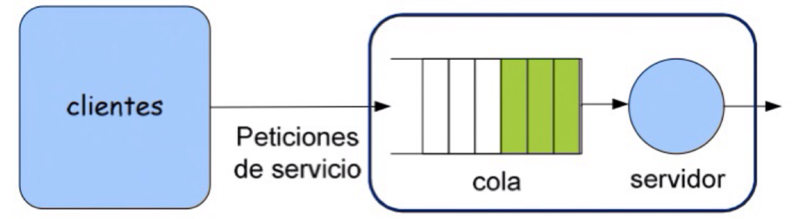
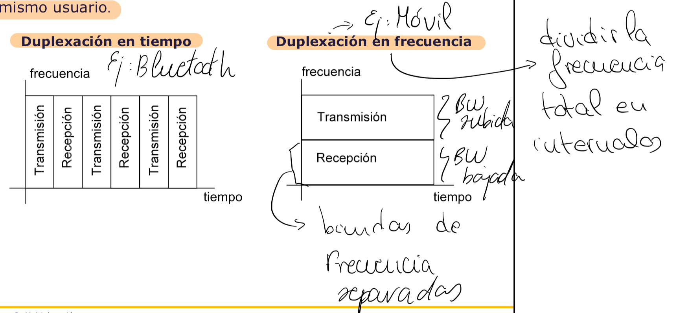
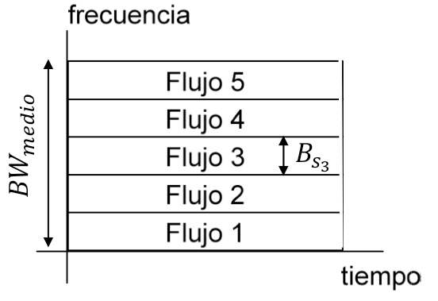
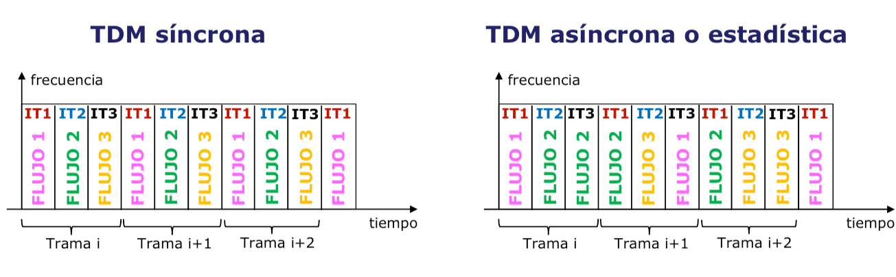
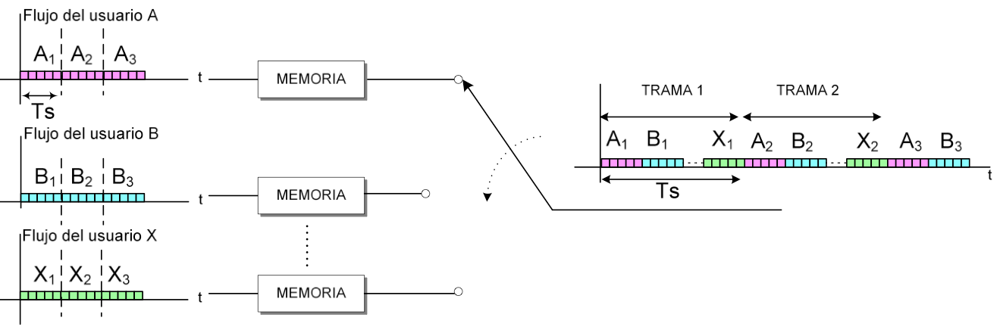
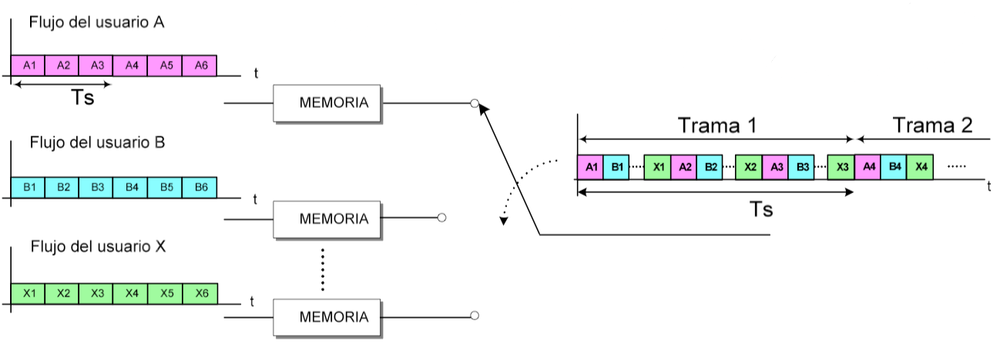
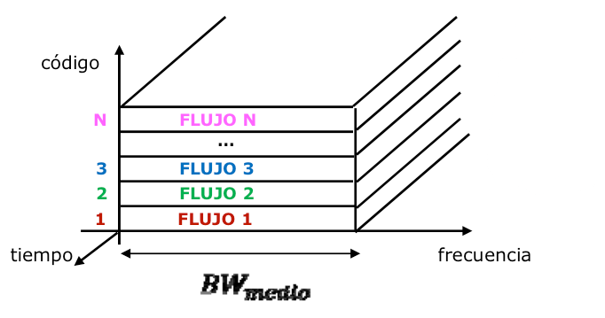
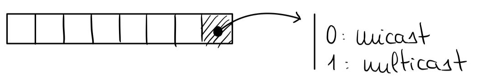
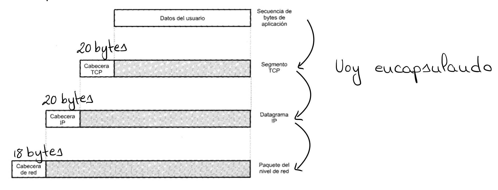

# Redes y servicios de telecomunicaciones

## Introducción a las comunicaciones

En el ámbito de las telecomunicaciones, el objetivo fundamental es el intercambio de
información —ya sea imagen, sonido, vídeo u otros tipos de datos— entre distintos
puntos. Para que dicho intercambio sea posible, la información se transforma en señales
susceptibles de ser manipuladas, transmitidas y recibidas. En este proceso, el tiempo
desempeña un papel esencial y puede presentarse de dos formas: continuo, cuando la
variable temporal toma cualquier valor dentro de un intervalo, o discreto, cuando solo
adopta un conjunto finito de valores.

Otro factor determinante en la caracterización de las señales es la amplitud. Si la
amplitud puede tomar cualquier valor, se dice que la señal es no cuantificada. En
cambio, cuando la amplitud se restringe a un conjunto de valores enteros, la señal se
denomina cuantificada.

Atendiendo a su naturaleza física, las señales se clasifican en tres categorías
principales. Las señales eléctricas circulan a través de cables conductores. Las señales
de radio se propagan por el aire mediante ondas electromagnéticas. Por último, las
señales ópticas viajan a través de cables de fibra óptica aprovechando la propagación de
la luz.

## Características de las señales

Las señales analógicas se caracterizan por cuatro parámetros fundamentales: amplitud,
frecuencia, fase y periodo. Las señales digitales, por su parte, se definen mediante el
bit (unidad mínima de información, que puede valer 0 o 1), el tiempo de bit (duración
necesaria para transmitir un único bit), el símbolo (agrupación de $n$ bits) y el tiempo
de símbolo (producto del número de bits por el tiempo de bit).

Un concepto clave a la hora de transmitir señales digitales es el régimen binario, que
se define como el número de bits transmitidos por segundo. Este parámetro resulta
fundamental para evaluar la velocidad de una comunicación digital y determinar si el
canal de transmisión es capaz de soportar el flujo de datos requerido.

## Conversión de señal analógica a digital

Las señales digitales presentan múltiples ventajas frente a las analógicas: permiten una
mayor capacidad de compresión, facilitan la implementación de sistemas de control de
errores, consumen menos energía, resultan más eficientes en el almacenamiento, sufren
menor degradación y posibilitan la transmisión a mayores distancias.

Por estas razones, resulta conveniente convertir las señales analógicas en digitales. El
proceso de conversión consta de varias etapas. En primer lugar, se captura la señal
analógica original. A continuación, se realiza el muestreo, que consiste en tomar
valores de la señal a intervalos regulares de tiempo. Posteriormente, cada muestra se
cuantifica, es decir, se aproxima a uno de los niveles discretos predefinidos.
Finalmente, se codifica cada valor cuantificado, obteniéndose como resultado una
secuencia de bits que representa la señal original.

Cuando una señal analógica no ha sido sometida a modulación, se denomina señal en banda
base. En el caso de una señal digital, el equivalente recibe el nombre de código de
línea. Si dicha señal se transmite en el mismo rango de frecuencias en el que fue
generada, la transmisión se conoce como transmisión en banda base.

> 💡 La **modulación** consiste en multiplicar la señal original por una sinusoide, lo
> que produce un desplazamiento en frecuencia que traslada la señal a una frecuencia
> portadora determinada.

## Sistema de telecomunicación

Un sistema de telecomunicación es el conjunto mínimo de elementos necesarios para
establecer un intercambio de información entre un emisor y un receptor. Se compone de
cinco elementos fundamentales: el emisor, que genera la información; el procesado de
transmisión, que adapta la señal para su envío a través del canal; el canal de
comunicación, que introduce retraso, distorsión y ruido durante el transporte de la
señal; el procesado de recepción, que se encarga de recuperar la señal original
minimizando los errores introducidos durante la transmisión; y el receptor, que consume
la información recibida.

### Sentido del flujo

Según el sentido en el que fluye la información, un sistema de comunicación puede
clasificarse en tres modalidades. En el modo simplex, la información se transmite en un
único sentido. En el modo half-duplex, la transmisión se realiza en ambos sentidos, pero
no de forma simultánea. En el modo duplex (o full-duplex), la transmisión tiene lugar en
ambos sentidos de manera simultánea.

### Características del canal de comunicación

El canal de comunicación se caracteriza por una serie de parámetros que determinan su
comportamiento y sus limitaciones.

El ancho de banda de la señal representa el rango de frecuencias que ocupa la señal que
se desea transmitir. El ancho de banda del canal, por su parte, corresponde al rango de
frecuencias dentro del cual la señal puede transmitirse sin errores significativos. Este
ancho de banda se define como el intervalo en el que la amplitud de la señal no cae por
debajo del 70 % de su valor máximo (equivalente a una atenuación de $-3$ dB). Para que
la transmisión sea correcta, el ancho de banda de la señal debe ser inferior al ancho de
banda del canal.

La capacidad del canal indica la cantidad máxima de bits que pueden transmitirse por
segundo a través de él. Para evitar errores, el régimen binario de la señal debe ser
menor o igual a esta capacidad. La capacidad se calcula como el producto de la
eficiencia espectral por el ancho de banda del canal. La eficiencia espectral alcanza su
valor máximo en transmisiones por cable (con un valor de referencia de 10) y su valor
mínimo en transmisiones vía radio (con un valor de referencia de 1).

La velocidad de propagación indica la rapidez con la que la señal se desplaza por el
medio de transmisión, mientras que el tiempo de propagación mide el intervalo que
transcurre desde que la señal parte del emisor hasta que llega al receptor.

Los errores del canal son perturbaciones que se acoplan a la señal emitida como
consecuencia del ruido, las distorsiones y otras interferencias presentes en el medio de
transmisión. En el caso de las señales digitales, la calidad de la transmisión se evalúa
mediante la tasa de error de bit (BER, por sus siglas en inglés), que expresa la
probabilidad de que un bit individual sea recibido de forma incorrecta.

### Medios de transmisión

Los medios de transmisión se dividen en dos grandes categorías. Los medios guiados son
aquellos de naturaleza física, como los cables de cobre, los cables coaxiales o la fibra
óptica. Los medios no guiados son inalámbricos y emplean señales de radio, microondas,
infrarrojos o luz visible para transportar la información.

En la transmisión de ondas electromagnéticas, los parámetros más relevantes son la
frecuencia y la longitud de onda, que mantienen una relación inversa. A mayor
frecuencia, la longitud de onda es menor, lo que permite transportar más información
pero dificulta la capacidad de la señal para atravesar obstáculos. A menor frecuencia,
la longitud de onda es mayor, lo que reduce la cantidad de información transportada pero
facilita la penetración a través de objetos.

Existen diferentes bandas de frecuencia utilizadas en las telecomunicaciones. Las
frecuencias medias (MF, Medium Frequency) generan ondas que viajan por la superficie
terrestre y alcanzan distancias de cientos de kilómetros. Las frecuencias altas (HF,
High Frequency) se propagan a través de la ionosfera, un medio inherentemente inestable,
y pueden cubrir distancias de miles de kilómetros. Las frecuencias muy altas y ultra
altas (VHF y UHF) viajan por la troposfera como ondas directas y reflejadas, con un
alcance de hasta 40 kilómetros. Las frecuencias súper altas (SHF, Super High Frequency)
se emplean en comunicaciones vía satélite o en enlaces terrestres de hasta 40
kilómetros.

Además, la transmisión puede ser direccional, cuando la energía se concentra en una
única dirección, u omnidireccional, cuando la señal se emite en múltiples direcciones
simultáneamente.

## Red de telecomunicación

Una red de telecomunicación es una infraestructura diseñada para conectar usuarios
(terminales o hosts) con el fin de ofrecer servicios de comunicación. En su estructura
se identifican tres grandes componentes: los terminales, que generan y consumen
información; los sistemas de acceso, que permiten a los usuarios conectarse a la red; y
la infraestructura, compuesta por todos los elementos que posibilitan la conexión de los
usuarios y el transporte de información dentro de la red.

### Topologías

Las conexiones dentro de una red pueden organizarse siguiendo distintas topologías.
Entre todas ellas, la red mallada es la más robusta, ya que ofrece múltiples caminos
alternativos entre cualquier par de nodos. Sin embargo, presenta inconvenientes
significativos: el número de enlaces crece rápidamente con el número de usuarios, las
distancias entre nodos pueden resultar prohibitivas, los enlaces pueden requerir
recursos que no se utilizan de manera eficiente y la incorporación de un nuevo usuario
obliga a reestructurar parte de la red.

### Organización de la información a transmitir

Los mensajes que circulan por la red, entendidos como conjuntos de bits, se organizan en
paquetes. Cada paquete incorpora una cabecera (header) y una cola. La cabecera contiene
información que permite identificar el origen y el destino del paquete, mientras que la
cola incluye datos de control destinados al manejo de errores. Cuando un mensaje es
demasiado grande para ser enviado en un único paquete, se fragmenta en múltiples
paquetes que se transmiten de forma independiente.

### Difusión del mensaje

La información puede difundirse dentro de la red de diferentes maneras. En modo
broadcast, el mensaje se transmite a todos los usuarios de la red. En modo multicast, se
envía a un subconjunto específico de usuarios. En modo unicast, la información se dirige
a un único destinatario. En modo anycast, el mensaje se entrega al usuario más cercano
dentro de un grupo de posibles destinatarios.

### Clasificación según el área de cobertura

Las redes se clasifican según su extensión geográfica. Las redes de área personal (PAN,
Personal Area Network) cubren distancias muy cortas, como las proporcionadas por
tecnologías NFC o Bluetooth. Las redes de área local (LAN, Local Area Network) abarcan
espacios reducidos, como una vivienda o una oficina. Las redes de área metropolitana
(MAN, Metropolitan Area Network) cubren una ciudad o un campus universitario. Las redes
de área amplia (WAN, Wide Area Network) se extienden a nivel nacional o global, siendo
Internet el ejemplo más representativo.

### Clasificación según la localización del terminal

Las redes pueden ser fijas, cuando los terminales permanecen en una ubicación estática,
o móviles, cuando los dispositivos se desplazan durante la comunicación. Adicionalmente,
se distinguen redes terrestres, en las que tanto los nodos como los terminales se
encuentran en tierra; redes satelitales, donde los terminales están en tierra pero
algunos nodos se ubican en satélites; y redes espaciales, en las que existen pocos
terminales y los nodos se sitúan fuera de la superficie terrestre.

### Clasificación según el modelo de comunicación

Atendiendo al modo en que la información se transmite a través de la red, los sistemas
de comunicación se clasifican en dos categorías principales.

Los sistemas de difusión son aquellos en los que los terminales comparten el medio de
transmisión. Cada terminal es responsable de determinar si un mensaje recibido está
destinado a él o no. Ejemplos de este tipo de sistemas son las redes LAN inalámbricas y
las topologías en anillo o en bus.

Los sistemas de conmutación establecen una conexión dedicada entre el emisor y el
receptor antes de iniciar la transmisión, liberando los recursos una vez finalizada.
Este modelo es característico de las topologías jerárquicas o en árbol, en estrella y
malladas.

Las redes de gran escala, como Internet, suelen adoptar una topología jerárquica o en
árbol, diferenciando dos niveles principales: el nivel de acceso, donde los usuarios se
conectan a la red a través de enlaces y conmutadores de acceso, y el nivel de
transporte, que se encarga de mover la información a lo largo de la red. Dentro de este
tipo de redes, existen interfaces estandarizadas que permiten la comunicación entre
equipos de distintos fabricantes.

### Técnicas de conmutación

Los sistemas de conmutación se clasifican en dos tipos fundamentales.

La conmutación de circuitos establece una conexión física dedicada entre el origen y el
destino antes de iniciar la transmisión. Una vez completada la comunicación, los
recursos se liberan. Este método se utiliza en redes telefónicas tanto públicas como
privadas. Su principal ventaja es que, una vez establecida la conexión, la transmisión
resulta rápida y con un retardo constante. No obstante, presenta desventajas
significativas: requiere un tiempo de establecimiento previo, hace un uso ineficiente de
los recursos (ya que el circuito permanece reservado aunque no se transmitan datos) y
descarta nuevas peticiones cuando el canal está ocupado.

La conmutación de paquetes divide la información en paquetes que se introducen en colas
para ser procesados de forma secuencial. Los paquetes se almacenan en cada nodo
intermedio y se retransmiten en caso de error. El tiempo total de transmisión depende
del número de paquetes, el régimen binario, el tamaño de cada paquete y el número de
nodos intermedios. Esta técnica se subdivide a su vez en dos modalidades. En la
conmutación mediante datagramas, los paquetes no llegan necesariamente en orden; cada
uno contiene la dirección de destino y puede seguir un camino diferente, lo que puede
provocar variaciones en los retardos. El receptor se encarga de reordenar los paquetes
utilizando un número de secuencia incluido en cada uno de ellos. En la conmutación
mediante circuito virtual, el primer paquete establece una ruta que será seguida por
todos los paquetes posteriores, garantizando que lleguen en orden al destino.

### Comunicación orientada a conexión

Un sistema de comunicaciones orientado a conexión establece una conexión previa al
intercambio de información. Este enfoque permite construir sistemas más fiables, con
menor pérdida de paquetes, y facilita la implementación de mecanismos de control de
flujo y de errores. Sin embargo, no resulta óptimo para redes en las que la latencia
constituye un requisito crítico, ya que el proceso de establecimiento de la conexión
introduce un retardo adicional.

### Indicadores de rendimiento

Existen varios indicadores fundamentales para evaluar el rendimiento de una red de
telecomunicaciones. La latencia mide el tiempo que transcurre desde que se envía una
petición hasta que se recibe la respuesta correspondiente. El throughput indica el
número de bits que se transmiten en un instante de tiempo determinado. El jitter
representa la variación del retardo entre paquetes consecutivos de un mismo mensaje,
siendo un parámetro especialmente crítico en sistemas de tiempo real donde la
regularidad en la entrega de datos es esencial.

### Problemas fundamentales de las comunicaciones

Todos los sistemas de comunicaciones se enfrentan a una serie de problemas comunes. El
direccionamiento se ocupa de identificar de forma unívoca a cada usuario dentro de la
red. La multiplexación aborda el uso eficiente de los recursos compartidos del medio de
transmisión. El dimensionado determina el número de enlaces necesarios para satisfacer
la demanda de tráfico. La señalización gestiona los mensajes de control que informan
sobre el estado de la red.

Las comunicaciones móviles, además de los problemas anteriores, presentan desafíos
adicionales. El roaming permite que un terminal móvil se conecte desde cualquier
ubicación dentro del área de cobertura. El handover gestiona el traspaso de la
comunicación cuando un terminal se desplaza de una celda a otra durante una llamada
activa. El paging y la actualización de localizaciones permiten localizar a los
terminales dentro de la red. La normalización establece mecanismos para garantizar la
interoperabilidad entre equipos de distintos fabricantes. Los sistemas celulares
optimizan el uso del espectro radioeléctrico mediante la reutilización de frecuencias.

En el caso particular de Internet, que conecta redes heterogéneas mediante
infraestructuras de transporte y acceso, se añaden problemas específicos. Los usuarios
generan y consumen contenido con requisitos muy diversos, lo que exige establecer
métricas de rendimiento como la calidad de experiencia (QoE, Quality of Experience) y la
calidad de usuario (QoU, Quality of User). El encaminamiento determina el camino que
deben seguir los paquetes dentro de la red. Además, se necesitan sistemas capaces de
controlar el flujo de información y de detectar y gestionar errores de manera
automática.

## Principios sobre dimensionado de redes y sistemas de colas

### Concepto de cola

En el contexto de las redes de telecomunicaciones, una cola es una región de
almacenamiento temporal donde se depositan las solicitudes cuando un servidor se
encuentra en un momento de alta demanda y no puede procesarlas de forma inmediata. El
diseño de estos sistemas implica encontrar un equilibrio entre el coste de la
infraestructura y la calidad de la experiencia percibida por el usuario.

Resulta esencial dimensionar el sistema teniendo en cuenta el nivel de uso previsto, con
el propósito de mejorar la satisfacción del usuario y optimizar el rendimiento de la
red. En este sentido, el objetivo principal consiste en minimizar la latencia y
maximizar el throughput. Cuando un usuario envía solicitudes a un servidor, estas se
encolan y el servidor las procesa siguiendo un conjunto predefinido de reglas de
servicio.

### Componentes de un sistema de colas

Un sistema de colas se describe a través de cuatro bloques funcionales: el cliente, la
cola, el servicio y el sistema en su conjunto.

En lo que respecta al cliente, se consideran el número de clientes (que puede ser finito
o infinito), la naturaleza de las peticiones (deterministas, si siguen un patrón
predecible, o aleatorias, si se rigen por una función de distribución con una esperanza
conocida), el tiempo entre llegadas (intervalo transcurrido entre dos peticiones
consecutivas) y la tasa media de llegada (cantidad de solicitudes que llegan por unidad
de tiempo).

En relación con la cola, los aspectos relevantes son su capacidad (finita o infinita;
cuando es finita y se llena, las nuevas solicitudes se descartan), el tiempo de espera
en cola (tiempo promedio que una solicitud aguarda antes de ser atendida) y el número de
solicitudes en cola en un momento dado.

En cuanto al servicio, se contemplan el número de servidores disponibles, la tasa de
servicio (cantidad de solicitudes que un servidor puede procesar por unidad de tiempo) y
el tiempo de servicio (duración necesaria para completar el procesamiento de una
solicitud).

Finalmente, a nivel del sistema completo, se consideran el número total de solicitudes
presentes (tanto en cola como en proceso de atención) y el tiempo total transcurrido
desde que se envía una solicitud hasta que se recibe la respuesta.

Cuando se modela un sistema de colas teniendo en cuenta el tiempo entre llegadas, el
comportamiento sigue una distribución exponencial. Si, en cambio, se modela a partir de
la tasa media de llegada, el sistema se ajusta a una distribución de Poisson.

Un parámetro adicional de gran importancia es la intensidad del tráfico, definida como
el número esperado de solicitudes que llegan mientras se procesa una solicitud. Si la
intensidad es mayor o igual que la capacidad del sistema, este se encuentra mal
dimensionado y no podrá atender la demanda de forma sostenible.

## Multiplexación

### Concepto de multiplexación

La multiplexación es una técnica que permite compartir un mismo medio físico de
transmisión entre múltiples flujos de información simultáneos, lo que se traduce en un
ahorro significativo de costes y en un aprovechamiento más eficiente de los recursos
disponibles.

Esta técnica se manifiesta de dos formas principales. En la primera, los usuarios
generan señales que no son directamente compatibles para su combinación, por lo que se
emplea un dispositivo denominado multiplexor para realizar la operación de mezcla. Un
ejemplo representativo de esta modalidad es la tecnología ADSL. En la segunda forma, los
usuarios generan información en un formato que permite su posterior separación sin
necesidad de un dispositivo multiplexor específico, como ocurre en la transmisión de
radio FM.

La duplexación es una variante de la multiplexación que se refiere a la combinación de
los flujos de transmisión y recepción de un mismo usuario en un único canal o medio de
comunicación.

La canalización o acceso múltiple constituye otra forma de multiplexación en la que la
relación entre los flujos de información y los canales asignados varía con el tiempo.
Esta técnica resulta especialmente habitual en los sistemas de comunicación móvil.

En cuanto a la nomenclatura, se distinguen tres enfoques principales. En la
multiplexación se encuentran FDM (Frequency Division Multiplexing o multiplexación por
división de frecuencia), TDM (Time Division Multiplexing o multiplexación por división
de tiempo) y CDM (Code Division Multiplexing o multiplexación por división de código).
En la canalización se emplean FDMA (Frequency Division Multiple Access), TDMA (Time
Division Multiple Access) y CDMA (Code Division Multiple Access). En la duplexación se
utilizan FDD (Frequency Division Duplexing) y TDD (Time Division Duplexing). La
duplexación por división de código (CDD) no se emplea en la práctica debido a los
problemas de saturación que genera.

### Multiplexación por división en frecuencia

La multiplexación por división de frecuencia (FDM) consiste en asignar a cada flujo de
información una banda de frecuencias distinta dentro del medio de transmisión, de modo
que todos los flujos se transmiten de forma simultánea durante todo el tiempo
disponible.

Dado que, por lo general, todas las señales que se desean multiplexar ocupan
inicialmente la misma banda de frecuencias, se realiza una traslación de banda mediante
modulación para llevar cada señal a una frecuencia portadora diferente.

No obstante, la multiplexación en frecuencia presenta algunas desventajas. La elevada
relación entre la potencia de pico y la potencia media (PAPR, Peak To Average Power
Ratio) afecta a la distancia máxima de transmisión, ya que señales con alta PAPR pueden
experimentar problemas de distorsión. La intermodulación entre canales se produce cuando
múltiples señales se superponen en la misma banda de frecuencia, generando
interferencias que degradan la calidad de la transmisión. Además, el uso de bandas de
guarda entre las señales individuales, necesarias para evitar interferencias, provoca
una utilización subóptima del espectro.

Cuando la multiplexación por división de frecuencia se aplica en transmisiones a través
de fibra óptica, recibe el nombre de multiplexación por división en longitud de onda
(WDM, Wavelength Division Multiplexing). Esta técnica permite aprovechar al máximo la
capacidad de transmisión de las fibras ópticas al transportar múltiples señales en
diferentes longitudes de onda de forma simultánea.

### Multiplexación por división en tiempo

La multiplexación por división de tiempo (TDM) asigna a cada flujo de información el
ancho de banda total del medio de transmisión durante una fracción del tiempo que se
repite de forma periódica. Esta estrategia resulta especialmente adecuada para señales
digitales. La información se organiza en tramas compuestas por intervalos de tiempo,
cada uno de los cuales se asocia a un canal físico, lo que permite utilizar
eficientemente todo el ancho de banda disponible. Cada canal físico puede transportar
información de uno o más flujos de datos.

Las tramas pueden organizarse mediante TDM síncrona, donde la capacidad asignada a cada
flujo permanece constante, o mediante TDM asíncrona, donde la capacidad varía con el
tiempo en función de la demanda.

El entrelazado de los flujos de información puede realizarse de dos maneras. En el
entrelazado de palabra, la información se organiza en palabras, donde cada palabra es un
conjunto de bits que se intercalan de forma secuencial entre los distintos flujos.

En el entrelazado de bit, la información se intercala a nivel de bits individuales,
alternando un bit de cada flujo en cada intervalo de tiempo.

El proceso de demultiplexación requiere identificar los bits correspondientes a cada
intervalo mediante una marca que se inserta de forma periódica, conocida como FAS (Frame
Alignment Signal). Esta marca puede implementarse de diversas maneras, ya sea a través
de un código de línea que utiliza un solo bit o mediante la adición de una secuencia de
bits específica.

### Multiplexación por división en código

La multiplexación por división en código asigna a cada flujo de información la totalidad
del ancho de banda disponible en el medio de transmisión durante todo el periodo de
transmisión. Para lograr la separación de los distintos flujos, se emplean señales
especiales denominadas códigos, que permiten compartir el medio de forma efectiva sin
que los flujos interfieran entre sí.

La multiplexación y demultiplexación en tiempo y en frecuencia son, en realidad, casos
particulares de un concepto más general conocido como ortogonalización de señales. Dos
señales se consideran ortogonales cuando su producto escalar es igual a cero, lo que
significa que al multiplicar cada componente de un código por la componente
correspondiente del otro código y sumar todos los productos, el resultado es nulo. Esta
propiedad fundamental garantiza que las señales no interfieran entre sí y puedan
recuperarse de manera independiente en el receptor.

## Técnicas de acceso al medio

### Concepto de colisión

En determinadas redes donde el medio de transmisión es compartido entre múltiples
terminales, las señales de diferentes usuarios pueden presentar características
similares. Si estas señales coinciden en el tiempo, se produce una colisión: las señales
de dos o más terminales se superponen en el medio de transmisión, lo que impide su
correcta interpretación por parte del receptor.

Cuando ocurre una colisión, el terminal receptor recibe dos señales de forma simultánea,
lo que genera un nivel de señal superior al esperado. En redes cableadas, la señal
resultante presenta aproximadamente el doble de energía de lo normal, mientras que en
redes inalámbricas la señal recibida suele ser de muy baja energía. El transmisor
detecta la colisión gracias a la ausencia de señales ACK (confirmación de recepción)
enviadas por el receptor, o bien mediante la detección directa de niveles anómalos de
energía en el medio.

### Técnicas de acceso aleatorio

Las técnicas de acceso aleatorio permiten a los dispositivos compartir un medio de
transmisión sin una coordinación centralizada estricta. A continuación se describen las
cuatro técnicas más relevantes.

Aloha es el protocolo más sencillo: los dispositivos transmiten datos en cualquier
momento sin coordinación central y escuchan el canal para detectar colisiones. Su
simplicidad de implementación constituye su principal ventaja, aunque resulta propenso a
colisiones, lo que genera retransmisiones frecuentes y un uso ineficiente del canal.

CSMA (Carrier Sense Multiple Access o acceso múltiple por detección de portadora) mejora
el rendimiento de Aloha al exigir que los dispositivos verifiquen la presencia de una
señal en el canal antes de transmitir. Si el canal está ocupado, el dispositivo espera
un tiempo aleatorio antes de intentar nuevamente. Aunque reduce significativamente las
colisiones respecto a Aloha, estas pueden seguir produciéndose debido a los retrasos
inherentes en la detección de la portadora.

CSMA/CD (Carrier Sense Multiple Access with Collision Detection) se utiliza
principalmente en redes Ethernet cableadas. Los dispositivos escuchan el canal mientras
transmiten y son capaces de detectar colisiones en tiempo real. Cuando se detecta una
colisión, la transmisión se detiene inmediatamente y el dispositivo espera un tiempo
aleatorio antes de reintentar. Este protocolo resulta eficiente en la detección y el
manejo de colisiones en entornos cableados, aunque ha perdido relevancia en las redes
modernas de alta velocidad que emplean conmutación.

CSMA/CA (Carrier Sense Multiple Access with Collision Avoidance) se emplea en redes
inalámbricas Wi-Fi, donde la detección directa de colisiones resulta más difícil. Antes
de transmitir, los dispositivos solicitan permiso y verifican que el canal esté libre,
utilizando un mecanismo de espera previa a la transmisión para evitar colisiones. Aunque
añade una sobrecarga de control que puede reducir la eficiencia en redes congestionadas,
resulta eficaz para prevenir colisiones en entornos inalámbricos.

## Control de errores

### Objetivos del control de errores

El objetivo principal de cualquier sistema de comunicación es garantizar la fiabilidad y
la eficiencia en la transmisión de datos. Sin embargo, el canal de comunicación
introduce inevitablemente errores debido a interferencias y ruido. La calidad de la
transmisión se mide mediante la tasa de error de bit (BER), donde un valor menor indica
una mejor calidad de la comunicación.

Para mitigar los errores introducidos por el canal, se emplean estrategias basadas en la
redundancia de información y en sistemas de control que permiten recuperar la
información original. Estos sistemas se dividen en dos categorías principales.

Los sistemas ARQ (Automatic Repeat Request o solicitud de repetición automática)
detectan los errores y solicitan la retransmisión del paquete dañado. Resultan adecuados
para redes con un retardo de propagación moderado, donde la retransmisión no introduce
un retraso excesivo.

Los sistemas FEC (Forward Error Correction o código de corrección de errores) detectan y
corrigen los errores directamente en el receptor, sin necesidad de retransmisión. Esta
técnica resulta especialmente útil en situaciones en las que no se dispone de un canal
de retorno o la retransmisión no es factible.

Los errores pueden clasificarse en dos categorías: errores simples, que afectan a un
solo bit en la transmisión, y errores a ráfagas, que pueden afectar a múltiples bits
consecutivos.

## Encaminamiento

El encaminamiento es el proceso mediante el cual un paquete de datos se dirige desde su
origen hasta su destino a través de la red. Para lograrlo, se emplean comúnmente tablas
de encaminamiento, que son registros que contienen información sobre las rutas
disponibles hacia los distintos nodos. Cada nodo dentro de la red mantiene su propia
tabla de encaminamiento, y estas tablas se clasifican en dos tipos.

Las tablas estáticas contienen información introducida manualmente por el administrador
de la red. Resultan adecuadas para redes de menor tamaño que experimentan pocos cambios
en su topología. Las tablas dinámicas se actualizan automáticamente mediante protocolos
de encaminamiento y resultan especialmente útiles en redes más extensas y complejas,
donde las rutas pueden cambiar con frecuencia debido a la dinámica de la red.

### Forwarding y routing

El routing (encaminamiento) es el proceso de actualización de las tablas de
encaminamiento, en el que los nodos de la red intercambian información a través de un
protocolo de encaminamiento. Dicho protocolo implementa un algoritmo que calcula la ruta
óptima para transmitir los datos hacia su destino.

El forwarding (envío) es la acción concreta de encaminar cada paquete en la dirección
adecuada hacia su destino. Requiere la presencia de routers que consultan sus tablas de
encaminamiento para determinar la mejor ruta en cada momento.

### Métodos de forwarding

Existen varios métodos de forwarding utilizados en las redes. En el método de ruta, las
tablas de encaminamiento contienen información detallada sobre la ruta completa hasta el
destino. En el método next-hop, las tablas solo indican el próximo salto necesario para
alcanzar el destino, simplificando el proceso de decisión. En el método host-specific,
las tablas contienen una entrada por cada terminal conectado a la red, lo que permite
una segmentación muy detallada. En el método network-specific, las tablas contienen
únicamente una entrada por cada red, simplificando el encaminamiento para grupos de
terminales. En el método default, se definen rutas específicas y, si ninguna coincide
con el destino solicitado, se utiliza una entrada predeterminada.

### Características del routing

Cuando se diseña un protocolo de encaminamiento, se busca determinar la mejor ruta entre
la fuente y el destino, que puede ser la más corta, la más rápida o la que minimice el
consumo de energía, entre otros criterios. Para ello, el protocolo debe ser correcto
(encontrar la ruta adecuada), simple (minimizar la carga computacional y el tráfico de
control), robusto ante fallos de red (adaptarse a situaciones de fallo sin perder la
conectividad), estable (mantener la consistencia de las rutas en condiciones cambiantes)
y óptimo (buscar la ruta que optimice los criterios definidos).

El encaminamiento puede aplicarse tanto a redes orientadas a la conexión como a redes no
orientadas a la conexión. En las redes orientadas a la conexión, se establece una ruta
denominada circuito virtual durante la fase de establecimiento de la conexión. Todos los
paquetes de una misma conexión siguen la misma ruta, ya que comparten identificadores
comunes. En las redes no orientadas a la conexión (basadas en datagramas), cada paquete
contiene la dirección de destino y se enruta de forma independiente, como ocurre en
Internet.

### Clasificación de los protocolos de routing

Los protocolos de encaminamiento pueden clasificarse según diversos criterios.
Atendiendo al modo en que se determina la ruta, se distinguen dos enfoques. En el
enrutamiento salto a salto (hop-by-hop), la fuente especifica únicamente el destino y
los nodos intermedios determinan el siguiente salto en función de sus tablas de
encaminamiento. En el enrutamiento con definición de ruta en la fuente (source routing),
la fuente decide la ruta completa que deben seguir los datos y los nodos intermedios
simplemente reenvían el mensaje al siguiente nodo de la ruta predefinida.

En cuanto a la adaptabilidad a cambios en la topología de la red, se distinguen dos
categorías. El enrutamiento estático emplea rutas configuradas manualmente que no se
adaptan automáticamente a cambios en la red. El enrutamiento dinámico se subdivide a su
vez en dos modalidades. En el enrutamiento centralizado, un nodo central recopila
información de control de todos los demás nodos, ejecuta los algoritmos de
encaminamiento y distribuye la información actualizada a las tablas de los nodos; este
enfoque es vulnerable, ya que un fallo en el nodo central puede afectar gravemente a
toda la red. En el enrutamiento distribuido, todos los nodos desempeñan roles similares:
cada uno envía y recibe información de control, calcula sus propias tablas de
encaminamiento y se adapta a los cambios en la topología de forma autónoma, lo que
confiere al sistema una mayor robustez.

## Modelos de referencia

### Arquitectura en capas

Para abordar la complejidad inherente a las comunicaciones, se adopta la estrategia de
agrupar funcionalidades relacionadas en un modelo de referencia. En el ámbito de las
redes, se desarrollan arquitecturas que organizan estas funciones en unidades
denominadas capas. Esta práctica ha dado lugar a la creación de arquitecturas comunes
que facilitan la comunicación entre dispositivos de diversos fabricantes.

El enfoque por capas consiste en organizar las funciones de una red en grupos
relacionados que se descomponen en subconjuntos jerárquicos. Cada capa se comunica con
las capas inmediatamente superior e inferior: la capa inferior proporciona servicios a
la capa superior, la cual ejecuta sus funciones y transmite los resultados a la
siguiente capa, y así sucesivamente. Además, una capa $N$ de un equipo puede comunicarse
con la capa $N$ correspondiente de otro equipo mediante protocolos específicos.

Este enfoque presenta múltiples ventajas: simplifica el diseño, facilita la realización
de modificaciones, permite dividir las tareas para su ejecución en paralelo y garantiza
la interoperabilidad entre equipos de diferentes fabricantes.

### Protocolos

Los protocolos son conjuntos de reglas que regulan el intercambio de datos entre
diferentes entidades. Se caracterizan por tres aspectos fundamentales. La semántica
define el significado de cada sección de bits en la comunicación. La sintaxis establece
el formato de los datos, incluyendo el número y la disposición de los campos en la
cabecera. La temporización determina la secuencia en la que se envían y reciben los
mensajes.

Dentro de una misma capa, las entidades se comunican mediante el intercambio de unidades
de datos de protocolo (PDU, Protocol Data Unit). Cada PDU consta de una cabecera con
información de control y, por lo general, datos de usuario en forma de unidades de datos
de servicio (SDU, Service Data Unit).

La comunicación entre procesos del mismo nivel es virtual, lo que significa que no
existe un enlace de comunicación directa entre ellos. En su lugar, cada nivel recibe
solicitudes de su nivel superior en forma de primitivas de servicio (ASP, Application
Service Primitives), las encapsula en PDU y las envía a la entidad correspondiente en el
sistema receptor a través de los servicios proporcionados por las capas inferiores.

### Modelo OSI

El modelo OSI (Open Systems Interconnection) es un sistema abierto que posibilita la
comunicación entre sistemas diversos, independientemente de su arquitectura. Se compone
de siete capas organizadas jerárquicamente, de la más alta a la más baja.

La capa de aplicación (Application Layer) es la capa superior y se encarga de
proporcionar servicios de red a las aplicaciones del usuario final, incluyendo
protocolos como HTTP para la navegación web. La capa de presentación (Presentation
Layer) se ocupa de la traducción, el cifrado y la compresión de datos para garantizar la
interoperabilidad entre sistemas con diferentes formatos. La capa de sesión (Session
Layer) establece, mantiene y finaliza las sesiones de comunicación entre dispositivos,
proporcionando mecanismos de gestión de diálogos y control de sincronización. La capa de
transporte (Transport Layer) asegura la entrega de datos de manera fiable y ordenada,
controlando la segmentación y el reensamblaje mediante protocolos como TCP y UDP. La
capa de red (Network Layer) gestiona el encaminamiento y el direccionamiento de datos,
donde los routers toman decisiones sobre cómo transmitir los paquetes a través de la
red. La capa de enlace de datos (Data Link Layer) se encarga de la transmisión a nivel
de enlace físico, garantizando la integridad de los paquetes y resolviendo colisiones en
la subcapa de control de acceso al medio (MAC). La capa física (Physical Layer) es la
capa más baja y se ocupa de la transmisión de bits a través del medio físico, definiendo
aspectos como el tipo de cable, los voltajes y las frecuencias.

### Organización de los niveles

En la organización de los sistemas de comunicación se identifican tres niveles
fundamentales. Los niveles de soporte de red, correspondientes a las capas 1, 2 y 3
(física, enlace de datos y red), se ocupan de la infraestructura y la logística
necesarias para que la información viaje de un punto a otro. Los niveles de servicios de
soporte de usuario, correspondientes a las capas 5, 6 y 7 (sesión, presentación y
aplicación), permiten la interoperabilidad entre sistemas de software heterogéneos y
facilitan el intercambio de información entre diferentes aplicaciones. El nivel de
transporte, identificado como la capa 4, se enfoca en la transmisión de datos de extremo
a extremo, garantizando que los datos lleguen de manera confiable y eficiente desde el
origen hasta el destino.

### Direcciones MAC

Cada equipo conectado a la red dispone de su propia tarjeta de interfaz de red, que se
identifica mediante una dirección física de 6 bytes (por ejemplo, 05:02:01:06:2B:4C). En
esta dirección, el bit menos significativo del primer byte indica si la dirección es
unicast (dirigida a un único destinatario) o multicast (dirigida a un grupo de
destinatarios). La dirección de broadcast, que se dirige a todos los dispositivos de la
red, es FF:FF:FF:FF:FF:FF.

### Equipos de interconexión

En una red se emplean diversos equipos de interconexión, cada uno operando en un nivel
diferente del modelo de referencia.

El repetidor opera en el nivel físico y regenera la señal para extender la cobertura de
una red local, compensando el ruido introducido por el medio de transmisión. Existen
también repetidores pasivos que no regeneran la señal, sino que simplemente la
amplifican.

El puente (bridge) opera en la capa de enlace y filtra el tráfico entre puertos,
dividiendo la red en segmentos. Asocia direcciones MAC a puertos, lo que le permite
reenviar mensajes únicamente al puerto correspondiente según la dirección MAC de
destino. Si desconoce la dirección MAC de destino o si se trata de una dirección de
broadcast, actúa como un repetidor y retransmite el mensaje por todos los puertos
excepto el de origen.

El router opera en el nivel de red y toma decisiones sobre el puerto de salida y los
nodos subsiguientes en la ruta. Para ello, debe disponer de conocimiento sobre la
topología de la red.

El conmutador (switch) funciona en los niveles de enlace de datos y red. Realiza un
mapeo entre direcciones IP y puertos de salida, lo que le permite determinar con
precisión el puerto por el cual debe reenviarse cada mensaje, aumentando la eficiencia
de la red al evitar transmisiones innecesarias.

La pasarela (gateway) opera en niveles superiores a la capa de red y se encarga de la
traducción entre dos dominios de red diferentes, facilitando la comunicación entre redes
que utilizan protocolos o arquitecturas distintas.

### Modelo TCP/IP

El modelo TCP/IP se compone de cuatro capas. La capa de aplicación facilita la
comunicación entre procesos o aplicaciones que se ejecutan en terminales separados,
proporcionando servicios directamente utilizados por las aplicaciones. La capa de
transporte (o extremo a extremo) ofrece un servicio de transferencia de datos de extremo
a extremo, garantizando que los datos se entreguen de manera confiable y en el orden
correcto. La capa de Internet se ocupa del enrutamiento de los datos desde su origen
hasta su destino a través de redes interconectadas por dispositivos de enrutamiento. La
capa de acceso a la red se relaciona con la interfaz lógica entre un sistema final y una
subred, asegurando que los datos se transmitan correctamente en el nivel más básico de
la red.

### TCP/IP frente a OSI

El modelo OSI especifica de forma precisa qué funciones pertenecen a cada uno de sus
niveles, mientras que los niveles de TCP/IP contienen protocolos relativamente
independientes que pueden solaparse o combinarse según las necesidades del sistema.
TCP/IP se estableció antes que OSI, por lo que el coste de migración resultaría elevado.
De hecho, Internet se construye sobre el conjunto de protocolos TCP/IP, lo que ha
consolidado su posición como estándar de facto en las comunicaciones globales.

### Enfoques cross-layer y layer-less

En el enfoque cross-layer no se respeta la regla de que los protocolos de capas
superiores utilicen exclusivamente los servicios de las capas inferiores. Se permite una
comunicación directa entre protocolos de capas no contiguas, incluyendo el intercambio
de variables entre ellas, lo que puede mejorar el rendimiento en determinados
escenarios.

En el concepto layer-less se busca consolidar el diseño de manera que cada vez más
funciones sean realizadas por una misma capa, lo que conduce a una reducción progresiva
del número de niveles en el modelo de comunicación.

## Redes de telecomunicación

### Internet: arquitectura de la red

Internet es una red descentralizada compuesta por la interconexión de diversas redes
mediante routers y otros elementos clave.

Los hosts son los dispositivos finales —computadoras personales, dispositivos móviles,
servidores y otros equipos— que necesitan conectarse a través de la red. Se vinculan a
redes locales (LAN) y redes de área amplia (WAN). Los routers son dispositivos
fundamentales que permiten la interconexión de redes entre sí y se encargan de encaminar
los paquetes de datos de manera eficiente.

Los proveedores de servicio de Internet (ISP) son empresas que brindan acceso a
Internet. Operan grupos de servidores conectados mediante enlaces de alta velocidad y
asignan direcciones IP a sus clientes. Para mantener la conectividad, disponen de
equipos y enlaces de telecomunicación organizados en puntos de presencia (POP), que
marcan la frontera de la red del ISP y constituyen los puntos donde se establecen las
conexiones con los clientes.

Los puntos de acceso a la red (NAP o IXP) son servicios públicos que ofrecen conmutación
a gran escala, facilitando la interconexión entre diversas redes. Los proveedores de
servicio de red (NSP) son empresas que proporcionan a los ISP la infraestructura de
telecomunicaciones necesaria; en algunos casos, una misma empresa puede operar
simultáneamente como ISP y NSP.

### Capa IP

La capa IP (Internet Protocol) es fundamental en el funcionamiento de Internet. Se
caracteriza por ser no orientada a la conexión y se encarga de fragmentar y ensamblar
los datos en datagramas. Cada datagrama contiene información de control en su cabecera y
el payload, que es la información útil que se está transmitiendo.

### GSM: problemática de las redes móviles

Las redes móviles presentan una serie de desafíos específicos que deben abordarse de
manera eficiente. La movilidad de los dispositivos exige la transmisión a través de
enlaces de radio, y el espectro radioeléctrico disponible es limitado, lo que puede dar
lugar a interferencias que afectan la calidad de la comunicación. La potencia de
transmisión de los dispositivos terminales es un factor crítico: si no es adecuada,
puede resultar en una cobertura insuficiente o conexiones de baja calidad.

Para brindar cobertura en un área extensa, el territorio se divide en celdas y se
instala una estación base en cada una de ellas. La eficiente gestión de estas estaciones
resulta esencial para garantizar una conectividad adecuada. La organización en sistemas
celulares implica la reutilización de canales considerando las interferencias cocanal,
lo que añade un desafío adicional en la asignación eficiente de recursos.

### Geometría de las celdas

El diseño geométrico de las celdas en las redes móviles es un aspecto crucial para
garantizar un servicio confiable. Se persiguen tres objetivos fundamentales: eliminar
los solapamientos entre celdas para evitar interferencias y problemas de calidad de
señal, asegurar la ausencia de zonas de sombra (áreas sin cobertura) y maximizar el área
de cobertura de cada celda sin comprometer la calidad de la señal, lo que implica una
distribución estratégica de estaciones base y antenas.

### Reutilización de los canales

La reutilización de canales es una práctica esencial para gestionar eficazmente el
espectro de frecuencia disponible. La asignación cuidadosa de canales de frecuencia
garantiza que las celdas cercanas no utilicen los mismos canales, reduciendo las
interferencias y mejorando la capacidad de la red. Para minimizar las interferencias
cocanal, se emplean estrategias inteligentes de reutilización que permiten un
aprovechamiento más efectivo del espectro disponible.

### Handover

El handover (HO) es un proceso esencial en las redes móviles que consiste en el cambio
de canal durante una conexión activa. Este cambio puede producirse por diversas razones:
el desplazamiento del dispositivo móvil a una nueva celda, una disminución en la
potencia de la señal recibida o una redistribución del tráfico en la red. La
transferencia puede realizarse con continuidad en la comunicación (handover suave o soft
HO) o con una breve interrupción (handover brusco o hard HO).

El proceso comprende tres etapas: la detección de la condición que requiere la
transferencia, la búsqueda del canal de destino óptimo para mantener la calidad de la
comunicación y la ejecución de la transferencia entre canales de forma eficiente.

### Roaming

El roaming es el conjunto de procedimientos que permiten que un terminal móvil
establezca una conexión en cualquier ubicación dentro del área de cobertura del sistema,
independientemente de su posición geográfica. Para ello, se define un área de
localización conjunta, que comprende un conjunto de celdas controladas por una central
de conmutación móvil.

Durante el proceso de roaming, cada dispositivo móvil realiza un registro de
localización, enviando un mensaje a la red para que esta lo ubique en un área de
localización específica. Además, se implementa el proceso de radiobúsqueda o paging, que
consiste en el envío de mensajes a todas las celdas dentro de un área de localización
con el objetivo de establecer una conexión con un dispositivo móvil concreto. Este
mecanismo garantiza que los dispositivos puedan mantener una comunicación ininterrumpida
mientras se desplazan.

### Seguridad y privacidad en redes móviles

En las redes móviles, la seguridad y la privacidad se abordan mediante dos
procedimientos fundamentales. La autenticación permite que la red verifique la identidad
del usuario móvil, previniendo intentos de suplantación o acceso no autorizado. El
cifrado protege la información transmitida mediante algoritmos criptográficos, evitando
que sea accesible para terceros no autorizados y asegurando la confidencialidad de los
datos.

### Arquitectura del sistema GSM

El sistema GSM (Global System for Mobile Communications) se compone de varios elementos
que desempeñan funciones esenciales en su operación.

La estación móvil (MS) es el terminal utilizado por el usuario. Contiene la tarjeta SIM,
que almacena el número de teléfono, la agenda y los mensajes SMS, entre otros datos.
Además, incluye el equipo móvil (ME) con el número IMEI, un identificador único asociado
a cada terminal.

El subsistema de estación base (BSS) consta de dos componentes. La estación base (BTS)
incluye antenas, líneas de transmisión, amplificadores, filtros y otros equipos que
permiten la comunicación inalámbrica con los dispositivos móviles. El controlador de
estación base (BSC) supervisa y gestiona las estaciones base, ejecutando las órdenes de
la central de conmutación móvil (MSC) a la que está conectado.

El subsistema de conmutación de red (NSS) está compuesto por varios elementos. El centro
de conmutación móvil (MSC) se encarga del enrutamiento de llamadas, las transferencias,
la itinerancia (roaming) y la interconexión con otras redes. El registro de localización
de hogar (HLR) es una base de datos que almacena la información de los usuarios de la
red. El registro de localización visitante (VLR) contiene una copia de la información
del HLR y se accede desde la MSC. El centro de autenticación (AuC) almacena los
algoritmos y las claves de cifrado utilizados para la autenticación y la seguridad de la
red. El registro de identidad de equipos (EIR) contiene los IMEI de todos los
dispositivos móviles registrados en la red.

El centro de operaciones y mantenimiento (OMC) desempeña un papel vital al obtener
informes de funcionamiento, gestionar alarmas y generar estadísticas para el monitoreo y
mantenimiento continuo de la red.
