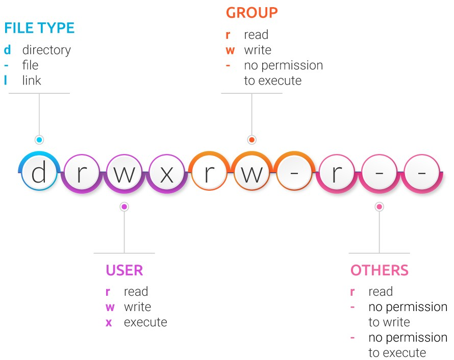

## Usuarios y grupos

Linux es un sistema multiusuario, en el que la seguridad y el control de acceso se
articulan mediante un modelo basado en usuarios, grupos y permisos. Este enfoque permite
que múltiples personas trabajen simultáneamente en el mismo sistema sin interferir entre
sí, garantizando al mismo tiempo la protección de los recursos y la estabilidad del
entorno.

Los permisos no se asignan únicamente a individuos, sino que se agrupan mediante
**grupos**, que actúan como conjuntos de privilegios compartidos (como una plantilla de
privilegios).

Cada usuario dispone de un **grupo primario**, asociado por defecto a los archivos que
crea, y puede pertenecer a varios **grupos secundarios**, que amplían sus capacidades,
como ocurre con el grupo `sudo`, destinado a la ejecución controlada de tareas
administrativas.

### Permisos

Cada archivo o directorio define privilegios de **lectura**, **escritura** y
**ejecución** para tres categorías claramente diferenciadas: a) el **propietario**, b)
el **grupo** asociado y c) el resto de usuarios, denominados **otros**.

Este esquema limita el acceso indebido a los recursos. Por encima de estas restricciones
se sitúa el **superusuario**, identificado como `root`, que posee control total sobre el
sistema y puede ignorar el modelo de permisos convencional.

La categoría de **otros** representa a cualquier usuario que no sea ni el propietario
del archivo ni miembro del grupo asociado.

El sistema evalúa los permisos siguiendo un orden de prioridad estricto: primero
comprueba si el usuario es el propietario, en cuyo caso aplica los permisos
correspondientes. Si no lo es, verifica si pertenece al grupo, y solo si no cumple
ninguna de estas condiciones, se aplican los permisos definidos para otros.

<figure markdown="span">
  
  <figcaption>Registro de permisos de Linux </figcaption>
</figure>

Los permisos se visualizan habitualmente mediante el comando `ls -l`, que muestra una
cadena simbólica como `rwxr-xr--`.

Esta notación agrupa los permisos en tres bloques de tres caracteres, cada uno
correspondiente al propietario, al grupo y a otros, respectivamente. Cada carácter
indica si el permiso de lectura (`r`), escritura (`w`) o ejecución (`x`) está concedido
o no.

???+ example "Ejemplo"

    Supongamos que al ejecutar `ls -l` obtenemos la siguiente salida:

    ```bash linenums="1"
    -rwxr-xr--
    ```

    Este conjunto de caracteres puede interpretarse de la siguiente manera, dividiéndolo en
    bloques de tres caracteres que representan los permisos del propietario, del grupo y de
    los demás usuarios:

    | Permiso       | Propietario | Grupo | Otros |
    | ------------- | ----------- | ----- | ----- |
    | Lectura (r)   | ✔           | ✔     | ✔     |
    | Escritura (w) | ✔           | ✖     | ✖     |
    | Ejecución (x) | ✔           | ✔     | ✖     |

    En este contexto:

    - **Propietario:** Tiene permisos completos sobre el archivo, lo que significa que puede
      leer su contenido, modificarlo y ejecutarlo si se trata de un archivo ejecutable.
    - **Grupo:** Posee permisos de lectura y ejecución, lo que le permite abrir y ejecutar
      el archivo, pero no modificarlo.
    - **Otros:** Solo cuentan con permiso de lectura, por lo que pueden consultar el
      contenido del archivo, pero no ejecutarlo ni realizar cambios sobre él.

    Es importante destacar que cada bloque de tres caracteres sigue siempre el orden `rwx`.

Cuando un permiso no está habilitado, se reemplaza con un guion (`-`). Por ejemplo,
`r--` indica que únicamente se permite la lectura, mientras que `rw-` permite lectura y
escritura, pero no ejecución.

### Modificación de permisos

Podemos modificar los permisos de los archivos y directorios utilizando el comando
`chmod` mediante dos notaciones principales, la **octal** y la **simbólica**.

En la **notación octal**, cada permiso tiene un valor numérico fijo, donde la lectura
equivale a 4, la escritura a 2 y la ejecución a 1. La suma de estos valores determina el
permiso final para cada categoría. El comando recibe siempre tres dígitos que
representan de izquierda a derecha los permisos del propietario, del grupo y de otros.

???+ example "Ejemplo"

    Al aplicar `chmod 754 archivo`, el propietario obtiene todos los permisos, el grupo
    puede leer y ejecutar, y el resto de usuarios solo puede leer.

Por otra parte, la **notación simbólica** utiliza letras para identificar a los sujetos,
`u` para el propietario, `g` para el grupo, `o` para otros y `a` para todos, además de
emplear operadores para añadir, quitar o asignar permisos.

???+ example "Ejemplos"

    - **Añadir permisos de ejecución a todos:** `chmod a+x backup.sh`, en este caso, el
      operador `+` suma el permiso de ejecución (`x`) a todas las categorías (`a` de _all_).
    - **Dar acceso de lectura al grupo:** `chmod g+r backup.sh`, aquí se especifica que
      únicamente el sujeto grupo (`g`) reciba el atributo de lectura (`r`).
    - **Retirar permisos de escritura accidental a otros:** `chmod o-w backup.sh`, el
      operador `-` garantiza que cualquier permiso de escritura previo para terceros sea
      revocado, sin alterar los permisos del dueño o del grupo.
    - **Asignación exacta de permisos:** `chmod g=rx backup.sh`, el operador `=` establece
      que el grupo tenga lectura y ejecución, eliminando cualquier otro permiso previo
      que pudiera tener ese grupo (como el de escritura) de una sola vez.

El sistema emplea el comando `umask` para definir los permisos **por defecto** de los
nuevos archivos y directorios. Mientras que `chmod` modifica permisos existentes,
`umask` actúa como una máscara que restringe los permisos máximos iniciales.

Para los archivos, el sistema parte de un valor máximo de lectura y escritura para
todos, y para los directorios, de permisos completos. El valor de `umask` indica qué
permisos deben eliminarse automáticamente, de modo que cuanto más restrictiva sea la
máscara, más limitados serán los permisos resultantes.

???+ example "Ejemplo"

    Supongamos que un usuario tiene configurada una **máscara `umask` de 022**:

    - Para un **archivo nuevo**, el sistema parte de los permisos máximos `rw-rw-rw-`
      (lectura y escritura para todos). La máscara 022 elimina los permisos de escritura
      para **grupo** y **otros**, por lo que el archivo se crea con permisos finales
      `rw-r--r--`.
    - Para un **directorio nuevo**, el sistema parte de permisos máximos `rwxrwxrwx`
      (lectura, escritura y ejecución para todos). Aplicando la misma máscara 022, se
      eliminan los permisos de escritura para **grupo** y **otros**, resultando en permisos
      finales `rwxr-xr-x`.

### Propiedad de archivos

Además de los permisos, cada archivo y directorio posee un **propietario** y un
**grupo**, que determinan quién ejerce la autoridad principal sobre él.

El comando `chown` permite modificar esta propiedad, definiendo quién es el dueño y a
qué grupo pertenece un recurso. A diferencia de `chmod`, que puede ser utilizado por el
propietario del archivo para ajustar sus permisos, `chown` requiere privilegios
administrativos, ya que cambiar la propiedad implica transferir el control efectivo del
recurso.

`chown` permite modificar únicamente el usuario propietario, solo el grupo o ambos
simultáneamente, y puede aplicarse de forma recursiva a directorios completos.

???+ example "Ejemplo"

    Supongamos que un administrador desea **cambiar el propietario y el grupo de un
    directorio** llamado `proyecto` un usuario llamado `ana`:

    ```bash linenums="1"
    sudo chown ana proyecto
    ```

    Después de ejecutar este comando, `ana` será la propietaria del directorio, mientras que
    el grupo permanece sin cambios. Para **cambiar solo el grupo** a `desarrolladores`:

    ```bash linenums="1"
    sudo chown :desarrolladores proyecto
    ```

    El propietario actual se mantiene, pero ahora el grupo asociado es `desarrolladores`.
    Para **cambiar tanto propietario como grupo simultáneamente**:

    ```bash linenums="1"
    sudo chown ana:desarrolladores proyecto
    ```

    Con esto, `ana` se convierte en la propietaria y `desarrolladores` en el grupo asociado
    al directorio. Para **aplicar los cambios de manera recursiva** a todos los archivos y
    subdirectorios dentro de `proyecto`:

    ```bash linenums="1"
    sudo chown -R ana:desarrolladores proyecto
    ```

### Administración de cuentas

La gestión de usuarios se completa con comandos orientados a la creación y mantenimiento
de cuentas. Herramientas como `adduser` permiten crear nuevos usuarios de forma
interactiva, mientras que `passwd` se utiliza para establecer o modificar contraseñas.
La pertenencia a grupos puede consultarse mediante `groups`, tanto para el usuario
actual como para cualquier otro usuario del sistema, y modificarse añadiendo usuarios a
grupos específicos, como `sudo`, para concederles capacidades administrativas
controladas.

???+ example "Ejemplos"

    - **Creación interactiva de la cuenta:** `sudo adduser pedro`, a diferencia de `useradd`,
      el comando `adduser` es un script de alto nivel que, de forma asistida, crea el
      directorio personal en `/home/pedro`, asigna un intérprete de comandos (Shell) y
      solicita la información básica del usuario.
    - **Gestión de la seguridad de acceso:** `sudo passwd pedro`, aunque el comando anterior
      solicita una clave inicial, `passwd` permite al administrador forzar un cambio de
      contraseña o actualizarla en cualquier momento, garantizando la integridad del acceso.
    - **Concesión de privilegios administrativos:** `sudo adduser pedro sudo`, para que el
      usuario pueda ejecutar tareas de mantenimiento que requieren privilegios de raíz
      (root), se le añade al grupo secundario `sudo`. Esta acción aplica la "plantilla" de
      permisos necesaria para que el sistema le permita utilizar dicho comando.
    - **Auditoría y verificación de pertenencia:** `groups pedro`, este comando permite
      verificar que los cambios se han aplicado correctamente. La salida mostrará una lista
      similar a `pedro : pedro sudo`, confirmando que el usuario pertenece a su grupo
      primario y al grupo de administradores.

## Procesos y servicios

En Linux, un **proceso** se define como un **programa en ejecución**. Cuando un usuario
inicia un programa, el sistema operativo carga el archivo binario en memoria, asigna los
recursos necesarios y lo transforma en un proceso activo.

Cada proceso es gestionado por el kernel y recibe un identificador único denominado
**PID** (_Process ID_). Todos los procesos forman una jerarquía cuyo origen es el
proceso con PID 1, gestionado actualmente por **`systemd`**.

A lo largo de su ciclo de vida, un proceso puede encontrarse en distintos estados, que
van desde ejecución activa hasta espera o finalización, y puede supervisarse mediante
herramientas como `ps`, `top` o `htop`, las cuales permiten analizar su consumo de
recursos y comportamiento.

Linux organiza los procesos en forma de árbol genealógico. Cada proceso nace de otro
proceso padre:

- **`systemd` (PID 1):** Es el proceso inicial que arranca con el kernel y actúa como
  ancestro de todos los demás.
- **Parent/Child:** Cuando un programa lanza otro (por ejemplo, cuando la terminal
  ejecuta `ls`), el primero actúa como padre y el segundo como hijo.

Cada proceso contiene información esencial para su gestión:

- **PID (Process ID):** Identificador único del proceso.
- **PPID (Parent Process ID):** PID del proceso que lo creó.
- **UID (User ID):** Usuario que ejecuta el proceso, determinando sus permisos sobre
  archivos y recursos del sistema.

Los procesos pueden encontrarse en diferentes estados según su actividad:

- **Running (R):** En ejecución o listo para ejecutarse.
- **Sleeping (S/D):** Esperando un evento, como entrada del usuario o lectura de disco.
- **Stopped (T):** Pausado, por ejemplo mediante `Ctrl+Z`.
- **Zombie (Z):** Ha terminado su ejecución, pero su padre aún no ha registrado su
  finalización. No consume memoria activa.

### Señales

Las **señales** son mecanismos que permiten comunicar eventos a un proceso en ejecución.
Funcionan como mensajes que pueden solicitar la terminación, pausa, reanudación o la
recarga de configuraciones de un proceso. Las señales más utilizadas son:

| Señal       | Nombre    | Número | Función                                                                   |
| ----------- | --------- | ------ | ------------------------------------------------------------------------- |
| **SIGTERM** | Terminate | 15     | Solicita al proceso que cierre de manera ordenada.                        |
| **SIGKILL** | Kill      | 9      | Fuerza la terminación inmediata del proceso, sin posibilidad de reacción. |
| **SIGHUP**  | Hangup    | 1      | Solicita la recarga de la configuración de daemons.                       |
| **SIGSTOP** | Stop      | 19     | Pausa el proceso sin liberarlo de la memoria.                             |
| **SIGCONT** | Continue  | 18     | Reanuda un proceso previamente detenido.                                  |

El comando `kill` permite enviar estas señales a procesos específicos mediante su PID.
Por ejemplo, `kill -15 1234` solicita una terminación ordenada, mientras que
`kill -9 1234` fuerza su cierre.

Si se desconoce el PID, se puede usar `pkill` con el nombre del proceso:
`pkill -9 firefox`. Los usuarios solo pueden enviar señales a sus propios procesos, para
interactuar con procesos de otros usuarios o del sistema se requiere privilegio de
superusuario (`sudo`).

Señales comunes generadas desde el teclado incluyen:

- **Ctrl + C (SIGINT):** Interrumpe la ejecución del proceso activo.
- **Ctrl + Z (SIGTSTP):** Pausa el proceso y lo envía al segundo plano, permitiendo
  reanudarlo con `fg`.

### _Daemons_

Los **_daemons_** son procesos diseñados para ejecutarse en segundo plano de manera
continua, sin depender de la sesión de un usuario. Proporcionan servicios permanentes
como servidores web, SSH o tareas programadas.

A diferencia de los procesos interactivos, los _daemons_ se desvinculan de su terminal
original y son adoptados por `systemd` (PID 1), lo que garantiza su ejecución continua
incluso si el usuario que los inició cierra su sesión.

Por convención, muchos _daemons_ tienen nombres terminados en **"d"**, como `sshd`
(gestión de conexiones SSH), `httpd` o `apache2` (servicio web), `crond` (tareas
programadas) y `systemd` (control de servicios y procesos del sistema).

Por razones de seguridad, los _daemons_ no deben ejecutarse como `root` salvo que sea
estrictamente necesario. En entornos web, por ejemplo, se suele asignar un usuario
específico como `www-data` para minimizar riesgos en caso de explotación de
vulnerabilidades.

El control de _daemons_ modernos se realiza mediante `systemctl`, que permite iniciar,
detener, reiniciar y habilitar servicios de manera uniforme:

| Comando                      | Función                                                                        |
| ---------------------------- | ------------------------------------------------------------------------------ |
| `sudo systemctl start sshd`  | Inicia el daemon (crea el proceso).                                            |
| `sudo systemctl stop sshd`   | Detiene el daemon.                                                             |
| `sudo systemctl status sshd` | Muestra el estado, PID y consumo de recursos del daemon.                       |
| `sudo systemctl enable sshd` | Configura el daemon para que se inicie automáticamente al arrancar el sistema. |
