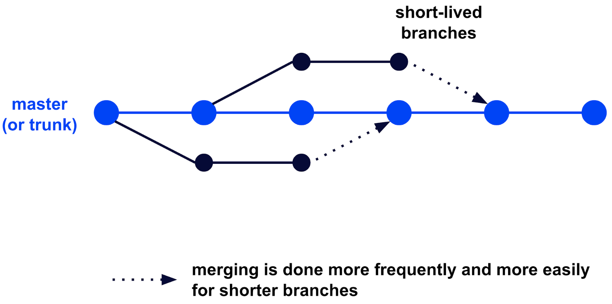
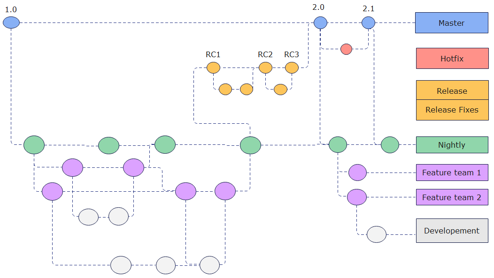

## Referencias

- [Ship / Show / Ask, A modern branching strategy](https://martinfowler.com/articles/ship-show-ask.html)

## Introducción

Existen diversas estrategias de ramificación que definen cómo organizar el flujo de
trabajo en un repositorio Git. Cada una de ellas responde a necesidades distintas en
función del tamaño del equipo, la frecuencia de los despliegues y el nivel de
complejidad del proyecto. A continuación se presentan tres de las estrategias más
extendidas.

### _Trunk-Based Development_

<figure markdown="span">
  
  <figcaption>Esquema de desarrollo Trunk-Based. <a href="https://statusneo.com/wp-content/uploads/2022/12/Beginners%20Guide%20to%20Trunk-Based%20Development.png">Fuente</a></figcaption>
</figure>

En esta estrategia, los desarrolladores fusionan frecuentemente pequeñas actualizaciones
en una única rama principal. Las principales ventajas de esta estrategia son:

- **Facilita la Integración Continua (CI) y el Despliegue Continuo (CD)**: Esta
  metodología es ideal para entornos donde se practican CI/CD, permitiendo despliegues
  rápidos y frecuentes gracias a la fusión de cambios pequeños y frecuentes.
- **Fomenta la iteración rápida y la colaboración**: Los desarrolladores pueden trabajar
  en paralelo y fusionar sus cambios rápidamente, lo que acelera el ciclo de desarrollo.

Sin embargo, presenta las siguientes desventajas:

- **Gestión en equipos grandes**: Puede ser difícil de gestionar en equipos grandes sin
  una estricta disciplina y coordinación.
- **Rastreo de cambios individuales**: Es menos capaz de rastrear cambios individuales
  en comparación con Git Flow, lo que puede dificultar la identificación de problemas
  específicos.

### Git Flow

<figure markdown="span">
  
  <figcaption>Esquema de desarrollo Git Flow. <a href="https://images.edrawmax.com/what-is/gitflow-diagram/2-git-flow-model.png">Fuente</a></figcaption>
</figure>

Esta estrategia utiliza múltiples ramas para diferentes propósitos (por ejemplo, ramas
de características, ramas de lanzamiento, ramas de corrección). Las principales ventajas
de esta estrategia son:

- **Organización y estructura**: Git Flow es altamente organizado y estructurado, lo que
  facilita la gestión de proyectos complejos.
- **Seguimiento detallado de cambios**: Permite un seguimiento detallado de los cambios
  individuales, lo que es útil para auditorías y revisiones de código.
- **Adecuado para ciclos de lanzamiento largos**: Es ideal para proyectos con ciclos de
  lanzamiento más largos, donde se requiere una planificación y gestión detallada.

Sin embargo, presenta las siguientes desventajas:

- **Complejidad**: La gestión de múltiples ramas puede ser más compleja y requerir más
  esfuerzo y coordinación.
- **Ralentización del desarrollo**: Si no se gestiona correctamente, puede ralentizar el
  proceso de desarrollo debido a la necesidad de mantener y fusionar múltiples ramas.

### _Ship / Show / Ask_

Uno de los problemas recurrentes en el desarrollo de software moderno reside en el
crecimiento progresivo de código, el aumento de su complejidad y la consiguiente pérdida
de visibilidad por parte del resto de los miembros del equipo. Esta situación provoca
que la incorporación de nuevas funcionalidades en las ramas de producción se vea
limitada o, en muchos casos, que la responsabilidad del control de calidad recaiga casi
exclusivamente en las herramientas de integración y despliegue continuo (CI/CD),
reduciendo la interacción humana en el proceso de revisión.

En este contexto surge la estrategia **_Ship / Show / Ask_**, una propuesta que redefine
la forma de trabajar con ramas y solicitudes de integración en Git. Este enfoque,
propuesto por Rouan Wilsenach, se articula en tres modalidades diferenciadas que buscan
equilibrar velocidad, calidad y comunicación dentro del equipo.

El enfoque **_Ship_** se basa en la realización de cambios pequeños, acotados y de bajo
riesgo que pueden integrarse directamente en la rama principal sin necesidad de abrir
una _Pull Request_ ni solicitar la revisión explícita de otros miembros del equipo.
Resulta especialmente adecuado cuando se añade una funcionalidad siguiendo un patrón
existente, se corrige un error menor y poco relevante, se actualiza documentación o se
mejora el código a partir de comentarios previos.

La modalidad **_Show_** introduce un punto intermedio entre la integración directa y la
revisión formal. En este caso, se crea una _Pull Request_ desde una rama distinta de la
principal, pero dicha solicitud no requiere aprobación obligatoria para ser integrada.
El cambio pasa por los mecanismos habituales de CI/CD y se incorpora rápidamente a la
base de código, pero al mismo tiempo se genera un espacio explícito para la revisión, el
aprendizaje y la conversación. El equipo es notificado de la existencia de la _Pull
Request_, lo que permite que otros desarrolladores revisen el enfoque adoptado, planteen
preguntas o sugieran mejoras. Este enfoque es especialmente útil cuando se busca
retroalimentación sobre cómo mejorar una solución, cuando se introduce un nuevo patrón,
se realiza una refactorización relevante o se corrige un error interesante desde el
punto de vista técnico. De este modo, se favorece el aprendizaje colectivo sin frenar el
flujo de entrega.

Por último, el enfoque **_Ask_** representa el modelo más tradicional y deliberativo.
Consiste en abrir una _Pull Request_ que sí requiere la aprobación explícita de uno o
varios miembros del equipo antes de ser integrada. Este modelo se reserva para
situaciones de mayor incertidumbre o riesgo, como propuestas experimentales, nuevos
enfoques arquitectónicos o soluciones que aún no están completamente maduras. En estos
casos, el objetivo principal es fomentar la discusión abierta, validar decisiones
técnicas y construir consenso. Resulta adecuado cuando se plantean dudas sobre la
viabilidad de una solución, se exploran alternativas, se solicita ayuda para mejorar una
implementación o simplemente se deja el trabajo pendiente de revisión para una
integración posterior.

Independientemente de la modalidad elegida, una de las reglas fundamentales que subyacen
a esta estrategia es que las ramas no deben tener una vida prolongada y deben mantenerse
alineadas con la rama principal mediante _rebases_ frecuentes. Las ramas que divergen
durante demasiado tiempo incrementan el riesgo de conflictos al integrarse, dificultan
la comprensión del estado real del proyecto y suelen generar frustración innecesaria en
el equipo.

El propio autor destaca que, cuando se entregan funcionalidades siguiendo patrones
consolidados y existe un alto nivel de confianza y estándares de calidad compartidos, el
equipo tenderá a utilizar más el enfoque **Ship**. En cambio, cuando los miembros aún se
están conociendo, el dominio del problema es nuevo o se están explorando soluciones
desconocidas, surge una mayor necesidad de comunicación, lo que incrementa el uso de
**Show** y **Ask**. Esto pone de manifiesto que la comunicación efectiva y el trabajo
colaborativo son pilares fundamentales de la ingeniería de software.
