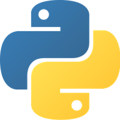

## Referencias

- [Python Docs](https://docs.python.org/3/)
- [Python Bootcamps Udemy](https://www.udemy.com/course/complete-python-bootcamp/)

## Introducción

<figure markdown="span">
  { width="250" }
  <figcaption>Logo de Python</figcaption>
</figure>

**Python** es un lenguaje de programación de alto nivel, interpretado y de propósito
general, desarrollado por Guido van Rossum. Su principal ventaja reside en la rápida
adopción que ha experimentado en el sector tecnológico, impulsada en gran medida por el
auge de la inteligencia artificial.

Python cuenta con una amplia comunidad de desarrolladores y un ecosistema robusto de
bibliotecas y _frameworks_ que permiten abordar una gran diversidad de proyectos,
incluyendo aplicaciones web, análisis de datos, automatización de tareas y aprendizaje
automático.

### Creación y configuración del entorno

Antes de comenzar a programar en Python, es necesario disponer de un entorno de
desarrollo correctamente configurado. Si se ha seguido el orden propuesto en esta wiki,
en secciones anteriores se ha abordado el tema de los entornos virtuales de Python y el
ecosistema de herramientas disponible para su gestión. En este documento se utiliza `uv`
como gestor de entornos, por lo que no es necesario instalar nada adicional para empezar
a trabajar con Python.

Independientemente del sistema operativo, resulta imprescindible crear un entorno
virtual que permita aislar la versión de Python y los paquetes específicos de cada
proyecto. Esta práctica evita conflictos entre dependencias y garantiza la
reproducibilidad del entorno de desarrollo.

Para obtener instrucciones detalladas sobre la configuración de entornos virtuales y la
gestión de paquetes en Python, se puede consultar la sección de entornos de esta misma
wiki, dentro del [apartado de programación en Python](section_1_environments.md).

### Jupyter Notebooks

Existen dos formas principales de trabajar en Python. La primera es mediante ficheros
con extensión **.py**, que funcionan como archivos de texto plano y permiten al entorno
de desarrollo (por ejemplo, Visual Studio Code) ofrecer funcionalidades como
autocompletado y corrección de sintaxis. Esta es la forma de programar más recomendable
para proyectos de producción.

Sin embargo, para explorar el lenguaje y para proyectos de ciencia de datos, se tiende a
utilizar **Jupyter Notebooks**, una herramienta interactiva que integra código, texto y
visualizaciones en un único documento. Entre sus principales ventajas destacan:

- **Interactividad**: Permite ejecutar bloques de código de manera independiente, lo que
  facilita la prueba de ideas y la depuración paso a paso.
- **Documentación integrada**: Soporta texto en formato Markdown, permitiendo incluir
  explicaciones y notas directamente junto al código.
- **Visualización**: Facilita la incorporación de gráficos y visualizaciones, mostrando
  los resultados de manera inmediata dentro del mismo documento.

La elección entre una u otra herramienta depende sobre todo de la facilidad para
organizar los proyectos y del enfoque de exploración y desarrollo que se adopte. También
influye la forma de trabajo del equipo. En cualquier caso, conviene explorar ambas
opciones sin descartar ninguna, ya que cada una tiene su momento y su utilidad.

## Tipos de datos y operaciones

Para dominar Python, es fundamental comprender primero los pilares que sostienen
cualquier programa: cómo se almacena la información, cómo se manipula y cómo se controla
el flujo de las instrucciones. En las siguientes secciones se exploran los elementos
esenciales del lenguaje, desde los tipos de datos básicos y las operaciones matemáticas
hasta las estructuras de control que permiten dotar de lógica al código.

### Tipos de datos

Python ofrece varios tipos de datos fundamentales que permiten definir, almacenar y
manipular información. La siguiente tabla resume los principales tipos de datos y sus
características:

| Tipo de datos                               | Palabra reservada | Ejemplos                         |
| ------------------------------------------- | ----------------- | -------------------------------- |
| **Números enteros**                         | `int`             | `3`                              |
| **Números flotantes**                       | `float`           | `2.3`                            |
| **Cadenas de texto**                        | `str`             | `"Hola"`                         |
| **Listas** (colección ordenada y mutable)   | `list`            | `[10, "hello", 200.3]`           |
| **Diccionarios** (pares clave-valor)        | `dict`            | `{"edad": 20, "nombre": "Dani"}` |
| **Tuplas** (secuencia ordenada e inmutable) | `tuple`           | `(10, "hello", 200.3)`           |
| **Sets** (colección única y desordenada)    | `set`             | `{"a", "b"}`                     |
| **Booleanos** (valores lógicos)             | `bool`            | `True`, `False`                  |

Las palabras reservadas (también conocidas como _keywords_) son términos que Python
utiliza internamente y que no pueden ser empleados como nombres de variables o
funciones. Son la forma que tiene el lenguaje de interpretar cada tipo de dato como tal.

**Python es un lenguaje de tipificación dinámica**, por lo que no es necesario declarar
explícitamente el tipo de dato, ya que este se asigna automáticamente según el valor.
Sin embargo, cada vez es más común (y constituye una buena práctica) utilizar lo que se
conoce como _typing_ para anotar los tipos. Por ejemplo:

```py linenums="1"
# Sin typing
valor_entero = 12

# Con typing
valor_entero: int = 12
lista_valores: list[int] = [1, 2, 3]
diccionario_valores: dict[str, list[int]] = {"esto_es_un_string": [1, 2, 3]}
```

Para conocer el tipo de una variable, se utiliza la función `type(variable)`.

### Operaciones aritméticas

Python permite realizar una amplia variedad de operaciones sobre datos numéricos y otros
tipos. Las principales operaciones matemáticas y funciones disponibles son:

| Operador/Función        | Descripción                                                            |
| ----------------------- | ---------------------------------------------------------------------- |
| `+`, `-`, `*`, `/`, `%` | Suma, resta, multiplicación, división y módulo (resto de la división). |
| `-x`                    | Cambia el signo de un número.                                          |
| `abs(x)`                | Devuelve el valor absoluto de $x$.                                     |
| `pow(x, y)` o `x**y`    | Potencia de $x$ elevado a $y$, es decir, $x^y$.                        |
| `max(x, y)`             | Devuelve el valor máximo entre $x$ e $y$.                              |
| `min(x, y)`             | Devuelve el valor mínimo entre $x$ e $y$.                              |
| `round(x, n)`           | Redondea $x$ a $n$ decimales.                                          |
| `hex(x)`                | Convierte $x$ a hexadecimal.                                           |
| `bin(x)`                | Convierte $x$ a binario.                                               |

Es posible extender la funcionalidad utilizando librerías, que pueden ser estándar
(incluidas con la propia instalación de Python) o paquetes de terceros como NumPy,
Pandas o similares. Por ejemplo, la librería estándar `math` amplía las operaciones
disponibles:

| Operador/Función | Descripción                                                                        |
| ---------------- | ---------------------------------------------------------------------------------- |
| `math.floor(x)`  | Redondea $x$ hacia abajo, es decir, $\lfloor x \rfloor$. Requiere importar `math`. |
| `math.ceil(x)`   | Redondea $x$ hacia arriba, es decir, $\lceil x \rceil$. Requiere importar `math`.  |
| `math.sqrt(x)`   | Devuelve la raíz cuadrada de $x$, es decir, $\sqrt{x}$. Requiere importar `math`.  |
| `math.pi`        | Devuelve el valor de la constante $\pi$. Requiere importar `math`.                 |

Para utilizar estas funciones, basta con importar la librería:

```py linenums="1"
import math

math.floor(3.1415)
```

Cuando se trabaja con valores monetarios o cálculos que requieren precisión decimal
exacta, es recomendable utilizar el módulo `Decimal` en lugar de `float`, ya que este
último puede introducir errores de redondeo inherentes a la representación en punto
flotante:

```python linenums="1"
from decimal import Decimal

RATES: dict[tuple[str, str], Decimal] = {
    ("USD", "EUR"): Decimal("0.91")
}
```

### Operadores de comparación y lógicos

Existen diferentes tipos de operadores en Python. Los **operadores de comparación**
permiten evaluar relaciones entre dos valores, devolviendo un resultado booleano (`True`
o `False`):

| Expresión | Descripción               |
| --------- | ------------------------- |
| `A == B`  | A es igual a B.           |
| `A != B`  | A es distinto de B.       |
| `A < B`   | A es menor que B.         |
| `A <= B`  | A es menor o igual que B. |
| `A > B`   | A es mayor que B.         |
| `A >= B`  | A es mayor o igual que B. |

Por otro lado, los **operadores lógicos** permiten combinar varias condiciones y
controlar el flujo de ejecución en función de los resultados:

| Operador | Descripción                                                  |
| -------- | ------------------------------------------------------------ |
| `and`    | Devuelve `True` si **todas** las condiciones son verdaderas. |
| `or`     | Devuelve `True` si **al menos una** condición es verdadera.  |
| `not`    | Invierte el valor lógico de la condición.                    |

Los operadores lógicos se utilizan principalmente en estructuras de control, como
condicionales y bucles, para determinar el flujo del programa en función de condiciones
lógicas.

### Variables

Al crear variables en Python, se deben seguir ciertas reglas:

- Los nombres no deben comenzar con números.
- No se permiten espacios en los nombres.
- No se deben utilizar los siguientes símbolos:
  `: ' " < > / , ? | \ ( ) ! @ # $ % ^ & * ~ - +`.
- Se recomienda utilizar nombres de variables en minúsculas.

## Entrada y salida de datos

### Salida por pantalla

Para mostrar datos en pantalla se utiliza la función `print()`:

```py linenums="1"
print("Esto es una prueba")
```

Es posible concatenar variables que contienen cadenas de texto o métodos que devuelvan
un valor utilizando el operador `+`:

```py linenums="1"
char_name: str = "Daniel"
char_age: int = 19

print("Yo me llamo " + char_name + " y tengo " + str(char_age) + " años.")
```

Este método puede resultar ineficiente. A partir de Python 3, es posible dar formato a
la función `print()` utilizando cadenas de formato con `f`, que permiten incluir
variables o expresiones dentro de llaves `{}`:

```py linenums="1"
char_name: str = "Daniel"
char_age: int = 19

print(f"Yo me llamo {char_name} y tengo {char_age} años")
```

Incluso es posible modificar la cantidad específica de decimales para un valor de tipo
`float` utilizando el formato `{valor_float:.precisiónf}`. Por ejemplo, para mostrar el
número $\pi$ con 5 decimales:

```py linenums="1"
import math

pi: float = math.pi
print(f"El número pi con 5 decimales es: {pi:.5f}")
```

### Entrada del usuario

Python permite recibir información del usuario mediante la función `input(...)`. Esta
función siempre devuelve el valor ingresado como una cadena de texto (`string`), por lo
que es necesario realizar una conversión de tipo (_casting_) si se requiere un tipo de
dato diferente:

```py linenums="1"
nombre: str = input("Introduce tu nombre: ")
edad: str = input("Introduce tu edad: ")

print("\n\t- DATOS DEL USUARIO - \n")
print(f"Nombre: {nombre}")
print(f"Edad: {edad}")
```

Para convertir un `input` a un número, es necesario hacer un _casting_, como en el
siguiente ejemplo, donde se convierte una entrada de tipo `string` a `float`:

```py linenums="1"
numero: float = float(input("Introduce un numero: "))
```

## Cadenas de texto

Una cadena de texto, o _string_, es una secuencia de caracteres que puede contener
letras, números, símbolos o espacios. A continuación se muestra un ejemplo básico de
_string_ junto con el uso del indexado:

```py linenums="1"
frase: str = "Hola buenas"

# Muestra el carácter 'H'
print(f"El primer carácter de mi string es {frase[0]}")

# Muestra el carácter 'b'
print(f"El sexto carácter de mi string es {frase[5]}")
```

En este caso, el índice de un _string_ comienza en `0`, por lo que `frase[0]` hace
referencia al primer carácter (`"H"`) y `frase[5]` al sexto carácter (`"b"`). El espacio
en blanco también cuenta como un carácter.

Python permite acceder a cualquier carácter de un _string_ utilizando su posición o
**índice**. El primer carácter tiene el índice `0`, el segundo el índice `1`, y así
sucesivamente. También se pueden usar índices negativos para contar desde el final del
_string_ hacia el principio. Por ejemplo, `frase[-1]` devuelve el último carácter `'s'`.

Los _strings_ son **inmutables**, lo que significa que no es posible cambiar un carácter
específico en un _string_ ya creado. Intentar modificar directamente un elemento produce
un error:

```py linenums="1"
frase: str = "Hola buenas"

# Intentar cambiar el primer carácter
frase[0] = "h"  # Esto producirá un error
```

Este código genera un error de tipo `TypeError`. Para modificar un _string_, es
necesario crear uno nuevo combinando partes del original:

```py linenums="1"
frase: str = "Hola buenas"

# Crear un nuevo string con la primera letra modificada
nueva_frase: str = "h" + frase[1:]

# Imprime: "hola buenas"
print(nueva_frase)
```

### Métodos de cadenas de texto

Las variables de tipo _string_ en Python disponen de varias funciones incorporadas para
manipular y analizar el contenido de la cadena:

| Función                                            | Definición                                                                                                     |
| -------------------------------------------------- | -------------------------------------------------------------------------------------------------------------- |
| `str(variable_a_convertir_en_string)`              | Convierte una variable en una cadena de texto.                                                                 |
| `variable *= x`                                    | Duplica la cadena `variable` `x` veces, siendo `x` un número entero.                                           |
| `variable[índice:]`                                | Obtiene una subcadena desde el índice hasta el final de la cadena.                                             |
| `variable[::X]`                                    | Obtiene caracteres de la cadena con un paso de `X`, es decir, toma un carácter cada `X` caracteres.            |
| `variable[::-1]`                                   | Invierte la cadena.                                                                                            |
| `variable.lower()`                                 | Convierte toda la cadena a minúsculas.                                                                         |
| `variable.upper()`                                 | Convierte toda la cadena a mayúsculas.                                                                         |
| `variable.isupper()`                               | Devuelve `True` si toda la cadena está en mayúsculas, `False` en caso contrario.                               |
| `variable.upper().isupper()`                       | Convierte la cadena a mayúsculas y devuelve `True` si toda la cadena está en mayúsculas.                       |
| `variable.split()`                                 | Divide la cadena en una lista de subcadenas basadas en espacios. Puede especificarse un delimitador diferente. |
| `len(variable)`                                    | Devuelve el número de caracteres en la cadena.                                                                 |
| `variable.index("a")` o `variable.index("buenas")` | Devuelve el primer índice donde se encuentra el parámetro especificado.                                        |
| `variable.replace("buenas", "me llamo Daniel")`    | Reemplaza una subcadena dentro de la cadena por otra subcadena.                                                |
| `variable.count('x')`                              | Cuenta el número de veces que aparece el carácter especificado.                                                |
| `variable.find('x')`                               | Devuelve la primera posición en la que se encuentra el carácter especificado.                                  |
| `variable.isalnum()`                               | Devuelve `True` si todos los caracteres son alfanuméricos.                                                     |
| `variable.isalpha()`                               | Devuelve `True` si todos los caracteres son alfabéticos.                                                       |
| `variable.islower()`                               | Devuelve `True` si todos los caracteres están en minúsculas.                                                   |
| `variable.isspace()`                               | Devuelve `True` si todos los caracteres son espacios en blanco.                                                |
| `variable.istitle()`                               | Devuelve `True` si la primera letra de cada palabra está en mayúsculas.                                        |
| `variable.split('x')`                              | Divide la cadena en partes cuando encuentra el carácter `x`.                                                   |
| `variable.partition('x')`                          | Divide la cadena en dos partes en el primer encuentro del carácter `x`.                                        |
| `variable.strip()`                                 | Elimina los espacios al principio y al final de la cadena.                                                     |

## Estructuras de control

### Condicionales

Las declaraciones condicionales en Python (`if`, `elif` y `else`) permiten ejecutar
diferentes bloques de código según se cumplan o no ciertas condiciones. Esto resulta
fundamental para controlar el flujo de un programa y tomar decisiones en función de los
datos evaluados.

El condicional básico es la instrucción `if`, que ejecuta un bloque de código solo si la
condición se cumple:

```py linenums="1"
if condicion:
    # Código a ejecutar si la condición es verdadera
```

Si la condición no se cumple, se puede usar una instrucción `else` para ejecutar un
bloque alternativo:

```py linenums="1"
if condicion:
    # Código a ejecutar si la condición es verdadera
else:
    # Código a ejecutar si la condición es falsa
```

Para manejar múltiples condiciones, se utiliza la instrucción `elif`, que permite
evaluar varias condiciones de forma secuencial. Esto significa que, si la primera
condición se cumple, el resto de condiciones no se evalúan y se descartan directamente.
En el caso de que la primera condición no se cumpla, se evalúa la siguiente:

```py linenums="1"
if primera_condicion:
    # Código a ejecutar si la primera condición es verdadera
elif segunda_condicion:
    # Código a ejecutar si la segunda condición es verdadera
else:
    # Código a ejecutar si ninguna de las condiciones anteriores es verdadera
```

???+ example "Ejemplo"

    En este ejemplo se utiliza un condicional `if` para verificar si una letra está
    presente en una palabra:

    ```py linenums="1"
    letra: str = 'y'
    palabra: str = "Laguna"

    if letra in palabra:
        print(f"La palabra {palabra} contiene la letra {letra}")
    else:
        print(f"La palabra {palabra} no contiene la letra {letra}")
    ```

    Si `letra` se encuentra en el `string` `palabra`, el programa imprime un mensaje
    indicando que la palabra contiene la letra. En caso contrario, se ejecuta el
    bloque `else`.

### Bucle `for`

El bucle `for` es ideal para iterar sobre secuencias como listas o _strings_. Su
sintaxis básica es:

```py linenums="1"
for variable in iterable:
    # Código a ejecutar para cada elemento en el iterable
```

???+ example "Recorrer un rango de números"

    La función `range(n, m, s)` genera una secuencia de números desde `n` hasta
    `m - 1`, con un paso de `s`. Por ejemplo, para mostrar números desde 0 hasta 10
    en pasos de 2:

    ```py linenums="1"
    for numero in range(0, 11, 2):
        print(numero)
    ```

???+ example "Recorrer los caracteres de un _string_"

    Se puede utilizar `range()` y `len()` para iterar sobre los índices de un *string*:

    ```py linenums="1"
    mi_string: str = "Hola caracola"
    for letra in range(len(mi_string)):
        print(mi_string[letra])
    ```

    Alternativamente, se puede iterar directamente sobre los caracteres del *string*:

    ```py linenums="1"
    mi_string: str = "Hola caracola"
    for letra in mi_string:
        print(letra)
    ```

???+ example "Recorrer dos secuencias simultáneamente con `zip()`"

    `zip()` permite recorrer dos secuencias al mismo tiempo, emparejando sus elementos:

    ```py linenums="1"
    cadena1: str = "Hola"
    cadena2: str = "Yadi"

    for item in zip(cadena1, cadena2):
        print(item)
    ```

    En este ejemplo, solo se recorren los caracteres hasta el final del *string* más corto.

???+ example "Uso de `enumerate()` para obtener índices y valores"

    `enumerate()` permite obtener el índice y el valor de cada elemento en una secuencia:

    ```py linenums="1"
    palabra: str = "abcde"

    for idx, letra in enumerate(palabra):
        print(f"Índice {idx}: {letra}")
    ```

### Bucle `while`

El bucle `while` continúa ejecutándose mientras una condición se mantenga verdadera. Su
sintaxis básica es:

```py linenums="1"
while condicion:
    # Código a ejecutar mientras la condición sea verdadera
```

???+ example "Crear un contador"

    Un bucle `while` puede usarse para incrementar un contador hasta que alcance un
    valor determinado:

    ```py linenums="1"
    contador: int = 0
    while contador < 5:
        print(contador)
        contador += 1
    ```

### Control de flujo: `break`, `continue` y `pass`

La instrucción `break` termina el bucle inmediatamente, incluso si no ha terminado de
recorrer todos los elementos:

```py linenums="1"
mi_string: str = "Daniel"

for letra in mi_string:
    if letra == 'a':
        break
    print(letra)
```

En este ejemplo, el bucle se detiene al encontrar la letra `'a'` y no continúa con el
resto de las iteraciones.

Por otra parte, `continue` omite el resto del código en la iteración actual y pasa a la
siguiente:

```py linenums="1"
mi_string: str = "Daniel"

for letra in mi_string:
    if letra == 'a':
        continue
    print(letra)
```

Cuando el bucle encuentra la letra `'a'`, omite el `print()` y continúa con la siguiente
letra.

Finalmente, `pass` no realiza ninguna acción, pero se utiliza como marcador de posición
cuando se necesita un bloque de código vacío:

```py linenums="1"
for letra in 'Python':
    if letra == 'h':
        pass  # No realiza ninguna acción
        print('Esta es la letra h')
    print('Letra actual:', letra)
```

## Uso de `__name__` y la función `main`

En Python, la variable especial `__name__` se utiliza para determinar si un archivo se
está ejecutando directamente como un _script_ o si está siendo importado como un módulo
en otro _script_. Comprender este comportamiento resulta útil para estructurar el código
de manera que ciertos bloques se ejecuten solo cuando el archivo se ejecuta
directamente.

Cuando un archivo de Python se ejecuta directamente, Python asigna a la variable
`__name__` el valor `"__main__"`. Sin embargo, si el archivo es importado como un módulo
en otro _script_, `__name__` toma el nombre del archivo (sin la extensión `.py`).

???+ example "Ejemplo"

    Por ejemplo, consideremos dos archivos Python, `one79.py` y `two79.py`, que se importan
    mutuamente:

    **Archivo `one79.py`**

    ```py linenums="1"
    # one79.py
    import two79

    print(f"Archivo 1 __name__ establecido a: {__name__}")

    if __name__ == "__main__":
        print("Archivo 1 ejecutado directamente")
    else:
        print("Archivo 1 ejecutado como importado a otro módulo")
    ```

    **Archivo `two79.py`**

    ```py linenums="1"
    # two79.py
    import one79 as t

    print(f"Archivo 2 __name__ establecido a: {__name__}")

    if __name__ == "__main__":
        print("Archivo 2 ejecutado directamente")
    else:
        print("Archivo 2 ejecutado como importado a otro módulo")
    ```

    Si se ejecuta el archivo `one79.py`, el resultado será:

    ```
    Archivo 1 __name__ establecido a: __main__
    Archivo 2 __name__ establecido a: two79
    Archivo 2 ejecutado como importado a otro módulo
    ```

    En este caso, `one79.py` muestra que `__name__` es `"__main__"` porque se está
    ejecutando directamente, mientras que `two79.py`, al ser importado dentro de `one79.py`,
    muestra que `__name__` es `"two79"`.

    Es una buena práctica definir una función `main()` que contenga el código principal a
    ejecutar. Esto hace que el código sea más organizado y facilita la reutilización:

    ```py linenums="1"
    # one79.py
    import two79

    def main() -> None:
        print("Código principal de one79.py")

    if __name__ == "__main__":
        main()
    ```

    En este ejemplo, el código dentro de la función `main()` solo se ejecuta si `one79.py`
    es ejecutado directamente. Si es importado, solo se ejecuta el código fuera de la
    función `main()`, que podría ser útil para la inicialización de módulos o importaciones.

## Estructuras de datos

En Python, las estructuras de datos son fundamentales para almacenar y manipular datos
de manera eficiente. A continuación se exploran las estructuras de datos más comunes del
lenguaje.

### Listas

Las listas en Python son estructuras de datos que permiten almacenar secuencias
ordenadas y mutables de elementos. A diferencia de otros lenguajes, las listas en Python
pueden contener elementos de diferentes tipos. Su tamaño es dinámico, lo que significa
que puede cambiar durante la ejecución del programa. La indexación comienza en `0`, y
los índices negativos permiten acceder a los elementos desde el final de la lista.

Para definir una lista, basta con usar corchetes y separar los elementos por comas:

```py linenums="1"
lista_amigos: list[str] = ["Jorge", "Fran", "Ricardo"]
```

También es posible inicializar una lista vacía:

```py linenums="1"
lista: list[str] = []
```

El acceso a los elementos se realiza mediante el índice:

```py linenums="1"
lista_amigos: list[str] = ["Jorge", "Fran", "Ricardo"]

# Accede al primer elemento
print(f"El primer amigo es {lista_amigos[0]}")

# Accede al último elemento
print(f"Mi amigo del pueblo es {lista_amigos[-1]}")

# Selecciona un rango de elementos
print(lista_amigos[0:2])

# Muestra la lista completa
print(lista_amigos)
```

#### Métodos de listas

| Función                  | Definición                                                                      |
| ------------------------ | ------------------------------------------------------------------------------- |
| `lista[indice] = x`      | Cambia el elemento en el índice especificado por `x`.                           |
| `lista.extend(x)`        | Agrega los elementos de `x` al final de la lista actual.                        |
| `lista.append(x)`        | Añade un elemento `x` al final de la lista.                                     |
| `lista.insert(indice,x)` | Inserta `x` en el índice especificado.                                          |
| `lista.remove(x)`        | Elimina la primera aparición de `x` en la lista.                                |
| `lista.clear()`          | Vacía la lista.                                                                 |
| `lista.pop()`            | Elimina el último elemento de la lista o el elemento en el índice especificado. |
| `lista.index(x)`         | Devuelve el índice de la primera aparición de `x`.                              |
| `lista.count(x)`         | Devuelve el número de veces que `x` aparece en la lista.                        |
| `lista.sort()`           | Ordena la lista en orden ascendente.                                            |
| `lista.reverse()`        | Invierte el orden de los elementos en la lista.                                 |
| `lista2 = lista1.copy()` | Crea una copia de `lista1` en `lista2`.                                         |
| `max(lista)`             | Devuelve el valor máximo de la lista.                                           |
| `min(lista)`             | Devuelve el valor mínimo de la lista.                                           |
| `del lista[x]`           | Elimina el elemento en el índice `x` de la lista.                               |

#### Comprensión de listas

Los bucles `for` permiten iterar sobre los elementos de una lista de manera sencilla.
Además, Python permite utilizar **comprensión de listas** para crear nuevas listas
basadas en operaciones sobre una secuencia de elementos. Esta técnica ofrece una
sintaxis concisa y expresiva:

```py linenums="1"
# Crear una lista de caracteres de un string
mi_lista: list[str] = [letra for letra in "Hola"]
print(mi_lista)

# Crear una lista de cuadrados de números
mi_lista: list[int] = [numero ** 2 for numero in range(0, 20, 2)]
print(mi_lista)

# Convertir temperaturas de Celsius a Fahrenheit
celcius: list[float] = [0, 10, 20, 34.5]
fahrenheit: list[float] = [((9/5) * temp + 32) for temp in celcius]
print(fahrenheit)

# Crear una lista de números cuadrados solo si son pares
mi_lista: list[int] = [numero ** 2 for numero in range(0, 15) if numero % 2 == 0]
print(mi_lista)
```

#### Listas anidadas y matrices

Las listas en Python pueden contener otras listas, lo que permite la representación de
matrices o tablas de datos. Este tipo de estructura resulta útil para manejar
información en varias dimensiones (como una imagen, que en realidad es una composición
de 3 matrices, una por cada canal de color RGB):

```py linenums="1"
number_grid: list[list[int]] = [
    [1, 2, 3],
    [4, 5, 6],
    [7, 8, 9],
]

# Acceder al elemento en la tercera fila y tercera columna
print(number_grid[2][2])
```

En este caso, `number_grid[2][2]` devuelve el valor `9`, que es el elemento ubicado en
la tercera fila y tercera columna.

### Tuplas

Las **tuplas** en Python son secuencias ordenadas e **inmutables**, lo que significa
que, a diferencia de las listas, sus elementos no pueden ser modificados después de su
creación. Las tuplas resultan útiles cuando se necesita garantizar que los datos no
cambien a lo largo del programa. Además, son más rápidas de procesar que las listas.

Para definir una tupla se utilizan paréntesis:

```py linenums="1"
coordenadas: tuple[int, int] = (4, 5)

print(f"Coordenada completa {coordenadas}")
print(f"Primera coordenada {coordenadas[0]} y segunda coordenada {coordenadas[1]}")
```

También es posible combinar tuplas con otras estructuras de datos, como listas de
tuplas:

```py linenums="1"
lista_tuplas: list[tuple[int, int]] = [(1, 2), (3, 4), (5, 6)]
print(f"Mi lista de tuplas es {lista_tuplas}")
```

#### Métodos de tuplas

A pesar de ser inmutables, las tuplas disponen de algunos métodos útiles:

| Función          | Descripción                                                    |
| ---------------- | -------------------------------------------------------------- |
| `tupla.count(x)` | Devuelve el número de veces que `x` aparece en la tupla.       |
| `tupla.index(x)` | Devuelve el índice de la primera aparición de `x` en la tupla. |

### Sets

Los _sets_ en Python son colecciones **desordenadas** de elementos únicos. A diferencia
de las listas y tuplas, los _sets_ no permiten duplicados, lo que los convierte en una
herramienta útil para eliminar valores repetidos o para realizar operaciones matemáticas
como uniones e intersecciones.

Un _set_ se puede definir usando llaves `{}` o con la función `set()`:

```py linenums="1"
# Inicializar un set vacío
mi_set: set[int] = set()

# Añadir elementos
mi_set.add(1)
mi_set.add(1)  # No se añadirá, ya que el elemento es único

# Inicializar un set con elementos
mi_nuevo_set: set[str] = {'a', 'b', 'c'}
```

#### Métodos de _sets_

| Función                    | Definición                                                                               |
| -------------------------- | ---------------------------------------------------------------------------------------- |
| `s.add(x)`                 | Añade un elemento `x` al _set_.                                                          |
| `s.clear()`                | Elimina todos los elementos del _set_.                                                   |
| `sc = s.copy()`            | Crea una copia del _set_.                                                                |
| `s1.difference(s2)`        | Devuelve los elementos en `s1` que no están en `s2`.                                     |
| `s1.difference_update(s2)` | Elimina los elementos en `s1` que están en `s2`.                                         |
| `s.discard(elem)`          | Elimina el elemento `elem` del _set_ sin causar error si `elem` no está presente.        |
| `s1.intersection(s2)`      | Devuelve los elementos comunes a `s1` y `s2`.                                            |
| `s1.issubset(s2)`          | Verifica si todos los elementos de `s1` están en `s2`.                                   |
| `s1.union(s2)`             | Devuelve la unión de `s1` y `s2`, combinando todos los elementos únicos de ambos _sets_. |

### Diccionarios

Los **diccionarios** en Python son colecciones de datos que almacenan pares de
**clave-valor**. Las claves son únicas y se utilizan para acceder a los valores
correspondientes. Los diccionarios son mutables, por lo que se pueden modificar después
de su creación.

Un diccionario se define utilizando llaves `{}`, donde cada elemento es un par de
clave-valor:

```py linenums="1"
conversion_meses: dict[str, str] = {
    "Ene": "Enero",
    "Feb": "Febrero",
    "Mar": "Marzo"
}

# Acceso a valores
print(conversion_meses["Ene"])
print(conversion_meses.get("Ene"))

# Manejo de claves no encontradas
clave: str = "Daniel"
print(conversion_meses.get(clave, f"La clave {clave} no está en el diccionario"))
```

#### Métodos de diccionarios

| Función                | Definición                                                   |
| ---------------------- | ------------------------------------------------------------ |
| `diccionario.items()`  | Devuelve una vista de los pares clave-valor del diccionario. |
| `diccionario.keys()`   | Devuelve una vista de las claves del diccionario.            |
| `diccionario.values()` | Devuelve una vista de los valores del diccionario.           |

???+ example "Diccionarios anidados"

    Es posible crear diccionarios dentro de otros diccionarios para representar estructuras
    más complejas:

    ```py linenums="1"
    diccionario: dict[str, dict[str, int]] = {"k3": {'insideKey': 100}}

    # Acceder al valor de 'insideKey'
    print(diccionario["k3"]['insideKey'])
    ```

???+ example "Iteración sobre diccionarios"

    Se puede iterar sobre claves, valores o pares clave-valor en un diccionario:

    ```py linenums="1"
    d: dict[str, int] = {'k1': 1, 'k2': 2}

    for llave in d.keys():
        print(llave)

    for valor in d.values():
        print(valor)

    for elemento in d.items():
        print(elemento)
    ```

???+ example "Listas de diccionarios"

    Es posible combinar listas y diccionarios para crear estructuras más elaboradas, como
    una lista de clientes y sus animales:

    ```py linenums="1"
    # En este caso el tipado puede ser variado, varía para cada key, en algunos
    # casos es solo el nombre, en otro es una lista de nombres
    clientes: list[dict[str, str | list[str]]] = [
        {"nombre": "<nombre>", "animales": ["Pakito", "Pakon", "Pakonazo"]},
        {"nombre": "<nombre>", "animales": ["Rodolfo"]},
        {"nombre": "<nombre>"}
    ]

    for cliente in clientes:
        print(f"{cliente['nombre']} tiene: {cliente.get('animales', 'No tiene animales')}")
    ```

## Funciones

En Python, las funciones son herramientas esenciales para la programación modular y la
reutilización del código. Comprender la diferencia entre métodos y funciones y dominar
su uso permite escribir programas más organizados, legibles y fáciles de mantener.

### Métodos

Los métodos son funciones que están asociadas a un objeto específico, como una instancia
de una clase. Actúan sobre el objeto y pueden modificar su estado o realizar alguna
operación sobre él. Cada tipo de objeto dispone de un conjunto específico de métodos.
Por ejemplo, los métodos para objetos de tipo `str` permiten realizar operaciones como
convertir a mayúsculas, dividir la cadena en palabras o reemplazar subcadenas.

```py linenums="1"
texto: str = "hola mundo"

# Convertir a mayúsculas
print(texto.upper())  # Output: "HOLA MUNDO"

# Dividir en palabras
print(texto.split())  # Output: ['hola', 'mundo']

# Reemplazar una subcadena
print(texto.replace("mundo", "Python"))  # Output: "hola Python"
```

???+ note "Obtener una lista de métodos disponibles"

    Para obtener una lista de todos los métodos disponibles para un tipo de objeto, se
    puede usar la función `dir()`:

    ```py linenums="1"
    # Muestra todos los métodos disponibles para objetos de tipo str
    print(dir(str))
    ```

???+ note "Obtener ayuda sobre un método específico"

    Es posible obtener información detallada sobre un método específico utilizando la
    función `help()`:

    ```py linenums="1"
    # Muestra la documentación para el método upper()
    help(str.upper)
    ```

### Definición de funciones

Las funciones son bloques de código reutilizables que realizan una tarea específica y
pueden ser invocadas desde cualquier lugar del programa. A diferencia de los métodos,
las funciones no están vinculadas a ningún tipo de objeto en particular.

Para definir una función se utiliza la palabra clave `def`, seguida del nombre de la
función y paréntesis con los posibles parámetros:

```py linenums="1"
def saludo(nombre: str) -> str:
    return f"Hola, {nombre}!"

print(saludo("Mundo"))
```

Las funciones pueden tomar cualquier número de parámetros, y estos pueden tener valores
predeterminados. Si un parámetro tiene un valor predeterminado, es posible omitirlo al
llamar a la función:

```py linenums="1"
def saludo(nombre: str = "Mundo") -> str:
    return f"Hola, {nombre}!"

print(saludo())
print(saludo("Python"))
```

En este ejemplo, `nombre` tiene un valor predeterminado de `"Mundo"`. Si se llama a
`saludo()` sin ningún argumento, se utiliza el valor predeterminado. Si se proporciona
un argumento, este reemplaza el valor predeterminado.

???+ example "Función para comprobar una lista"

    Esta función toma una lista de números como entrada y separa los números pares e
    impares en dos conjuntos diferentes:

    ```py linenums="1"
    def comprobar_lista(lista: list[int]) -> None:
        lista_par_devolver: set[int] = set()
        lista_impar_devolver: set[int] = set()

        for indice in lista:
            if indice % 2 == 0:
                lista_par_devolver.add(indice)
            else:
                lista_impar_devolver.add(indice)

        print(f"Lista de números pares de la lista principal: {lista_par_devolver}")
        print(f"Lista de números impares de la lista principal: {lista_impar_devolver}")

    comprobar_lista([1, 1, 1, 1, 1, 1, 23, 56, 87, 918, 23, 12, 3, 2, 4, 6, 5])
    ```

???+ example "Función con tuplas"

    Este ejemplo muestra una función que determina el trabajador con más horas
    trabajadas:

    ```py linenums="1"
    def mejor_trabajador(lista: list[tuple[str, int]]) -> tuple[str, int]:
        maximo: int = 0
        mejor: str = ""

        for empleado, horas in lista:
            if horas > maximo:
                maximo = horas
                mejor = empleado

        return (mejor, maximo)

    horas_trabajadores: list[tuple[str, int]] = [
        ("Daniel", 22), ("Kike", 20), ("Ricardo", 25)
    ]
    mejor, maximo = mejor_trabajador(horas_trabajadores)
    print(f"El mejor trabajador es {mejor} que ha trabajado un total de {maximo} horas")
    ```

???+ example "Funciones que llaman a otras funciones"

    En este ejemplo se muestra un juego simple donde las funciones interactúan entre sí. Se
    utiliza la función `shuffle()` del módulo `random`, que reordena una lista de manera
    aleatoria:

    ```py linenums="1"
    from random import shuffle

    # Lista de vasos donde 'O' representa la bolita
    vasos: list[str] = [' ', 'O', ' ']

    def shuffle_list(mi_lista: list[str]) -> list[str]:
        shuffle(mi_lista)
        return mi_lista

    def inicio() -> None:
        print("La bolita se encuentra en el vaso 2\n")
        print('vaso 1: ')
        print('vaso 2: O')
        print('vaso 3: ')
        print("\nMoviendo la bola por los diferentes vasos...\n")

    def operar() -> None:
        resultado: int = int(input("¿En qué vaso está la bolita?: "))

        while resultado < 1 or resultado > 3:
            print("Este vaso no existe")
            resultado = int(input("¿En qué vaso está la bolita?: "))

        comprobar(resultado)

    def comprobar(resultado: int) -> None:
        if vasos[resultado - 1] == 'O':
            print("\n¡Has acertado!\n")
        else:
            print("\nHas fallado :(\n")

        for i, vaso in enumerate(vasos, start=1):
            print(f"vaso {i}: {vaso}")

    inicio()
    shuffle_list(vasos)
    operar()
    ```

### Argumentos arbitrarios: `*args` y `**kwargs`

En Python, los términos `*args` y `**kwargs` se utilizan en la definición de funciones
para permitir que estas acepten un número arbitrario de argumentos. Esta capacidad
resulta especialmente útil cuando no se conoce de antemano cuántos valores recibirá la
función.

En el siguiente ejemplo, `a` y `b` son argumentos posicionales:

```py linenums="1"
def mifuncion(a: float, b: float) -> float:
    return sum((a, b)) * 0.05

mifuncion(40, 60)
```

Si se desea que la función pueda manejar más de dos números, una opción sería asignar un
valor predeterminado a los parámetros adicionales:

```py linenums="1"
def mifuncion(a: float, b: float, c: float = 0) -> float:
    return sum((a, b, c)) * 0.05
```

`*args` permite configurar la función para aceptar un número arbitrario de argumentos
posicionales. Python toma todos los parámetros que se pasan y los agrupa como una tupla:

```py linenums="1"
def mifuncion(*args: float) -> float:
    return sum(args) * 0.05
```

De manera similar, `**kwargs` permite manejar un número arbitrario de argumentos de
palabras clave. En lugar de crear una tupla, crea un diccionario:

```py linenums="1"
def mifuncion(**kwargs: str) -> None:
    if 'fruta' in kwargs:
        print(f"Mi fruta favorita es la {kwargs['fruta']}")
    else:
        print("No se encontró la fruta")

    if 'verduras' in kwargs:
        print(f"Mi verdura favorita es la {kwargs['verduras']}")
    else:
        print("No se encontró la verdura")

mifuncion(fruta='manzana', verduras='zanahoria')
```

También es posible combinar ambos en la misma función:

```py linenums="1"
def mifuncion(*args: int, **kwargs: str) -> None:
    print(f"Tengo {args[0]} coneja llamada {kwargs['animal']}")

mifuncion(1, 2, 3, 4, fruta="manzana", verdura="zanahoria", animal="Misifu")
```

En este caso, `args` es una tupla de los argumentos posicionales y `kwargs` es un
diccionario de los argumentos de palabras clave, lo que proporciona una gran
flexibilidad a la hora de definir funciones.

### Funciones _lambda_, `map` y `filter`

Las **expresiones _lambda_** son una forma rápida de crear funciones anónimas, es decir,
funciones que se definen en una sola línea y se utilizan una única vez. Pueden tomar
múltiples argumentos, lo que aumenta su flexibilidad. Sin embargo, debido a su
naturaleza anónima y de un solo uso, son más adecuadas para operaciones simples y
concisas. Para operaciones más complejas, es recomendable definir una función completa:

```py linenums="1"
cuadrado = lambda num: pow(num, 2)
print(cuadrado(3))  # Output: 9
```

La función **`map()`** aplica una función a cada elemento de una lista, devolviendo una
nueva lista con los resultados:

```py linenums="1"
mis_nums: list[int] = [1, 2, 3, 4, 5]
resultado: list[int] = list(map(lambda num: pow(num, 2), mis_nums))
print(resultado)
```

La función **`filter()`** filtra los elementos de una lista basándose en una función de
filtrado, devolviendo una nueva lista con los elementos que cumplen la condición:

```py linenums="1"
mis_nums: list[int] = [1, 2, 3, 4, 5]
resultado: list[int] = list(filter(lambda num: num % 2 == 0, mis_nums))
print(resultado)
```

Las expresiones _lambda_ se utilizan comúnmente junto con `map()` y `filter()`:

```py linenums="1"
personas: list[str] = ['Dr. Christopher Brooks', 'Dr. Kevyn Collins-Thompson',
                       'Dr. VG Vinod Vydiswaran', 'Dr. Daniel Romero']

resultado: list[str] = list(map(lambda person: person.split()[0] + ' ' + person.split()[-1], personas))
print(resultado)
```

## Decoradores

Los decoradores en Python permiten modificar el comportamiento de una función sin
alterar su código fuente. Esto resulta útil cuando se desea añadir funcionalidades a una
función existente sin modificar su definición.

Los decoradores tienen múltiples aplicaciones. Por ejemplo, se utilizan en el desarrollo
web con _frameworks_ como Flask para añadir comportamientos a las funciones de ruta,
como requerir autenticación para acceder a ciertas páginas. También se emplean para
crear _loggers_ que registran cuándo se invocan determinadas funciones y con qué
argumentos, lo cual resulta útil para depurar y entender el flujo de ejecución de un
programa.

En Python, las funciones son objetos de primera clase. Esto significa que pueden ser
asignadas a variables, almacenadas en estructuras de datos, pasadas como argumentos a
otras funciones e incluso retornadas como valores de otras funciones.

???+ example "Ejemplo"

    ```py linenums="1"
    from collections.abc import Callable

    def nuevo_decorador(funcion_original: Callable[[], None]) -> Callable[[], None]:
        def funcion_nueva() -> None:
            print("Antes de la funcion original")
            funcion_original()
            print("Despues de la funcion original")
        return funcion_nueva

    @nuevo_decorador
    def funcion_necesita_decorador() -> None:
        print("Necesita un nuevo decorador")

    funcion_necesita_decorador()
    ```

    En este ejemplo, `nuevo_decorador` añade dos líneas de impresión antes y después
    de la ejecución de la función original. La sintaxis `@nuevo_decorador` antes de la
    definición de `funcion_necesita_decorador` es lo que aplica el decorador a la
    función.

## Generadores

Los generadores en Python son una forma eficiente de crear iteradores. A diferencia de
las funciones normales, los generadores utilizan la palabra clave `yield` en lugar de
`return`. Esto permite que produzcan valores de uno en uno, y solo cuando se necesitan,
en lugar de calcular todos los valores a la vez y almacenarlos en memoria. Son
especialmente útiles cuando se trabaja con grandes cantidades de datos que no caben en
memoria, ya que producen los elementos de forma perezosa (_lazy evaluation_), lo que
puede mejorar significativamente el rendimiento del programa.

???+ example "Ejemplo"

    Una función generadora devuelve un objeto generador que puede ser iterado para
    obtener los valores generados por `yield`:

    ```py linenums="1"
    from collections.abc import Generator

    def funcion_cubo_generador(n: int) -> Generator[int, None, None]:
        for x in range(n):
            yield pow(x, 3)

    # Imprime: [0, 1, 8, 27, 64, 125, 216, 343, 512, 729]
    print(list(funcion_cubo_generador(10)))
    ```

La función `iter()` convierte un objeto iterable en un iterador, lo que permite utilizar
la función `next()` para acceder a sus elementos uno a uno:

```py linenums="1"
texto: str = "hola"
texto_iterador = iter(texto)
print(next(texto_iterador))  # Imprime: h
```

## Alcance de las variables

En Python, es fundamental comprender cómo se gestionan las variables en función de su
ubicación en el código. Las variables se almacenan en lo que se conoce como un "alcance"
o _scope_, que determina la visibilidad de la variable en otras partes del programa:

```py linenums="1"
x = 25

def printer() -> int:
    x = 50
    return x

print(x)  # Devuelve 25
print(printer())  # Devuelve 50
```

La reasignación de `x` dentro de la función `printer()` no afecta a la asignación global
de `x`. Esto se debe a la regla de alcance en Python, que sigue el orden **LEGB**:

- **L (_Local_)**: Nombres asignados dentro de una función (`def` o `lambda`) y que no
  se declaran globales en esa función.
- **E (_Enclosing function locals_)**: Nombres en el ámbito local de cualquier función
  de encierro (`def` o `lambda`), de interior a exterior.
- **G (_Global_)**: Nombres asignados en el nivel superior de un archivo de módulo, o
  declarados globales en un `def` dentro del archivo.
- **B (_Built-in_)**: Nombres preasignados en el módulo de nombres incorporados: `open`,
  `range`, `SyntaxError`, etc.

Este es el orden en el que Python busca las variables:

```py linenums="1"
# VARIABLE GLOBAL
nombre: str = "Esto es un string global"

def prueba() -> None:
    # VARIABLE DE ENCIERRO LOCAL
    nombre: str = "Daniel"

    def hola() -> None:
        # VARIABLE LOCAL
        nombre: str = "Carlitos"
        print(f"Hola {nombre}")

    hola()

prueba()
```

En este ejemplo, la función `hola()` muestra primero la variable local `"Carlitos"`. Si
se comenta la asignación local, toma la variable de encierro local `"Daniel"`. Y si
también se comenta esa asignación, toma la variable global `"Esto es un string global"`.

Cuando se reasigna una variable global dentro de una función, por el alcance, el valor
de reasignación solo se mantiene dentro de la función. Para modificar la variable global
desde dentro de una función, se puede usar la palabra clave `global`:

```py linenums="1"
x: int = 50

def prueba() -> None:
    global x
    print(f"Valor de x antes {x}")
    x = 200
    print(f"Valor de x despues {x}")

prueba()
print(f"Valor de x fuera {x}")
```

Sin embargo, se recomienda evitar el uso de `global` a menos que sea absolutamente
necesario. Es más seguro devolver un objeto y luego asignarlo a la variable, evitando
así sobrescribir la variable global dentro de una función de forma inadvertida.

## Cronometrar el tiempo de ejecución

Para evaluar la eficiencia del código, es posible medir el tiempo que una función tarda
en ejecutar una acción específica. El módulo `time` de la biblioteca estándar ofrece una
forma sencilla de hacerlo:

```py linenums="1"
import time

def func_uno(n: int) -> list[str]:
    return [str(num) for num in range(n)]

def func_dos(n: int) -> list[str]:
    return list(map(str, range(n)))

# Paso 1: Registrar el tiempo de inicio
tiempo_inicio: float = time.time()

# Paso 2: Ejecutar el código que se desea cronometrar
resultado: list[str] = func_uno(1000000)

# Paso 3: Calcular el tiempo total de ejecución
tiempo_transcurrido: float = time.time() - tiempo_inicio
print(tiempo_transcurrido)
```

Para mediciones más precisas, se puede utilizar la biblioteca `timeit`, que permite
realizar múltiples repeticiones y obtener resultados estadísticamente más fiables:

```py linenums="1"
import timeit

setup = '''
def func_uno(n):
    return [str(num) for num in range(n)]
'''

stmt = 'func_uno(100)'
print(timeit.timeit(stmt, setup, number=100000))

setup2 = '''
def func_dos(n):
    return list(map(str, range(n)))
'''

stmt2 = 'func_dos(100)'
print(timeit.timeit(stmt2, setup2, number=100000))
```

En Jupyter Notebooks es posible utilizar **funciones mágicas** (se activan con dos
signos de porcentaje al comienzo del bloque de código), como la función `timeit`:

```py linenums="1"
%%timeit
func_uno(100)
```

## Programación Orientada a Objetos

La **Programación Orientada a Objetos** es un paradigma que organiza el código en torno
a **objetos** en lugar de funciones y lógica. Estos objetos combinan **datos**
(atributos) y **funciones** (métodos) que actúan sobre dichos datos. Este enfoque
permite la reutilización, la modularidad y la escalabilidad del código.

### Clases y objetos

Una **clase** es un molde o plantilla para crear objetos, que son instancias de la
clase. Los objetos poseen **atributos** (características) y **métodos**
(comportamientos):

```py linenums="1"
class NombreDeClase:

    def __init__(self, parametro1: str, parametro2: int) -> None:
        self.parametro1 = parametro1
        self.parametro2 = parametro2

    def algun_metodo(self) -> None:
        print("Este es un método dentro de la clase")
```

Cuando se define una función dentro de una clase, se denomina **método**. El método
especial `__init__` es un **constructor** que se ejecuta automáticamente al crear una
nueva instancia de la clase. El primer argumento de cualquier método en una clase es
`self`, que hace referencia a la propia instancia del objeto:

```py linenums="1"
class Coche:

    def __init__(self, marca: str, modelo: str, mejorado: bool, acceso_coche: list[str]) -> None:
        self.marca = marca
        self.modelo = modelo
        self.mejorado = mejorado
        self.acceso_coche = acceso_coche

mi_coche = Coche("Toyota", "Corolla", True, ["Juan", "Maria"])
print(f"Mi coche es un {mi_coche.marca} {mi_coche.modelo}")
```

Cuando un método de una clase devuelve una instancia del mismo tipo, se puede utilizar
la anotación `Self` del módulo `typing` para indicarlo de forma clara:

```python linenums="1"
from typing import Self

class User:
    def metodo(self) -> Self:
        return User()
```

### Atributos y métodos

Los **atributos** son características del objeto, y los **métodos** son acciones que
puede realizar. Algunos atributos son comunes a todas las instancias (atributos de
clase), mientras que otros son específicos para cada objeto (atributos de instancia):

```py linenums="1"
class Perro:

    # Atributo de clase (común para todas las instancias)
    especie: str = "mamífero"

    def __init__(self, raza: str, nombre: str, edad: int) -> None:
        # Atributos de instancia
        self.raza = raza
        self.nombre = nombre
        self.edad = edad

    def sonido(self) -> str:
        return "Woof!"

    def informacion(self) -> None:
        print(f"Nombre: {self.nombre}, Raza: {self.raza}, Edad: {self.edad}, Especie: {self.especie}")

if __name__ == '__main__':
    mi_perro = Perro("Labrador", "Fido", 3)
    mi_perro.informacion()
```

En este ejemplo, `especie` es un atributo de clase compartido por todas las instancias
de `Perro`, mientras que `raza`, `nombre` y `edad` son atributos únicos para cada
instancia.

### Herencia y polimorfismo

La **herencia** permite crear nuevas clases a partir de clases ya existentes. La nueva
clase (subclase) hereda los atributos y métodos de la clase padre, pero también puede
tener sus propios atributos y métodos o sobrescribir los heredados:

```py linenums="1"
class Animal:

    def __init__(self, nombre: str) -> None:
        self.nombre = nombre

    def quien_soy(self) -> None:
        print("Soy un animal")

    def comer(self) -> None:
        print("Estoy comiendo")

class Perro(Animal):

    def quien_soy(self) -> None:
        print(f"Soy un perro llamado {self.nombre}")

mi_perro = Perro("Fido")
mi_perro.quien_soy()  # Imprime: Soy un perro llamado Fido
mi_perro.comer()  # Imprime: Estoy comiendo
```

En este caso, `Perro` hereda de `Animal`, por lo que puede usar el método `comer`.
Además, la subclase `Perro` sobrescribe el método `quien_soy` de la clase `Animal`.

Por otro lado, el **polimorfismo** permite usar el mismo nombre de método en diferentes
clases. Aunque el método tenga el mismo nombre, cada clase puede implementarlo de manera
diferente:

```py linenums="1"
class Perro:

    def __init__(self, nombre: str) -> None:
        self.nombre = nombre

    def sonido(self) -> None:
        print(f"El perro {self.nombre} ladra")

class Gato:

    def __init__(self, nombre: str) -> None:
        self.nombre = nombre

    def sonido(self) -> None:
        print(f"El gato {self.nombre} maulla")

mi_perro = Perro("Fido")
mi_gato = Gato("Miau")

mi_perro.sonido()  # Imprime: El perro Fido ladra
mi_gato.sonido()  # Imprime: El gato Miau maulla
```

### Clases abstractas

Una **clase abstracta** es aquella que no se espera que se instancie directamente. Solo
sirve como base para otras clases que implementen sus métodos. Para definir clases
abstractas en Python se utiliza el módulo `abc` (_Abstract Base Classes_):

```py linenums="1"
from abc import ABC, abstractmethod

class Animal(ABC):

    def __init__(self, nombre: str) -> None:
        self.nombre = nombre

    @abstractmethod
    def sonido(self) -> str:
        pass

class Perro(Animal):

    def sonido(self) -> str:
        return f"{self.nombre} hace woof!"

mi_perro = Perro("Fido")
# Imprime: Fido hace woof!
print(mi_perro.sonido())
```

Si no se implementa el método abstracto en la subclase, se genera un error al intentar
instanciarla.

### _Dataclasses_

En Python, cuando se necesita crear una clase cuya función principal es almacenar datos,
el código tiende a volverse repetitivo: es necesario escribir el método `__init__` para
asignar cada atributo, `__repr__` para obtener una representación legible del objeto y
`__eq__` para poder comparar instancias. El decorador `@dataclass`, disponible en el
módulo `dataclasses` desde Python 3.7, genera automáticamente todos estos métodos a
partir de las anotaciones de tipo de los atributos, lo que reduce significativamente el
código _boilerplate_.

Para definir una _dataclass_, basta con decorar la clase con `@dataclass` y declarar los
atributos con sus tipos:

```python linenums="1"
from dataclasses import dataclass

@dataclass
class Producto:
    nombre: str
    precio: float
    cantidad: int = 0

p1 = Producto("Teclado", 49.99, 10)
p2 = Producto("Teclado", 49.99, 10)

print(p1)            # Producto(nombre='Teclado', precio=49.99, cantidad=10)
print(p1 == p2)      # True (compara por valor de los atributos)
print(p1.precio)     # 49.99
```

En este ejemplo, Python genera automáticamente el constructor, la representación en
texto y la comparación por igualdad. El atributo `cantidad` tiene un valor
predeterminado de `0`, por lo que es opcional al crear una instancia.

El decorador `@dataclass` acepta varios parámetros que modifican el comportamiento de la
clase:

```python linenums="1"
from dataclasses import dataclass

@dataclass(frozen=True, order=True, slots=True)
class User:
    name: str
    age: int

u1 = User("alice", 30)
u2 = User("bob", 25)

print(u1 < u2)   # True (compara por orden de los atributos: primero name, luego age)
# u1.name = "otro"  # Error: FrozenInstanceError, la instancia es inmutable
```

Cada parámetro cumple una función específica:

- `frozen=True`: Hace que las instancias sean inmutables. Cualquier intento de modificar
  un atributo después de la creación del objeto lanza un `FrozenInstanceError`. Esto
  resulta útil cuando se necesita garantizar la integridad de los datos o utilizar las
  instancias como claves de diccionarios o elementos de _sets_, ya que las hace
  _hashables_.
- `order=True`: Genera automáticamente los métodos de comparación (`__lt__`, `__le__`,
  `__gt__`, `__ge__`), permitiendo ordenar instancias. La comparación se realiza por el
  orden en que se declaran los atributos, de forma similar a como se comparan las
  tuplas.
- `slots=True` (disponible desde Python 3.10): Sustituye el diccionario interno
  `__dict__` por _slots_, lo que reduce el consumo de memoria por instancia y mejora
  ligeramente la velocidad de acceso a los atributos. Como contrapartida, no es posible
  crear atributos que no hayan sido declarados previamente en la clase.

El método `__post_init__` se ejecuta automáticamente después del `__init__` generado por
la _dataclass_. Resulta útil para realizar validaciones o transformaciones sobre los
atributos una vez asignados:

```python linenums="1"
from dataclasses import dataclass

@dataclass(frozen=True)
class User:
    name: str

    def __post_init__(self):
        # En una dataclass frozen, se usa object.__setattr__ para modificar atributos
        object.__setattr__(self, "name", self.name.strip().lower())

u = User("  Alice  ")
print(u.name)  # alice
```

Cuando la _dataclass_ es inmutable (`frozen=True`), no es posible reasignar atributos
directamente con `self.name = ...` dentro de `__post_init__`, ya que esto lanzaría un
error. En su lugar, se utiliza `object.__setattr__` para sortear la restricción de
inmutabilidad exclusivamente durante la fase de inicialización.

Cuando un atributo necesita un valor predeterminado mutable (como una lista o un
diccionario), no se puede asignar directamente, ya que todas las instancias compartirían
la misma referencia. Para estos casos se utiliza la función `field` con
`default_factory`:

```python linenums="1"
from dataclasses import dataclass, field

@dataclass
class Inventario:
    nombre: str
    items: list[str] = field(default_factory=list)
    metadata: dict[str, str] = field(default_factory=dict, repr=False)

inv = Inventario("Almacén A")
inv.items.append("Tornillo")
print(inv)  # Inventario(nombre='Almacén A', items=['Tornillo'])
# metadata no aparece en repr porque se configuró repr=False
```

El parámetro `repr=False` en `field` permite excluir un atributo de la representación en
texto del objeto, lo cual resulta útil para atributos internos o de gran tamaño que no
aportan claridad al inspeccionar la instancia.

Las _dataclasses_ soportan herencia de forma natural. La subclase hereda los atributos
de la clase padre y puede añadir los suyos propios. También es posible combinar
_dataclasses_ con clases abstractas del módulo `abc` para definir interfaces que las
subclases deben implementar:

```python linenums="1"
from dataclasses import dataclass
from abc import ABC, abstractmethod

@dataclass
class Vehiculo(ABC):
    marca: str
    modelo: str

    @abstractmethod
    def tipo(self) -> str:
        ...

@dataclass
class Coche(Vehiculo):
    num_puertas: int = 4

    def tipo(self) -> str:
        return "Turismo"

c = Coche("Toyota", "Corolla")
print(c)         # Coche(marca='Toyota', modelo='Corolla', num_puertas=4)
print(c.tipo())  # Turismo
```

## Módulos de la biblioteca estándar

Python dispone de una amplia colección de módulos en su biblioteca estándar que amplían
las capacidades del lenguaje sin necesidad de instalar paquetes externos. A continuación
se presentan algunos de los más utilizados.

### Módulo de colecciones

El módulo `collections` proporciona tipos de datos especializados como `Counter`,
`defaultdict` y `namedtuple`, que son alternativas más eficientes a los contenedores
generales de Python (`dict`, `list`, `set` y `tuple`).

#### Counter

`Counter` es una subclase de diccionario para contar elementos de manera rápida.
Almacena los elementos como claves y su recuento como valores:

```py linenums="1"
from collections import Counter

lista = [1, 1, 1, 2, 2, 3, 'a', 'adios']
cuenta = Counter(lista)

# Devuelve los elementos más comunes
print(cuenta.most_common())
```

#### defaultdict

`defaultdict` es una subclase de `dict` que devuelve un valor predeterminado si la clave
no existe, evitando errores:

```py linenums="1"
from collections import defaultdict

d = defaultdict(lambda: 0)
# Imprime: 0
print(d["inexistente"])
```

#### namedtuple

`namedtuple` es una subclase de tupla que permite acceder a sus elementos por nombre en
lugar de por índice:

```py linenums="1"
from collections import namedtuple

Conejo = namedtuple("Conejo", ["edad", "color", "nombre"])
misifu = Conejo(edad=2, color="Blanco", nombre="Misifu")

# Imprime: 2
print(misifu.edad)
```

### Módulo de fecha y hora

El módulo `datetime` permite trabajar con fechas y horas en Python. Es posible crear
objetos de fecha, realizar cálculos y extraer información como el año, mes o día:

```py linenums="1"
import datetime
from datetime import date

# Crear un objeto de tiempo
mi_tiempo = datetime.time(2, 20)
# Imprime: 20
print(mi_tiempo.minute)
# Imprime: 02:20:00
print(mi_tiempo)

# Obtener la fecha actual
hoy = datetime.date.today()
print(hoy)

# Extraer día, mes y año
print(f"Día: {hoy.day}, Mes: {hoy.month}, Año: {hoy.year}")

# Operaciones con fechas
fecha1 = date(2021, 11, 3)
fecha2 = date(2020, 11, 2)
# Imprime: 366 days, 0:00:00
print(fecha1 - fecha2)
```

### Módulo `math` y `random`

#### Módulo `math`

El módulo `math` proporciona funciones matemáticas comunes, como el valor de $\pi$,
logaritmos y funciones trigonométricas:

```py linenums="1"
import math

# Valor de pi y e
print(math.pi)  # Imprime: 3.141592653589793
print(math.e)   # Imprime: 2.718281828459045

# Logaritmo en base 2 de 100
print(math.log(100, 2))  # Imprime: 6.643856189774724

# Funciones trigonométricas
print(math.sin(math.radians(90)))  # Imprime: 1.0
print(math.degrees(math.pi / 2))  # Imprime: 90.0
```

#### Módulo `random`

El módulo `random` genera números pseudoaleatorios y ofrece varias funciones para elegir
elementos aleatoriamente o barajar listas:

```py linenums="1"
import random

# Número aleatorio entre 0 y 100
print(random.randint(0, 100))

# Semilla para números aleatorios reproducibles
random.seed(101)

# Lista de números del 0 al 9
lista = list(range(10))
print(lista)

# Elegir un número aleatorio de la lista
print(random.choice(lista))

# Elegir varios números aleatorios (pueden repetirse)
print(random.choices(lista, k=5))

# Elegir varios números aleatorios sin repetición
print(random.sample(lista, k=4))

# Barajar la lista de forma aleatoria
random.shuffle(lista)
print(lista)
```

## Manejo de errores y excepciones

### Validación de datos

Cuando se crean funciones que reciben valores de entrada del usuario, es importante
verificar dichas entradas para asegurarse de que son correctas. Este proceso se conoce
como validación de datos.

La función `input()` en Python puede resultar problemática porque espera la interacción
del usuario. Si se ejecuta accidentalmente dos veces, el programa puede quedarse
esperando una respuesta que no llega. En Jupyter, en ese caso, sería necesario reiniciar
el _kernel_, teniendo en cuenta que todas las variables anteriores se borrarán y habrá
que ejecutarlas de nuevo.

Una forma cómoda de validar datos es utilizar bucles `while` para pedir al usuario que
introduzca un valor repetidamente cuando este no es válido:

```py linenums="1"
def limite(eleccion: str) -> bool:
    return int(eleccion) >= 1 and int(eleccion) <= 10

def eleccion_usuario() -> int:
    eleccion: str = input("Numero de 1-10: ")

    while not eleccion.isdigit() or not limite(eleccion):
        eleccion = input("Numero de 1-10: ")

        if not eleccion.isdigit():
            print("El valor introducido no es un numero")

        if eleccion.isdigit() and not limite(eleccion):
            print("El numero introducido supero el limite")

    return int(eleccion)

eleccion_usuario()
```

Para limpiar la consola cuando el usuario introduce valores incorrectos en un cuaderno
Jupyter, se puede importar y usar la función `clear_output()` de la biblioteca
`IPython.display`:

```py linenums="1"
from IPython.display import clear_output
```

Esta función borra la salida de la celda actual en un cuaderno Jupyter, lo que puede ser
útil para mantener la interfaz limpia. Sin embargo, solo funciona en cuadernos Jupyter.

### Excepciones: `try`, `except` y `finally`

El manejo de errores es una estrategia que permite planificar y gestionar posibles
errores que puedan surgir en el código. Por ejemplo, si un usuario intenta escribir en
un archivo que se ha abierto en modo de solo lectura y no existe ninguna declaración de
error en el código, el programa entero se detendrá. Para evitar esto, se utiliza el
manejo de excepciones, que permite continuar con el programa, notificar el error y
seguir con la ejecución.

Existen tres palabras clave para el manejo de errores en Python:

- `try`: Bloque de código que se intenta ejecutar (puede producir un error).
- `except`: Bloque de código que se ejecuta en caso de que haya un error en el bloque
  `try`.
- `finally`: Bloque final de código que se ejecuta independientemente de si hubo un
  error o no.

```py linenums="1"
try:
    f = open("fichero", 'w')
    f.write("Linea de prueba")
except TypeError:
    print("Hubo un problema con el tipo")
except OSError:
    print("Hubo un error de OSError")
except Exception:
    print("Hubo un fallo en otro tipo de excepciones")
finally:
    print("De todos modos seguí ejecutando el código")
```

En este otro ejemplo, se pide constantemente un dato al usuario hasta que introduzca un
valor adecuado:

```py linenums="1"
def introducir_entero() -> None:
    while True:
        try:
            valor = int(input("Introduce un número entero: "))
        except ValueError:
            print("El valor introducido no es un número")
        else:
            print(f"El valor {valor} es un valor correcto")
            break

introducir_entero()
```

A partir de Python 3.11, es posible añadir notas adicionales a las excepciones
capturadas mediante el método `add_note`, lo que facilita la depuración al proporcionar
contexto extra sobre el error:

```python linenums="1"
try:
    ...
except Exception as e:
    e.add_note("Contexto adicional sobre el error")
    raise
```

### Depuración

El depurador o _debugger_ se emplea para identificar y corregir errores en el código. En
lugar de utilizar `print()` para inspeccionar el estado del programa, se puede usar el
depurador interactivo de Python, `pdb`:

```py linenums="1"
import pdb

x = [1, 2, 3]
z = 2
y = 1

resultado1 = z + y

# pdb.set_trace() es la forma clásica de invocar el depurador.
# Desde Python 3.7, se puede usar simplemente breakpoint().
breakpoint()

resultado2 = y + x  # ERROR: no se puede sumar int y list
```

## Trabajo con archivos y directorios

### Lectura y escritura

Es posible abrir un fichero usando la función `open()`:

```py linenums="1"
file = open(dirección_del_fichero)
```

Python permite asignar diferentes permisos (escritura, lectura o ambas) al fichero:

| Permiso | Definición                                                               |
| ------- | ------------------------------------------------------------------------ |
| `r`     | Solo lectura.                                                            |
| `w`     | Solo escritura, reescribe los archivos existentes o crea uno nuevo.      |
| `a`     | Para añadir información al final del archivo.                            |
| `r+`    | Lectura y escritura.                                                     |
| `w+`    | Escritura y lectura, reescribe los archivos existentes o crea uno nuevo. |
| `wb`    | Modo archivo, escritura y binario.                                       |

Para leer un fichero se pueden utilizar las siguientes funciones:

| Función       | Definición                                                        |
| ------------- | ----------------------------------------------------------------- |
| `readable()`  | Devuelve un booleano para saber si se puede leer o no el fichero. |
| `read()`      | Muestra toda la información del fichero.                          |
| `readline()`  | Lee la primera línea del fichero.                                 |
| `readlines()` | Lee todas las líneas del fichero y las inserta en una lista.      |

```py linenums="1"
nombre_fic: str = input("Nombre del fichero: ")

fichero = open(nombre_fic, "r")

if fichero.readable():
    lista: list[str] = fichero.readlines()

for empleado in fichero:
    print(empleado)

# Es recomendable cerrar el fichero después de trabajar con él
fichero.close()
```

Si se lee un archivo directamente con métodos como `read()`, al leer de nuevo el fichero
no aparecerá nada. Para solucionarlo se utiliza `nombre_fichero.seek(0)`, que permite
poner el cursor al principio del fichero.

Otra forma de abrir un fichero y operar con él es mediante el gestor de contexto `with`,
que cierra automáticamente el archivo al finalizar el bloque:

```py linenums="1"
with open('myfile.txt', mode='r') as my_new_file:
    contents = my_new_file.read()

print(contents)
```

Un ejemplo de cómo escribir en un fichero:

```py linenums="1"
nombre_fic = input("Nombre del fichero: ")

fichero = open(nombre_fic, "a")

nuevo_empleado = input("Nombre del nuevo empleado: ")
funcion_empleado = input(f"Puesto del empleado {nuevo_empleado}: ")

fichero.write("\\n" + nuevo_empleado + " - " + funcion_empleado)
fichero.close()
```

### Rutas de archivos con `pathlib`

El módulo `pathlib` proporciona una interfaz orientada a objetos para trabajar con rutas
del sistema de archivos. Su uso resulta más limpio que la manipulación de cadenas de
texto y es multiplataforma, lo que garantiza la compatibilidad entre sistemas
operativos:

```python linenums="1"
from pathlib import Path

ruta = Path("datos") / "archivo.csv"
```

### Gestión de directorios

En Python se utilizan varios módulos para la apertura, lectura y manipulación de
archivos y directorios en el sistema operativo. Los módulos principales son `shutil` y
`os`, que permiten realizar operaciones como navegar por los directorios, mover y
eliminar archivos, entre otras:

```py linenums="1"
import os
import shutil
import send2trash  # pip install send2trash

# Creación de un archivo de prueba
f = open("Prueba.txt", 'w+')
f.write("Esto es una prueba de escritura en un archivo")
f.close()

# Obtención del directorio de trabajo actual
print(os.getcwd())

# Listado de los elementos en el directorio de trabajo
print(os.listdir())

# Listado de los elementos en un directorio específico
print(os.listdir('/home/usuario/'))

# Movimiento de archivos entre directorios
shutil.move("Prueba.txt", '/home/daniel/')

# Eliminación segura de archivos con send2trash
send2trash.send2trash("Prueba.txt")
```

Python también permite listar todos los archivos de un directorio, incluyendo carpetas,
subcarpetas y ficheros:

```py linenums="1"
import os

directorio = '/home/daniel/Desktop'

for carpeta, sub_carpetas, archivos in os.walk(directorio):
    print(f"Estamos en la carpeta: {carpeta}")
    print("Las subcarpetas son: ")

    for sub_carpeta in sub_carpetas:
        print(f"\t{sub_carpeta}")

    print("Los archivos son: ")

    for archivo in archivos:
        print(f"\t{archivo}")
```

### Manipulación de archivos CSV y JSON

Los archivos CSV (_Comma Separated Values_) son un formato utilizado por Excel y otros
programas de bases de datos. Son útiles para la manipulación de datos, aunque solo
contienen el contenido en crudo, sin imágenes, macros ni formato visual.

En Python se trabaja con el módulo `csv` incluido en la biblioteca estándar. Otras
bibliotecas a considerar para la manipulación de datos son Pandas, Openpyxl o la API de
Google Sheets para Python.

```py linenums="1"
import csv

# Abrimos el fichero
datos = open('example.csv', encoding='utf-8')

# csv.reader
csv_datos = csv.reader(datos)

# Convertimos los datos a una lista
lineas_datos = list(csv_datos)

correos = []

for linea in lineas_datos[1:]:
    if linea[3] not in correos:
        correos.append(linea[3])

for numero, correo in enumerate(correos):
    print(f"{numero} : {correo}")
```

Para escribir en un archivo CSV:

```py linenums="1"
import csv

# Creamos un archivo CSV
archivo_salida = open('fichero_prueba.csv', mode='w', newline='')

# "delimiter" es un delimitador que separa una columna de otra
csv_escribir = csv.writer(archivo_salida, delimiter=',')

csv_escribir.writerow(['a', 'b', 'c'])
csv_escribir.writerows([['1', '2', '3'], ['4', '5', '6']])

archivo_salida.close()

# Añadimos información al final del archivo
f = open('fichero_prueba.csv', mode='a', newline='')
csv_writer = csv.writer(f)

csv_writer.writerow(['Nombre', 'Apellido', 'Correo'])
csv_writer.writerows([['Daniel', 'BC', '<email>'],
                      ['Clara', 'RA', '<email>']])

f.close()
```

Para trabajar con ficheros JSON se importa la biblioteca `json`:

```py linenums="1"
import json

json_string = '{"Nombre":"Antonio", "Apellidos":"Adrian"}'
obj = json.loads(json_string)

print(f"Nombre: {obj['Nombre']} \nApellidos: {obj['Apellidos']}")
```

Python también permite cargar ficheros JSON directamente desde una URL:

```py linenums="1"
import requests  # pip install requests

r = requests.get("https://api.example.com/data")
print(r.json())
```

### Compresión de archivos

El módulo `zipfile` permite crear, leer y extraer archivos comprimidos en formato ZIP
directamente desde Python:

```py linenums="1"
import zipfile

# Creación de archivos de prueba
f = open("nuevo_archivo.txt", 'w+')
f.write("Esto es solo un ejemplo de introducción de texto")
f.close()

f = open("nuevo_archivo2.txt", 'w+')
f.write("Un poquito más de texto")
f.close()

# Creación del archivo zip
archivo_comprimido = zipfile.ZipFile('comprimido_1.zip', 'w')

# Añadir archivos al zip
archivo_comprimido.write("nuevo_archivo.txt", compress_type=zipfile.ZIP_DEFLATED)
archivo_comprimido.write('nuevo_archivo2.txt', compress_type=zipfile.ZIP_DEFLATED)

archivo_comprimido.close()

# Extraer archivos de un archivo zip
zip_obj = zipfile.ZipFile('comprimido_1.zip', 'r')
zip_obj.extractall("contenido_extraido")
```

## Expresiones regulares

Las expresiones regulares son secuencias de caracteres que definen patrones de búsqueda
dentro de cadenas de texto. En Python, el módulo `re` proporciona todas las herramientas
necesarias para trabajar con ellas de forma eficiente, permitiendo buscar, extraer,
reemplazar y validar texto según patrones específicos.

### Búsqueda de patrones

Las funciones principales del módulo `re` para localizar texto son `search()`, que
encuentra la primera coincidencia de un patrón, `findall()`, que devuelve todas las
coincidencias como lista, y `finditer()`, que devuelve un iterador con objetos que
contienen información detallada sobre cada coincidencia:

```py linenums="1"
import re

texto = "El número del agente es 111-111-1111"
patron = "número"

# Localiza la palabra y muestra el índice desde donde empieza hasta donde acaba
busqueda = re.search(patron, texto)

# Muestra el índice de inicio de la palabra
print(busqueda.start())

# Muestra el índice de finalización de la palabra
print(busqueda.end())

# Si queremos encontrar todas las coincidencias, utilizamos findall
texto2 = "Mi número favorito es el número 8"
busqueda2 = re.findall("número", texto2)

# Para ver en qué índice se encuentra la palabra repetida
print("La palabra 'número' está en los siguientes índices:")

for palabra in re.finditer('número', texto2):
    print(f"\t{palabra.span()}")

# Para mostrar la palabra junto con el índice
print("\nLa palabra 'número' está en los siguientes índices:")

for palabra in re.finditer('número', texto2):
    print(f"\t{palabra.group()} -> {palabra.span()}")
```

### Sintaxis de patrones

Los patrones en expresiones regulares utilizan secuencias especiales para representar
tipos de caracteres. Por ejemplo, `\d` representa cualquier dígito. Es importante
utilizar el prefijo `r` (_raw string_) para evitar que Python interprete las barras
invertidas como secuencias de escape:

```py linenums="1"
import re

texto = "Mi número de teléfono es 11 11 11 111"

# Importante usar la 'r' para indicar a Python que es un patrón raw
numero = re.search(r"\d{2} \d{2} \d{2} \d{3}", texto)
print(numero.group())

# Para extraer áreas concretas del patrón, se pueden utilizar grupos
numero_grupos = re.compile(r"(\d{2}) (\d{2}) (\d{2}) (\d{3})")
resultado = re.search(numero_grupos, texto)

# Acceder a un índice específico del grupo
print(resultado.group(4))
```

Las expresiones regulares también permiten buscar alternativas mediante el operador `|`
(o lógico), así como definir patrones basados en la posición o el contexto de los
caracteres:

```py linenums="1"
import re

texto = "Tengo una coneja que se llama Misifu"

busq1 = re.search(r'coneja|perro', texto)
print(busq1.group())

texto2 = "Tengo un perro que se llama Tom"

busq2 = re.search(r'coneja|perro', texto2)
print(busq2.group())

texto3 = "The cat in the hat sat there"

# Encontrar palabras que terminen con 'at'
terminadas_at = re.findall(r'.at', texto3)
print(terminadas_at)

# Exclusión de caracteres específicos
phrase = "there are 3 numbers 34 inside 5 this sentence."
print(re.findall(r'[^\d]+', phrase))

# Eliminar signos de puntuación
test_phrase = """This is a string! But it has punctuation. How can we remove it?"""
clean = ' '.join(re.findall('[^!.? ]+', test_phrase))
print(clean)

# Encontrar palabras que comienzan con ciertos patrones
text = 'Hello, would you like some catfish?'
texttwo = "Hello, would you like to take a catnap?"
re.search(r'cat(fish|nap|claw)', text)
re.search(r'cat(fish|nap|claw)', texttwo)
```

### Clases de caracteres y cuantificadores

Las clases de caracteres permiten definir conjuntos de caracteres que se desea buscar.
Se delimitan con corchetes `[]` y admiten rangos, negaciones y combinaciones:

```python linenums="1"
import re

grades = "ACAAAABCBCBAA"

# Buscar todas las calificaciones B
re.findall("B", grades)

# Buscar calificaciones A o B
re.findall("[AB]", grades)

# Buscar combinaciones AB o AC
re.findall("[A][B-C]", grades)

# Equivalente con operador lógico
re.findall("AB|AC", grades)

# Negar un conjunto: todo lo que no sea A
re.findall("[^A]", grades)

# Cuidado con la combinación de ^ dentro y fuera de corchetes
re.findall("^[^A]", grades)
# Lista vacía: busca al inicio de la cadena un carácter que no sea A,
# pero la cadena comienza con A
```

Los cuantificadores especifican cuántas veces debe aparecer un patrón para considerarse
una coincidencia. La sintaxis básica es `e{m,n}`, donde `e` es la expresión, `m` el
mínimo de repeticiones y `n` el máximo:

```python linenums="1"
import re

grades = "ACAAAABCBCBAA"

re.findall("A{2,10}", grades)  # Secuencias de 2 a 10 letras A consecutivas

re.findall("A{1,1}A{1,1}", grades)  # Pares de A consecutivas

# Sin cuantificador, el valor predeterminado es 1
re.findall("A{2}", grades)  # Exactamente 2 letras A consecutivas
```

Es importante tener en cuenta que no se deben incluir espacios dentro de las llaves del
cuantificador, ya que `"A{2, 2}"` devuelve un resultado vacío.

El metacarácter `\w` representa cualquier letra o dígito, y el asterisco `*` indica cero
o más repeticiones. El siguiente ejemplo extrae los encabezados de un artículo de
Wikipedia donde cada encabezado va seguido de `[edit]`:

```python linenums="1"
import re

with open("datasets/ferpa.txt", "r") as file:
    wiki = file.read()

# Buscar palabras seguidas de [edit] con límite de caracteres
re.findall(r"[\w]{1,100}\[edit\]", wiki)

# Equivalente sin límite superior usando *
re.findall(r"[\w]*\[edit\]", wiki)

# Extraer solo los títulos sin la etiqueta [edit]
for title in re.findall(r"[\w ]*\[edit\]", wiki):
    print(re.split(r"\[", title)[0])
```

### Grupos

Los grupos permiten hacer coincidir diferentes patrones simultáneamente y referirse a
ellos de forma independiente. Se definen con paréntesis:

```python linenums="1"
import re

# Agrupar título y etiqueta [edit] por separado
re.findall(r"([\w ]*)(\[edit\])", wiki)

# Iterar sobre los resultados con finditer
for item in re.finditer(r"([\w ]*)(\[edit\])", wiki):
    print(item.groups())

# Acceder a un grupo específico (grupo 0 es la coincidencia completa)
for item in re.finditer(r"([\w ]*)(\[edit\])", wiki):
    print(item.group(1))
```

Los grupos pueden etiquetarse con nombres mediante la sintaxis `(?P<nombre>...)`, lo que
permite acceder a los resultados como un diccionario:

```python linenums="1"
for item in re.finditer(r"(?P<title>[\w ]*)(?P<edit_link>\[edit\])", wiki):
    print(item.groupdict()['title'])
```

### _Look-ahead_ y _look-behind_

Estas técnicas permiten hacer coincidir un patrón sin capturarlo en el resultado. El
_look-ahead_ utiliza la sintaxis `(?=...)`:

```python linenums="1"
import re

for item in re.finditer(r"(?P<title>[\w ]+)(?=\[edit\])", wiki):
    print(item)
```

También es posible crear patrones multilínea utilizando la bandera `re.VERBOSE`:

```python linenums="1"
patron = r"""
(?P<title>.*)           # Nombre de la universidad
(–\ located\ in\ )     # Indicación de localización
(?P<city>\w*)           # Ciudad
(,\ )                   # Separador
(?P<state>\w*)          # Estado
"""

for item in re.finditer(patron, wiki, re.VERBOSE):
    print(item.groupdict())
```

Para más información sobre expresiones regulares, se puede consultar la
[documentación oficial](https://docs.python.org/3/library/re.html) y utilizar
herramientas como [regex101](https://regex101.com/) para depurar patrones.
