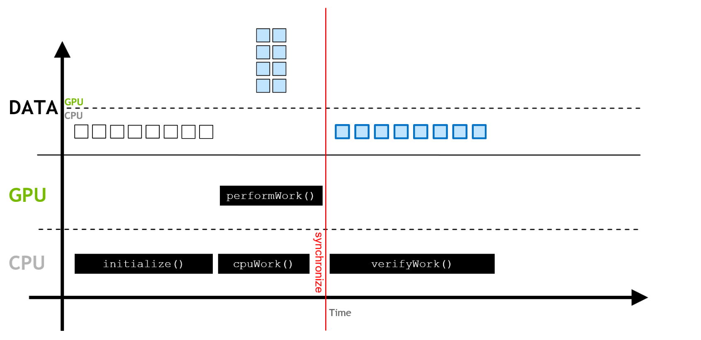
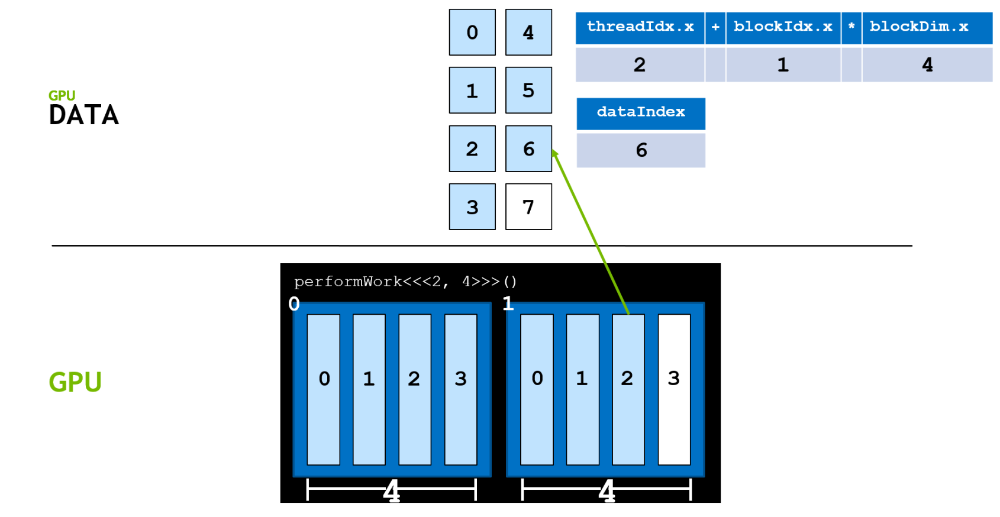
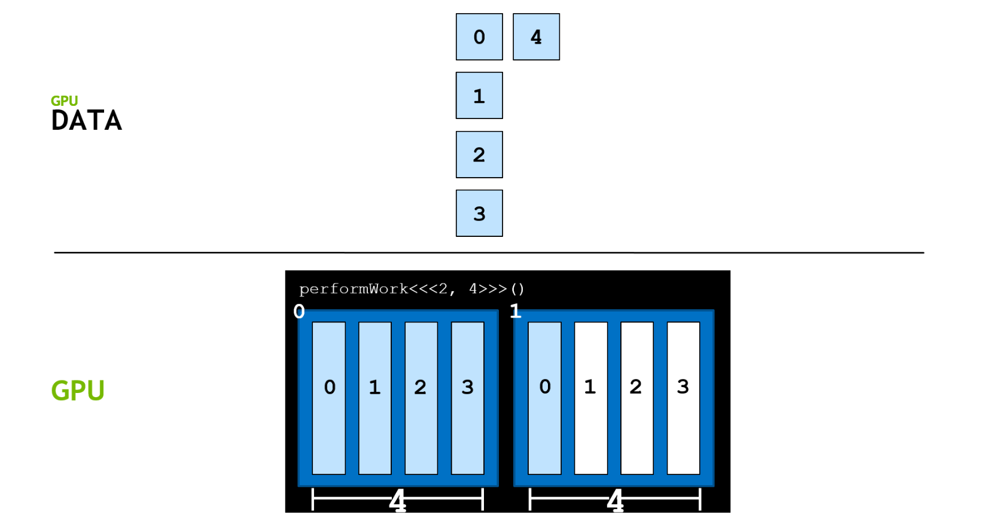
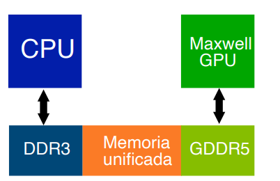
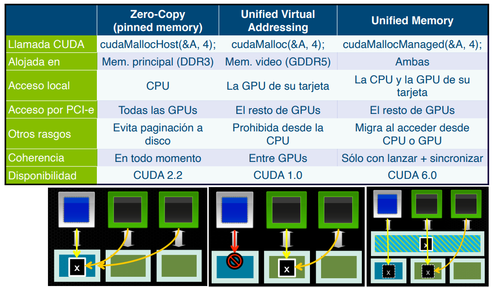
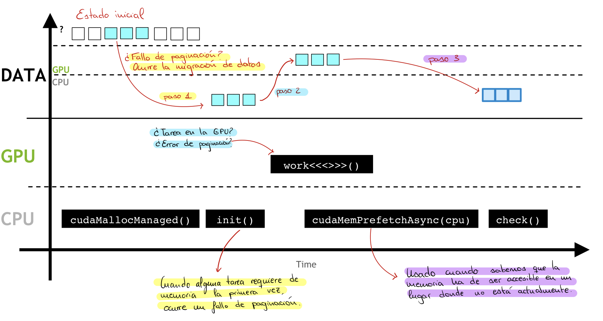
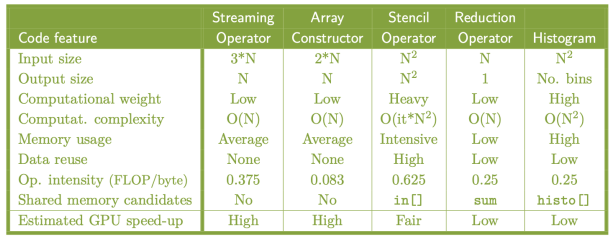

## Conceptos básicos

En CUDA, una función paralelizada se denomina **kernel**. Para conocer la GPU disponible
y sus características se puede utilizar el siguiente comando en la terminal:

```bash linenums="1"
nvidia-smi
```

Durante la programación en CUDA, tanto la CPU como la GPU realizan operaciones
simultáneamente, por lo que resulta necesario sincronizar los tiempos de ejecución entre
ambos componentes.

<figure markdown="span">



</figure>

La sincronización entre la GPU y la CPU, así como entre diferentes hilos en la GPU,
puede hacer que las sentencias condicionales como `if` resulten desfavorables para la
ejecución en la GPU. Por tanto, se recomienda minimizar el uso de sentencias
condicionales dentro de un kernel.

La programación en CUDA se realiza utilizando C/C++ y los archivos CUDA tienen la
extensión `.cu`. La compilación del código se lleva a cabo con el siguiente comando:

```bash linenums="1"
!nvcc -arch=sm_70 -o resultado_nombre programa.cu -run
```

En este comando, `-arch=sm_70` especifica la arquitectura objetivo para la compilación.
A continuación se presenta un ejemplo básico de código en CUDA:

```c linenums="1"
#include <iostream>

using namespace std;

void hola_cpu(void)
{
    printf("Esto es un saludo desde la CPU");
}

// Define una función de kernel que se ejecuta en la GPU
__global__ void ejemplo_kernel(void)
{
    printf("Hola, esto se está ejecutando de forma paralela en GPU");
}

int main(void)
{
    hola_cpu();

    // Lanza el kernel en la GPU con una sola instancia de un solo hilo
    ejemplo_kernel<<<1, 1>>>();

    // Espera a que todos los hilos en la GPU terminen antes de continuar
    cudaDeviceSynchronize();

    return 0;
}
```

La palabra clave `__global__` indica que la función se ejecuta en la GPU y puede ser
invocada desde la CPU. El código ejecutado en la CPU se denomina **_host_** y el código
ejecutado en la GPU se denomina **_device_**. Las funciones `__global__` deben tener el
tipo de retorno `void`. La invocación de una función CUDA utiliza la **configuración de
ejecución**, que adopta la forma `nombre_funcion<<<x, y>>>`, donde `x` es el número de
bloques (debe ser menor a 2048) e `y` es el número de hilos por bloque (debe ser menor a
1024). El número total de hilos se obtiene multiplicando `x` por `y`. Por ejemplo, con 2
bloques y 4 hilos por bloque se obtienen 8 hilos en total. El número de bloques y de
hilos depende de las capacidades de hardware de la GPU.

El código del kernel se ejecuta en cada hilo de cada bloque configurado cuando se lanza
el kernel. Un kernel con un solo bloque utilizará únicamente un multiprocesador de la
GPU. La función `cudaDeviceSynchronize()` asegura que la GPU complete su tarea antes de
que la CPU finalice el programa, funcionando como herramienta de sincronización entre
CPU y GPU.

CUDA permite agilizar los bucles en la programación. Por ejemplo, para incrementar un
valor `b` a los `N` elementos de un vector en la CPU:

```c linenums="1"
void incremento_en_cpu(float *a, float b, int N)
{
    for (int idx = 0; idx < N; idx++)
    {
        a[idx] = a[idx] + b;
    }
}

void main()
{
    incremento_en_cpu(a, b, N);
}
```

Este bucle es adecuado para la paralelización, ya que cada índice es independiente y no
requiere un orden específico de ejecución (las hebras en un _warp_ se ejecutan de forma
desordenada).

## Identificación de hilos, bloques y mallas

CUDA proporciona variables integradas que describen los hilos, bloques y mallas
(_grid_):

| Variable      | Definición                                          |
| ------------- | --------------------------------------------------- |
| `gridDim.x`   | Número total de bloques en la malla.                |
| `blockIdx.x`  | Índice del bloque actual dentro de la malla.        |
| `blockDim.x`  | Número de hilos en un bloque dentro del kernel.     |
| `threadIdx.x` | Índice de un hilo dentro de un bloque en el kernel. |

Los bloques de un mismo kernel no pueden comunicarse entre sí durante su ejecución, ya
que pueden ejecutarse en cualquier orden y de forma independiente. El kernel debe
realizar el trabajo de una sola iteración del bucle, por lo que la configuración del
kernel debe ajustarse al número de iteraciones, configurando adecuadamente tanto el
número de bloques como el número de hilos por bloque. A continuación se presenta el
código paralelizado del bucle anterior:

```c linenums="1"
__global__ void incremento_en_gpu(float *a, float b, int N)
{
    int idx = blockIdx.x * blockDim.x + threadIdx.x;

    if (idx < N)
    {
        a[idx] = a[idx] + b;
    }
}

void main()
{
    dim3 dimBlock(blocksize);
    dim3 dimGrid(ceil(N / (float)blocksize));

    incremento_en_gpu<<<dimGrid, dimBlock>>>(a, b, N);
}
```

Cada hilo realiza una iteración del bucle. La fórmula para mapear cada hilo a un índice
del bucle es:

$$
i_{x} = (blockIdx.x \cdot blockDim.x) + threadIdx.x
$$

<figure markdown="span">



</figure>

Es importante que `blockDim.x` sea mayor o igual a 32, que es el tamaño del _warp_. En
casos donde el número de hilos excede el número de tareas, se debe asegurar que el
índice obtenido $i_{x}$ sea menor que el número total de datos.

<figure markdown="span">



</figure>

## Asignación de memoria

La asignación y liberación de memoria se realiza de forma diferente en la CPU y en la
GPU. En la CPU se utilizan las funciones `malloc()` y `free()`, mientras que en la GPU
se emplean `cudaMallocManaged()` y `cudaFree()`. El siguiente ejemplo muestra ambos
enfoques:

```c linenums="1"
// Asignación en CPU
int N = 2 << 20;
size_t size = N * sizeof(int);
int *a;
a = (int *)malloc(size);
free(a);

// Asignación en GPU con memoria unificada
int N = 2 << 20;
size_t size = N * sizeof(int);
int *a;
cudaMallocManaged(&a, size);
cudaFree(a);
```

Gracias a los avances en hardware, se ha logrado mejorar la tasa de transferencia entre
la CPU y la GPU. Las versiones recientes de CUDA permiten el uso de **memoria
unificada**, que facilita el intercambio de datos entre ambos componentes.

<figure markdown="span">



</figure>

La memoria unificada ofrece varias ventajas: proporciona un único puntero a los datos
accesible tanto desde la CPU como desde la GPU, elimina la necesidad de usar
`cudaMemcpy()`, facilita la portabilidad del código y mejora el rendimiento en la
transferencia de datos asegurando la coherencia global. También permite la optimización
manual con `cudaMemcpyAsync()`.

Los tipos de memoria en CUDA se pueden observar en la siguiente imagen:

<figure markdown="span">



</figure>

La memoria unificada presenta algunas consideraciones importantes: su capacidad máxima
está limitada por la menor cantidad de memoria disponible entre las GPUs; la memoria
unificada utilizada por la CPU debe migrar de nuevo a la GPU antes de lanzar un kernel;
la CPU no puede acceder a la memoria unificada mientras la GPU ejecuta un kernel (se
debe llamar a `cudaDeviceSynchronize()` previamente); y la GPU tiene acceso exclusivo a
la memoria unificada mientras ejecuta un kernel, incluso si este no la utiliza
directamente.

<figure markdown="span">



</figure>

### Ejemplos de uso de memoria unificada

El siguiente ejemplo muestra un uso **incorrecto** de la memoria unificada, donde la CPU
accede a una variable mientras la GPU puede estar ejecutándose:

```c linenums="1"
__device__ __managed__ int x, y = 2;

__global__ void mykernel()
{
    x = 10;
}

int main()
{
    mykernel <<<1, 1>>> ();

    // ERROR: Acceso concurrente desde la CPU mientras la GPU puede estar usando la variable 'y'
    y = 20;

    return 0;
}
```

La versión **correcta** incluye la sincronización antes de que la CPU acceda a la
variable:

```c linenums="1"
__device__ __managed__ int x, y = 2;

__global__ void mykernel()
{
    x = 10;
}

int main()
{
    mykernel <<<1, 1>>> ();

    // Sincronización antes de que la CPU acceda a la memoria unificada
    cudaDeviceSynchronize();

    y = 20;

    return 0;
}
```

## Kernels con gran tamaño de datos

Cuando la cantidad de datos excede el número máximo de hebras disponibles, es necesario
dividir los datos en bloques más pequeños que se ajusten al número de hebras. Tras
completar el procesamiento de una división, se pasa a la siguiente utilizando un
desplazamiento de $blockDim.x \cdot gridDim.x$. El siguiente bucle ilustra esta técnica:

```c linenums="1"
__global__ void kernel(int *a, int N)
{
    int indexWithinTheGrid = (blockIdx.x * blockDim.x) + threadIdx.x;
    int gridStride = blockDim.x * gridDim.x;

    for (int i = indexWithinTheGrid; i < N; i += gridStride)
    {
        // Código para procesar los datos
    }
}
```

## Manejo de errores

Las funciones de CUDA devuelven un valor de tipo `cudaError_t` que indica si se ha
producido un error. A continuación se muestra cómo gestionar errores al reservar
memoria:

```c linenums="1"
cudaError_t err;
err = cudaMallocManaged(&a, N);

if (err != cudaSuccess)
{
    printf("Error: %s\n", cudaGetErrorString(err));
}
```

Para la gestión de errores al lanzar un kernel, se utiliza `cudaGetLastError()`:

```c linenums="1"
someKernel<<<1, -1>>>(); // -1 no es un valor válido para el número de hebras por bloque

cudaError_t err;
err = cudaGetLastError();

if (err != cudaSuccess)
{
    printf("Error: %s\n", cudaGetErrorString(err));
}
```

También se puede emplear una función auxiliar para verificar errores de forma
centralizada:

```c linenums="1"
#include <stdio.h>
#include <assert.h>

inline cudaError_t checkCuda(cudaError_t result)
{
    if (result != cudaSuccess)
    {
        fprintf(stderr, "CUDA Runtime Error: %s\n", cudaGetErrorString(result));
        assert(result == cudaSuccess);
    }

    return result;
}

int main()
{
    checkCuda(todas_las_funciones_a_gestionar_errores);
}
```

## Patrones comunes de kernels

<figure markdown="span">



</figure>

Antes de explorar los distintos patrones, conviene definir el concepto de **bucle
_forall_**: se trata de un bucle `for` sin dependencias entre iteraciones, lo que
permite que el resultado no se vea alterado independientemente del índice de inicio. Los
patrones más comunes son los siguientes:

- **Operadores streaming**: Representan la forma más simple de un bucle _forall_. CUDA
  puede utilizar todos los hilos necesarios para procesar cada elemento de manera
  independiente:

    ```c linenums="1"
    #define N 1920 * 1080

    float r[N], g[N], b[N], luminancia[N];

    for(int i = 0; i < N; i++)
    {
        luminancia[i] = 255 * (0.2999 * r[i] + 0.587 * g[i] + 0.114 * b[i]);
    }
    ```

- **Operadores sobre vectores**: Cada iteración del bucle puede asignarse a un hilo CUDA
  para maximizar el paralelismo y la escalabilidad:

    ```c linenums="1"
    #define N (1 << 30)

    float a[N], b[N], c[N];

    for(int i = 0; i < N; i++)
    {
        c[i] = a[i] + b[i];
    }
    ```

- **Operadores patrón (_stencil operators_)**: Las iteraciones externas deben
  serializarse debido a dependencias, pero se puede aprovechar el paralelismo en cada
  partícula. La carga computacional depende del número de iteraciones:

    ```c linenums="1"
    int i, j, iter, N, Niters;
    float in[N][N], out[N][N];

    for (iter = 0; iter < Niters; iter++)
    {
        for (i = 1; i < N - 1; i++)
        {
            for (j = 1; j < N - 1; j++)
            {
                out[i][j] = 0.2 * (in[i][j] + in[i-1][j] + in[i+1][j] + in[i][j-1] + in[i][j+1]);
            }
        }

        for (i = 1; i < N - 1; i++)
        {
            for (j = 1; j < N - 1; j++)
            {
                in[i][j] = out[i][j];
            }
        }
    }
    ```

    El paralelismo en este caso está determinado por el tamaño de la matriz 2D ($N^2$).

- **Operadores de reducción**: Aunque el código presenta dependencias entre iteraciones,
  el paralelismo puede desplegarse mediante una estructura en árbol binario, resultando
  en $\log(N)$ pasos que reducen el grado de paralelismo hasta llegar a un solo hilo. Es
  fundamental usar un patrón de acceso a memoria que optimice la jerarquía de memoria de
  la GPU:

    ```c linenums="1"
    float sum, x[N];
    sum = 0;

    for (int i = 0; i < N; i++)
    {
        sum += x[i];
    }
    ```

- **Histogramas**: Representan un patrón donde los bucles presentan dependencias, pero
  las lecturas pueden realizarse en paralelo si se asignan a hilos CUDA. CUDA
  proporciona operaciones atómicas (`atomicInc(histo[image[i][j]])`) para manejar
  accesos concurrentes y prevenir condiciones de carrera:

    ```c linenums="1"
    int histo[Nbins], image[N][N];

    for (int i = 0; i < Nbins; i++)
    {
        histo[i] = 0;
    }

    for (int i = 0; i < N; i++)
    {
        for (int j = 0; j < N; j++)
        {
            histo[image[i][j]]++;
        }
    }
    ```

Como análisis final, el operador streaming es el más eficiente en GPU, el operador
patrón aprovecha mejor la memoria compartida, el operador de reducción requiere una
mayor intervención del programador y el histograma es el más desafiante de implementar.
