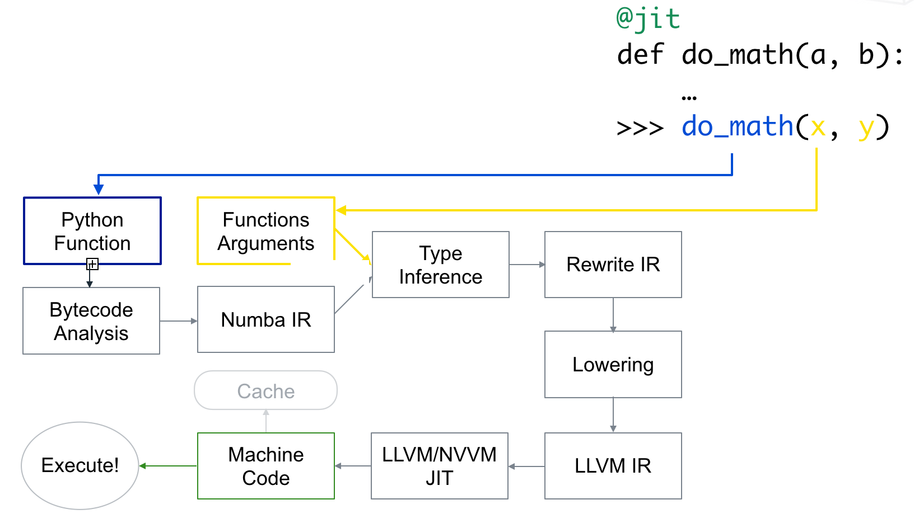
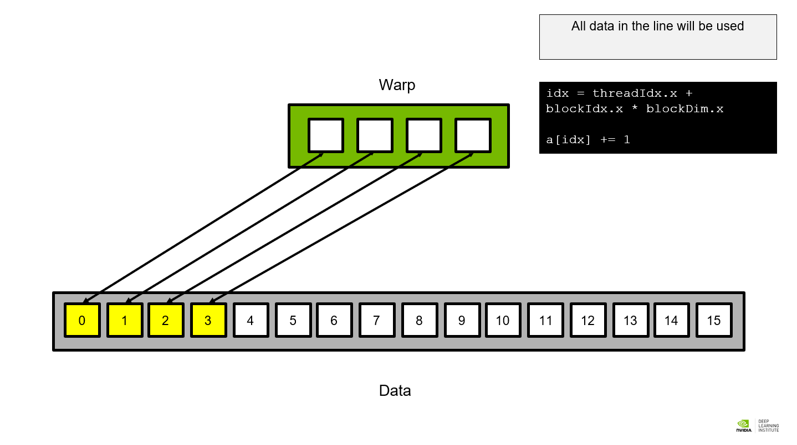
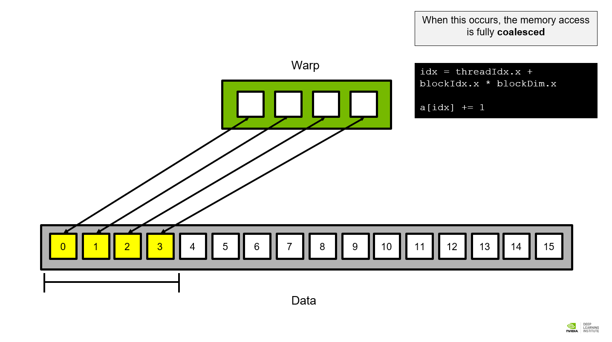
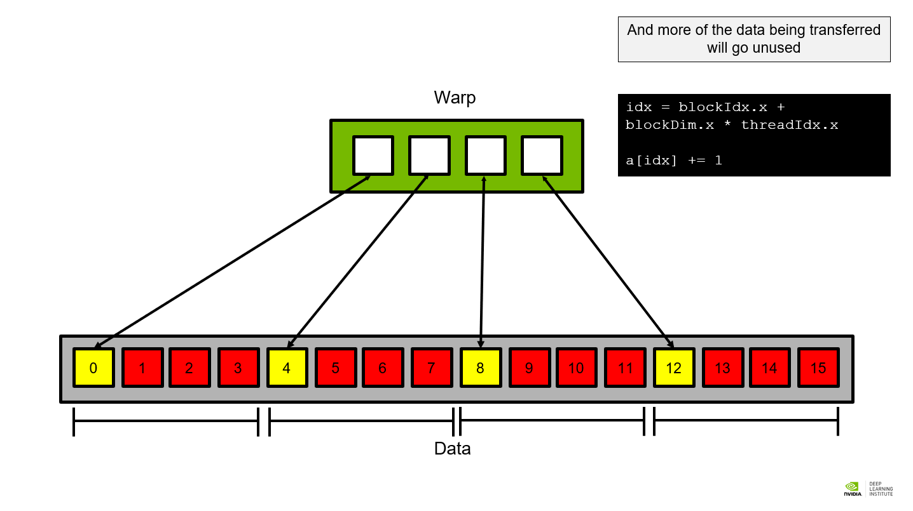

## Introducción

El rendimiento de las aplicaciones científicas y de ingeniería en Python se puede
mejorar significativamente mediante el uso de herramientas como Numba y CuPy. Estas
tecnologías permiten la paralelización y aceleración del código, aprovechando la
potencia de procesamiento de las GPUs y superando las limitaciones del intérprete de
Python.

## Numba

### Fundamentos

Numba es un compilador JIT (_Just-In-Time_) y de especialización de tipos para acelerar
cálculo numérico en Python tanto en CPU como en GPU. A diferencia de otros enfoques,
Numba compila funciones individuales de Python, no la aplicación al completo, por lo que
no sustituye al intérprete de Python. La aceleración se consigue generando
implementaciones específicas para el tipo de dato que se utiliza, en lugar de emplear el
_dynamic typing_ que es el comportamiento por defecto de Python. Al ser _just-in-time_,
la compilación se produce cuando la función se invoca por primera vez, lo que permite al
compilador conocer los argumentos que se van a utilizar y facilita la ejecución
interactiva en cuadernos Jupyter. Numba se centra principalmente en tipos de datos
numéricos (enteros, flotantes, números complejos) y ofrece el mejor soporte cuando se
trabaja con arrays de NumPy.

Sin embargo, Numba presenta ciertas limitaciones: no es compatible con Pandas, por lo
que se recomienda convertir los DataFrames a matrices de NumPy o CuPy antes de
utilizarlo. Para más información, se puede consultar la
[página oficial de Numba](https://numba.pydata.org/).

### Alternativas

Existen varias alternativas para la programación con CUDA, cada una con sus propias
ventajas. **CUDA C/C++** es la opción más común, con mayor rendimiento y flexibilidad, y
acelera aplicaciones escritas en C/C++. **pyCUDA** expone la totalidad de la API de CUDA
C/C++ y es la opción más eficiente disponible para Python, aunque requiere escribir
código C dentro de Python y, en general, modificaciones sustanciales del código.
**Numba**, por su parte, ofrece el mejor equilibrio entre tiempo de desarrollo y
beneficio: aunque potencialmente menos eficiente que pyCUDA y sin exponer aún la
totalidad de la API de CUDA C/C++, permite aceleraciones masivas con muy pocas
modificaciones del código, escribiendo directamente en Python, y también optimiza código
para la CPU.

### Funcionamiento interno

Cuando se invoca una función decorada con `@jit` o `@njit`, el compilador de Numba
convierte el código Python a código máquina para el tipo específico de los datos que se
están utilizando. Numba también conserva la función original de Python en el atributo
`.py_func`, lo que permite llamar a la función con dicho atributo para comparar
resultados:

```python linenums="1"
from numba import jit
import math

@jit
def hypot(x, y):
    x = abs(x)
    y = abs(y)
    t = min(x, y)
    x = max(x, y)
    t = t / x
    return x * math.sqrt(1 + t * t)

# Ejecución compilada con Numba
hypot(3.0, 4.0)

# Ejecución con la función original de Python
hypot.py_func(3.0, 4.0)
```

No obstante, si existen versiones ya implementadas y optimizadas en Python para una
operación concreta, estas suelen ser más rápidas que Numba, ya que Numba introduce una
pequeña sobrecarga en la compilación inicial.

El proceso interno de compilación se puede visualizar de la siguiente manera:



Para inspeccionar el resultado de la inferencia de tipos, se puede utilizar el método
`.inspect_types()`, que imprime el código fuente anotado con los tipos inferidos:

```python linenums="1"
hypot.inspect_types()
```

### Decoradores

Numba ofrece varios decoradores para la compilación y optimización de funciones:

| Decorador                       | Definición                                                                                                                                                                                                                     |
| ------------------------------- | ------------------------------------------------------------------------------------------------------------------------------------------------------------------------------------------------------------------------------ |
| `@jit`                          | Compila en modo objeto. Numba compila los bucles optimizables a código máquina y el resto de la función se ejecuta con el intérprete de Python.                                                                                |
| `@njit` = `@jit(nopython=True)` | Compila sin el intérprete de Python, obteniendo el mejor rendimiento. Puede fallar si los parámetros no son compatibles; si falla, se recomienda utilizar `@jit`. Este es el decorador preferido para la mayoría de los casos. |
| `@njit(parallel=True)`          | Compila el código para ejecutarse en múltiples hilos, aprovechando la paralelización cuando las operaciones lo permiten.                                                                                                       |
| `@njit(fastmath=True)`          | Habilita cálculos matemáticos rápidos a costa de reducir la precisión numérica, acelerando aún más el rendimiento.                                                                                                             |

Los decoradores pueden combinarse para optimizar el rendimiento. Por ejemplo,
`@njit(parallel=True, fastmath=True)` evita el intérprete de Python, paraleliza el
código y permite una menor precisión numérica para maximizar la velocidad de ejecución.

El decorador `@njit` es la versión recomendada y más eficiente, ya que fuerza a mostrar
los errores de las estructuras o funciones que no son directamente compatibles con Numba
y que no se pueden compilar, evitando el _object mode_ (donde se utiliza el tipo de
variable original de Python sin especializar el tipo en Numba).

???+ example "Ejemplo"

    ```python linenums="1"
    from numba import njit
    import numpy as np

    @njit()
    def bucle(lista1, lista2, num_filas):
        lista3 = []

        for fila in range(num_filas):
            if (lista1[fila] >= 1) and (lista2[fila] <= 5):
                lista3.append(np.mean([lista1[fila], lista2[fila]]))

        return lista3

    lista1 = np.array([1, 2, 3])
    lista2 = np.array([4, 5, 6])
    result = bucle(lista1, lista2, len(lista1))
    print(result)
    ```

### Vectorización para GPU

El hardware de la GPU está diseñado para la paralelización de datos, por lo que se
obtiene el máximo _throughput_ cuando la GPU calcula la misma operación para diferentes
elementos al mismo tiempo. Las funciones universales de NumPy (_ufuncs_) realizan la
misma operación en cada elemento de un array, lo que las hace naturalmente
paralelizables y las ajusta muy bien a la naturaleza de la GPU.

???+ example "Ejemplo para CPU"

    ```python linenums="1"
    from numba import vectorize
    import numpy as np

    @vectorize
    def add_ten(num):
        return num + 10

    nums = np.arange(10)
    add_ten(nums)
    ```

???+ example "Ejemplo para GPU"

    ```python linenums="1"
    @vectorize(['int64(int64, int64)'], target='cuda')
    def add_ufunc(x, y):
        return x + y

    add_ufunc(a, b)
    ```

En el caso de la GPU se especifica el _target_ como `'cuda'`, así como el _typing_
específico de las variables (lo que aparece dentro de los paréntesis) y el tipo de
retorno de la función (lo que aparece fuera del paréntesis).

Internamente, Numba compila un kernel CUDA para ejecutar la operación _ufunc_ en
paralelo sobre todos los elementos de entrada, reserva memoria en la GPU para las
entradas y la salida, copia los datos de entrada a la GPU, ejecuta el kernel CUDA con
las dimensiones adecuadas según el tamaño de las entradas, copia el resultado de vuelta
a la CPU y lo devuelve como un array de NumPy en el _host_.

Consideraciones para rendimiento óptimo en GPU: las entradas deben ser suficientemente
grandes (miles de elementos como mínimo); el cálculo debe tener suficiente intensidad
aritmética para compensar la sobrecarga de enviar datos a la GPU; conviene ejecutar
varias operaciones en secuencia en la GPU para amortizar el coste de la copia de datos;
y los tipos de datos deben ser los más pequeños posibles (NumPy usa 64 bits por defecto,
usar `dtype` o `ndarray.astype()` para 32 bits cuando sea apropiado).

### Funciones de dispositivo

Para funciones que no son estrictamente elemento a elemento, se utiliza `@cuda.jit`. El
parámetro `device=True` indica que la función solo puede ser invocada desde otra función
que se ejecuta en la GPU:

```python linenums="1"
from numba import cuda, vectorize
import math

@cuda.jit(device=True)
def polar_to_cartesian(rho, theta):
    x = rho * math.cos(theta)
    y = rho * math.sin(theta)
    return x, y

@vectorize(['float32(float32, float32, float32, float32)'], target='cuda')
def polar_distance(rho1, theta1, rho2, theta2):
    x1, y1 = polar_to_cartesian(rho1, theta1)
    x2, y2 = polar_to_cartesian(rho2, theta2)
    return ((x1 - x2) ** 2 + (y1 - y2) ** 2) ** 0.5
```

## Kernels personalizados

La jerarquía de ejecución en CUDA se organiza de la siguiente manera: las hebras se
agrupan en bloques de hebras, y los bloques de hebras conforman una malla (_grid_). Para
escribir kernels personalizados se utiliza el decorador `@cuda.jit`, que a diferencia de
`@vectorize` no devuelve valores, sino que utiliza un argumento de salida:

```python linenums="1"
from numba import cuda
import numpy as np

@cuda.jit
def add_kernel(x, y, out):
    idx = cuda.grid(1)
    out[idx] = x[idx] + y[idx]

n = 4096
x = np.arange(n).astype(np.int32)
y = np.ones_like(x)

d_x = cuda.to_device(x)
d_y = cuda.to_device(y)
d_out = cuda.device_array_like(d_x)

threads_per_block = 128
blocks_per_grid = 32

add_kernel[blocks_per_grid, threads_per_block](d_x, d_y, d_out)
cuda.synchronize()
print(d_out.copy_to_host())
```

A la hora de elegir el tamaño óptimo de la malla: el tamaño de un bloque debe ser
múltiplo de 32 hilos (el tamaño de un _warp_), con tamaños típicos entre 128 y 512; el
tamaño de la malla debe asegurar la utilización completa de la GPU, siendo un buen punto
de partida lanzar entre 2x y 4x el número de SMs.

### _Grid stride loop_

El patrón _grid stride loop_ permite trabajar con conjuntos de datos más grandes que el
número total de hilos, al tiempo que se beneficia de la **coalescencia de memoria
global**:

```python linenums="1"
from numba import cuda

@cuda.jit
def add_kernel(x, y, out):
    start = cuda.grid(1)
    stride = cuda.gridsize(1)

    for i in range(start, x.shape[0], stride):
        out[i] = x[i] + y[i]
```

## Operaciones atómicas y condiciones de carrera

Una **condición de carrera** ocurre cuando múltiples hilos acceden a la misma ubicación
de memoria sin sincronización. Para evitarlas: cada hilo debe escribir en una ubicación
única, no usar el mismo array como entrada y salida, y utilizar operaciones atómicas
cuando sea necesario.

???+ example "Ejemplo con operación atómica"

    ```python linenums="1"
    from numba import cuda
    import numpy as np

    @cuda.jit
    def contador_global_atomic(counter):
        idx = cuda.grid(1)
        cuda.atomic.add(counter, 0, 1)

    contador = np.zeros(1, dtype=np.int32)
    d_contador = cuda.to_device(contador)

    contador_global_atomic[4, 128](d_contador)

    resultado = d_contador.copy_to_host()
    print("Valor final del contador:", resultado[0])  # Esperado: 512
    ```

## Coalescencia de memoria

La coalescencia de memoria es un factor determinante en el rendimiento. Los bloques de
hebras se dividen en _warps_ de 32 hebras, y el subsistema de memoria intenta minimizar
el número de líneas de caché requeridas. Cuanto más contiguos sean los datos asignados a
cada hebra del _warp_, mayor es la eficiencia.







### Trabajo con matrices en 2D

CUDA permite trabajar con mallas bidimensionales de hilos usando `cuda.grid(2)`:

```python linenums="1"
import numpy as np
from numba import cuda

@cuda.jit
def get_2D_indices(A):
    x, y = cuda.grid(2)
    A[x][y] = x + y / 10

A = np.zeros((4, 4))
d_A = cuda.to_device(A)
get_2D_indices[(2, 2), (2, 2)](d_A)
result = d_A.copy_to_host()
```

## Memoria compartida

La **memoria compartida** reside en un área _on-chip_ del dispositivo. Su tamaño es
limitado pero ofrece un ancho de banda significativamente mayor que la memoria global.
Es compartida entre todos los hilos de un mismo bloque y no persiste una vez que el
kernel termina.

Casos de uso habituales: almacenar en caché datos leídos múltiples veces, acumular
salidas para escritura coalescente, y preparar datos para operaciones de
dispersión/recopilación.

En Numba, se reserva mediante `cuda.shared.array` y la sincronización se realiza con
`cuda.syncthreads()`:

???+ example "Ejemplo: intercambio de elementos"

    ```python linenums="1"
    from numba import cuda, types
    import numpy as np

    @cuda.jit
    def swap_with_shared(vector, swapped):
        temp = cuda.shared.array(4, dtype=types.int32)
        idx = cuda.grid(1)
        temp[idx] = vector[idx]
        cuda.syncthreads()
        swapped[idx] = temp[3 - cuda.threadIdx.x]

    vector = np.arange(4).astype(np.int32)
    swapped = np.zeros_like(vector)
    d_vector = cuda.to_device(vector)
    d_swapped = cuda.to_device(swapped)
    swap_with_shared[1, 4](d_vector, d_swapped)
    ```

???+ example "Ejemplo: transposición con tiling"

    ```python linenums="1"
    from numba import cuda, types as numba_types
    import numpy as np

    @cuda.jit
    def tile_transpose(a, transposed):
        tile = cuda.shared.array((32, 32), numba_types.float32)

        a_col = cuda.blockIdx.x * cuda.blockDim.x + cuda.threadIdx.x
        a_row = cuda.blockIdx.y * cuda.blockDim.y + cuda.threadIdx.y

        tile[cuda.threadIdx.y, cuda.threadIdx.x] = a[a_row, a_col]
        cuda.syncthreads()

        t_col = cuda.blockIdx.y * cuda.blockDim.y + cuda.threadIdx.x
        t_row = cuda.blockIdx.x * cuda.blockDim.x + cuda.threadIdx.y

        transposed[t_row, t_col] = tile[cuda.threadIdx.x, cuda.threadIdx.y]
    ```

## CuPy

CuPy es una biblioteca de Python diseñada para acelerar cálculos numéricos mediante la
ejecución de código en GPUs. Ofrece una API similar a NumPy, lo que permite realizar
operaciones aprovechando la arquitectura de CUDA. Para más información, se puede
consultar la [página oficial de CuPy](https://cupy.dev/).

```python linenums="1"
import cupy as cp

a = cp.array([1, 2, 3, 4, 5])
b = cp.array([6, 7, 8, 9, 10])

c = a + b
c_numpy = cp.asnumpy(c)
print(c_numpy)  # Resultado: [ 7  9 11 13 15]
```

## Comparación entre Numba y CuPy

**Numba** resulta ideal para acelerar funciones específicas y bucles en Python. Permite
compilación JIT para CPU y GPU, y se integra bien con código existente de NumPy. Se
recomienda para optimizar algoritmos matemáticos complejos y simulaciones con
estructuras de bucles que pueden beneficiarse de la compilación JIT. **CuPy**, por su
parte, es más adecuado para trabajar con matrices y realizar operaciones a gran escala
en GPUs. Ofrece una API similar a NumPy, facilitando la migración de código y
aprovechando el hardware de CUDA. Resulta especialmente apropiado para tareas que
involucren cálculos matriciales intensivos, como el entrenamiento de modelos de _machine
learning_, procesamiento de imágenes y simulaciones con alta densidad de datos.
