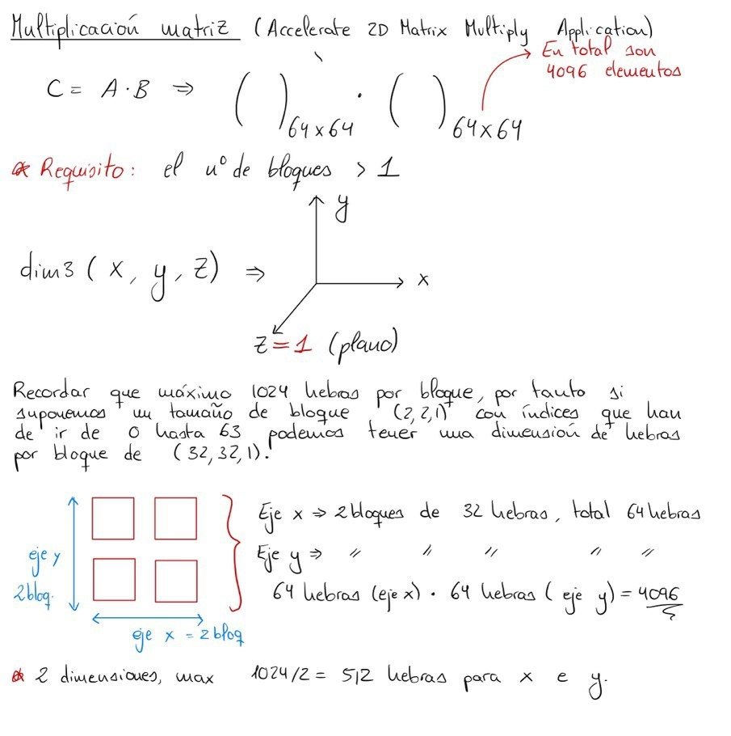
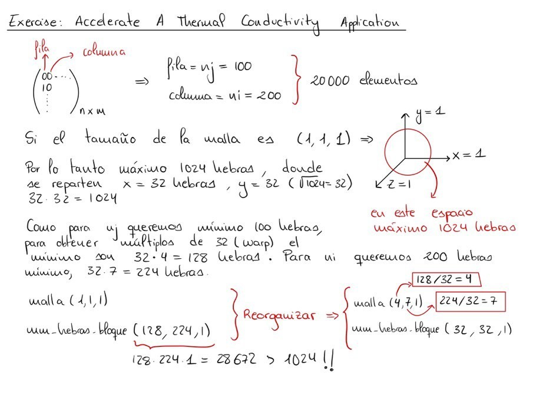

## Ejercicios básicos

### Orden de ejecución

??? example "Ejemplo"

    En este código mostraremos como ejecutar la función primero en la GPU, y luego en la
    CPU.

    ```c linenums="1"
    #include <stdio.h>

    void helloCPU()
    {
        printf("Hola desde la CPU.\n");
    }

    __global__ void helloGPU()
    {
        printf("Hola desde la GPU.\n");
    }

    int main()
    {
        int num_bloques = 1;
        int num_hebras_bloque = 1;

        helloGPU<<<num_bloques, num_hebras_bloque>>>();

        cudaDeviceSynchronize();

        helloCPU();

        return 0;
    }
    ```

    En este otro caso, primero se ejecutará en la CPU y posteriormente en la GPU.

    ```c linenums="1"
    #include <stdio.h>

    void helloCPU()
    {
        printf("Hola desde la CPU.\n");
    }

    __global__ void helloGPU()
    {
        printf("Hola desde la GPU.\n");
    }

    int main()
    {
        int num_bloques = 1;
        int num_hebras_bloque = 1;

        helloGPU<<<num_bloques, num_hebras_bloque>>>();

        cudaDeviceSynchronize();

        helloCPU();

        helloGPU<<<num_bloques, num_hebras_bloque>>>();

        cudaDeviceSynchronize();

        return 0;
    }
    ```

### Ejecución de hilos y bloques en un Kernel

??? example "Ejemplo"

    En este primer ejemplo, vamos a ejecutar 5 hilos en un único bloque para un Kernel.

    ```c linenums="1"
    #include <stdio.h>

    __global__ void firstParallel()
    {
        /*
        Se debería ver el mensaje de salida impreso 5 veces
        */
        printf("Paralelismo.\n");
    }

    int main()
    {
        int num_bloques = 1;
        int num_hebras_bloques = 5;

        firstParallel<<<num_bloques, num_hebras_bloques>>>();

        cudaDeviceSynchronize();

        return 0;
    }
    ```

    En este otro ejemplo, vamos a ejecutar 5 hilos en 5 bloques diferentes de un mismo
    Kernel.

    ```c linenums="1"
    #include <stdio.h>

    __global__ void firstParallel()
    {
        /*
        Se debería ver el mensaje de salida impreso 25 veces
        */
        printf("Paralelismo.\n");
    }

    int main()
    {
        int num_bloques = 5;
        int num_hebras_bloques = 5;

        firstParallel<<<num_bloques, num_hebras_bloques>>>();

        cudaDeviceSynchronize();

        return 0;
    }
    ```

### Utilizar índices específicos de hilos y bloques en un Kernel

??? example "Ejemplo"

    ```c linenums="1"
    #include <stdio.h>

    __global__ void printSuccessForCorrectExecutionConfiguration()
    {

        if(threadIdx.x == 1023 && blockIdx.x == 255)
        {
            printf("Success!\n");
        }
    }

    int main()
    {
        int num_bloques = 256;
        int num_hebras_bloque = 1024;

        printSuccessForCorrectExecutionConfiguration<<<num_bloques, num_hebras_bloque>>>();

        cudaDeviceSynchronize();

        return 0;
    }
    ```

### Aceleración de un bucle con un único bloque de subprocesos

??? example "Ejemplo"

    ```c linenums="1"
    #include <stdio.h>

    __global__ void loop(int N)
    {
        int i = (blockIdx.x * blockDim.x) + threadIdx.x;

        if(i < N)
        {
            printf("Esta es la iteracion número %d\n", i);
        }
    }

    int main()
    {
        int N = 10;

        int num_bloques = 1;
        int num_hebras_bloque = N;

        loop<<<num_bloques, num_hebras_bloque>>>(N);

        cudaDeviceSynchronize();

        return 0;
    }
    ```

### Aceleración de un bucle con varios bloques de subprocesos

??? example "Ejemplo"

    ```c linenums="1"
    #include <stdio.h>

    __global__ void loop(int N)
    {
        int i = (blockIdx.x * blockDim.x) + threadIdx.x;

        if(i < N)
        {
            printf("This is iteration number %d\n", i);
        }
    }

    int main()
    {
        int N = 10;

        int num_bloques = 2;
        int num_hebras_bloque = N/num_bloques;

        loop<<<num_bloques, num_hebras_bloque>>>(N);

        cudaDeviceSynchronize();

        return 0;
    }
    ```

### Manipulación de arrays en el _host_ y _device_

??? example "Ejemplo"

    ```c linenums="1"
    #include <stdio.h>

    void init(int *a, int N)
    {
        int i

        for (i = 0; i < N; ++i)
        {
            a[i] = i;
        }
    }

    __global__ void doubleElements(int *a, int N)
    {
        int i = (blockIdx.x * blockDim.x) + threadIdx.x;

        if (i < N)
        {
            a[i] *= 2;
        }
    }

    bool checkElementsAreDoubled(int *a, int N)
    {
        int i

        for (i = 0; i < N; ++i)
        {
            if (a[i] != i*2) return false;
        }

        return true;
    }

    int main()
    {

        int N = 100
        int *a;

        size_t size = N * sizeof(int);

        /*
        * Refactorizar esta asignación de memoria para proporcionar un puntero
        * `a` que se puede utilizar tanto en el host como en el dispositivo.
        */

        //a = (int *)malloc(size);
        cudaMallocManaged(&a, tamaño);


        init(a, N);

        size_t hilos_por_bloque = 10;
        size_t numero_de_bloques = 10;

        /*
        * Este lanzamiento no funcionará hasta que el puntero `a` esté también
        * disponible en el dispositivo.
        */

        doubleElements<<número_de_bloques, hilos_por_bloque>>(a, N);
        cudaDeviceSynchronize();

        bool areDoubled = checkElementsAreDoubled(a, N);
        printf("¿Se han duplicado todos los elementos? %s\n", areDoubled ? "TRUE" : "FALSE");

        cudaFree(a);

        return 0;
    }
    ```

### Aceleración de un bucle con una configuración de ejecución no coincidente

??? example "Ejemplo"

    ```c linenums="1"
    #include <stdio.h>

    /*
    * Actualmente, `initializeElementsTo`, si se ejecuta en un hilo cuyo
    * `i` se calcula que es mayor que `N`, intentará acceder a un valor
    * fuera del rango de `a`.
    *
    * Refactoriza la definición del kernel para prevenir accesos fuera de rango.
    */

    __global__ void initializeElementsTo(int initialValue, int *a, int N)
    {
        int i = threadIdx.x + blockIdx.x * blockDim.x;

        if(i < N)
        {
            a[i] = initialValue;
        }
    }

    int main()
    {
        int N = 1000

        int *a;
        size_t size = N * sizeof(int);

        cudaMallocManaged(&a, tamaño);

        /*
        * Supongamos que tenemos razones para querer el número de hilos
        * fijo en 256
        */
        size_t hilos_por_bloque = 256;

        /*
        * Asigna un valor de bloques que permita
        * una configuración de ejecución operativa dados
        * los valores fijos para `N` y de hilos.
        */
        size_t numero_de_bloques = (N + hilos_por_bloque - 1) / hilos_por_bloque;

        int valorinicial = 6;

        initializeElementsTo<<número_de_bloques, hilos_por_bloque>>(initialValue, a, N);
        cudaDeviceSynchronize();

        /*
        * Comprueba que todos los valores en `a`, fueron inicializados.
        */
        for (int i = 0; i < N; ++i)
        {
            if(a[i] != valorinicial)
            {
                printf("FAILURE: target value: %d\t a[%d]: %d\n", initialValue, i, a[i]);
                cudaFree(a);
                exit(1);
            }
        }

        printf("¡Éxito!\n");

        cudaFree(a);

        return 0;
    }
    ```

### Utilizar un bucle _Grid-Stride_ para manipular un array mayor que la cuadrícula de los bloques

??? example "Ejemplo"

    ```c linenums="1"
    #include <stdio.h>

    void init(int *a, int N)
    {
        int i

        for (i = 0; i < N; ++i)
        {
            a[i] = i;
        }
    }

    /*
    * En la aplicación actual, `N` es mayor que la rejilla.
    * Refactoriza este kernel para usar un bucle grid-stride para que
    * cada hilo paralelo trabaje sobre más de un elemento del array.
    */

    __global__ void doubleElements(int *a, int N)
    {
        int i = blockIdx.x * blockDim.x + threadIdx.x;
        int gridStride = gridDim.x * blockDim.x;

        for (int j = i; j < N; j += gridStride)
        {
            a[j] *= 2;
        }

    }

    bool checkElementsAreDoubled(int *a, int N)
    {
        for (int i = 0; i < N; ++i)
        {
            if (a[i] != i*2) return false;
        }

        return true;
    }

    int main()
    {

        /*
        * `N` es mayor que el tamaño de la rejilla (ver más abajo).
        */

        int N = 10000;
        int *a;

        size_t size = N * sizeof(int);
        cudaMallocManaged(&a, tamaño);

        init(a, N);

        /*
        * El tamaño de esta rejilla es 256*32 = 8192.
        */

        size_t hilos_por_bloque = 256;
        size_t número_de_bloques = 32;

        doubleElements<<número_de_bloques, hilos_por_bloque>>(a, N);
        cudaDeviceSynchronize();

        bool areDoubled = checkElementsAreDoubled(a, N);
        printf("¿Se han duplicado todos los elementos? %s\n", areDoubled ? "TRUE" : "FALSE");

        cudaFree(a);

        return 0;
    }
    ```

### Manejo de errores

??? example "Ejemplo"

    ```c linenums="1"
    #include <stdio.h>

    void init(int *a, int N)
    {
        for (int i = 0; i < N; ++i)
        {
            a[i] = i;
        }
    }

    __global__ void doubleElements(int *a, int N)
    {
        int idx = blockIdx.x * blockDim.x + threadIdx.x;
        int stride = gridDim.x * blockDim.x;

        for (int i = idx; i < N + stride; i += stride)
        {
            a[i] *= 2;
        }
    }

    bool checkElementsAreDoubled(int *a, int N)
    {
        for (int i = 0; i < N; ++i)
        {
            if (a[i] != i*2) return false;
        }

        return true;
    }

    int main()
    {
        /*
        * Añadir manejo de errores a este código fuente para saber qué errores
        * existen, y luego corregirlos. Googlear los mensajes de error puede ser
        * de servicio si las acciones para resolverlos no son claras para usted.
        */

        cudaError_t gestor_errores;

        int N = 10000
        int *a;

        size_t tamaño = N * sizeof(int);
        gestor_errores = cudaMallocManaged(&a, size);

        if(gestor_errores != cudaSuccess)
        {
            printf("Hubo un error en la reserva de memoria\n");
            printf("Error obtenido: %s\n", cudaGetErrorString(gestor_errores));
        }

        init(a, N);

        size_t hilos_por_bloque = 2048;
        size_t numero_de_bloques = 32;

        doubleElements<<número_de_bloques, hilos_por_bloque><>(a, N);

        gestor_errores = cudaGetLastError();

        if (gestor_errores != cudaSuccess)
        {
        printf("Error en el lanzamiento del Kernel\n");
        printf("Error obtenido: %s\n", cudaGetErrorString(gestor_errores));
        }

        gestor_errores = cudaDeviceSynchronize();

        if(gestor_errores != cudaSuccess)
        {
            printf("Hubo un error en la sincronizacion\n");
            printf("Error obtenido: %s\n", cudaGetErrorString(gestor_errores));
        }

        bool areDoubled = checkElementsAreDoubled(a, N);
        printf("¿Se han duplicado todos los elementos? %s\n", areDoubled ? "TRUE" : "FALSE");

        cudaFree(a);

        return 0;
    }
    ```

    El error obtenido es el siguiente: **invalid configuration argument**

    Y vemos que se trata de la configuración del Kernel donde el número de hebras por bloque
    supera el máximo de 1 Giga-Bloque. Por lo que hay que cambiar al máximo permitido:

    ```c linenums="1"
    size_t threads_per_block = 1024;
    ```

### Acelerar la suma de vectores

??? example "Ejemplo"

    ```c linenums="1"
    #include <stdio.h>
    #include <assert.h>

    inline cudaError_t checkCuda(cudaError_t result)
    {
        if (result != cudaSuccess)
        {
            fprintf(stderr, "CUDA Runtime Error: %s\n", cudaGetErrorString(result));
            assert(resultado == cudaSuccess);
        }

        return resultado;
    }

    void initWith(float num, float *a, int N)
    {
        for(int i = 0; i < N; ++i)
        {
            a[i] = num;
        }
    }

    __global__ void addVectorsInto(float *resultado, float *a, float *b, int N)
    {
        int i = (blockIdx.x * blockDim.x) + threadIdx.x;
        int gridStride = gridDim.x * blockDim.x;

        for (int j = i; j < N; j += gridStride)
        {
            result[j] = a[j] + b[j];
        }
    }

    void checkElementsAre(float target, float *array, int N)
    {
        for(int i = 0; i < N; i++)
        {
            if(array[i] != objetivo)
            {
                printf("FAIL: array[%d] - %0.0f no es igual a %0.0f\n", i, array[i], target);
                exit(1);
            }
        }

        printf("¡ÉXITO! Todos los valores añadidos correctamente.\n");
    }

    int main()
    {
        const int N = 2<<20; // 2 ^21 = 2097152
        size_t tamaño = N * sizeof(float);

        float *a, *b, *c;

        checkCuda(cudaMallocManaged(&a, tamaño));
        checkCuda(cudaMallocManaged(&b, tamaño));
        checkCuda(cudaMallocManaged(&c, tamaño));

        initWith(3, a, N);
        initWith(4, b, N);
        initWith(0, c, N);

        int num_hebras_bloque = 1024;
        int num_bloques = (N + num_hebras_bloque - 1) / num_hebras_bloque;

        addVectorsInto<<num_bloques, num_hebras_bloque><>(c, a, b, N);

        checkCuda(cudaGetLastError());
        checkCuda(cudaDeviceSynchronize());

        // Comprobar elementos en CPU
        // Si hacemos el cudaDeviceSynchronize() después dará un error en la comprobación
        // de los datos
        checkElementsAre(7, c, N);

        checkCuda(cudaFree(a));
        checkCuda(cudaFree(b));
        checkCuda(cudaFree(c));

        return 0;
    }
    ```

### Acelerar la multiplicación de matrices 2D

??? example "Ejemplo"

    <figure markdown="span">


      


    </figure>

    ```c linenums="1"
    #include <stdio.h>

    #define N 64

    __global__ void matrixMulGPU( int * a, int * b, int * c )
    {
        int val = 0;

        int fila = (bloqueDim.x * bloqueIdx.x) + hiloIdx.x;
        int col = (blockDim.y * blockIdx.y) + threadIdx.y;

        if(fila < N && col < N)
        {
            for ( int k = 0; k < N; ++k )
            {
                val += a[fila * N + k] * b[k * N + col];
                c[fila * N + col] = val;
            }
        }
    }

    void matrixMulCPU( int * a, int * b, int * c )
    {
        int val = 0;

        for( int fila = 0; fila < N; ++fila )
        {
            for( int col = 0; col < N; ++col )
            {
                val = 0;

                for ( int k = 0; k < N; ++k )
                {
                    val += a[fila * N + k] * b[k * N + col];
                    c[fila * N + col] = val;
                }
            }
        }
    }

    int main()
    {
        // Asigna una matriz de soluciones para las operaciones de la CPU y la GPU
        int *a, *b, *c_cpu, *c_gpu;

        // Número de bytes de una matriz N x N
        int size = N * N * sizeof (int);

        // Asignar memoria
        cudaMallocManaged (&a, tamaño);
        cudaMallocManaged (&b, tamaño);
        cudaMallocManaged (&c_cpu, tamaño);
        cudaMallocManaged (&c_gpu, tamaño);

        // Inicializar memoria; crear matrices 2D
        for( int fila = 0; fila < N; ++fila )
        {
            for( int col = 0; col < N; ++col )
            {
                a[fila*N + col] = fila;
                b[fila*N + col] = col+2;
                c_cpu[fila*N + col] = 0;
                c_gpu[fila*N + col] = 0;
            }
        }

        /*
        * Asigna los valores 2D `threads_per_block` y `number_of_blocks
        * que pueden ser usados en matrixMulGPU arriba.
        */

        // dim3 permite definir el número de bloques por cuadrícula y de hilos por bloque.
        /*
        Utilizar un bloque multidimensional significa que hay que tener cuidado al distribuir
        este número de hilos entre todas las dimensiones. En un bloque 1D, puede establecer 1024 hilos
        como máximo en el eje x, pero en un bloque 2D, si establece 2 como tamaño de y,
        ¡no puede superar los 512 (1024/2 = 512) para la x! Por ejemplo, se permite dim3 threadsPerBlock(1024, 1, 1),
        así como dim3 threadsPerBlock(512, 2, 1), pero no dim3 threadsPerBlock(256, 3, 2).
        */
        int x1 = N/2;
        int y1 = N/2;

        int x2 = 2
        int y2 = 2;

        dim3 hilos_por_bloque (x1, y1, 1);
        dim3 número_de_bloques (x2, y2, 1);

        matrixMulGPU <<< número_de_bloques, hilos_por_bloque >>> ( a, b, c_gpu );

        cudaDeviceSynchronize();

        // Llama a la versión CPU para comprobar nuestro trabajo
        matrixMulCPU( a, b, c_cpu );

        // Compara las dos respuestas para asegurarte de que son iguales
        bool error = false;
        for( int fila = 0; fila < N && !error; ++fila )
        {
            for( int col = 0; col < N && !error; ++col )
            {
                if (c_cpu[fila * N + col] != c_gpu[fila * N + col])
                {
                    printf("ERROR ENCONTRADO en c[%d][%d]\n", fila, col);
                    error = true;
                    break;
                }
            }
        }

        if (!error)
        {
            printf("¡Éxito!\n");
        }

        // Liberar toda la memoria asignada
        cudaFree(a);
        cudaFree(b);
        cudaFree(c_cpu);
        cudaFree(c_gpu);
    }
    ```

### Acelerar una aplicación de conductividad térmica

??? example "Ejemplo"

    <figure markdown="span">


      


    </figure>

    ```c linenums="1"
    #include <stdio.h>
    #include <math.h>
    #include <assert.h>

    inline cudaError_t checkCuda(cudaError_t result)
    {
        if (result != cudaSuccess)
        {
            fprintf(stderr, "CUDA Runtime Error: %s\n", cudaGetErrorString(result));
            assert(resultado == cudaSuccess);
        }

        return resultado;
    }

    // Definición simple para indexar en un array 1D desde un espacio 2D
    #define I2D(num, c, r) ((r)*(num)+(c))

    /*
    * `step_kernel_mod` es actualmente una copia directa de la ??? example "Ejemplo" de referencia de la CPU
    * `step_kernel_ref` a continuación. Aceléralo para que se ejecute como un kernel CUDA.
    */

    __global__ void step_kernel_mod(int ni, int nj, float fact, float* temp_in, float* temp_out)
    {
        int i00, im10, ip10, i0m1, i0p1;
        float d2tdx2, d2tdy2;

        int j = ((blockIdx.x * blockDim.x) + threadIdx.x) + 1;
        int i = ((bloqueIdx.y * bloqueDim.y) + hiloIdx.y) + 1;

        if((j < nj - 1 && i < ni-1))
        {
            // encontrar índices en memoria lineal
            // para el punto central y los vecinos
            i00 = I2D(ni, i, j);
            im10 = I2D(ni, i-1, j);
            ip10 = I2D(ni, i+1, j);
            i0m1 = I2D(ni, i, j-1);
            i0p1 = I2D(ni, i, j+1);

            // evaluar derivadas
            d2tdx2 = temp_in[im10]-2*temp_in[i00]+temp_in[ip10];
            d2tdy2 = temp_in[i0m1]-2*temp_in[i00]+temp_in[i0p1];

            // actualizar temperaturas
            temp_out[i00] = temp_in[i00]+fact*(d2tdx2 + d2tdy2);
        }
    }

    void step_kernel_ref(int ni, int nj, float fact, float* temp_in, float* temp_out)
    {
        int i00, im10, ip10, i0m1, i0p1;
        float d2tdx2, d2tdy2;

        // bucle sobre todos los puntos del dominio (excepto el límite)
        for ( int j=1; j < nj-1; j++ )
        {
            for ( int i=1; i < ni-1; i++ )
            {
                // encontrar índices en memoria lineal
                // para el punto central y los vecinos
                i00 = I2D(ni, i, j);
                im10 = I2D(ni, i-1, j);
                ip10 = I2D(ni, i+1, j);
                i0m1 = I2D(ni, i, j-1);
                i0p1 = I2D(ni, i, j+1);

                // evaluar derivadas
                d2tdx2 = temp_in[im10]-2*temp_in[i00]+temp_in[ip10];
                d2tdy2 = temp_in[i0m1]-2*temp_in[i00]+temp_in[i0p1];

                // actualizar temperaturas
                temp_out[i00] = temp_in[i00]+fact*(d2tdx2 + d2tdy2);
            }
        }
    }

    int main()
    {
        int istep
        int nstep = 200; // número de pasos temporales

        // Especificar nuestras dimensiones 2D
        const int ni = 200
        const int nj = 100
        float tfac = 8.418e-5; // difusividad térmica de la plata

        float *temp1_ref, *temp2_ref, *temp1, *temp2, *temp_tmp;

        const int size = ni * nj * sizeof(float);

        checkCuda(cudaMallocManaged(&temp1_ref, size));
        checkCuda(cudaMallocManaged(&temp2_ref, tamaño));
        checkCuda(cudaMallocManaged(&temp1, tamaño));
        checkCuda(cudaMallocManaged(&temp2, tamaño));

        // Inicializar con datos aleatorios
        for( int i = 0; i < ni*nj; ++i)
        {
            temp1_ref[i] = temp2_ref[i] = temp1[i] = temp2[i] = (float)rand()/(float)(RAND_MAX/100.0f);
        }

        // Ejecuta la versión de referencia sólo para CPU
        for (istep=0; istep < nstep; istep++)
        {
            step_kernel_ref(ni, nj, tfac, temp1_ref, temp2_ref);

            // intercambia los punteros de temperatura
            temp_tmp = temp1_ref;
            temp1_ref = temp2_ref;
            temp2_ref= temp_tmp;
        }

        dim3 num_hebras_bloq(32, 32, 1);
        dim3 malla(4, 7, 1);
        //dim3 num_hebras_bloq(128, 224, 1);
        //dim3 malla(1, 1, 1);

        // Ejecutar la versión modificada utilizando los mismos datos
        for (istep=0; istep < nstep; istep++)
        {
            step_kernel_mod<<malla, num_hebras_bloq><>>(ni, nj, tfac, temp1, temp2);

            checkCuda(cudaGetLastError());
            checkCuda(cudaDeviceSynchronize());

            // intercambia los punteros de temp
            temp_tmp = temp1;
            temp1 = temp2;
            temp2= temp_tmp;
        }

        float maxError = 0;

        // La salida debe almacenarse siempre en temp1 y temp1_ref en este punto
        for( int i = 0; i < ni*nj; ++i )
        {
            if (abs(temp1[i]-temp1_ref[i]) > maxError)
            {
                maxError = abs(temp1[i]-temp1_ref[i]);
            }
        }

        // Comprueba si nuestro maxError es mayor que un límite de error
        if (maxError > 0.0005f)
        {
            printf("¡Problema! El Error Max de %.5f NO está dentro de los límites aceptables.\n", maxError);
        }
        else
        {
            printf("El error máximo de %.5f está dentro de los límites aceptables;)
        }

        checkCuda(cudaFree(temp1_ref));
        checkCuda(cudaFree(temp2_ref));
        checkCuda(cudaFree(temp1));
        checkCuda(cudaFree(temp2));

        return 0;
    }
    ```

## Ejercicios avanzados

### Perfilar una aplicación con nsys

Podemos utilizar el comando `!nsys profile --stats=true ./kernel` para obtener
información sobre dicho kernel. Entre la información proporcionada, se encuentra el
tiempo medio de ejecución del kernel po lo que sería muy útil para hacer evaluaciones
del mejor reparto de bloques y hebras para el problema concreto.

### Optimización

Por ejemplo, si tenemos datos con tamaños de
$2^{24} = 2^{25} = 2^{10} \cdot 2^{10} \cdot 2^{5}$, podemos tener como máximo 1024
hebras por bloque, quedando $2^{15}$ hebras que las repartiremos conformando
$2^{25}/1024 = 32768$ bloques. En total tendríamos $1024 \cdot 32768 = 33554432$ hebras
totales.

#### Consultar especificaciones de la GPU

??? example "Ejemplo"

    ```c linenums="1"
    #include <stdio.h>

    int main()
    {
        int deviceId;

        cudaGetDevice(&deviceId);

        cudaDeviceProp props;
        cudaGetDeviceProperties(&props, deviceId);

        printf("Nombre de la grafica: %s\n", props.name);
        printf("Tamano del Warp grafica: %d\n", props.warpSize);
        printf("Numero total de hebras por bloque: %d\n", props.maxThreadsPerBlock);
        printf("Numero total de SMs: %d\n", props.multiProcessorCount);

        return 0;
    }
    ```

#### Optimizar la suma de vectores con cuadrículas del tamaño del número de SMs de la GPU

??? example "Ejemplo"

    ```c linenums="1"
    #include <stdio.h>

    /*
    * Función host para inicializar los elementos del vector. Esta función
    * simplemente inicializa cada elemento para igualar su índice en el
    * vector.
    */

    void initWith(float num, float *a, int N)
    {
        for(int i = 0; i < N; ++i)
        {
            a[i] = num;
        }
    }

    /*
    * El núcleo del dispositivo almacena en `result` la suma de cada
    * valor con el mismo índice de `a` y `b`.
    */

    __global__ void addVectorsInto(float *resultado, float *a, float *b, int N)
    {
        int index = threadIdx.x + blockIdx.x * blockDim.x;
        int stride = blockDim.x * gridDim.x;

        for(int i = índice; i < N; i += paso)
        {
            resultado[i] = a[i] + b[i];
        }
    }

    /*
    * Función host para confirmar valores en `vector`. Esta función
    * asume que todos los valores son el mismo valor `target`.
    */

    void checkElementsAre(float target, float *vector, int N)
    {
        for(int i = 0; i < N; i++)
        {
            if(vector[i] != objetivo)
            {
                printf("FAIL: vector[%d] - %0.0f no es igual a %0.0f\n", i, vector[i], target);
                exit(1);
            }
        }

        printf("¡Éxito! Todos los valores calculados correctamente.\n");
    }

    int main()
    {
        const int N = 2<<24;
        size_t tamaño = N * sizeof(float);

        float *a
        float *b
        float *c;

        cudaMallocManaged(&a, tamaño);
        cudaMallocManaged(&b, tamaño);
        cudaMallocManaged(&c, tamaño);

        initWith(3, a, N);
        initWith(4, b, N);
        initWith(0, c, N);

        size_t hilosPorBloque;
        size_t numeroDeBloques;

        /*
        * nsys debe registrar los cambios de rendimiento cuando la configuración de ejecución
        * se actualiza.
        */

        int deviceID;
        cudaGetDevice(&deviceID);

        cudaDeviceProp props;
        cudaGetDeviceProperties(&props, deviceID);

            threadsPerBlock = props.maxThreadsPerBlock;
        numberOfBlocks = (N/threadsPerBlock) + 1;

        cudaError_t addVectorsErr;
        cudaError_t asyncErr;

        addVectorsInto<<numberOfBlocks, threadsPerBlock><>>(c, a, b, N);

        addVectorsErr = cudaGetLastError();
        if(addVectorsErr != cudaSuccess)
        {
            printf("Error: %s\n", cudaGetErrorString(addVectorsErr));
        }

        asyncErr = cudaDeviceSynchronize();
        if(asyncErr != cudaSuccess)
        {
            printf("Error: %s\n", cudaGetErrorString(asyncErr));
        }

        checkElementsAre(7, c, N);

        cudaFree(a);
        cudaFree(b);
        cudaFree(c);
    }
    ```

#### Prefetch/precarga de memoria

??? example "Ejemplo"

    Al utilizar precarga de memoria, obtenemos menos transferencias de memoria pero con
    mayor contenido además de una reducción en el tiempo de ejecución del Kernel.

    ```c linenums="1"
    #include <stdio.h>

    /*
    * Función host para inicializar los elementos del vector. Esta función
    * simplemente inicializa cada elemento para igualar su índice en el
    * vector.
    */

    __global__ void initWith(float num, float *a, int N)
    {
        int i = (blockDim.x * blockIdx.x) + threadIdx.x;

        if(i < N)
        {
            a[i] = num;
        }
    }

    /*
    * El núcleo del dispositivo almacena en `result` la suma de cada
    * valor con el mismo índice de `a` y `b`.
    */

    __global__ void addVectorsInto(float *resultado, float *a, float *b, int N)
    {
    int index = threadIdx.x + blockIdx.x * blockDim.x;
    int stride = blockDim.x * gridDim.x;

    for(int i = índice; i < N; i += paso)
    {
        resultado[i] = a[i] + b[i];
    }
    }

    /*
    * Función host para confirmar valores en `vector`. Esta función
    * asume que todos los valores son el mismo valor `target`.
    */

    void checkElementsAre(float target, float *vector, int N)
    {
        for(int i = 0; i < N; i++)
        {
            if(vector[i] != objetivo)
            {
                printf("FAIL: vector[%d] - %0.0f no es igual a %0.0f\n", i, vector[i], target);
                exit(1);
            }
        }
        printf("¡Éxito! Todos los valores calculados correctamente.\n");
    }

    int main()
    {
        int deviceID;
        cudaGetDevice(&deviceID);

        const int N = 2<<24;
        size_t size = N * sizeof(float);

        float *a, *b, *c;

        cudaMallocManaged(&a, tamaño);
        cudaMallocManaged(&b, tamaño);
        cudaMallocManaged(&c, tamaño);

        cudaMemPrefetchAsync(a, size, deviceID);
        cudaMemPrefetchAsync(b, tamaño, deviceID);
        cudaMemPrefetchAsync(c, tamaño, deviceID);

        initWith<< 32768, 1024><>>(3, a, N);
        initWith<< 32768, 1024><>>(4, b, N);
        initWith<< 32768, 1024><>>(0, c, N);

        size_t hilosPorBloque;
        size_t numeroDeBloques;

        /*
        * nsys debe registrar los cambios de rendimiento cuando la configuración de ejecución
        * se actualiza.
        */

        cudaDeviceProp props;
        cudaGetDeviceProperties(&props, deviceID);

        threadsPerBlock = props.maxThreadsPerBlock;
        numberOfBlocks = (N/threadsPerBlock) + 1;

        cudaError_t addVectorsErr;
        cudaError_t asyncErr;

        addVectorsInto<<numberOfBlocks, threadsPerBlock><>>(c, a, b, N);

        addVectorsErr = cudaGetLastError();
        if(addVectorsErr != cudaSuccess)
        {
            printf("Error: %s\n", cudaGetErrorString(addVectorsErr));
        }

        asyncErr = cudaDeviceSynchronize();
        if(asyncErr != cudaSuccess)
        {
            printf("Error: %s\n", cudaGetErrorString(asyncErr));
        }

        cudaMemPrefetchAsync(c, size, cudaCpuDeviceId);

        checkElementsAre(7, c, N);

        cudaFree(a);
        cudaFree(b);
        cudaFree(c);
    }
    ```
