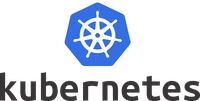

## Kubernetes

<figure markdown="span">
  { width="500" }
  <figcaption>Logo de Kubernetes</figcaption>
</figure>

La adopción de Kubernetes se motiva principalmente por la necesidad de administrar de
manera eficiente y escalable múltiples contenedores distribuidos en diversos servidores.
Kubernetes facilita la orquestación de estos contenedores a través de una
infraestructura declarativa, en la que los usuarios definen la configuración deseada en
un manifiesto (un archivo de configuración) que se procesa mediante la API de
Kubernetes. La plataforma asume la responsabilidad de distribuir la carga de trabajo
entre los nodos disponibles y de administrar los recursos requeridos por los
contenedores.

Kubernetes también posibilita la construcción de _pipelines_ ETL utilizando herramientas
como Spark o Airflow, y se emplea extensamente en el entrenamiento de modelos de
aprendizaje automático, como se evidencia en su uso con Kubeflow. Al gestionar la
infraestructura de cómputo, redes y almacenamiento, Kubernetes simplifica la
implementación y administración de aplicaciones en contenedores a gran escala.

### Componentes de Kubernetes

**Kubectl** es una interfaz de línea de comandos que facilita la interacción con un
clúster de Kubernetes, permitiendo la gestión de objetos como _pods_, servicios y
despliegues.

Para la creación de un clúster de Kubernetes en un entorno local, se utiliza
**Minikube**. Esta herramienta permite la ejecución de Kubernetes de manera local para
fines de prueba o desarrollo, creando un clúster con uno o varios nodos virtualizados.
Por defecto, Minikube crea un clúster que contiene un nodo. Para inicializar el clúster
se utiliza el comando `minikube start`, y para verificar su estado, `minikube status`.

### Nodos

Un nodo representa la unidad más pequeña dentro de un clúster de Kubernetes. Puede ser
una máquina física o una máquina virtual donde se ejecutan las aplicaciones. Kubernetes
abstrae el _hardware_ subyacente, permitiendo una gestión eficiente de los requisitos de
recursos. Si un nodo no puede proporcionar más recursos o falla, Kubernetes redistribuye
las cargas de trabajo a otros nodos disponibles. Existen diferentes tipos de nodos: los
nodos bajo demanda (_on-demand nodes_), que se crean cuando los recursos requeridos son
elevados (CPU, GPU, RAM), y los nodos al mejor precio (_spot nodes_), que son más
económicos pero pueden ser retirados en cualquier momento.

### _Pods_

Un _pod_ es la unidad mínima de ejecución en Kubernetes y puede contener uno o más
contenedores que comparten los mismos recursos y red local. Todos los contenedores
dentro del mismo _pod_ pueden comunicarse entre sí y comparten el mismo entorno de red.
Al escalar un _pod_, todos los contenedores dentro de él se escalan conjuntamente.

### Clúster

Un clúster es un conjunto de nodos, también conocidos como _workers_, que se ejecutan en
Kubernetes. La relación entre las aplicaciones que se ejecutan en cada nodo es
independiente. Por ejemplo, si se dispone de un servidor de Proxmox con dos máquinas
virtuales, VM1 y VM2, a pesar de que cuenten con diferentes _pods_, si todos están
gestionados por Kubernetes, ambos forman parte del mismo clúster.

### _StatefulSet_ y volúmenes

Dado que no se puede garantizar el lugar de ejecución de una aplicación, el uso del
disco local para almacenar datos resulta inviable, siendo útil únicamente para
almacenamiento temporal como caché. Kubernetes emplea volúmenes persistentes que, a
diferencia de otros recursos como la CPU, GPU y RAM gestionados por los clústeres, deben
adjuntarse al propio clúster desde unidades locales o en la nube. Estos volúmenes no se
asocian a un nodo en particular.

**_StatefulSet_** permite la creación de _pods_ con volúmenes persistentes, garantizando
la integridad de los datos incluso si el _pod_ se reinicia o se elimina. A continuación
se muestra un ejemplo:

???+ example "Ejemplo: Manifiesto de un _StatefulSet_"

    ```yaml linenums="1"
    apiVersion: apps/v1
    kind: StatefulSet
    metadata:
      name: my-csi-app-set
    spec:
      selector:
        matchLabels:
          app: my-frontend
      serviceName: "my-frontend"
      replicas: 1
      template:
        metadata:
          labels:
            app: my-frontend
        spec:
          containers:
            - name: my-frontend
              image: busybox
              args:
                - sleep
                - infinity
              volumeMounts:
                - name: data
                  mountPath: "/data"
      volumeClaimTemplates:
        - metadata:
            name: csi-pvc
          spec:
            accessModes: ["ReadWriteOnce"]
            resources:
              requests:
                storage: 1Gi
    ```

Para verificar el estado de los volúmenes y los _StatefulSets_ se utilizan los comandos
`kubectl get pvc` (para consultar la asignación del volumen, capacidad y otros detalles)
y `kubectl get sts` (para consultar los _StatefulSets_).

### Manifiestos

Un manifiesto es un archivo en formato YAML o JSON que especifica cómo desplegar una
aplicación en un clúster de Kubernetes. Este archivo se conoce como un registro de
intención, donde se le indica a Kubernetes el estado deseado del clúster.

Un concepto importante asociado es el de _namespace_, que constituye la división lógica
del clúster de Kubernetes y permite separar la carga del clúster. Se pueden crear
políticas para separar tráfico entre _namespaces_, aunque por defecto los datos de un
_namespace_ son visibles desde otro. Para obtener los _namespaces_ del clúster se
utiliza `kubectl get ns`, para obtener los _pods_ de un _namespace_ específico se emplea
`kubectl -n nombre_namespace get pods -o wide` (la opción `-o wide` proporciona
información adicional como la IP del _pod_ y el nodo), y para eliminar un _pod_ se usa
`kubectl -n nombre_namespace delete pod nombre_pod`.

A continuación se muestra un ejemplo de manifiesto para crear un _pod_ simple:

???+ example "Ejemplo: Manifiesto de un _pod_ simple"

    ```yaml linenums="1"
    apiVersion: v1
    kind: Pod
    metadata:
      name: nginx
    spec:
      containers:
        - name: nginx
          image: nginx:alpine
    ```

Para aplicar el manifiesto se ejecuta `kubectl apply -f nombre.yaml`, y para consultar
el estado del _pod_, `kubectl get pods`.

El siguiente ejemplo muestra un manifiesto más complejo que incluye variables de
entorno, solicitudes y límites de recursos, así como _readiness probe_ y _liveness
probe_:

???+ example "Ejemplo: Manifiesto con variables de entorno, recursos y _probes_"

    ```yaml linenums="1"
    apiVersion: v1
    kind: Pod
    metadata:
      name: nginx
    spec:
      containers:
        - name: nginx
          image: nginx:alpine
          env:
            - name: MI_VARIABLE
              value: "valor_ejemplo"
            - name: MI_OTRA_VARIABLE
              value: "otro_valor"
            - name: DD_AGENT_HOST
              valueFrom:
                fieldRef:
                  fieldPath: status.hostIP
          resources:
            requests:
              memory: "64Mi"
              cpu: "200m"
            limits:
              memory: "128Mi"
              cpu: "500m"
          readinessProbe:
            httpGet:
              path: /
              port: 80
            initialDelaySeconds: 5
            periodSeconds: 10
          livenessProbe:
            tcpSocket:
              port: 80
            initialDelaySeconds: 15
            periodSeconds: 20
          ports:
            - containerPort: 80
    ```

En este manifiesto, la sección `resources.requests` define los recursos garantizados que
la instancia debe tener disponibles para poder realizar el despliegue, medidos en
_milicores_ para CPU (donde 1000 _milicores_ equivalen a 1 _core_). La sección
`resources.limits` establece el límite máximo de recursos que el _pod_ puede consumir.
Si se excede dicho límite, el _kernel_ de Linux finaliza el proceso y el _pod_ se
reinicia. La _readiness probe_ indica a Kubernetes que el _pod_ está listo para recibir
tráfico, mientras que la _liveness probe_ confirma que el _pod_ sigue activo y no debe
ser eliminado.

### Despliegue y gestión de réplicas

Un despliegue (_deployment_) permite declarar el número de réplicas de _pods_ y asegurar
que el estado deseado se mantenga, monitorizándolos de forma continua:

???+ example "Ejemplo: Manifiesto de un _deployment_"

    ```yaml linenums="1"
    apiVersion: apps/v1
    kind: Deployment
    metadata:
      name: nginx-deployment
    spec:
      replicas: 3
      selector:
        matchLabels:
          app: nginx
      template:
        metadata:
          labels:
            app: nginx
        spec:
          containers:
            - name: nginx
              image: nginx:alpine
              ports:
                - containerPort: 80
    ```

### _DaemonSet_

Un _DaemonSet_ es una forma de despliegue que garantiza que un _pod_ se ejecute en todos
los nodos del clúster, con exactamente un _pod_ por nodo. No se especifica el número de
réplicas, ya que depende del número de nodos. Se utiliza habitualmente para servicios de
monitoreo:

???+ example "Ejemplo: Manifiesto de un _DaemonSet_"

    ```yaml linenums="1"
    apiVersion: apps/v1
    kind: DaemonSet
    metadata:
      name: nginx-daemonset
    spec:
      selector:
        matchLabels:
          app: nginx
      template:
        metadata:
          labels:
            app: nginx
        spec:
          containers:
            - name: nginx
              image: nginx:alpine
    ```

### Exponer aplicaciones

#### Tipos de servicios

Los servicios en Kubernetes permiten acceder a los _pods_ desde dentro y fuera del
clúster. Existen varios tipos de servicios según las necesidades de exposición.

**ClusterIP** proporciona una dirección IP virtual única a nivel de clúster, facilitando
la comunicación y el balanceo de carga entre _pods_ de forma interna.

**NodePort** crea un puerto en cada nodo que recibe el tráfico y lo redirige a los
_pods_ correspondientes, permitiendo que la aplicación sea accesible desde fuera del
clúster. Suele utilizar puertos dentro del rango 30000 a 32767:

???+ example "Ejemplo: Servicio NodePort"

    ```yaml linenums="1"
    apiVersion: v1
    kind: Service
    metadata:
      name: mi-servicio
    spec:
      type: NodePort
      selector:
        app: mi-aplicacion
      ports:
        - port: 80
          targetPort: 9376
          nodePort: 30007
    ```

**LoadBalancer** está orientado a proveedores de la nube y crea un balanceador de carga
que proporciona una IP estable para el servidor, facilitando su acceso desde Internet:

???+ example "Ejemplo: Servicio LoadBalancer"

    ```yaml linenums="1"
    apiVersion: v1
    kind: Service
    metadata:
      name: mi-servicio
    spec:
      type: LoadBalancer
      selector:
        app: mi-aplicacion
      ports:
        - port: 80
          targetPort: 80
    ```

#### _Ingress_

_Ingress_ administra el acceso externo a los servicios del clúster, típicamente HTTP.
Proporciona balanceo de carga y terminación SSL, y permite el acceso al servicio
mediante _paths_. Suele requerirse un controlador Ingress-Nginx que se instala por
separado.

### _Networking_ y almacenamiento

Cada _pod_ en Kubernetes tiene su propia dirección IP, y para comunicar _pods_ en
diferentes nodos se utiliza el _Cloud Cluster Networking Interface_. En cuanto al
almacenamiento, **etcd** es un almacén de datos clave-valor distribuido utilizado para
guardar datos de configuración, estado y metadatos del clúster.
