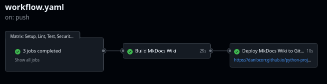

## Referencias

- [ML in Production: From Data Scientist to ML Engineer](https://www.udemy.com/course/ml-in-production/?couponCode=SKILLS4SALEA)
- [GitHub Actions Documentation](https://docs.github.com/en/actions)

## Métricas clave

La mejora continua requiere medir de forma sistemática el desempeño de los procesos de
entrega de software:

| Métrica                            | Descripción                                                              |
| :--------------------------------- | :----------------------------------------------------------------------- |
| **Lead Time**                      | Tiempo desde la concepción de una idea hasta su despliegue en producción |
| **Change Failure Rate**            | Proporción de cambios que generan fallos o incidencias                   |
| **MTTR** (_Mean Time to Recovery_) | Tiempo promedio para recuperar un sistema tras una falla                 |
| **MTTF** (_Mean Time to Failure_)  | Tiempo medio de funcionamiento antes de un fallo                         |

Estas métricas, utilizadas de manera conjunta, permiten identificar cuellos de botella,
evaluar la estabilidad del sistema y orientar las decisiones de mejora.

## Introducción

La integración continua (CI) y el despliegue continuo (CD) constituyen prácticas
esenciales para garantizar la calidad y la velocidad de entrega del software:

- **CI**: Integración frecuente de cambios en la rama principal, acompañada de procesos
  automáticos de construcción y pruebas.
- **CD**: Automatización del despliegue del software en entornos de producción o
  equivalentes.

Una implementación madura de CI/CD incluye _commits_ frecuentes, pruebas automatizadas,
revisión de código mediante _pull requests_ y el uso de técnicas como **_feature
flags_**, que permiten activar o desactivar funcionalidades sin necesidad de nuevos
despliegues.

### Herramientas

GitHub es una plataforma de desarrollo colaborativo que proporciona herramientas
avanzadas para el control de versiones mediante Git, así como funcionalidades de CI/CD.
Destaca GitHub Actions para la automatización de flujos de trabajo y GitHub Pages para
publicar sitios web estáticos desde un repositorio.

Una de las principales ventajas de GitHub Actions frente a herramientas como Jenkins es
su integración nativa con GitHub. Su Marketplace proporciona un amplio catálogo de
acciones desarrolladas tanto por GitHub como por terceros.

## GitHub Actions

La implementación de CI/CD permite automatizar procesos de desarrollo, mejorando la
eficiencia y reduciendo errores en la integración y despliegue de software. La
integración continua (CI) se refiere a la automatización de la integración de código en
un repositorio compartido, asegurando que los cambios sean validados continuamente
mediante pruebas y compilaciones. El despliegue continuo (CD) automatiza el proceso de
despliegue de código en entornos de producción, facilitando la entrega continua de
nuevas versiones del software.

### GitHub Actions y su funcionamiento

GitHub Actions es una plataforma que permite la automatización de flujos de trabajo a
través de archivos de configuración en formato YAML. Cada _workflow_ está compuesto por
una serie de pasos organizados en _jobs_, que pueden ejecutarse en paralelo o en
secuencia dependiendo de las necesidades del proyecto.

El _runner_ de GitHub Actions es un servidor que ejecuta estos _workflows_ en un entorno
definido, permitiendo la compilación del código para distintos sistemas operativos, la
ejecución de pruebas en paralelo, la validación de código con herramientas como
_linters_ y analizadores estáticos, y la implementación de código en producción o
entornos de _staging_.

Para definir un _workflow_, se crea un archivo `.yml` dentro de la carpeta
`.github/workflows/`:

```plaintext linenums="1"
src
│
.github
│   ├── workflows
│   │   ├── workflow_ejemplo.yml
```

<figure markdown="span">
  { width="100%" }
  <figcaption>Esquema de un workflow en GitHub Actions</figcaption>
</figure>

Un _pipeline_ típico en un _workflow_ podría incluir pasos como fusionar (_merge_)
cambios en la rama principal, ejecutar pruebas, realizar un análisis de código
(_linting_), generar una compilación (_build_) y desplegar en producción o _staging_.

### Estructura de un Workflow en GitHub Actions

Un _workflow_ en GitHub Actions está definido en un archivo de configuración YAML que
contiene las instrucciones necesarias para automatizar tareas dentro de un repositorio.

#### Elementos clave de un workflow

El campo `name` define un nombre descriptivo para el _workflow_. Aunque es opcional, se
recomienda utilizarlo para mejorar la identificación y reutilización de _workflows_
dentro del repositorio:

```yaml linenums="1"
name: Nombre del Workflow
```

Los disparadores (`on`) determinan cuándo debe ejecutarse el _workflow_. Pueden
activarse mediante eventos como `push`, `pull_request` o ejecuciones programadas.
También es posible definir permisos a nivel global o dentro de un _job_ específico. Si
varios _jobs_ requieren los mismos permisos, es recomendable declararlos a nivel del
_workflow_ en lugar de repetirlos en cada _job_.

???+ example "Ejemplo"

    Definición de permisos a nivel de _workflow_:

    ```yaml  linenums="1"
    name: Nombre del Workflow

    on:
      push:
        branches: ["main"]
      workflow_call:

    permissions:
      contents: write
    ```

    Definición de permisos dentro de un _job_:

    ```yaml  linenums="1"
    name: Nombre del Workflow

    on:
      push:
        branches: ["main"]
      workflow_call:

    jobs:
      build-mkdocs:
        name: Build MkDocs Wiki
        runs-on: ubuntu-latest
        needs: setup-lint-test

        permissions:
          contents: write

        steps:
          - name: Checkout repository
            uses: actions/checkout@v4
    ```

Los _jobs_ representan las unidades de trabajo dentro de un _workflow_. Cada _job_ se
compone de una serie de _steps_ que definen las acciones a ejecutar de manera
secuencial. Por defecto, los _jobs_ se ejecutan en paralelo a menos que uno dependa
explícitamente de otro mediante la directiva `needs`. Cada _job_ se ejecuta en una nueva
máquina virtual, y se debe especificar un sistema operativo con `runs-on`, permitiendo
elegir entre Linux, macOS y Windows:

???+ example "Ejemplo"

    ```yaml  linenums="1"
    jobs:
      nombre-del-job:
        runs-on: ubuntu-latest
    ```

    !!!note "Nota"

        Consulta la documentación oficial sobre runners de GitHub
        [aquí](https://docs.github.com/en/actions/using-github-hosted-runners/using-github-hosted-runners/about-github-hosted-runners).

GitHub Actions permite integrar acciones predefinidas disponibles en
[GitHub Actions](https://github.com/actions) y el
[GitHub Marketplace](https://github.com/marketplace).

#### Ejemplos de configuración de workflows

???+ example "Ejemplo básico"

    El siguiente ejemplo muestra un _workflow_ que se ejecuta cuando hay un `push` o un `pull_request` en la rama `main`:

    ```yaml  linenums="1"
    name: Workflow básico

    on:
      push:
        branches: ["main"]
      pull_request:
        branches: ["main"]

    permissions:
      contents: read

    jobs:
      build:
        runs-on: ubuntu-latest

        steps:
          - name: Checkout repository
            uses: actions/checkout@v4
    ```

    !!!note "Nota"

        Se recomienda incluir la acción `checkout` al inicio del workflow para asegurarse de que
        el código más reciente esté disponible antes de ejecutar cualquier otra tarea.

???+ example "Ejemplo: Configuración de Python, Poetry y Flake8"

    En este ejemplo, el _workflow_ configura Python, administra dependencias con Poetry y valida el código con Flake8:

    ```yaml  linenums="1"
    name: Verificación con Flake8

    on:
      push:
        branches: ["main"]
      pull_request:
        branches: ["main"]

    permissions:
      contents: read

    jobs:
      build:
        runs-on: ubuntu-latest

        steps:
          - name: Checkout repository
            uses: actions/checkout@v4

          - name: Instalar Python
            uses: actions/setup-python@v5
            with:
              python-version: "3.10"

          - name: Instalar Poetry
            uses: snok/install-poetry@v1

          - name: Instalar dependencias con Poetry
            run: poetry install

          - name: Verificar código con Flake8
            run: poetry run flake8 src/
    ```

???+ example "Ejemplo: Uso de caché para optimización de workflows"

    Para mejorar el rendimiento, es posible utilizar caché para almacenar dependencias y evitar reinstalaciones innecesarias:

    ```yaml  linenums="1"
    name: Workflow con caché

    on:
      push:
        branches: ["main"]
      pull_request:
        branches: ["main"]

    permissions:
      contents: read

    jobs:
      build:
        runs-on: ubuntu-latest

        steps:
          - name: Checkout repository
            uses: actions/checkout@v4

          - name: Instalar Python
            uses: actions/setup-python@v5
            with:
              python-version: "3.10"

          - name: Instalar Poetry
            uses: snok/install-poetry@v1
            with:
              virtualenvs-in-project: true

          - name: Cargar caché de dependencias
            uses: actions/cache@v4
            id: cached-poetry-dependencies
            with:
              path: .venv
              key: venv-${{ runner.os }}-${{ hashFiles('**/poetry.lock') }}

          - name: Instalar dependencias con Poetry
            if: steps.cached-poetry-dependencies.outputs.cache-hit != 'true'
            run: poetry install
    ```

    !!!note "Nota"

        La clave de caché `key: venv-${{ runner.os }}-${{ hashFiles('**/poetry.lock') }}`
        garantiza que el caché solo se actualice cuando cambie el archivo `poetry.lock`. Utilizar
        caché reduce significativamente el tiempo de ejecución del workflow, pero es importante
        monitorearlo para evitar el uso de dependencias obsoletas.

#### Modularización de workflows y acciones

Para mejorar la reutilización y el mantenimiento del código, se recomienda modularizar
los _workflows_ mediante acciones personalizadas. Un ejemplo de la estructura del
proyecto podría ser la siguiente:

```plaintext linenums="1"
src
│
.github
|   ├── actions
|       ├── build-application
|           ├── action.yml
|   ├── workflows
│       ├── lint.yml
```

Dentro de la carpeta `build-application` se define una acción, que siempre debe tener el
nombre `action.yml`:

```yaml linenums="1"
name: Build Application

runs:
    using: composite

    steps:
        - name: Checkout repository
          uses: actions/checkout@v4

        - name: Set up Python
          uses: actions/setup-python@v5
          with:
              python-version: "3.10.7"

        - name: Instalar Poetry
          uses: snok/install-poetry@v1
          with:
              virtualenvs-in-project: true

        - name: Cargar caché de dependencias
          uses: actions/cache@v4
          id: cached-poetry-dependencies
          with:
              path: .venv
              key: venv-${{ runner.os }}-${{ hashFiles('**/poetry.lock') }}

        - name: Instalar dependencias con Poetry
          if: steps.cached-poetry-dependencies.outputs.cache-hit != 'true'
          run: poetry install
```

La modularización de _workflows_ no solo mejora la reutilización, sino que también
facilita el mantenimiento del código y la integración de nuevas funcionalidades sin
modificar los _workflows_ principales. Este enfoque modular permite dividir la
complejidad, mejorar la eficiencia y permitir la reutilización de configuraciones a lo
largo del proyecto.

#### Uso de estrategias con matrices

Las matrices de estrategia en GitHub Actions permiten ejecutar un mismo _workflow_ en
múltiples combinaciones de entornos, lo que resulta útil para probar software en
diferentes sistemas operativos, versiones o configuraciones. Por ejemplo:

```yaml linenums="1"
name: Workflow

on:
    push:
        branches: ["main"]
    pull_request:
        branches: ["main"]

strategy:
    matrix:
        os: [macos-latest, windows-latest]
        version: [12, 14, 16]
        environment: [staging, production]
        exclude:
            - os: macos-latest
              version: 12
              environment: production
            - os: windows-latest
              version: 16
runs-on: ${{ matrix.os }}
```

GitHub genera automáticamente todas las combinaciones posibles de los valores definidos
en `matrix`. Las combinaciones resultantes se reflejan en la siguiente tabla:

| OS             | Versión | Entorno    |
| -------------- | ------- | ---------- |
| macos-latest   | 12      | staging    |
| macos-latest   | 14      | staging    |
| macos-latest   | 14      | production |
| macos-latest   | 16      | staging    |
| macos-latest   | 16      | production |
| windows-latest | 12      | staging    |
| windows-latest | 12      | production |
| windows-latest | 14      | staging    |
| windows-latest | 14      | production |

Gracias al bloque `exclude`, las siguientes combinaciones no se ejecutan en el
_workflow_:

| OS             | Versión | Entorno    |
| -------------- | ------- | ---------- |
| macos-latest   | 12      | production |
| windows-latest | 16      | Cualquiera |

Los beneficios del uso de matrices incluyen la eficiencia al probar múltiples entornos
en paralelo, la flexibilidad para excluir combinaciones no necesarias y la
automatización escalable, ideal para probar en distintos sistemas sin escribir múltiples
_workflows_. Este enfoque resulta especialmente útil en proyectos que requieren pruebas
en múltiples versiones de software, diferentes entornos (_staging_/producción) o
compatibilidad con varios sistemas operativos.

## GitLab CI/CD

GitLab es una plataforma de desarrollo que, al igual que GitHub, ofrece capacidades de
integración y entrega continua de forma nativa. Su sistema de CI/CD se configura
mediante un archivo `.gitlab-ci.yml` en la raíz del repositorio y se basa en una
arquitectura cliente-servidor: el GitLab Server actúa como orquestador, mientras que los
GitLab Runners son los encargados de ejecutar los _jobs_ y devolver los resultados al
servidor.

### Estructura básica de un _pipeline_

Un _pipeline_ en GitLab se compone de _stages_ (etapas) y _jobs_ (tareas). Los _stages_
definen el orden de ejecución, y los _jobs_ dentro de un mismo _stage_ se ejecutan en
paralelo por defecto. La configuración comienza con la definición del flujo de trabajo,
las etapas y las variables globales.

???+ example "Ejemplo: Estructura básica de un _pipeline_"

    El bloque `workflow.rules` controla cuándo se crea un _pipeline_. En este ejemplo, se ejecuta en eventos de _merge request_ y en _pushes_ a la rama `develop`, evitando _pipelines_ duplicados cuando existe una _merge request_ abierta para la misma rama. La directiva `image` establece la imagen Docker base que utilizan todos los _jobs_ del _pipeline_, aunque cada _job_ puede sobrescribirla si es necesario:

    ```yaml linenums="1"
    workflow:
      rules:
        - if: $CI_PIPELINE_SOURCE == "merge_request_event"
        - if: $CI_COMMIT_BRANCH && $CI_OPEN_MERGE_REQUESTS
          when: never
        - if: $CI_COMMIT_BRANCH == "develop"

    stages:
      - lint
      - test
      - deploy

    variables:
      PATH_SRC: src
      PATH_TESTS: tests
      GIT_STRATEGY: fetch
      GIT_DEPTH: 1

    image: ghcr.io/astral-sh/uv:python3.11-bookworm
    ```

    !!!note "Nota"

        Cuando no se especifica una imagen, GitLab utiliza una por defecto, por lo que es recomendable definirla explícitamente para garantizar la reproducibilidad del entorno. Las imágenes se obtienen de Docker Hub u otros registros de contenedores, y es buena práctica fijar versiones específicas en lugar de utilizar etiquetas como `latest`. La directiva `image` definida a nivel global (fuera de los _jobs_) se aplica a todos los _jobs_ del _pipeline_; para que un _job_ concreto utilice una imagen diferente, basta con redefinir `image` dentro de ese _job_. Si no se asigna un _stage_ a un _job_, GitLab lo asigna automáticamente al _stage_ `test`. Los ficheros creados o modificados durante la ejecución de un _job_ no se confirman (_commit_) automáticamente en el repositorio.

### _Jobs_ y configuración

Cada _job_ define una unidad de trabajo dentro del _pipeline_. Se compone de un bloque
`before_script` para la preparación del entorno, un bloque `script` con los comandos
principales y, opcionalmente, un bloque `after_script` para tareas de limpieza. La
directiva `needs` permite establecer dependencias explícitas entre _jobs_, y los
artefactos (`artifacts`) permiten compartir ficheros entre _jobs_ o conservarlos tras la
ejecución del _pipeline_.

???+ example "Ejemplo: _Jobs_ con dependencias y artefactos"

    En este ejemplo, `unit_tests` solo se ejecuta tras la finalización exitosa de `quality_check` gracias a la directiva `needs`. El bloque `artifacts` conserva el informe de cobertura durante una hora mediante `expire_in`:

    ```yaml linenums="1"
    quality_check:
      stage: lint
      before_script:
        - uv sync --only-group pipeline
      script:
        - uv run ruff format --check ${PATH_SRC}
        - uv run ruff check ${PATH_SRC}
        - uv run mypy ${PATH_SRC}

    unit_tests:
      stage: test
      needs:
        - quality_check
      before_script:
        - |
          if [ ! -d "${PATH_TESTS}" ]; then
            echo "${PATH_TESTS} no disponible. Omitiendo job..."
            exit 0
          fi
        - uv sync --all-extras
      script:
        - uv run pytest ${PATH_TESTS} --maxfail=1 --durations=0
          --cov=${PATH_SRC} --cov-report=xml:coverage.xml
      artifacts:
        paths:
          - coverage.xml
        expire_in: 1 hour
    ```

Además de las variables definidas directamente en el archivo `.gitlab-ci.yml`, GitLab
permite configurar variables CI/CD desde los ajustes del repositorio, en la sección
**Settings > CI/CD > Variables**. Esto resulta especialmente útil para almacenar valores
sensibles como _tokens_ de acceso, credenciales, direcciones de correo u otros datos que
no deben incluirse en el código fuente. Estas variables quedan disponibles
automáticamente en todos los _pipelines_ del repositorio y pueden referenciarse en los
_jobs_ de la misma forma que las variables globales del archivo YAML.

### Opciones de control de _jobs_

GitLab ofrece varias directivas para controlar el comportamiento de los _jobs_. La
directiva `when: manual` permite que un _job_ requiera activación manual desde la
interfaz de GitLab, lo cual resulta útil para despliegues a producción que necesitan
aprobación. La directiva `retry` define el número de reintentos en caso de fallo, con un
máximo de 2 intentos adicionales. Por su parte, `allow_failure: true` permite que un
_job_ falle sin bloquear la ejecución del resto del _pipeline_, lo cual es adecuado para
tareas no críticas como análisis opcionales.

### _Anchors_ y plantillas YAML

Para evitar la repetición de configuración, GitLab aprovecha las _anchors_ de YAML, que
permiten definir bloques reutilizables. Un _job_ cuyo nombre comienza con un punto (`.`)
se considera una plantilla oculta y no se ejecuta directamente en el _pipeline_. El
operador `&` crea un _anchor_ (alias) y `<<: *anchor` inserta todas las propiedades de
la plantilla en el _job_. Las propiedades definidas directamente en el _job_
sobrescriben las heredadas de la plantilla.

???+ example "Ejemplo: Plantilla completa con _anchor_"

    En este ejemplo, `.job_template` define una plantilla oculta con una imagen y un _script_ de preparación. El _job_ `job_1` hereda toda la configuración de la plantilla y añade su propio bloque `script`:

    ```yaml linenums="1"
    .job_template: &anchor
      image: alpine
      before_script:
        - echo "Preparando entorno"

    job_1:
      <<: *anchor
      script:
        - echo "Ejecutando job_1"
    ```

???+ example "Ejemplo: _Anchor_ parcial"

    Este mecanismo también se puede aplicar a fragmentos parciales de configuración, no solo a _jobs_ completos. En este caso, se reutiliza únicamente el bloque `before_script`:

    ```yaml linenums="1"
    .dependencies: &dependencies
      - echo "Instalando dependencias"

    job_1:
      image: alpine
      before_script: *dependencies
      script:
        - echo "Ejecutando job_1"
    ```

### _Extends_ frente a _anchors_

Además de las _anchors_, GitLab proporciona la directiva `extends`, que ofrece un
comportamiento diferente: mientras que las _anchors_ sobrescriben las propiedades de
forma completa, `extends` realiza una fusión (_merge_) profunda de los atributos,
combinando las propiedades del _job_ con las de la plantilla. Esta diferencia es
relevante cuando se trabaja con estructuras anidadas, ya que `extends` preserva las
propiedades no redefinidas en niveles internos.

???+ example "Ejemplo: Uso de _extends_"

    En este caso, `nuevo_job` hereda todas las propiedades de `.template` y puede añadir o modificar las que necesite:

    ```yaml linenums="1"
    nuevo_job:
      extends: .template
      stage: production
    ```

### Modularización de la configuración

A medida que un proyecto crece, es recomendable dividir el archivo `.gitlab-ci.yml` en
múltiples ficheros para mejorar la organización y el mantenimiento. La directiva
`include` permite importar configuraciones desde distintas fuentes. Los ficheros locales
se referencian desde la raíz del repositorio, mientras que los ficheros remotos deben
ser accesibles públicamente, salvo que pertenezcan a la misma instancia o grupo de
GitLab, en cuyo caso pueden ser privados.

???+ example "Ejemplo: Inclusión de ficheros locales y remotos"

    ```yaml linenums="1"
    include:
      - local: "ci/build.yml"
      - remote: "https://gitlab.com/grupo/proyecto/-/raw/main/ci/shared.yml"
    ```

### Catálogo de componentes CI/CD

GitLab dispone de un catálogo de componentes CI/CD reutilizables, similar al Marketplace
de GitHub Actions. Estos componentes se integran en el _pipeline_ mediante la directiva
`include` con la clave `component`, y pueden aceptar parámetros de entrada. Los
parámetros disponibles dependen de cada componente y se documentan en su repositorio
correspondiente.

???+ example "Ejemplo: Uso de un componente del catálogo"

    ```yaml linenums="1"
    include:
      - component: gitlab.com/grupo/componente@version
        inputs:
          stage: build
    ```

### Selección de _runners_ y _tags_

Los _runners_ de GitLab se seleccionan mediante _tags_, que permiten dirigir la
ejecución de un _job_ a un _runner_ con características específicas, como un determinado
sistema operativo, tipo de CPU o capacidad de GPU. Los _tags_ disponibles dependen de la
configuración de la instancia de GitLab, ya sea _self-hosted_ o gestionada por GitLab.

### Gestión de artefactos y caché

La directiva `dependencies: []` permite que un _job_ no descargue artefactos de _jobs_
anteriores, lo cual reduce el tiempo de ejecución cuando dichos artefactos no son
necesarios.

Para la caché de dependencias, existen dos estrategias principales: utilizar un mismo
_runner_ mediante _tags_ para que la caché persista localmente, o configurar un sistema
de caché distribuido al que múltiples _runners_ puedan acceder. Es importante recordar
que, al utilizar el Docker _executor_, cada _job_ se ejecuta en un contenedor efímero
que se destruye al finalizar, por lo que la caché debe almacenarse fuera del contenedor.

!!!note "Nota"

    El Docker _executor_ también permite utilizar Docker-in-Docker (DinD) mediante imágenes especiales como `docker:dind`, lo que habilita la ejecución de comandos de Docker dentro de los propios _jobs_. Esto resulta útil para construir, etiquetar y publicar imágenes de contenedores directamente desde el _pipeline_.

!!!note "Nota"

    En el caso de submódulos de Git, es necesario activar los permisos de _job token_ para que un repositorio pueda acceder a otro durante el clonado, especialmente cuando no pertenecen al mismo grupo.

### _Stages_ especiales

GitLab proporciona dos _stages_ especiales: `.pre` y `.post`. El _stage_ `.pre` se
ejecuta antes que cualquier otro _stage_ definido, y `.post` se ejecuta después de
todos. Para que el _pipeline_ se cree correctamente, debe existir al menos un _job_ en
un _stage_ regular además de los _jobs_ en `.pre` o `.post`.

???+ example "Ejemplo: Uso del _stage_ `.pre`"

    Algunas imágenes Docker, como la de AWS CLI, definen un _entrypoint_ personalizado que puede interferir con la ejecución de comandos. En estos casos, es necesario sobrescribir el _entrypoint_ con un valor vacío (`[""]`) para que los comandos del _script_ se ejecuten correctamente:

    ```yaml linenums="1"
    preparar_entorno:
      stage: .pre
      image:
        name: amazon/aws-cli
        entrypoint: [""]
      script:
        - aws --version
    ```

### Reportes JUnit

GitLab permite integrar reportes JUnit en los _pipelines_ de CI. Estos reportes son
ficheros XML generados por los _frameworks_ de pruebas que contienen información
detallada sobre los resultados de cada _test_, incluyendo el nombre, la duración, el
estado (éxito o fallo) y los mensajes de error. GitLab los muestra directamente en la
interfaz de las _merge requests_, facilitando la revisión de los resultados sin
necesidad de consultar los _logs_ del _pipeline_.
